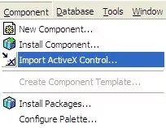
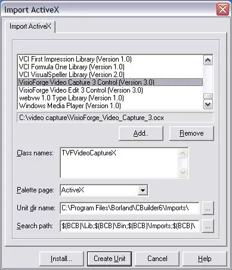
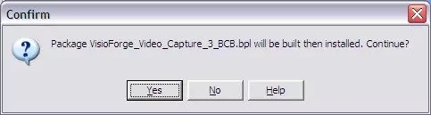
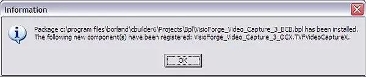
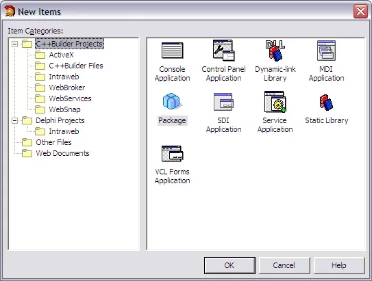
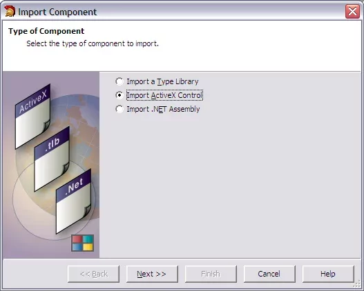
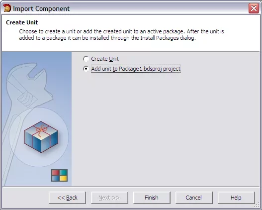

# Installation de TVFMediaPlayer dans C++ Builder

Bienvenue dans le guide détaillé pour intégrer la puissante bibliothèque TVFMediaPlayer dans votre environnement de développement Embarcadero C++ Builder. Ce document couvre le processus d'installation pour les versions héritées comme C++ Builder 5 et 6, ainsi que pour les versions modernes à partir de 2006. Nous explorerons les prérequis nécessaires, les procédures d'installation pas à pas pour les différentes versions de l'IDE, les considérations relatives aux architectures 32 bits (x86) et 64 bits (x64), ainsi que les étapes courantes de dépannage.

## Introduction à TVFMediaPlayer et au VisioForge Media Framework

TVFMediaPlayer est un composant multimédia polyvalent développé par VisioForge. Il fait partie du plus vaste VisioForge Media Framework, conçu pour offrir aux développeurs un ensemble robuste d'outils permettant de gérer la lecture, la capture, le traitement et le streaming audio et vidéo au sein de leurs applications. TVFMediaPlayer se concentre spécifiquement sur les capacités de lecture, prenant en charge un large éventail de formats et offrant un contrôle étendu sur le rendu multimédia.

Le composant est livré sous forme de contrôle ActiveX, ce qui le rend facilement intégrable dans les environnements prenant en charge la technologie COM, comme C++ Builder. L'utilisation d'ActiveX permet une intégration visuelle à la conception et un accès programmatique direct aux fonctionnalités du lecteur.

## Prérequis

Avant de procéder à l'installation, assurez-vous que votre environnement de développement répond aux exigences suivantes :

1. **Version de C++ Builder prise en charge :** vous devez disposer d'une installation fonctionnelle d'Embarcadero C++ Builder. Ce guide couvre :
    * C++ Builder 5
    * C++ Builder 6
    * C++ Builder 2006
    * C++ Builder 2007, 2009, 2010, série XE (XE à XE8), série 10.x (Seattle, Berlin, Tokyo, Rio, Sydney), 11.x (Alexandria) et versions ultérieures. Bien que le processus principal reste similaire pour les versions plus récentes, des variations mineures de l'interface utilisateur peuvent exister.
2. **Système d'exploitation :** un système Windows compatible (Windows 7 ou ultérieur, y compris Windows 8, 10, 11 et les versions Server correspondantes). Assurez-vous que votre système d'exploitation correspond à l'architecture cible (32 ou 64 bits) de vos projets C++ Builder.
3. **Privilèges d'administrateur :** l'installation du VisioForge Media Framework et l'enregistrement des contrôles ActiveX nécessitent généralement des privilèges d'administrateur sur votre machine. Veillez à exécuter le programme d'installation et C++ Builder avec des autorisations suffisantes, en particulier si le Contrôle de compte d'utilisateur (UAC) est activé.
4. **Dépendances :** le programme d'installation VisioForge regroupe habituellement les dépendances d'exécution nécessaires (telles que des composants DirectX ou Media Foundation spécifiques). Néanmoins, il est généralement recommandé de maintenir votre système Windows à jour.

## Étape 1 : télécharger le All-in-One Media Framework

Le composant TVFMediaPlayer est distribué dans le cadre du SDK VisioForge All-in-One Media Framework. Vous devez télécharger la version correcte :

* **Cible :** téléchargez la version **ActiveX** du SDK. Ne téléchargez pas les versions .NET ou VCL, qui sont destinées à d'autres environnements de développement.
* **Source :** obtenez le programme d'installation directement depuis le site officiel de VisioForge. Naviguez vers la [page produit](https://www.visioforge.com/all-in-one-media-framework) et localisez le lien de téléchargement du SDK ActiveX. Téléchargez la dernière version stable, sauf si vous avez des besoins spécifiques pour une version plus ancienne.

## Étape 2 : installer le VisioForge Media Framework

Une fois le téléchargement terminé, procédez à l'installation :

1. **Localisez le programme d'installation :** trouvez le fichier exécutable téléchargé.
2. **Exécutez en tant qu'administrateur :** cliquez avec le bouton droit sur le fichier d'installation et sélectionnez « Exécuter en tant qu'administrateur ». Cela est essentiel pour garantir l'enregistrement correct des contrôles ActiveX dans le registre Windows.
3. **Suivez l'assistant :** l'assistant d'installation vous guidera tout au long du processus.
    * Acceptez le contrat de licence.
    * Choisissez le répertoire d'installation (l'emplacement par défaut convient généralement).
    * Sélectionnez les composants à installer. Assurez-vous que le framework central et les composants MediaPlayer sont sélectionnés. Habituellement, la sélection par défaut est suffisante.
    * Le programme d'installation copiera les fichiers nécessaires (DLL, fichiers AX, etc.) et enregistrera les contrôles ActiveX sur votre système.
4. **Achèvement :** une fois l'installation terminée, cliquez sur « Terminer ». Le contrôle ActiveX TVFMediaPlayer est désormais disponible sur votre système, prêt à être importé dans l'IDE C++ Builder.

## Étape 3 : importer le contrôle ActiveX TVFMediaPlayer dans C++ Builder

La méthode d'importation du contrôle ActiveX diffère légèrement entre les anciennes et les nouvelles versions de C++ Builder.

### A. Pour C++ Builder 5 et 6

Ces versions classiques disposent d'un mécanisme d'importation simple :

1. **Lancez C++ Builder :** ouvrez votre IDE C++ Builder 5 ou 6.
2. **Ouvrez ou créez un projet :** vous pouvez importer le contrôle dans un projet existant ou nouveau. Le processus d'importation ajoute le composant à la palette de l'IDE, le rendant disponible pour tous les projets.
3. **Importez le contrôle ActiveX :** naviguez vers le menu principal et sélectionnez `Component` → `Import ActiveX Controls...`.

    

4. **Sélectionnez le contrôle :** une boîte de dialogue apparaît, listant tous les contrôles ActiveX enregistrés sur votre système. Parcourez la liste et trouvez `VisioForge Media Player` (il peut aussi être listé sous `VFMediaPlayer Class` ou un nom similaire, selon les détails du registre). Cochez la case en regard.

    

5. **Installez :** cliquez sur le bouton `Install...`.
6. **Création/sélection du paquet :** C++ Builder vous invite à installer le composant dans un paquet. Vous pouvez choisir un paquet existant (comme `dclusr.dpk`) ou en créer un nouveau. Pour plus de simplicité, l'ajouter au paquet utilisateur par défaut suffit souvent. Cliquez sur `OK`.
7. **Confirmation :** une boîte de dialogue de confirmation demande si vous souhaitez reconstruire le paquet. Cliquez sur `Yes`.

    

8. **Compilation et installation :** C++ Builder compile le paquet contenant le code wrapper du contrôle ActiveX. Après une compilation réussie, un message confirme l'installation. Cliquez sur `OK`.

    

9. **Palette de composants :** le composant TVFMediaPlayer doit maintenant apparaître dans la palette de composants de C++ Builder, probablement sous un onglet nommé `ActiveX` ou `VisioForge`. Vous pouvez désormais le glisser-déposer sur vos formulaires comme n'importe quel autre composant VCL standard.

### B. Pour C++ Builder 2006 et versions ultérieures (y compris XE, 10.x, 11.x)

Les versions modernes de C++ Builder utilisent un processus d'importation de composants plus structuré, impliquant généralement la création ou l'utilisation d'un paquet dédié à la conception :

1. **Lancez C++ Builder :** ouvrez votre IDE C++ Builder (2006 ou plus récent).
2. **Créez un nouveau paquet :** il est généralement recommandé d'installer les composants tiers dans leur propre paquet.
    * Allez à `File` → `New` → `Other...`.
    * Dans la boîte de dialogue `New Items`, naviguez vers `C++Builder Projects` (ou une catégorie similaire) et sélectionnez `Package`. Cliquez sur `OK`.

    

3. **Importez le composant :** avec le nouveau projet de paquet actif (par exemple `Package1.cbproj`), allez dans le menu principal et sélectionnez `Component` → `Import Component...`.

    

4. **Sélectionnez le type d'importation :** dans l'assistant `Import Component`, choisissez l'option `Import ActiveX Control` et cliquez sur `Next >`.

    

5. **Sélectionnez le contrôle :** de la même manière que pour les anciennes versions, trouvez `VisioForge Media Player` dans la liste des contrôles enregistrés, sélectionnez-le et cliquez sur `Next >`.

    

6. **Détails du composant :** l'assistant affiche les détails du contrôle. Vous pouvez généralement accepter les valeurs par défaut pour `Palette Page` (par exemple `ActiveX`), `Unit Dir Name` et `Search Path`. Cliquez sur `Next >`. *Remarque : certains développeurs préfèrent créer une page de palette « VisioForge » dédiée.*
7. **Sélection du paquet :** choisissez l'action `Add unit to <PackageName>.cbproj` (où `<PackageName>` est le nom du paquet créé à l'étape 2). Cliquez sur `Finish`.

    

    *Auto-correction : la référence à la capture d'écran 'mpbcb2006_5.webp' semble mal placée dans le flux du document original. Elle se rapportait probablement aux options d'enregistrement ou de construction, qui sont traitées ensuite.*

8. **Enregistrez le paquet :** C++ Builder génère l'unité wrapper nécessaire (par exemple `VFMediaPlayerLib_TLB.cpp` / `.h`). Enregistrez le projet de paquet (`.cbproj`) et les fichiers associés lorsque vous y êtes invité. Choisissez un nom et un emplacement significatifs pour votre paquet (par exemple `VisioForgeMediaPlayerPkg`).

    

9. **Compilez et installez le paquet :**
    * Dans le panneau `Project Manager`, cliquez avec le bouton droit sur le fichier `.bpl` du projet de paquet (par exemple `VisioForgeMediaPlayerPkg.bpl`).
    * Sélectionnez `Compile` pour vous assurer que le code wrapper se construit correctement.
    * Après une compilation réussie, cliquez à nouveau avec le bouton droit sur le fichier `.bpl` et sélectionnez `Install`.

10. **Confirmation :** l'IDE installe le paquet, rendant le composant TVFMediaPlayer disponible sur la page de la palette de composants spécifiée (par exemple `ActiveX`).

## Étape 4 : utiliser le composant TVFMediaPlayer

Après une installation réussie, vous pouvez utiliser le composant dans vos applications C++ Builder :

1. **À la conception :** ouvrez un formulaire dans le concepteur de formulaires. Localisez le composant `TVFMediaPlayer` dans la palette de composants (généralement sous l'onglet `ActiveX` ou `VisioForge`). Cliquez puis déposez-le sur votre formulaire. Vous pouvez le redimensionner et le positionner selon vos besoins. Utilisez l'inspecteur d'objets pour configurer ses propriétés de base.
2. **À l'exécution :** accédez aux méthodes et propriétés du composant par programmation dans votre code C++. Par exemple, pour charger et lire un fichier :

    ```cpp
    // En supposant que MediaPlayer1 est le nom du composant TVFMediaPlayer sur votre formulaire
    MediaPlayer1->FilenameOrURL = "C:\\chemin\\vers\\votre\\video.mp4";
    MediaPlayer1->Play();
    ```

3. **Gestion des événements :** utilisez l'onglet `Events` de l'inspecteur d'objets pour affecter des gestionnaires à divers événements du lecteur (par exemple `OnPlay`, `OnStop`, `OnError`).

## Considérations relatives à l'architecture (x86 vs. x64)

Le VisioForge Media Framework fournit des versions 32 bits (x86) et 64 bits (x64) de ses bibliothèques et contrôles ActiveX. Il est essentiel de faire correspondre l'architecture du composant à la plateforme cible de votre projet C++ Builder :

* **Projets 32 bits (plateforme cible Win32) :** utilisez la version x86 du contrôle ActiveX TVFMediaPlayer. L'installation standard enregistre généralement correctement la version x86. Lors de l'importation/installation du paquet du composant (en particulier dans les IDE modernes), assurez-vous de construire et d'installer le paquet pour la plateforme Win32.
* **Projets 64 bits (plateforme cible Win64) :** utilisez la version x64 du contrôle ActiveX TVFMediaPlayer. Le programme d'installation VisioForge doit enregistrer les deux versions.
  * **Conception dans l'IDE :** point important, l'IDE C++ Builder est souvent lui-même une application 32 bits (même dans les versions récentes). Cela signifie que pour la conception visuelle des formulaires, l'IDE doit charger la version **x86** du contrôle ActiveX.
  * **Compilation/exécution :** lorsque vous compilez votre projet pour la plateforme cible Win64, l'application aura besoin de la version **x64** du contrôle à l'exécution.
  * **Gestion des paquets :** dans les versions modernes de C++ Builder, vous devrez peut-être :
        1. Créer et installer un paquet de conception ciblant Win32 (en utilisant le contrôle x86) pour une utilisation dans l'IDE.
        2. Vous assurer que le paquet d'exécution correspondant (ou les fichiers de bibliothèque nécessaires) pour Win64 est correctement configuré dans les paramètres de construction de votre projet et déployé avec votre application 64 bits. Consultez la documentation VisioForge et les fonctionnalités de gestion des plateformes de C++ Builder pour les détails. Certains développeurs gèrent des paquets distincts pour les cibles Win32 et Win64.

**Recommandation :** bien que les versions héritées de C++ Builder soient couvertes, VisioForge recommande vivement l'utilisation des versions modernes de C++ Builder (série XE ou ultérieure). Ces versions offrent un meilleur support du développement 64 bits, des fonctionnalités d'IDE améliorées et une compatibilité avec les systèmes d'exploitation Windows actuels et les mises à jour du SDK VisioForge. La prise en charge de C++ Builder 5/6 peut être limitée.

## Dépannage des problèmes courants

* **Contrôle introuvable dans la liste d'importation :** assurez-vous que le VisioForge Media Framework (version ActiveX) a été installé correctement avec des privilèges d'administrateur. Essayez de réinstaller le framework. L'enregistrement manuel du fichier `.ocx` ou `.ax` à l'aide de `regsvr32` (à exécuter depuis une invite de commandes administrateur) peut être nécessaire dans de rares cas (par exemple `regsvr32 "C:\Program Files (x86)\VisioForge\Media Framework\VFMediaPlayer.ax"` — adaptez le chemin selon vos besoins).
* **L'installation du paquet échoue :** vérifiez la sortie de compilation pour repérer les erreurs. Assurez-vous que les paramètres du projet de paquet (chemins, plateforme cible) sont corrects. Vérifiez que vous disposez des droits d'écriture sur les répertoires de bibliothèques/paquets de C++ Builder.
* **Le composant fonctionne dans l'IDE mais échoue à l'exécution (ou inversement) :** cela indique souvent une incompatibilité d'architecture (x86 vs. x64). Relisez attentivement la section « Considérations relatives à l'architecture ». Assurez-vous que la bonne version (32 bits ou 64 bits) des fichiers d'exécution VisioForge est accessible à votre application compilée. Déployez les redistribuables VisioForge requis avec votre application si nécessaire.
* **Erreurs lors de la lecture (`CreateObject` échoue, etc.) :** vérifiez que la propriété `FilenameOrURL` pointe vers un fichier multimédia valide et accessible. Assurez-vous que les codecs nécessaires au format multimédia sont installés sur le système (bien que VisioForge inclue souvent des décodeurs internes ou utilise Media Foundation/DirectShow). Consultez l'événement `OnError` de VisioForge pour obtenir des codes ou messages d'erreur spécifiques.

## Conclusion

L'intégration de TVFMediaPlayer dans C++ Builder offre une solution puissante pour ajouter la lecture multimédia à vos applications. En suivant les étapes appropriées à votre version d'IDE, en gérant soigneusement les architectures x86/x64 et en comprenant le système de paquets, vous pouvez intégrer ce composant avec succès. N'oubliez pas de consulter la documentation officielle VisioForge et les exemples pour découvrir des utilisations plus avancées et les détails de l'API.

---
Pour toute assistance supplémentaire ou pour des problèmes spécifiques non traités ici, veuillez contacter le [support](https://support.visioforge.com/) VisioForge. Explorez d'autres exemples avancés et le code source dans le dépôt [GitHub](https://github.com/visioforge/) de VisioForge.