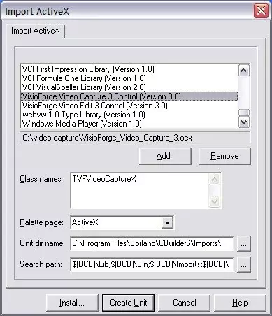
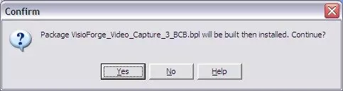
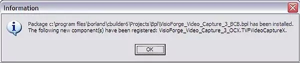
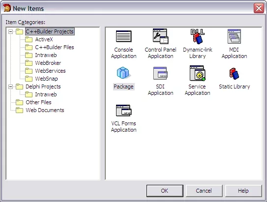
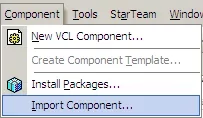
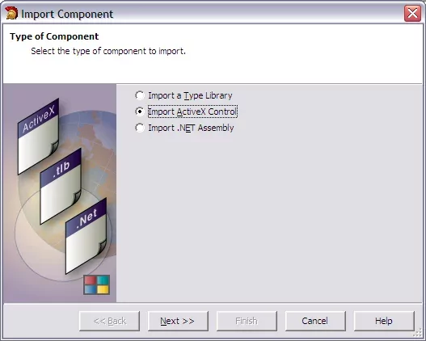
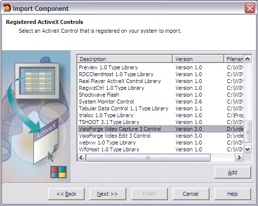
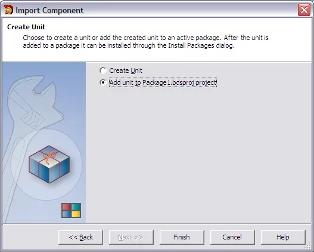
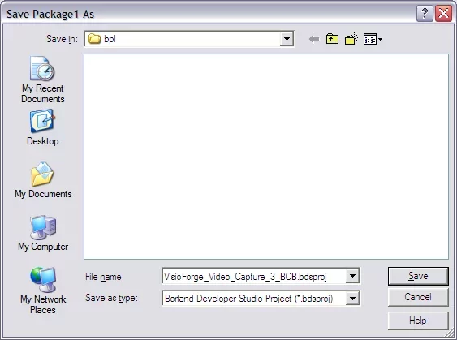

# Installing TVFMediaPlayer in C++ Builder

Welcome to the detailed guide for integrating the powerful TVFMediaPlayer library into your Embarcadero C++ Builder development environment. This document covers the installation process for legacy versions like C++ Builder 5 and 6, as well as modern versions from 2006 onwards. We will explore the necessary prerequisites, step-by-step installation procedures for different IDE versions, considerations for 32-bit (x86) and 64-bit (x64) architectures, and common troubleshooting steps.

## Introduction to TVFMediaPlayer and VisioForge Media Framework

TVFMediaPlayer is a versatile multimedia component developed by VisioForge. It's part of the larger VisioForge Media Framework, designed to provide developers with a robust set of tools for handling audio and video playback, capture, processing, and streaming within their applications. TVFMediaPlayer specifically focuses on playback capabilities, supporting a wide array of formats and offering extensive control over media rendering.

The component is delivered as an ActiveX control, making it easily integrable into environments that support COM technology, such as C++ Builder. Utilizing ActiveX allows for visual design-time integration and straightforward programmatic access to the player's features.

## Prerequisites

Before proceeding with the installation, ensure your development environment meets the following requirements:

1. **Supported C++ Builder Version:** You need a working installation of Embarcadero C++ Builder. This guide covers:
    * C++ Builder 5
    * C++ Builder 6
    * C++ Builder 2006
    * C++ Builder 2007, 2009, 2010, XE series (XE to XE8), 10.x series (Seattle, Berlin, Tokyo, Rio, Sydney), 11.x (Alexandria), and later versions. While the core process remains similar for newer versions, minor UI variations might exist.
2. **Operating System:** A compatible Windows operating system (Windows 7 or later, including Windows 8, 10, 11, and corresponding Server versions). Ensure your OS matches the target architecture (32-bit or 64-bit) of your C++ Builder projects.
3. **Administrative Privileges:** The installation of the VisioForge Media Framework and the registration of ActiveX controls typically require administrative privileges on your machine. Ensure you are running the installer and C++ Builder with sufficient permissions, especially if User Account Control (UAC) is enabled.
4. **Dependencies:** The VisioForge installer usually bundles necessary runtime dependencies (like specific DirectX or Media Foundation components). However, keeping your Windows system updated is generally recommended.

## Step 1: Download the All-in-One Media Framework

The TVFMediaPlayer component is distributed as part of the VisioForge All-in-One Media Framework SDK. You must download the correct version:

* **Target:** Download the **ActiveX** version of the SDK. Do not download the .NET or VCL versions, as they are intended for different development environments.
* **Source:** Obtain the installer directly from the official VisioForge website. Navigate to the [product page](https://www.visioforge.com/all-in-one-media-framework) and locate the download link for the ActiveX SDK. Ensure you are downloading the latest stable release unless you have specific requirements for an older version.

## Step 2: Install the VisioForge Media Framework

Once the download is complete, proceed with the installation:

1. **Locate the Installer:** Find the downloaded executable file.
2. **Run as Administrator:** Right-click the installer file and select "Run as administrator". This is crucial for ensuring the ActiveX controls are correctly registered in the Windows Registry.
3. **Follow the Wizard:** The installation wizard will guide you through the process.
    * Accept the license agreement.
    * Choose the installation directory (the default location is usually suitable).
    * Select the components to install. Ensure that the core framework and the MediaPlayer components are selected. Typically, the default selection is sufficient.
    * The installer will copy the necessary files (DLLs, AX files, etc.) and register the ActiveX controls on your system.
4. **Completion:** Once the installation finishes, click "Finish". The TVFMediaPlayer ActiveX control is now available on your system, ready to be imported into the C++ Builder IDE.

## Step 3: Import the TVFMediaPlayer ActiveX Control into C++ Builder

The method for importing the ActiveX control differs slightly between older and newer versions of C++ Builder.

### A. For C++ Builder 5 and 6

These classic versions have a straightforward import mechanism:

1. **Launch C++ Builder:** Open your C++ Builder 5 or 6 IDE.
2. **Open or Create a Project:** You can import the control into an existing project or a new one. The import process adds the component to the IDE's palette, making it available for all projects.
3. **Import ActiveX Control:** Navigate to the main menu and select `Component` → `Import ActiveX Controls...`.

    

4. **Select the Control:** A dialog box will appear listing all registered ActiveX controls on your system. Scroll through the list and find `VisioForge Media Player` (it might also be listed as `VFMediaPlayer Class` or similar, depending on registry details). Check the box next to it.

    

5. **Install:** Click the `Install...` button.
6. **Package Creation/Selection:** C++ Builder will prompt you to install the component into a package. You can choose an existing package (like `dclusr.dpk`) or create a new one. For simplicity, adding it to the default user package is often sufficient. Click `OK`.
7. **Confirmation:** A confirmation dialog will ask if you want to rebuild the package. Click `Yes`.

    

8. **Compilation and Installation:** C++ Builder will compile the package containing the wrapper code for the ActiveX control. Upon successful compilation, a message will confirm the installation. Click `OK`.

    

9. **Component Palette:** The TVFMediaPlayer component should now appear on the C++ Builder Component Palette, likely under a tab named `ActiveX` or `VisioForge`. You can now drag and drop it onto your forms like any other standard VCL component.

### B. For C++ Builder 2006 and Later (including XE, 10.x, 11.x)

Modern C++ Builder versions use a more structured component import process, typically involving creating or using a dedicated design-time package:

1. **Launch C++ Builder:** Open your C++ Builder IDE (2006 or newer).
2. **Create a New Package:** It's generally best practice to install third-party components into their own package.
    * Go to `File` → `New` → `Other...`.
    * In the `New Items` dialog, navigate to `C++Builder Projects` (or similar category) and select `Package`. Click `OK`.

    

3. **Import Component:** With the new package project active (e.g., `Package1.cbproj`), go to the main menu and select `Component` → `Import Component...`.

    

4. **Select Import Type:** In the `Import Component` wizard, choose the `Import ActiveX Control` option and click `Next >`.

    

5. **Select the Control:** Similar to the older versions, find `VisioForge Media Player` in the list of registered controls, select it, and click `Next >`.

    

6. **Component Details:** The wizard will display details about the control. You can typically accept the defaults for `Palette Page` (e.g., `ActiveX`), `Unit Dir Name`, and `Search Path`. Click `Next >`. *Note: Some developers prefer to create a dedicated "VisioForge" palette page.*
7. **Package Selection:** Choose the action `Add unit to <PackageName>.cbproj` (where `<PackageName>` is the name of the package you created in step 2). Click `Finish`.

    

    *Self-Correction: The screenshot reference 'mpbcb2006_5.webp' seems misplaced in the original document's flow. It likely referred to saving or build options, which are handled next.*

8. **Save the Package:** C++ Builder will generate the necessary wrapper unit (e.g., `VFMediaPlayerLib_TLB.cpp` / `.h`). Save the package project (`.cbproj`) and the associated files when prompted. Choose a meaningful name and location for your package (e.g., `VisioForgeMediaPlayerPkg`).

    

9. **Compile and Install the Package:**
    * In the `Project Manager` pane, right-click on the package project's `.bpl` file (e.g., `VisioForgeMediaPlayerPkg.bpl`).
    * Select `Compile` to ensure the wrapper code builds correctly.
    * After a successful compilation, right-click the `.bpl` file again and select `Install`.

10. **Confirmation:** The IDE will install the package, making the TVFMediaPlayer component available on the specified Component Palette page (e.g., `ActiveX`).

## Step 4: Using the TVFMediaPlayer Component

After successful installation, you can use the component in your C++ Builder applications:

1. **Design-Time:** Open a form in the Form Designer. Locate the `TVFMediaPlayer` component on the Component Palette (usually on the `ActiveX` or `VisioForge` tab). Click and drop it onto your form. You can resize and position it as needed. Use the Object Inspector to configure its basic properties.
2. **Run-Time:** Access the component's methods and properties programmatically in your C++ code. For example, to load and play a file:

    ```cpp
    // Assuming MediaPlayer1 is the name of the TVFMediaPlayer component on your form
    MediaPlayer1->Filename = "C:\\path\\to\\your\\video.mp4";
    MediaPlayer1->Play();
    ```

3. **Event Handling:** Use the Object Inspector's `Events` tab to assign handlers to various player events (e.g., `OnPlay`, `OnStop`, `OnError`).

## Architecture Considerations (x86 vs. x64)

The VisioForge Media Framework provides both 32-bit (x86) and 64-bit (x64) versions of its libraries and ActiveX controls. It's crucial to match the component architecture with your C++ Builder project's target platform:

* **32-bit Projects (Win32 Target Platform):** Use the x86 version of the TVFMediaPlayer ActiveX control. The standard installation typically registers the x86 version correctly. When importing/installing the component package (especially in modern IDEs), ensure you are building and installing the package for the Win32 platform.
* **64-bit Projects (Win64 Target Platform):** Use the x64 version of the TVFMediaPlayer ActiveX control. The VisioForge installer should register both versions.
  * **IDE Design-Time:** Importantly, the C++ Builder IDE itself is often a 32-bit application (even in recent versions). This means that for visual form design, the IDE needs to load the **x86** version of the ActiveX control.
  * **Compilation/Runtime:** When you compile your project for the Win64 target platform, the application will require the **x64** version of the control at runtime.
  * **Package Management:** In modern C++ Builder versions, you might need to:
        1. Create and install a design-time package targeting Win32 (using the x86 control) for use in the IDE.
        2. Ensure the corresponding runtime package (or necessary library files) for Win64 are correctly configured in your project's build settings and deployed with your 64-bit application. Consult the VisioForge documentation and C++ Builder's platform management features for specifics. Some developers manage separate packages for Win32 and Win64 targets.

**Recommendation:** While legacy C++ Builder versions are covered, VisioForge strongly recommends using modern versions of C++ Builder (XE series or later). These versions offer better support for 64-bit development, improved IDE features, and compatibility with current Windows operating systems and VisioForge SDK updates. Support for C++ Builder 5/6 might be limited.

## Troubleshooting Common Issues

* **Control Not Found in Import List:** Ensure the VisioForge Media Framework (ActiveX version) was installed correctly with administrative privileges. Try reinstalling the framework. Manually registering the `.ocx` or `.ax` file using `regsvr32` (run from an Administrator command prompt) might be necessary in rare cases (e.g., `regsvr32 "C:\Program Files (x86)\VisioForge\Media Framework\VFMediaPlayer.ax"` - adjust path as needed).
* **Package Installation Fails:** Check the build output for errors. Ensure the package project settings (paths, target platform) are correct. Verify you have write permissions to the C++ Builder library/package directories.
* **Component Works in IDE but Fails at Runtime (or vice-versa):** This often points to an architecture mismatch (x86 vs. x64). Review the "Architecture Considerations" section carefully. Ensure the correct version (32-bit or 64-bit) of the VisioForge runtime files is accessible to your compiled application. Deploy the required VisioForge redistributables with your application if necessary.
* **Errors During Playback (`CreateObject` fails, etc.):** Double-check that the `Filename` property points to a valid, accessible media file. Ensure the necessary codecs for the media format are installed on the system (though VisioForge often includes internal decoders or utilizes Media Foundation/DirectShow). Check the VisioForge `OnError` event for specific error codes or messages.

## Conclusion

Integrating TVFMediaPlayer into C++ Builder provides a powerful solution for adding media playback to your applications. By following the appropriate steps for your IDE version, carefully managing x86/x64 architectures, and understanding the package system, you can successfully incorporate this component. Remember to consult the official VisioForge documentation and examples for more advanced usage and API details.

---
For further assistance or specific issues not covered here, please contact VisioForge [support](https://support.visioforge.com/). Explore more advanced examples and source code on the VisioForge [GitHub](https://github.com/visioforge/) repository.