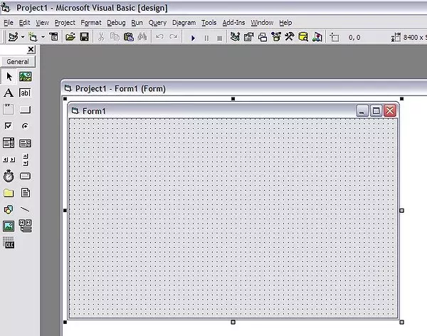
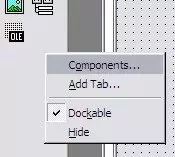
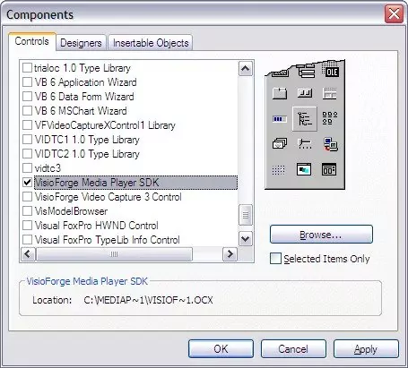
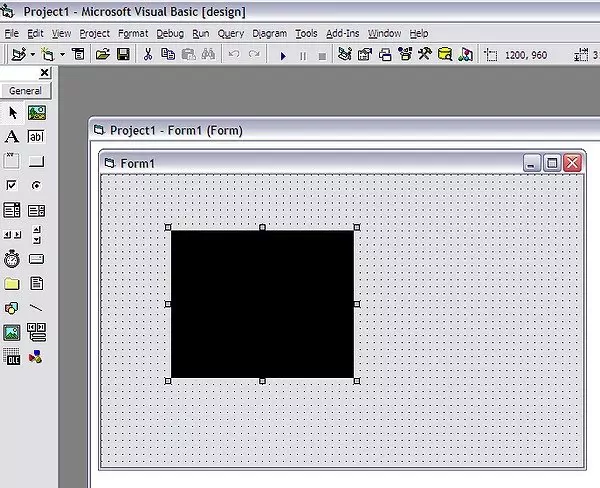

# Intégration de TVFMediaPlayer avec Visual Basic 6 : un guide complet

Microsoft Visual Basic 6 (VB6), malgré son âge, reste une plateforme pertinente pour de nombreuses applications héritées. Sa simplicité et ses capacités de développement rapide d'applications (RAD) l'ont rendu extrêmement populaire. Une façon d'étendre les fonctionnalités des applications VB6, en particulier en matière de traitement multimédia, consiste à tirer parti des contrôles ActiveX. La bibliothèque TVFMediaPlayer, développée par VisioForge, offre une suite puissante de fonctionnalités multimédias accessibles aux développeurs VB6 via son interface ActiveX.

Ce guide propose un cheminement complet pour installer, configurer et utiliser la bibliothèque TVFMediaPlayer au sein d'un projet Visual Basic 6. Nous aborderons les subtilités du travail avec ActiveX dans VB6, traiterons les limitations inhérentes au 32 bits, et fournirons des étapes pratiques pour l'intégration et l'utilisation de base.

## Comprendre ActiveX et la compatibilité avec VB6

Les contrôles ActiveX sont des composants logiciels réutilisables basés sur la technologie Component Object Model (COM) de Microsoft. Ils permettent aux développeurs d'ajouter des fonctionnalités spécifiques aux applications sans écrire le code sous-jacent à partir de zéro. Visual Basic 6 dispose d'une excellente prise en charge intégrée d'ActiveX, permettant aux développeurs d'incorporer facilement des contrôles tiers comme TVFMediaPlayer dans leurs projets via une interface graphique.

Cette intégration transparente signifie que les développeurs VB6 peuvent accéder aux capacités multimédias avancées de la bibliothèque VisioForge — telles que la lecture vidéo, la manipulation audio, la capture d'écran et le streaming réseau — directement depuis l'IDE familier de VB6.

### La contrainte 32 bits

Un point essentiel à comprendre est que Visual Basic 6 est strictement un environnement de développement 32 bits. Il a été créé à une époque où l'informatique 64 bits n'était pas généralisée pour les applications de bureau. Par conséquent, VB6 ne peut ni créer ni interagir directement avec des composants ou processus 64 bits.

Cette limitation impose que seule la version 32 bits (x86) du contrôle ActiveX TVFMediaPlayer puisse être utilisée avec VB6. Alors que les systèmes modernes sont majoritairement 64 bits, Windows conserve des couches de compatibilité (WoW64 — Windows 32-bit on Windows 64-bit) qui permettent aux applications 32 bits comme celles construites avec VB6, ainsi qu'aux contrôles ActiveX 32 bits qu'elles utilisent, de fonctionner correctement sur les systèmes d'exploitation 64 bits.

Bien que confinée à une architecture 32 bits, la bibliothèque TVFMediaPlayer est optimisée pour offrir des performances robustes et fiables. Les développeurs peuvent en toute confiance construire des applications multimédias sophistiquées en VB6, en exploitant l'ensemble des fonctionnalités fournies par le contrôle 32 bits.

## Prérequis

Avant de commencer le processus d'installation, assurez-vous de disposer des éléments suivants :

1. **Microsoft Visual Basic 6 :** une installation fonctionnelle de l'IDE VB6 est requise. Cela inclut les service packs nécessaires (généralement SP6).
2. **SDK :** téléchargez la dernière version du SDK qui inclut les composants ActiveX. Veillez à télécharger le programme d'installation adapté à vos besoins (souvent un programme d'installation combiné x86/x64, mais seuls les composants x86 seront enregistrés pour une utilisation avec VB6).
3. **Privilèges d'administrateur :** l'installation du SDK et l'enregistrement du contrôle ActiveX nécessitent généralement des droits d'administrateur sur la machine de développement.

## Installation et intégration pas à pas

Suivez ces étapes pour intégrer le contrôle TVFMediaPlayer dans votre projet Visual Basic 6 :

### **Étape 1 : installer le contrôle TVFMediaPlayer**

Exécutez le programme d'installation du SDK VisioForge téléchargé. Suivez les invites à l'écran. Le programme d'installation copie les fichiers de bibliothèque nécessaires (`.ocx`, `.dll`) sur votre système et tente d'enregistrer le contrôle ActiveX dans le registre Windows. Prêtez attention au répertoire d'installation, bien que le processus d'enregistrement rende généralement le contrôle disponible à l'échelle du système.

### **Étape 2 : créer ou ouvrir un projet VB6**

Lancez l'IDE Visual Basic 6. Vous pouvez soit démarrer un nouveau projet Standard EXE, soit ouvrir un projet existant dans lequel vous souhaitez ajouter des capacités multimédias.


*Légende : création d'un nouveau projet Standard EXE dans Visual Basic 6.*

### **Étape 3 : ajouter le composant TVFMediaPlayer**

Pour rendre le contrôle ActiveX disponible dans la boîte à outils de votre projet, vous devez l'ajouter via la boîte de dialogue « Components ».

* Allez dans le menu `Project` et sélectionnez `Components...`. Vous pouvez également cliquer avec le bouton droit sur la boîte à outils et choisir `Components...`.


*Légende : accès à la boîte de dialogue Components depuis le menu Project.*

* La boîte de dialogue « Components » répertorie tous les contrôles ActiveX enregistrés sur votre système. Faites défiler la liste sous l'onglet « Controls ».
* Localisez et cochez la case en regard de « VisioForge Media Player » (le nom exact peut varier légèrement selon la version installée).


*Légende : sélection du contrôle « VisioForge Media Player » dans la boîte de dialogue Components.*

* Cliquez sur `OK` ou `Apply`.

### **Étape 4 : utiliser le contrôle dans votre projet**

Après avoir ajouté le composant, son icône apparaît dans la boîte à outils VB6.


*Légende : le contrôle TVFMediaPlayer ajouté à la boîte à outils de Visual Basic 6.*

Vous pouvez maintenant sélectionner l'icône TVFMediaPlayer dans la boîte à outils et la dessiner sur n'importe quel formulaire de votre projet, comme n'importe quel contrôle VB6 standard (par exemple Button, TextBox). Cela crée une instance de l'objet lecteur multimédia sur votre formulaire. Vous pouvez la redimensionner et la positionner selon vos besoins à l'aide du concepteur de formulaires.

#### **Utilisation de base : contrôler le lecteur**

Une fois que le contrôle TVFMediaPlayer (`VFMediaPlayer1` par défaut, s'il s'agit du premier ajouté) est sur votre formulaire, vous pouvez interagir avec lui par programmation à l'aide de code VB6.

## Considérations de déploiement

Lorsque vous distribuez votre application VB6 qui utilise le contrôle TVFMediaPlayer, vous devez vous assurer que les fichiers d'exécution nécessaires sont inclus et correctement enregistrés sur la machine de l'utilisateur cible.

1. **Fichiers requis :** identifiez le fichier `.ocx` spécifique au contrôle TVFMediaPlayer ainsi que tous les fichiers `.dll` dépendants fournis par le SDK VisioForge. Ces fichiers doivent être livrés avec le programme d'installation de votre application.
2. **Enregistrement :** le contrôle ActiveX (fichier `.ocx`) doit être enregistré dans le registre Windows sur la machine cible. Les outils d'installation standard (comme Inno Setup, InstallShield, ou même les outils d'empaquetage VB6 plus anciens) fournissent généralement des mécanismes pour enregistrer les contrôles ActiveX lors de l'installation. À défaut, l'utilitaire en ligne de commande `regsvr32.exe` peut être utilisé manuellement ou via un script :

    ```bash
    regsvr32.exe "C:\\Program Files (x86)\\YourApp\\VFMediaPlayer.ocx"
    ```

    N'oubliez pas d'utiliser le chemin correct et d'exécuter la commande avec des privilèges d'administrateur. Comme il s'agit d'un contrôle 32 bits, même sur un système 64 bits, vous utilisez généralement le `regsvr32.exe` situé dans le répertoire `C:\Windows\SysWOW64`, bien que le système gère souvent cette redirection automatiquement.
3. **Licences :** assurez-vous de respecter les termes de la licence VisioForge pour le déploiement. Certaines versions peuvent exiger qu'une clé de licence d'exécution soit définie par programmation dans votre application.

## Dépannage des problèmes courants

* **Le contrôle n'apparaît pas dans Components :**
  * Assurez-vous que le SDK VisioForge a été installé correctement avec des droits d'administrateur.
  * Essayez d'enregistrer manuellement le fichier `.ocx` en utilisant `regsvr32.exe` depuis une invite de commandes élevée.
  * Vérifiez que vous recherchez le bon nom dans la liste Components.
* **« Runtime Error '429': ActiveX component can't create object » :**
  * Cela indique généralement que le contrôle n'est pas correctement enregistré sur la machine où s'exécute l'application. Réenregistrez le fichier `.ocx`.
  * Assurez-vous que toutes les DLL dépendantes sont présentes dans le répertoire de l'application ou dans un chemin système.
* **Problèmes de lecture (pas de vidéo/audio, erreurs) :**
  * Vérifiez que le chemin vers le fichier multimédia est correct et accessible.
  * Assurez-vous que les codecs nécessaires sont installés sur le système (bien que TVFMediaPlayer inclue souvent des décodeurs internes ou utilise DirectShow/Media Foundation).
  * Consultez la documentation VisioForge pour des codes d'erreur spécifiques ou des propriétés qui pourraient donner plus de détails.
  * Mettez en place une gestion d'erreurs appropriée autour des méthodes du lecteur (`Play`, `Stop`, définition de propriétés) pour diagnostiquer les problèmes.

## Au-delà de VB6 : modernisation

Bien que TVFMediaPlayer fournisse un pont pour ajouter des fonctionnalités multimédias modernes aux applications VB6 héritées, les organisations doivent également envisager des stratégies à long terme. La migration des applications VB6 vers des plateformes plus récentes comme .NET (en utilisant C# ou VB.NET) ou des technologies basées sur le Web peut offrir des avantages significatifs en matière de performance, de sécurité, de maintenabilité et d'accès aux outils et bibliothèques de développement les plus récents. VisioForge propose également des versions .NET natives de ses bibliothèques, qui seraient le choix privilégié dans une application modernisée.

## Conclusion

La bibliothèque TVFMediaPlayer, via son contrôle ActiveX, offre un moyen puissant et accessible pour les développeurs Visual Basic 6 d'incorporer des fonctionnalités multimédias avancées dans leurs applications. En comprenant le processus d'installation, les limitations 32 bits, l'utilisation de base du contrôle et les exigences de déploiement décrites dans ce guide, les développeurs peuvent exploiter efficacement la technologie VisioForge pour améliorer leurs projets VB6. Bien que VB6 soit une plateforme héritée, des outils comme TVFMediaPlayer aident à prolonger sa durée de vie utile pour des besoins applicatifs spécifiques.

---
Pour toute assistance supplémentaire ou pour des scénarios plus complexes, veuillez contacter le [support VisioForge](https://support.visioforge.com/). Explorez les nombreux exemples de code disponibles sur le [dépôt GitHub](https://github.com/visioforge/) VisioForge pour des exemples et techniques plus avancés.