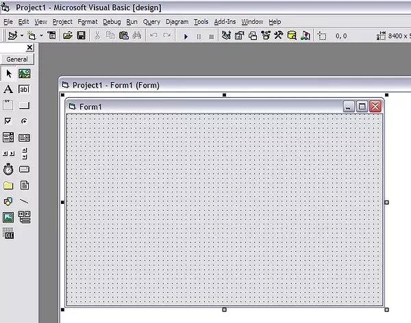
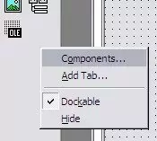
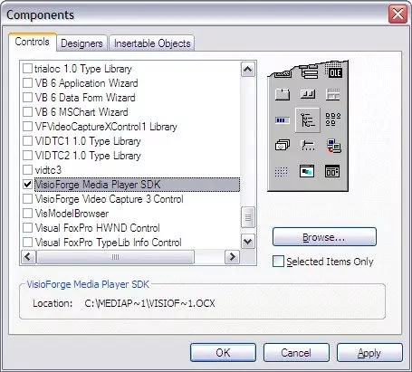
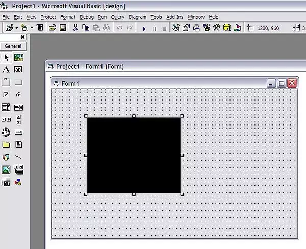

# Integrating TVFMediaPlayer with Visual Basic 6: A Comprehensive Guide

Microsoft Visual Basic 6 (VB6), despite its age, remains a relevant platform for many legacy applications. Its simplicity and rapid application development (RAD) capabilities made it incredibly popular. One way to extend the functionality of VB6 applications, particularly in multimedia processing, is by leveraging ActiveX controls. The TVFMediaPlayer library, developed by VisioForge, offers a powerful suite of multimedia features accessible to VB6 developers through its ActiveX interface.

This guide provides a comprehensive walkthrough for installing, configuring, and utilizing the TVFMediaPlayer library within a Visual Basic 6 project. We will cover the nuances of working with ActiveX in VB6, address the inherent 32-bit limitations, and provide practical steps for integration and basic usage.

## Understanding ActiveX and VB6 Compatibility

ActiveX controls are reusable software components based on Microsoft's Component Object Model (COM) technology. They allow developers to add specific functionalities to applications without writing the underlying code from scratch. Visual Basic 6 has excellent built-in support for ActiveX, enabling developers to easily incorporate third-party controls like TVFMediaPlayer into their projects via a graphical interface.

This seamless integration means that VB6 developers can access the advanced multimedia capabilities of the VisioForge library—such as video playback, audio manipulation, screen capture, and network streaming—directly within the familiar VB6 IDE.

### The 32-bit Constraint

A crucial point to understand is that Visual Basic 6 is strictly a 32-bit development environment. It was created during an era when 64-bit computing was not mainstream for desktop applications. Consequently, VB6 cannot create or directly interact with 64-bit components or processes.

This limitation dictates that only the 32-bit (x86) version of the TVFMediaPlayer ActiveX control can be used with VB6. While modern systems are predominantly 64-bit, Windows maintains compatibility layers (WoW64 - Windows 32-bit on Windows 64-bit) that allow 32-bit applications like those built with VB6, and the 32-bit ActiveX controls they use, to run correctly on 64-bit operating systems.

Despite being confined to a 32-bit architecture, the TVFMediaPlayer library is optimized to deliver robust and reliable performance. Developers can confidently build sophisticated multimedia applications in VB6, leveraging the full feature set provided by the 32-bit control.

## Prerequisites

Before you begin the installation process, ensure you have the following:

1. **Microsoft Visual Basic 6:** A working installation of the VB6 IDE is required. This includes the necessary service packs (typically SP6).
2. **SDK:** Download the latest version of the SDK that includes the ActiveX components. Ensure you download the installer appropriate for your needs (often a combined x86/x64 installer, but only the x86 components will be registered for VB6 use).
3. **Administrator Privileges:** Installing the SDK and registering the ActiveX control typically requires administrator rights on the development machine.

## Step-by-Step Installation and Integration

Follow these steps to integrate the TVFMediaPlayer control into your Visual Basic 6 project:

### **Step 1: Install the TVFMediaPlayer control**

Run the downloaded VisioForge SDK installer. Follow the on-screen prompts. The installer will copy the necessary library files (`.ocx`, `.dll`) to your system and attempt to register the ActiveX control in the Windows Registry. Pay attention to the installation directory, though typically the registration process makes the control available system-wide.

### **Step 2: Create or Open a VB6 Project**

Launch the Visual Basic 6 IDE. You can either start a new Standard EXE project or open an existing one where you wish to add multimedia capabilities.


*Caption: Creating a new Standard EXE project in Visual Basic 6.*

### **Step 3: Add the TVFMediaPlayer Component**

To make the ActiveX control available in your project's Toolbox, you need to add it through the "Components" dialog.

* Go to the `Project` menu and select `Components...`. Alternatively, right-click on the Toolbox and choose `Components...`.


*Caption: Accessing the Components dialog from the Project menu.*

* The "Components" dialog lists all registered ActiveX controls on your system. Scroll down the list under the "Controls" tab.
* Locate and check the box next to "VisioForge Media Player" (the exact name might vary slightly depending on the installed version).


*Caption: Selecting the 'VisioForge Media Player' control in the Components dialog.*

* Click `OK` or `Apply`.

### **Step 4: Use the Control in Your Project**

After adding the component, its icon will appear in the VB6 Toolbox.


*Caption: The TVFMediaPlayer control added to the Visual Basic 6 Toolbox.*

You can now select the TVFMediaPlayer icon from the Toolbox and draw it onto any form in your project, just like any standard VB6 control (e.g., Button, TextBox). This creates an instance of the media player object on your form. You can resize and position it as needed using the form designer.

#### **Basic Usage: Controlling the Player**

Once the TVFMediaPlayer control (`VFMediaPlayer1` by default, if it's the first one added) is on your form, you can interact with it programmatically using VB6 code.

## Deployment Considerations

When you distribute your VB6 application that uses the TVFMediaPlayer control, you must ensure the necessary runtime files are included and correctly registered on the target user's machine.

1. **Required Files:** Identify the specific `.ocx` file for the TVFMediaPlayer control and any dependent `.dll` files provided by the VisioForge SDK. These files need to be shipped with your application installer.
2. **Registration:** The ActiveX control (`.ocx` file) must be registered in the Windows Registry on the target machine. Standard installer tools (like Inno Setup, InstallShield, or even older VB6 packaging tools) usually provide mechanisms to register ActiveX controls during installation. Alternatively, the `regsvr32.exe` command-line utility can be used manually or via a script:

    ```bash
    regsvr32.exe "C:\\Program Files (x86)\\YourApp\\VFMediaPlayer.ocx"
    ```

    Remember to use the correct path and run the command with administrator privileges. Since it's a 32-bit control, even on a 64-bit system, you typically use the `regsvr32.exe` found in the `C:\Windows\SysWOW64` directory, although the system often handles this redirection automatically.
3. **Licensing:** Ensure you comply with the VisioForge licensing terms for deployment. Some versions might require a runtime license key to be set programmatically within your application.

## Troubleshooting Common Issues

* **Control Not Appearing in Components:**
  * Ensure the VisioForge SDK was installed correctly with administrator rights.
  * Try manually registering the `.ocx` file using `regsvr32.exe` from an elevated command prompt.
  * Verify you are looking for the correct name in the Components list.
* **"Runtime Error '429': ActiveX component can't create object":**
  * This usually indicates the control is not properly registered on the machine where the application is running. Re-register the `.ocx` file.
  * Ensure all dependent DLLs are present in the application's directory or a system path.
* **Playback Issues (No Video/Audio, Errors):**
  * Verify the path to the media file is correct and accessible.
  * Ensure necessary codecs are installed on the system (though TVFMediaPlayer often includes internal decoders or uses DirectShow/Media Foundation).
  * Check the VisioForge documentation for specific error codes or properties that might give more detail.
  * Implement proper error handling around player methods (`Play`, `Stop`, property setting) to diagnose issues.

## Beyond VB6: Modernization

While TVFMediaPlayer provides a bridge for adding modern multimedia features to legacy VB6 applications, organizations should also consider long-term strategies. Migrating VB6 applications to newer platforms like .NET (using C# or VB.NET) or web-based technologies can offer significant advantages in terms of performance, security, maintainability, and access to the latest development tools and libraries. VisioForge also offers .NET-native versions of its libraries, which would be the preferred choice in a modernized application.

## Conclusion

The TVFMediaPlayer library, through its ActiveX control, offers a powerful and accessible way for Visual Basic 6 developers to incorporate advanced multimedia functionalities into their applications. By understanding the installation process, the 32-bit limitations, basic control usage, and deployment requirements outlined in this guide, developers can effectively leverage VisioForge technology to enhance their VB6 projects. While VB6 is a legacy platform, tools like TVFMediaPlayer help extend its useful life for specific application needs.

---
For further assistance or more complex scenarios, please get in touch with [VisioForge support](https://support.visioforge.com/). Explore the extensive code samples available on the VisioForge [GitHub repository](https://github.com/visioforge/) for more advanced examples and techniques.