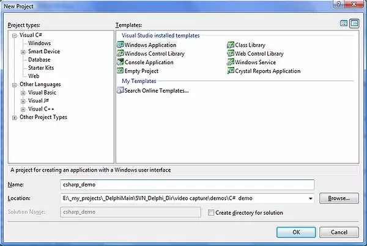
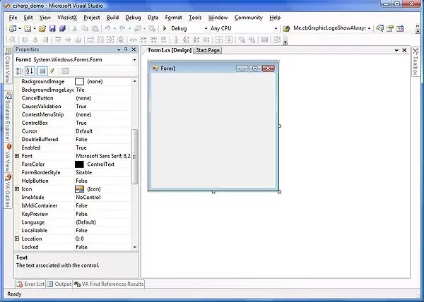
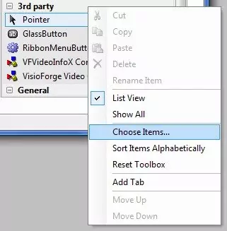
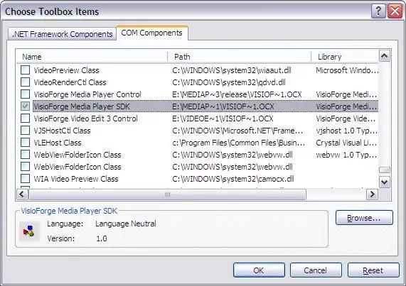
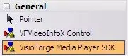
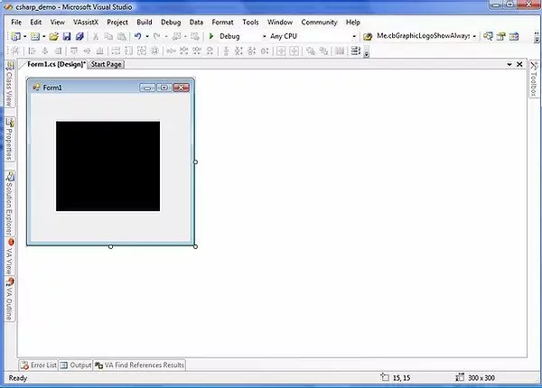

# Installation de TVFMediaPlayer ActiveX dans Visual Studio 2010 et versions ultérieures

Ce guide fournit des instructions détaillées pour intégrer le contrôle ActiveX VisioForge Media Player (`TVFMediaPlayer`) dans vos projets Microsoft Visual Studio (version 2010 et ultérieures). Nous couvrirons les étapes nécessaires pour les environnements C++, C# et Visual Basic .NET, expliquerons les mécanismes sous-jacents et discuterons de considérations importantes, notamment des raisons pour lesquelles la migration vers le SDK .NET natif est vivement recommandée pour le développement moderne.

## Comprendre ActiveX et son rôle dans le développement moderne

ActiveX, une technologie développée par Microsoft, permet aux composants logiciels (contrôles) d'interagir entre eux, quel que soit le langage dans lequel ils ont été initialement écrits. Elle repose sur le Component Object Model (COM). Dans le contexte de Visual Studio, les contrôles ActiveX peuvent être intégrés dans des formulaires d'application pour fournir des fonctionnalités spécifiques, comme la lecture multimédia dans le cas de `TVFMediaPlayer`.

Bien qu'historiquement important, l'usage d'ActiveX a décliné, surtout au sein de l'écosystème .NET. Les frameworks .NET modernes offrent des moyens plus intégrés, robustes et sécurisés d'incorporer des composants d'interface utilisateur et des fonctionnalités. Néanmoins, des applications héritées ou des scénarios d'interopérabilité spécifiques peuvent encore nécessiter l'utilisation de contrôles ActiveX.

Lorsque vous utilisez un contrôle ActiveX dans un projet .NET (C# ou VB.Net), Visual Studio n'interagit pas directement avec lui. À la place, il génère automatiquement des **Runtime Callable Wrappers (RCW)**. Ces wrappers sont essentiellement des assemblys .NET qui agissent comme intermédiaires, traduisant les appels .NET en appels COM que le contrôle ActiveX comprend, et inversement. Ce processus permet au code managé (.NET) d'utiliser des composants non managés (COM/ActiveX).

## Prérequis

Avant de commencer, assurez-vous d'avoir les éléments suivants :

1. **Microsoft Visual Studio :** version 2010 ou édition ultérieure installée.
2. **Contrôle ActiveX TVFMediaPlayer :** le contrôle ActiveX VisioForge Media Player doit être correctement installé et enregistré sur votre machine de développement. Vous pouvez généralement le télécharger depuis le site web ou auprès d'un distributeur VisioForge. **De manière cruciale**, vous pouvez avoir besoin que les versions 32 bits (x86) et 64 bits (x64) soient toutes deux enregistrées, même si vous développez uniquement une application 64 bits. Le concepteur de Visual Studio s'exécute souvent comme un processus 32 bits et nécessite la version x86 pour afficher visuellement le contrôle pendant la conception. L'exécution utilisera la version correspondant à l'architecture cible de votre projet (x86 ou x64).
3. **Projet :** un projet C++, C# ou VB.NET existant ou nouveau dans lequel vous prévoyez d'utiliser le lecteur multimédia.

## Installation pas à pas dans Visual Studio

Le processus consiste à ajouter le contrôle `TVFMediaPlayer` à la boîte à outils de Visual Studio, ce qui vous permet ensuite de le glisser-déposer sur les formulaires ou fenêtres de votre application.

### **Étape 1 : créer ou ouvrir votre projet**

Lancez Visual Studio et créez un nouveau projet ou ouvrez-en un existant. Les captures d'écran ci-dessous utilisent une application Windows Forms en C#, mais les étapes sont analogues pour C++ (MFC, par exemple) et VB.NET WinForms.

* Pour C# WinForms : `File -> New -> Project -> Visual C# -> Windows Forms App (.NET Framework)`
* Pour VB.NET WinForms : `File -> New -> Project -> Visual Basic -> Windows Forms App (.NET Framework)`
* Pour C++ MFC : `File -> New -> Project -> Visual C++ -> MFC/ATL -> MFC App`





### **Étape 2 : ouvrir la boîte à outils**

Si la boîte à outils n'est pas visible, vous pouvez l'ouvrir via le menu `View` (`View -> Toolbox` ou `Ctrl+Alt+X`). La boîte à outils contient les contrôles et composants d'interface utilisateur standard.

### **Étape 3 : ajouter le contrôle ActiveX à la boîte à outils**

Pour rendre le contrôle `TVFMediaPlayer` disponible, vous devez l'ajouter à la boîte à outils :

1. Cliquez avec le bouton droit dans une zone vide de la boîte à outils (par exemple, sous l'onglet « General » ou créez un nouvel onglet).
2. Sélectionnez « Choose Items... » dans le menu contextuel.



### **Étape 4 : sélectionner le contrôle TVFMediaPlayer**

1. La boîte de dialogue « Choose Toolbox Items » apparaît. Naviguez vers l'onglet « COM Components ». Cet onglet liste tous les contrôles ActiveX enregistrés sur votre système.
2. Parcourez la liste ou utilisez la zone de filtre pour trouver le contrôle « VisioForge Media Player » (le nom exact peut varier légèrement selon la version installée).
3. Cochez la case en regard du nom du contrôle.
4. Cliquez sur « OK ».



Visual Studio ajoute alors le contrôle à votre boîte à outils et, si vous êtes dans un projet C# ou VB.Net, génère les assemblys RCW nécessaires (souvent nommés `AxInterop.VisioForgeMediaPlayerLib.dll` et `Interop.VisioForgeMediaPlayerLib.dll`) et ajoute les références correspondantes dans votre projet.

### **Étape 5 : ajouter le contrôle à votre formulaire**

1. Localisez l'icône « VisioForge Media Player » nouvellement ajoutée dans la boîte à outils.
2. Cliquez et faites glisser l'icône sur le formulaire ou la surface de conception de votre application.



Une instance du contrôle `TVFMediaPlayer` apparaît sur votre formulaire. Vous pouvez la redimensionner et la positionner selon vos besoins à l'aide du concepteur.



### **Étape 6 : interagir avec le contrôle (code)**

Vous pouvez désormais interagir avec le contrôle du lecteur multimédia par programmation via ses propriétés, méthodes et événements. Sélectionnez le contrôle dans le concepteur, et utilisez la fenêtre Propriétés (`F4`) pour configurer son apparence et son comportement de base.

Pour contrôler la lecture, gérer les événements, etc., vous écrirez du code. Voici un exemple simple en C# pour charger et lire un fichier vidéo lors du clic sur un bouton :

```csharp
// En supposant que votre contrôle TVFMediaPlayer s'appelle 'axMediaPlayer1'
// et que vous disposez d'un bouton nommé 'buttonPlay'

private void buttonPlay_Click(object sender, EventArgs e)
{
    // Invite l'utilisateur à sélectionner un fichier vidéo
    OpenFileDialog openFileDialog = new OpenFileDialog();
    openFileDialog.Filter = "Media Files|*.mp4;*.avi;*.mov;*.wmv|All Files|*.*";
    if (openFileDialog.ShowDialog() == DialogResult.OK)
    {
        try
        {
            // Définir le nom de fichier pour le contrôle ActiveX
            axMediaPlayer1.FilenameOrURL = openFileDialog.FileName;

            // Démarrer la lecture
            axMediaPlayer1.Play();
        }
        catch (Exception ex)
        {
            MessageBox.Show($"Error playing file: {ex.Message}");
        }
    }
}

// Exemple de gestion d'un événement (par exemple, lecture terminée)
private void axMediaPlayer1_OnStop(object sender, EventArgs e)
{
    MessageBox.Show("Playback stopped or finished.");
}

// N'oubliez pas d'attacher le gestionnaire d'événement, généralement dans l'événement Load du formulaire ou le constructeur
public Form1()
{
    InitializeComponent();
    axMediaPlayer1.OnStop += axMediaPlayer1_OnStop; // Attacher le gestionnaire d'événement
}
```

Un code similaire peut être écrit en VB.NET, accédant aux mêmes propriétés (`FilenameOrURL`, `Play()`) et événements (`OnStop`). En C++, vous utiliseriez généralement les interfaces COM directement ou des wrappers MFC si vous utilisez ce framework.

## Important : pourquoi privilégier le SDK .NET natif

Bien que les étapes ci-dessus montrent comment utiliser le contrôle ActiveX, **pour tout nouveau développement .NET (C#, VB.NET), nous recommandons vivement d'utiliser le SDK natif VisioForge Media Player pour .NET.**

L'approche ActiveX, bien que fonctionnelle, comporte plusieurs inconvénients significatifs dans le monde .NET moderne :

1. **Complexité :** dépend du COM Interop et de la génération de RCW, ajoutant des couches d'abstraction qui peuvent parfois être fragiles ou conduire à des comportements inattendus.
2. **Performances :** le COM Interop peut introduire une surcharge de performance par rapport au code .NET natif.
3. **Déploiement :** nécessite un enregistrement approprié du contrôle ActiveX (x86 et éventuellement x64) sur la machine de l'utilisateur final via `regsvr32`, ce qui peut compliquer le déploiement et nécessiter des privilèges d'administrateur. Les bibliothèques .NET natives sont généralement déployées simplement en copiant des fichiers (déploiement XCopy) ou via NuGet.
4. **Intégration limitée :** les contrôles ActiveX ne s'intègrent pas aussi naturellement avec les frameworks d'interface utilisateur .NET modernes tels que WPF ou MAUI. Bien qu'ils puissent parfois être hébergés, cela reste souvent maladroit et limité par rapport aux contrôles natifs.
5. **Incompatibilités d'architecture :** gérer les versions x86/x64 et s'assurer que la bonne est utilisée par l'application et le concepteur de VS peut être source d'erreurs.
6. **Ancienneté de la technologie :** ActiveX est une technologie héritée dont l'évolution est limitée comparée à la plateforme .NET en pleine expansion.

**Avantages du SDK .NET natif :**

* **Contrôles natifs :** fournit des contrôles dédiés et optimisés pour WinForms, WPF et MAUI.
* **Intégration .NET complète :** tire pleinement parti de la plateforme .NET, y compris `async`/`await`, LINQ, les modèles d'événements modernes et la liaison de données simplifiée.
* **Déploiement simplifié :** consiste généralement à référencer simplement les assemblys du SDK ou les paquets NuGet. Aucun enregistrement COM nécessaire.
* **Fonctionnalités enrichies :** inclut souvent plus de fonctionnalités, de meilleures performances et un contrôle plus granulaire que la version ActiveX correspondante.
* **Stabilité et maintenabilité accrues :** le code natif est généralement plus facile à déboguer, à maintenir et moins sujet aux problèmes d'interopérabilité.
* **Pérennité :** aligne votre application avec les pratiques modernes de développement .NET.

Vous pouvez trouver la [version .NET native du SDK ici](https://www.visioforge.com/media-player-sdk-net). Elle offre une expérience de développement et des résultats nettement supérieurs pour les applications .NET.

## Dépannage des problèmes courants

* **Le contrôle n'apparaît pas dans « COM Components » :** assurez-vous que le contrôle ActiveX `TVFMediaPlayer` est correctement installé et enregistré. Essayez d'exécuter la commande d'enregistrement (`regsvr32 <path_to_control.ocx>`) manuellement en tant qu'administrateur. N'oubliez pas d'enregistrer à la fois les versions x86 et x64 si elles sont disponibles et nécessaires.
* **Erreur lors de l'ajout du contrôle au formulaire :** cela indique souvent une incompatibilité entre le processus du concepteur Visual Studio (généralement x86) et la version du contrôle enregistrée. Assurez-vous que la version x86 est enregistrée.
* **Erreurs d'exécution (fichier introuvable, classe non enregistrée) :** vérifiez que le contrôle (avec la bonne architecture pour la cible de votre application) est enregistré sur la machine cible où l'application s'exécute. Vérifiez les références du projet pour vous assurer que les assemblys Interop sont correctement inclus.
* **Les événements ne se déclenchent pas :** vérifiez que les gestionnaires d'événements sont correctement attachés aux événements du contrôle dans votre code.

## Conclusion

L'intégration du contrôle ActiveX `TVFMediaPlayer` dans Visual Studio 2010+ est réalisable en l'ajoutant via la boîte de dialogue « Choose Toolbox Items ». Visual Studio gère la génération des assemblys wrapper pour les projets .NET, permettant l'interaction via les propriétés, méthodes et événements standard. Cependant, en raison des complexités, limitations et défis de déploiement associés à ActiveX/COM Interop dans l'environnement .NET, **il est vivement conseillé d'utiliser le SDK natif VisioForge Media Player pour .NET pour tout nouveau développement WinForms, WPF ou MAUI.** Le SDK natif offre une expérience plus robuste, performante et conviviale pour le développeur, alignée sur les pratiques modernes de développement d'applications.

---
Besoin d'une assistance supplémentaire ? Veuillez contacter le [support VisioForge](https://support.visioforge.com/) ou explorer plus d'exemples sur notre page [GitHub](https://github.com/visioforge/).