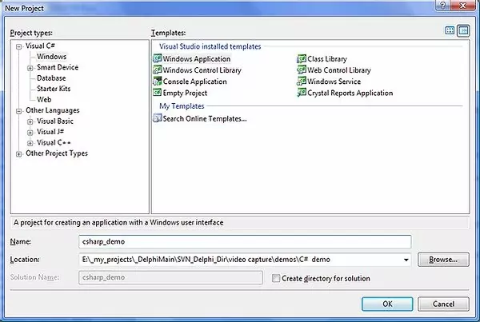
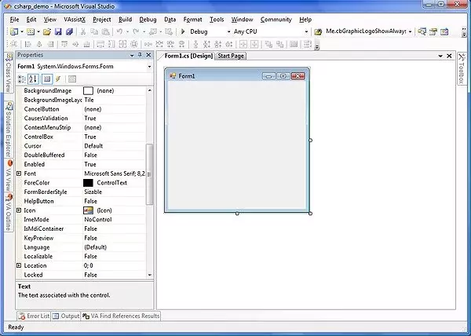
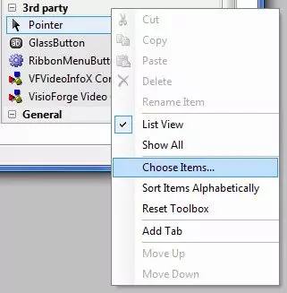
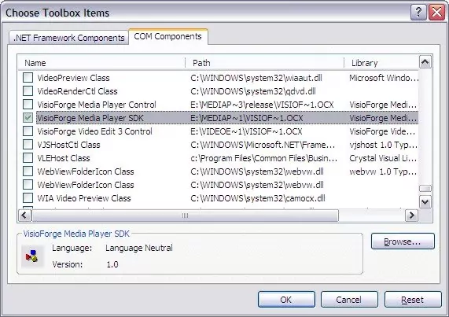
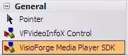
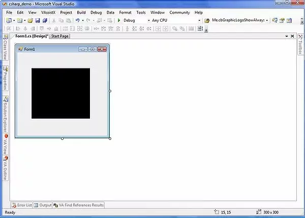

# Installing TVFMediaPlayer ActiveX in Visual Studio 2010 and Later

This guide provides detailed instructions for integrating the VisioForge Media Player (`TVFMediaPlayer`) ActiveX control into your Microsoft Visual Studio projects (version 2010 and newer). We will cover the necessary steps for C++, C#, and Visual Basic .NET environments, explain the underlying mechanisms, and discuss important considerations, including why migrating to the native .NET SDK is highly recommended for modern development.

## Understanding ActiveX and its Role in Modern Development

ActiveX, a technology developed by Microsoft, allows software components (controls) to interact with one another regardless of the language they were originally written in. It's based on the Component Object Model (COM). In the context of Visual Studio, ActiveX controls can be embedded within application forms to provide specific functionalities, such as media playback in the case of `TVFMediaPlayer`.

While historically significant, ActiveX usage has declined, especially within the .NET ecosystem. Modern .NET frameworks offer more integrated, robust, and secure ways to incorporate UI components and functionality. However, legacy applications or specific interoperability scenarios might still necessitate the use of ActiveX controls.

When you use an ActiveX control in a .NET project (C# or VB.Net), Visual Studio doesn't interact with it directly. Instead, it automatically generates **Runtime Callable Wrappers (RCW)**. These wrappers are essentially .NET assemblies that act as intermediaries, translating .NET calls into COM calls that the ActiveX control understands, and vice versa. This process allows managed (.NET) code to utilize unmanaged (COM/ActiveX) components.

## Prerequisites

Before you begin, ensure you have the following:

1. **Microsoft Visual Studio:** Version 2010 or a later edition installed.
2. **TVFMediaPlayer ActiveX Control:** The VisioForge Media Player ActiveX control must be properly installed and registered on your development machine. You can typically download this from the VisioForge website or distributor. **Crucially**, you might need both the 32-bit (x86) and 64-bit (x64) versions registered, even if you are only developing a 64-bit application. Visual Studio's designer often runs as a 32-bit process and requires the x86 version to display the control visually during design time. The runtime will use the version corresponding to your project's target architecture (x86 or x64).
3. **Project:** An existing or new C++, C#, or VB.NET project where you intend to use the media player.

## Step-by-Step Installation in Visual Studio

The process involves adding the `TVFMediaPlayer` control to the Visual Studio Toolbox, which then allows you to drag and drop it onto your application's forms or windows.

### **Step 1: Create or Open Your Project**

Launch Visual Studio and create a new project or open an existing one. The example screenshots below use a C# Windows Forms application, but the steps are analogous for C++ (MFC, perhaps) and VB.NET WinForms.

* For C# WinForms: `File -> New -> Project -> Visual C# -> Windows Forms App (.NET Framework)`
* For VB.NET WinForms: `File -> New -> Project -> Visual Basic -> Windows Forms App (.NET Framework)`
* For C++ MFC: `File -> New -> Project -> Visual C++ -> MFC/ATL -> MFC App`





### **Step 2: Open the Toolbox**

If the Toolbox is not visible, you can open it via the `View` menu (`View -> Toolbox` or `Ctrl+Alt+X`). The Toolbox contains standard UI controls and components.

### **Step 3: Add the ActiveX Control to the Toolbox**

To make the `TVFMediaPlayer` control available, you need to add it to the Toolbox:

1. Right-click within an empty area of the Toolbox (e.g., under the "General" tab or create a new tab).
2. Select "Choose Items..." from the context menu.



### **Step 4: Select the TVFMediaPlayer Control**

1. The "Choose Toolbox Items" dialog will appear. Navigate to the "COM Components" tab. This tab lists all registered ActiveX controls on your system.
2. Scroll through the list or use the filter box to find the "VisioForge Media Player" control (the exact name might vary slightly based on the installed version).
3. Check the checkbox next to the control's name.
4. Click "OK".



Visual Studio will now add the control to your Toolbox and, if you are in a C# or VB.Net project, it will generate the necessary RCW assemblies (often named `AxInterop.VisioForgeMediaPlayerLib.dll` and `Interop.VisioForgeMediaPlayerLib.dll`) and add references to them in your project.

### **Step 5: Add the Control to Your Form**

1. Locate the newly added "VisioForge Media Player" icon in the Toolbox.
2. Click and drag the icon onto your application's form or design surface.



An instance of the `TVFMediaPlayer` control will appear on your form. You can resize and position it as needed using the designer.



### **Step 6: Interacting with the Control (Code)**

You can now interact with the media player control programmatically through its properties, methods, and events. Select the control in the designer, and use the Properties window (`F4`) to configure its appearance and basic behavior.

To control playback, handle events, etc., you'll write code. Here's a simple C# example to load and play a video file when a button is clicked:

```csharp
// Assuming your TVFMediaPlayer control is named 'axMediaPlayer1'
// and you have a button named 'buttonPlay'

private void buttonPlay_Click(object sender, EventArgs e)
{
    // Prompt user to select a video file
    OpenFileDialog openFileDialog = new OpenFileDialog();
    openFileDialog.Filter = "Media Files|*.mp4;*.avi;*.mov;*.wmv|All Files|*.*";
    if (openFileDialog.ShowDialog() == DialogResult.OK)
    {
        try
        {
            // Set the filename for the ActiveX control
            axMediaPlayer1.Filename = openFileDialog.FileName;

            // Start playback
            axMediaPlayer1.Play();
        }
        catch (Exception ex)
        {
            MessageBox.Show($"Error playing file: {ex.Message}");
        }
    }
}

// Example of handling an event (e.g., playback completed)
private void axMediaPlayer1_OnStop(object sender, EventArgs e)
{
    MessageBox.Show("Playback stopped or finished.");
}

// Remember to attach the event handler, usually in the Form's Load event or constructor
public Form1()
{
    InitializeComponent();
    axMediaPlayer1.OnStop += axMediaPlayer1_OnStop; // Attach the event handler
}
```

Similar code can be written in VB.NET, accessing the same properties (`Filename`, `Play()`) and events (`OnStop`). In C++, you would typically use COM interfaces directly or MFC wrappers if using that framework.

## Important: The Case for the Native .NET SDK

While the steps above show how to use the ActiveX control, **for all new .NET development (C#, VB.NET), we strongly recommend using the native VisioForge Media Player SDK for .NET.**

The ActiveX approach, while functional, carries several significant disadvantages in the modern .NET world:

1. **Complexity:** Relies on COM Interop and RCW generation, adding layers of abstraction that can sometimes be fragile or lead to unexpected behavior.
2. **Performance:** COM Interop can introduce performance overhead compared to native .NET code.
3. **Deployment:** Requires proper registration of the ActiveX control (x86 and potentially x64) on the end-user's machine using `regsvr32`, which can complicate deployment and require administrative privileges. Native .NET libraries are typically deployed just by copying files (XCopy deployment) or via NuGet.
4. **Limited Integration:** ActiveX controls don't integrate as seamlessly with modern .NET UI frameworks like WPF or MAUI. While they can sometimes be hosted, it's often awkward and limited compared to native controls.
5. **Bitnes Mismatches:** Managing x86/x64 versions and ensuring the correct one is used by the application and the VS designer can be error-prone.
6. **Technology Age:** ActiveX is a legacy technology with limited ongoing evolution compared to the rapidly advancing .NET platform.

**Advantages of the Native .NET SDK:**

* **Native Controls:** Provides dedicated, optimized controls for WinForms, WPF, and MAUI.
* **Full .NET Integration:** Leverages the full power of the .NET framework, including async/await, LINQ, modern event patterns, and easier data binding.
* **Simplified Deployment:** Usually involves just referencing the SDK assemblies or NuGet packages. No COM registration needed.
* **Enhanced Features:** Often includes more features, better performance, and more granular control than the corresponding ActiveX version.
* **Improved Stability & Maintainability:** Native code is generally easier to debug, maintain, and less prone to interop issues.
* **Future-Proofing:** Aligns your application with modern .NET development practices.

You can find the native [.Net version of the SDK here](https://www.visioforge.com/media-player-sdk-net). It offers a significantly superior development experience and results for .NET applications.

## Troubleshooting Common Issues

* **Control Not Appearing in "COM Components":** Ensure the `TVFMediaPlayer` ActiveX control is correctly installed and registered. Try running the registration command (`regsvr32 <path_to_control.ocx>`) manually as an administrator. Remember to register both x86 and x64 versions if available and needed.
* **Error Adding Control to Form:** This often points to a mismatch between the Visual Studio designer process (usually x86) and the registered control version. Make sure the x86 version is registered.
* **Runtime Errors (File Not Found, Class Not Registered):** Verify the control (correct bitness for your app's target) is registered on the target machine where the application is run. Check project references to ensure the Interop assemblies are correctly included.
* **Events Not Firing:** Double-check that event handlers are correctly attached to the control's events in your code.

## Conclusion

Integrating the `TVFMediaPlayer` ActiveX control into Visual Studio 2010+ is achievable by adding it via the "Choose Toolbox Items" dialog. Visual Studio handles the generation of wrapper assemblies for .NET projects, allowing interaction via standard properties, methods, and events. However, due to the complexities, limitations, and deployment challenges associated with ActiveX/COM Interop in the .NET environment, **it is strongly advised to use the native VisioForge Media Player SDK for .NET for any new WinForms, WPF, or MAUI development.** The native SDK provides a more robust, performant, and developer-friendly experience aligned with modern application development practices.

---
Need further assistance? Please contact [VisioForge Support](https://support.visioforge.com/) or explore more examples on our [GitHub](https://github.com/visioforge/) page.