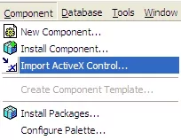
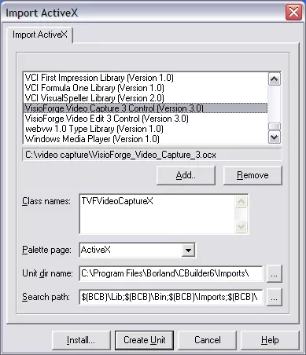
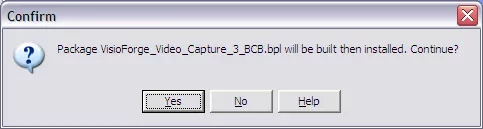
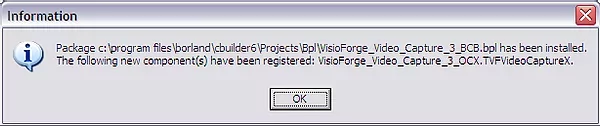
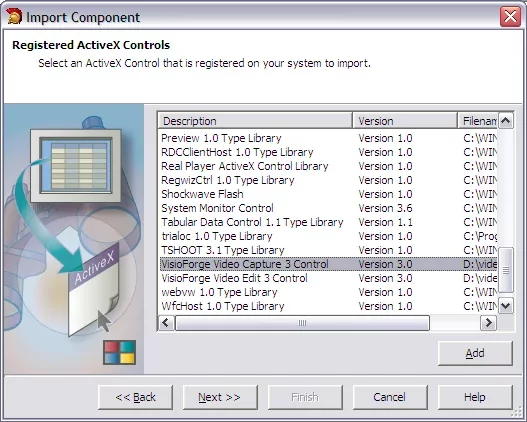
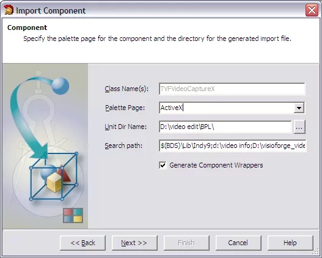
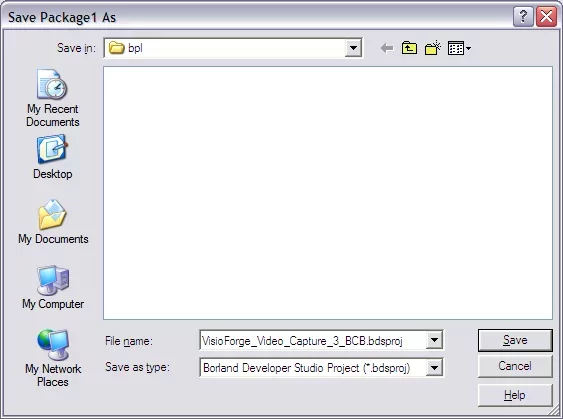
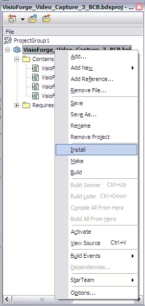
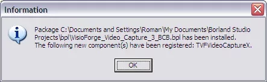

# Guide d'intégration de TVFVideoCapture pour C++ Builder

Ce guide d'installation détaillé vous accompagne dans le processus d'intégration du puissant contrôle ActiveX TVFVideoCapture dans vos projets C++ Builder. Nous avons fourni des instructions distinctes pour différentes versions de C++ Builder afin de garantir une implémentation transparente quel que soit votre environnement de développement.

> Produits associés : [All-in-One Media Framework (Delphi / ActiveX)](https://www.visioforge.com/all-in-one-media-framework)

## Installation dans Borland C++ Builder 5/6

Suivez ces étapes détaillées pour installer correctement le contrôle TVFVideoCapture dans Borland C++ Builder 5/6 :

1. Naviguez vers le menu principal et sélectionnez **Component → Import ActiveX Controls**

2. Dans la liste des contrôles disponibles, localisez et sélectionnez l'élément **VisioForge Video Capture**

3. Cliquez sur le bouton **Install** pour commencer à importer le contrôle ActiveX

4. Lorsqu'une confirmation est demandée, cliquez sur le bouton **Yes** pour continuer

5. Une fois le processus d'installation terminé avec succès, vous verrez un message de confirmation

6. Cliquez sur le bouton **OK** pour finaliser l'installation

## Installation dans C++ Builder 2006 et versions ultérieures

Pour les versions plus récentes de C++ Builder (2006 et ultérieures), suivez ce processus d'installation étendu :

### Étape 1 : créer un nouveau paquet

Commencez par créer un nouveau paquet qui contiendra le contrôle TVFVideoCapture

### Étape 2 : importer le composant ActiveX

1. Depuis le menu principal, sélectionnez **Component → Import Component**

2. Dans la boîte de dialogue qui apparaît, sélectionnez la case d'option **Import ActiveX Control**

3. Cliquez sur le bouton **Next** pour continuer

### Étape 3 : sélectionner le contrôle TVFVideoCapture

1. Parcourez les contrôles ActiveX disponibles

2. Localisez et sélectionnez l'élément **VisioForge Video Capture** dans la liste

3. Cliquez sur le bouton **Next** pour continuer

### Étape 4 : configurer les paramètres de sortie

1. Spécifiez le dossier de sortie du paquet souhaité pour les fichiers du composant

2. Cliquez sur le bouton **Next** après avoir sélectionné un emplacement approprié

### Étape 5 : ajouter le composant au paquet

1. Assurez-vous que la case d'option **Add unit to…** est sélectionnée

2. Cliquez sur le bouton **Finish** pour terminer le processus d'importation

### Étape 6 : enregistrer et installer le paquet

1. Enregistrez votre projet lorsque vous y êtes invité

2. Installez le paquet pour rendre le composant disponible dans votre environnement de développement

3. Vérifiez que le contrôle ActiveX TVFVideoCapture a été installé avec succès

## Ressources et support supplémentaires

Une fois l'installation terminée, vous pouvez commencer à utiliser le contrôle TVFVideoCapture dans vos applications. Le composant offre une vaste fonctionnalité pour les opérations de capture et de traitement vidéo.

Pour les développeurs souhaitant explorer des exemples et techniques d'implémentation supplémentaires :

- Accédez à notre [dépôt GitHub](https://github.com/visioforge/) pour des exemples de code et des projets d'exemple
- Contactez notre [équipe de support technique](https://support.visioforge.com/) pour une assistance personnalisée dans les défis d'intégration
- Consultez notre documentation pour des références d'API détaillées et des scénarios d'utilisation avancés

En suivant ce guide d'installation, vous aurez intégré avec succès le contrôle ActiveX TVFVideoCapture dans votre environnement de développement C++ Builder, activant ainsi de puissantes capacités de capture vidéo dans vos applications.
