# TVFVideoCapture Integration Guide for C++ Builder

This detailed installation guide walks you through the process of integrating the powerful TVFVideoCapture ActiveX control with your C++ Builder projects. We've provided separate instructions for different C++ Builder versions to ensure seamless implementation regardless of your development environment.

> Related products: [All-in-One Media Framework (Delphi / ActiveX)](https://www.visioforge.com/all-in-one-media-framework)

## Installation in Borland C++ Builder 5/6

Follow these detailed steps to properly install the TVFVideoCapture control in Borland C++ Builder 5/6:

1. Navigate to the main menu and select **Component → Import ActiveX Controls**

2. From the available controls list, locate and select the **VisioForge Video Capture** item

3. Click the **Install** button to begin importing the ActiveX control

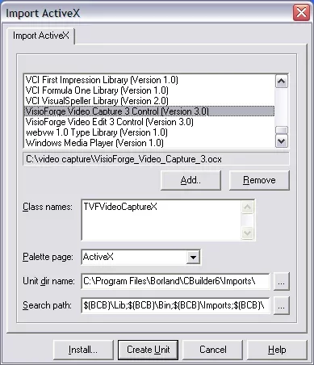

4. When prompted for confirmation, click the **Yes** button to proceed

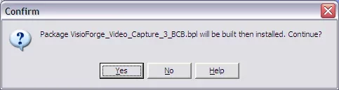

5. Once the installation process completes successfully, you'll see a confirmation message

6. Click the **OK** button to finalize the installation

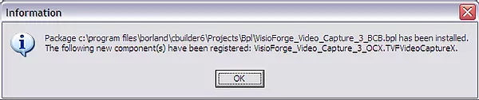

## Installation in C++ Builder 2006 and Later Versions

For more recent versions of C++ Builder (2006 and newer), follow this expanded installation process:

### Step 1: Create a New Package

Begin by creating a new package that will contain the TVFVideoCapture control

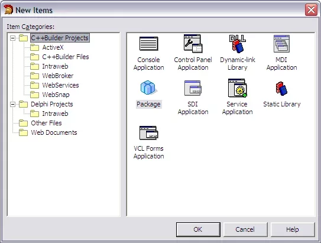

### Step 2: Import the ActiveX Component

1. From the main menu, select **Component → Import Component**

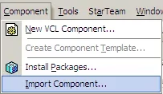

2. In the dialog that appears, select the **Import ActiveX Control** radio button 

3. Click the **Next** button to continue

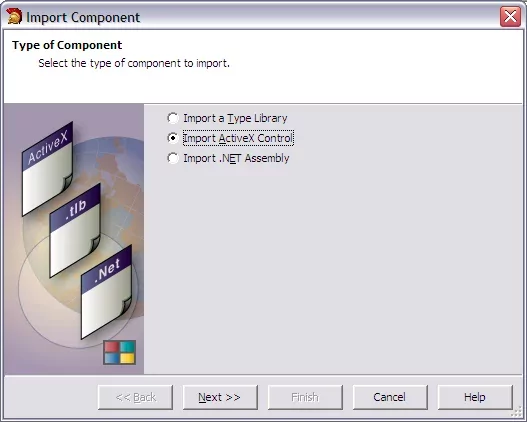

### Step 3: Select the TVFVideoCapture Control

1. Browse through the available ActiveX controls

2. Locate and select the **VisioForge Video Capture** item from the list

3. Click the **Next** button to proceed

### Step 4: Configure Output Settings

1. Specify the desired package output folder for the component files

2. Click the **Next** button after selecting an appropriate location

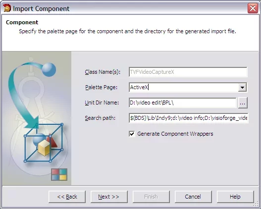

### Step 5: Add Component to Package

1. Ensure the **Add unit to…** radio button is selected

2. Click the **Finish** button to complete the import process

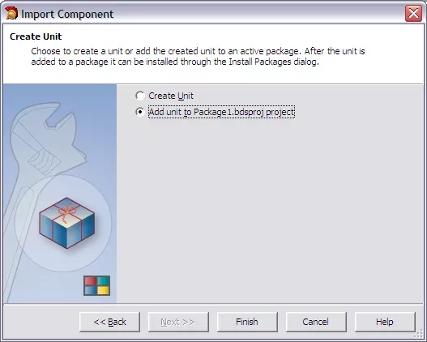

### Step 6: Save and Install the Package

1. Save your project when prompted

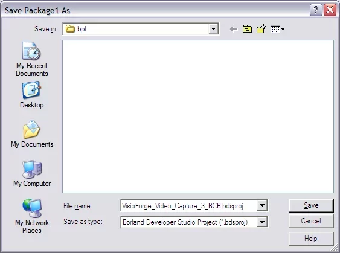

2. Install the package to make the component available in your development environment

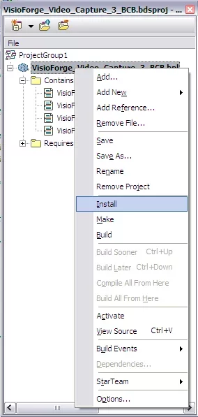

3. Verify that the TVFVideoCapture ActiveX control has been successfully installed

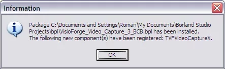

## Additional Resources and Support

After completing the installation, you can begin using the TVFVideoCapture control in your applications. The component provides extensive functionality for video capture and processing operations.

For developers looking to explore additional implementation examples and techniques:

- Access our [GitHub repository](https://github.com/visioforge/) for code samples and example projects
- Contact our [technical support team](https://support.visioforge.com/) for personalized assistance with integration challenges
- Review our documentation for detailed API references and advanced usage scenarios

By following this installation guide, you'll have successfully integrated the TVFVideoCapture ActiveX control into your C++ Builder development environment, enabling powerful video capture capabilities in your applications.
