# Guide complet d'installation de TVFVideoCapture pour les développeurs Delphi

> Produits associés : [All-in-One Media Framework (Delphi / ActiveX)](https://www.visioforge.com/all-in-one-media-framework)

## Installation dans Borland Delphi 6/7

Le processus d'installation pour les environnements Delphi 6/7 hérités requiert plusieurs étapes spécifiques pour garantir l'intégration correcte de la bibliothèque TVFVideoCapture.

### Étape 1 : créer un nouveau paquet

Commencez par créer un nouveau paquet dans votre environnement de développement Delphi 6/7.

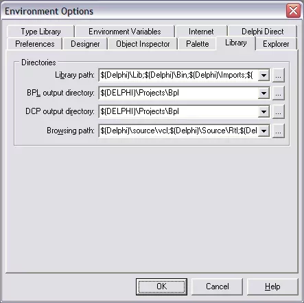

### Étape 2 : configurer les chemins de bibliothèque

Ajoutez le répertoire source TVFVideoCapture aux paramètres de chemin de bibliothèque et de navigateur. Cela permet à Delphi de localiser les fichiers de composants nécessaires.

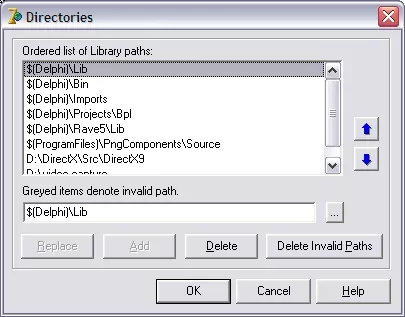

### Étape 3 : ouvrir le paquet de bibliothèque

Naviguez vers et ouvrez le fichier de paquet de bibliothèque pour préparer l'installation.

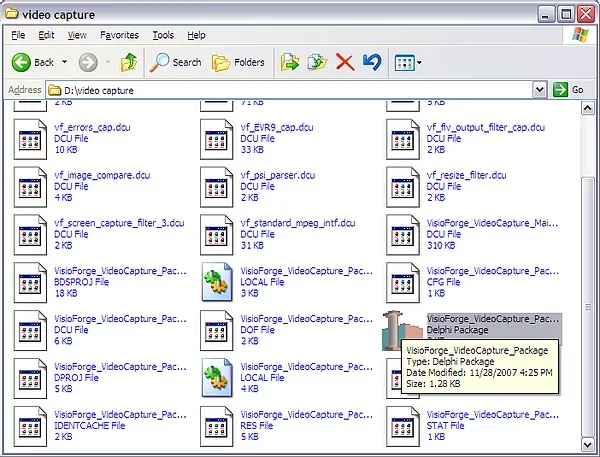

### Étape 4 : installer le paquet de composants

Terminez l'installation en sélectionnant l'option d'installation dans l'interface du paquet.

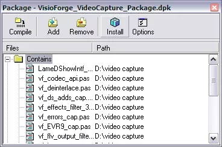

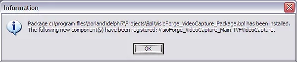

### Limitations d'architecture

Bien que TVFVideoCapture offre une prise en charge des architectures x86 et x64, Delphi 6/7 ne prend en charge que x86 en raison de limitations de plateforme. Les développeurs utilisant ces versions devront utiliser exclusivement l'implémentation 32 bits.

## Processus d'installation pour Delphi 2005 et versions ultérieures

Les versions modernes de Delphi offrent un flux d'installation amélioré avec des capacités accrues.

### Étape 1 : lancer Delphi avec des privilèges administratifs

Assurez-vous d'exécuter votre IDE Delphi avec des droits administratifs pour éviter les problèmes d'installation liés aux autorisations.

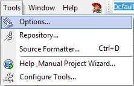

### Étape 2 : accéder à la boîte de dialogue Options

Naviguez vers le menu Options pour configurer les paramètres essentiels de la bibliothèque.

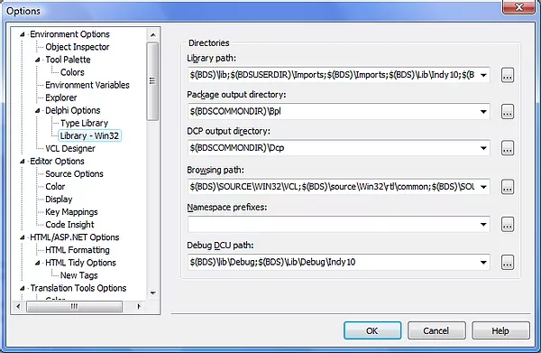

### Étape 3 : configurer les chemins du répertoire source

Ajoutez le répertoire source TVFVideoCapture aux paramètres de chemin de bibliothèque et de navigateur pour garantir la découverte correcte des composants.

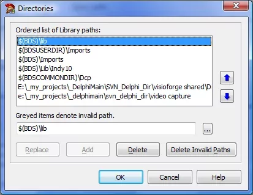

### Étape 4 : ouvrir le paquet de bibliothèque de composants

Localisez et ouvrez le fichier de paquet de bibliothèque inclus avec TVFVideoCapture.

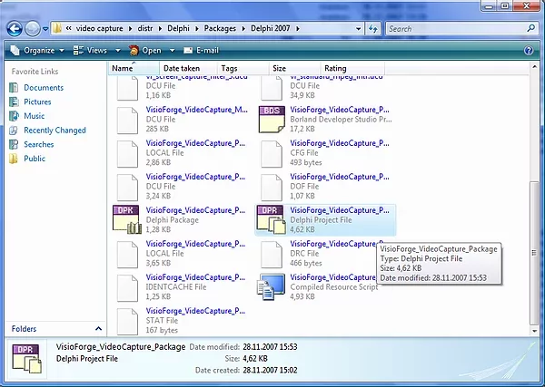

### Étape 5 : terminer l'installation du paquet

Installez le paquet via l'interface d'installation de paquets de l'IDE.

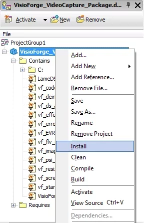

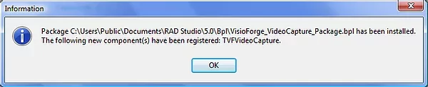

## Installation avancée pour Delphi 11 et versions plus récentes

Les dernières versions de Delphi nécessitent une approche légèrement différente qui exploite les structures de projet modernes.

### Étape 1 : localiser et ouvrir le projet de paquet

Après avoir installé le framework, naviguez vers le dossier d'installation et ouvrez le fichier de paquet `.dproj`.

### Étape 2 : sélectionner la configuration de compilation appropriée

Choisissez la configuration de compilation Release pour garantir des performances optimales du composant.

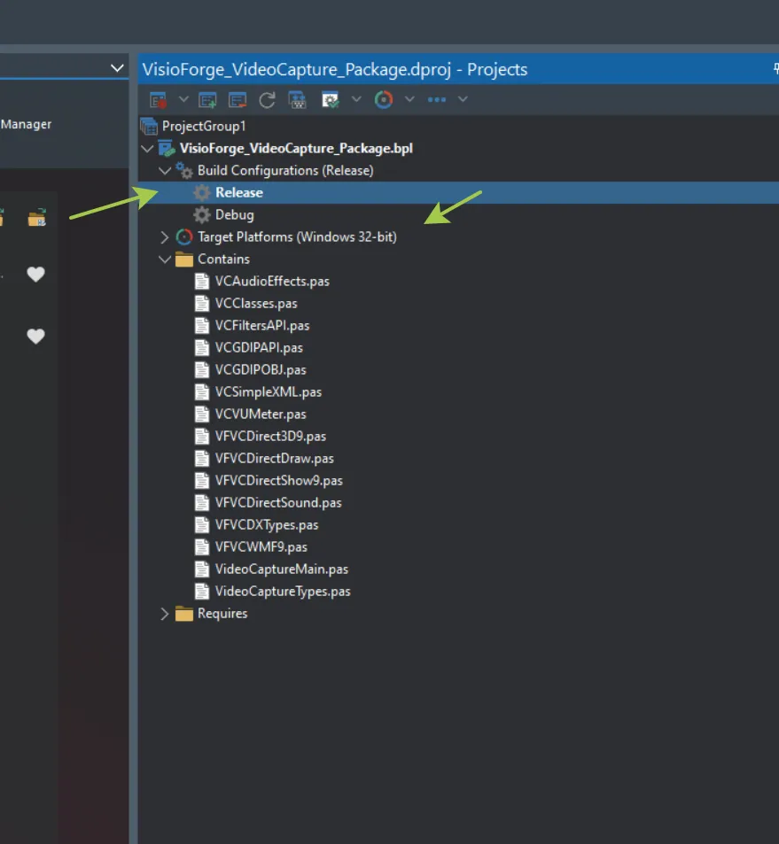

### Étape 3 : installer le paquet de composants

Terminez le processus d'installation via l'interface d'installation de paquets de l'IDE.

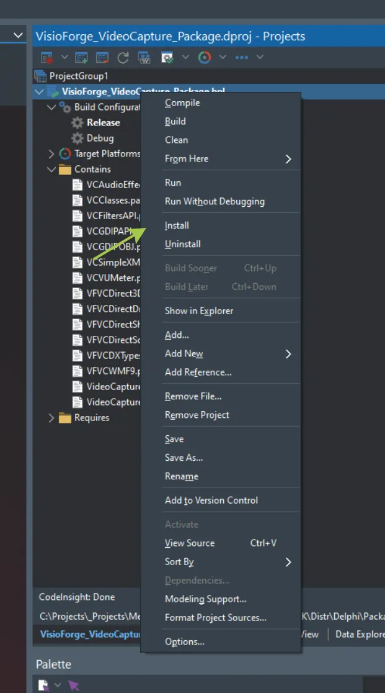

### Étape 4 : vérifier le succès de l'installation

Confirmez que l'installation s'est terminée avec succès avant de poursuivre le développement.

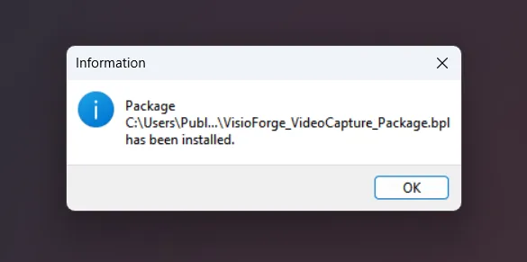

## Exigences de configuration de projet et bonnes pratiques

### Prise en charge multi-architecture

TVFVideoCapture prend en charge les architectures x86 et x64, vous permettant de développer des applications pour différentes cibles de plateforme. Vous pouvez installer simultanément les deux versions de paquets pour prendre en charge des scénarios de déploiement flexibles.

### Configuration du chemin de bibliothèque

Pour un fonctionnement correct du composant, assurez-vous d'avoir configuré le chemin correct du dossier de bibliothèque dans les paramètres de votre projet d'application. Ce chemin doit pointer vers l'emplacement contenant les fichiers `.dcu` pour votre architecture cible.

Pour configurer cela :
1. Ouvrez la boîte de dialogue des options de votre projet
2. Naviguez vers la section Library path
3. Ajoutez le chemin de bibliothèque TVFVideoCapture approprié
4. Enregistrez les paramètres de votre projet

Cette configuration garantit que votre application peut localiser toutes les ressources de composants requises pendant le développement et l'exécution.

## Dépannage des problèmes d'installation courants

Lors de l'installation de TVFVideoCapture, les développeurs peuvent rencontrer plusieurs problèmes connus. Voici les solutions aux problèmes les plus fréquents :

### Problèmes d'installation du paquet 64 bits

Si vous rencontrez des difficultés à installer la version 64 bits du paquet, consultez notre [guide détaillé pour résoudre les problèmes d'installation des paquets Delphi 64 bits](../../general/install-64bit.md).

### Problèmes d'installation des fichiers de ressources (.otares)

Certains développeurs rencontrent des problèmes liés aux fichiers `.otares` lors de l'installation du paquet. Pour un processus de résolution pas à pas, consultez notre [guide de dépannage pour les problèmes d'installation .otares](../../general/install-otares.md).

## Support technique et ressources supplémentaires

Pour les développeurs nécessitant une assistance supplémentaire concernant le processus d'installation ou l'implémentation de composants :

- Contactez notre [équipe de support technique](https://support.visioforge.com/) pour une assistance personnalisée à l'installation
- Visitez notre [dépôt GitHub](https://github.com/visioforge/) pour des exemples de code et des exemples d'implémentation supplémentaires
- Consultez notre documentation pour des scénarios d'utilisation avancés et des modèles d'intégration

Le suivi de ce guide d'installation garantira que vous disposez d'un environnement de développement correctement configuré pour créer de puissantes applications multimédias avec TVFVideoCapture dans vos projets Delphi.
