# Comprehensive TVFVideoCapture Installation Guide for Delphi Developers

> Related products: [All-in-One Media Framework (Delphi / ActiveX)](https://www.visioforge.com/all-in-one-media-framework)

## Installation in Borland Delphi 6/7

The installation process for legacy Delphi 6/7 environments requires several specific steps to ensure proper integration of the TVFVideoCapture library.

### Step 1: Create a New Package

Begin by creating a new package in your Delphi 6/7 development environment.

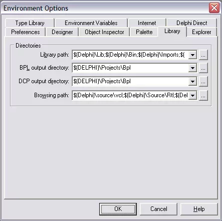

### Step 2: Configure Library Paths

Add the TVFVideoCapture source directory to both the library and browser path settings. This allows Delphi to locate the necessary component files.

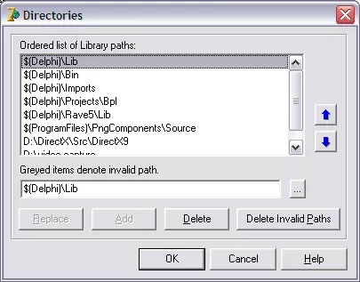

### Step 3: Open the Library Package

Navigate to and open the library package file to prepare for installation.

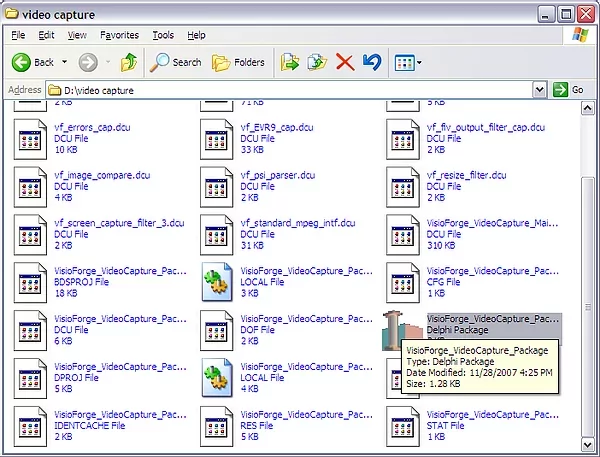

### Step 4: Install the Component Package

Complete the installation by selecting the install option within the package interface.

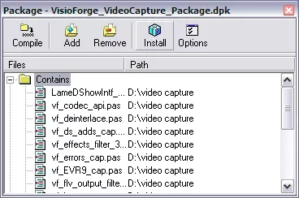

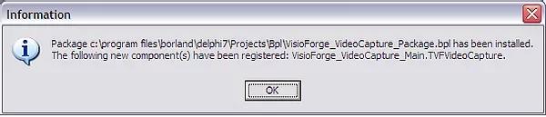

### Architecture Limitations

While TVFVideoCapture offers both x86 and x64 architecture support, Delphi 6/7 only supports x86 due to platform limitations. Developers using these versions will need to utilize the 32-bit implementation exclusively.

## Installation Process for Delphi 2005 and Later Versions

Modern Delphi versions offer an improved installation workflow with enhanced capabilities.

### Step 1: Launch Delphi with Administrative Privileges

Ensure you run your Delphi IDE with administrative rights to prevent permission-related installation issues.

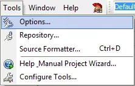

### Step 2: Access Options Dialog

Navigate to the Options menu to configure essential library settings.

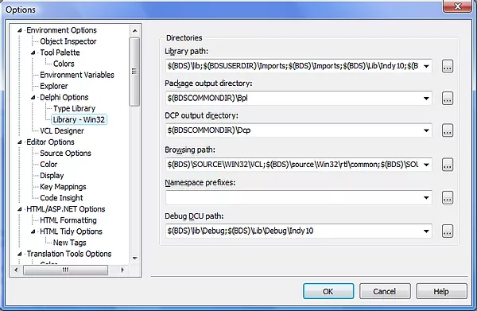

### Step 3: Configure Source Directory Paths

Add the TVFVideoCapture source directory to both the library and browser path settings to ensure proper component discovery.

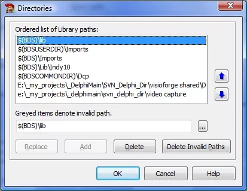

### Step 4: Open the Component Library Package

Locate and open the library package file included with TVFVideoCapture.

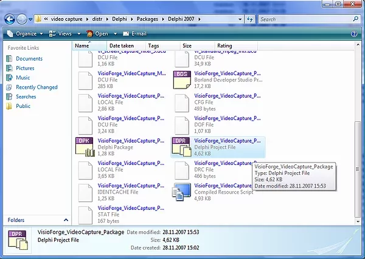

### Step 5: Complete Package Installation

Install the package through the IDE's package installation interface.

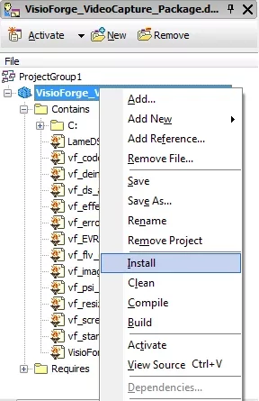

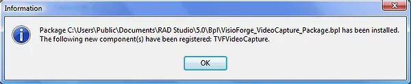

## Advanced Installation for Delphi 11 and Newer Releases

The latest Delphi versions require a slightly different approach that leverages modern project structures.

### Step 1: Locate and Open the Package Project

After installing the framework, navigate to the installation folder and open the `.dproj` package file.

### Step 2: Select the Appropriate Build Configuration

Choose the Release build configuration to ensure optimal component performance.

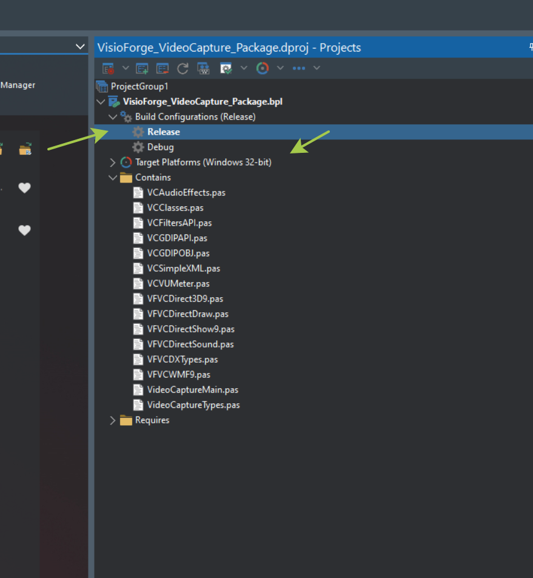

### Step 3: Install the Component Package

Complete the installation process through the IDE's package installation interface.

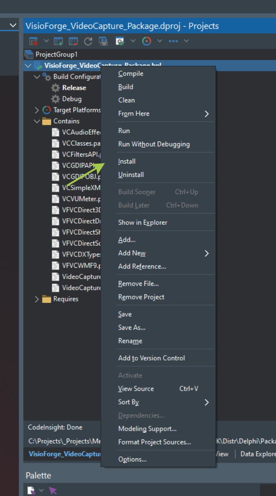

### Step 4: Verify Installation Success

Confirm that the installation completed successfully before proceeding with development.

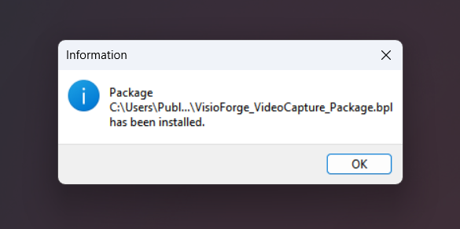

## Project Configuration Requirements and Best Practices

### Multi-Architecture Support

TVFVideoCapture supports both x86 and x64 architectures, allowing you to develop applications for different platform targets. You can install both package versions simultaneously to support flexible deployment scenarios.

### Library Path Configuration

For proper component functionality, ensure that you've configured the correct library folder path in your application project settings. This path should point to the location containing the `.dcu` files for your target architecture.

To set this up:
1. Open your project options dialog
2. Navigate to the Library path section
3. Add the appropriate TVFVideoCapture library path
4. Save your project settings

This configuration ensures that your application can locate all required component resources during both development and runtime.

## Troubleshooting Common Installation Issues

When installing TVFVideoCapture, developers might encounter several known issues. Here are solutions to the most frequent problems:

### 64-bit Package Installation Problems

If you're having difficulties installing the 64-bit package version, refer to our [detailed guide for resolving Delphi 64-bit package installation issues](../../general/install-64bit.md).

### Resource File (.otares) Installation Issues

Some developers encounter problems related to `.otares` files during package installation. For a step-by-step resolution process, see our [troubleshooting guide for .otares installation problems](../../general/install-otares.md).

## Technical Support and Additional Resources

For developers requiring additional assistance with the installation process or component implementation:

- Contact our [technical support team](https://support.visioforge.com/) for personalized installation assistance
- Visit our [GitHub repository](https://github.com/visioforge/) for additional code samples and implementation examples
- Check our documentation for advanced usage scenarios and integration patterns

Following this installation guide will ensure that you have a properly configured development environment for creating powerful multimedia applications with TVFVideoCapture in your Delphi projects.
