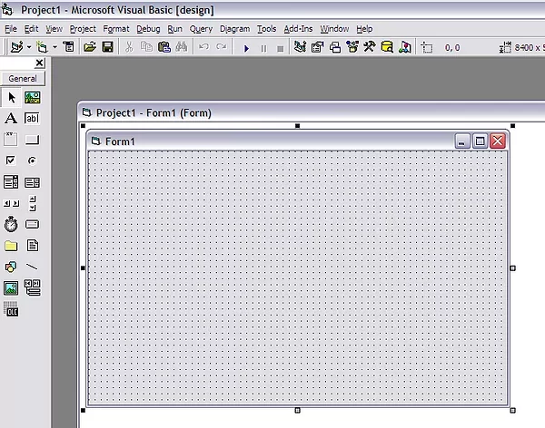
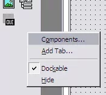
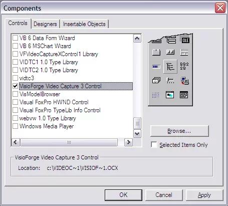
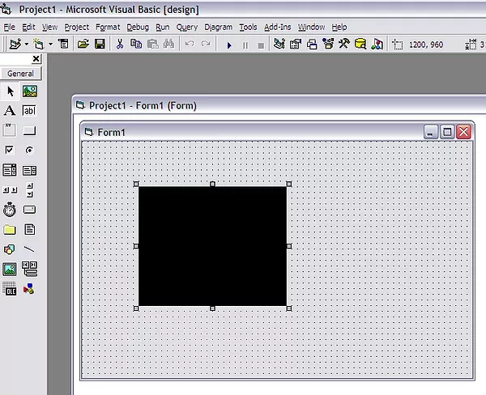

# Intégration de TVFVideoCapture avec Visual Basic 6

## Vue d'ensemble et compatibilité

Microsoft Visual Basic 6 offre une excellente compatibilité avec notre bibliothèque TVFVideoCapture via son interface de contrôle ActiveX. Cette intégration permet aux développeurs d'enrichir considérablement leurs applications avec des capacités avancées de capture vidéo tout en maintenant des caractéristiques de performance optimales.

En raison de l'architecture de Visual Basic 6, qui a été développé aux premiers stades des frameworks de programmation Windows, la plateforme prend en charge exclusivement les applications 32 bits. Par conséquent, seule la version x86 de notre bibliothèque TVFVideoCapture est compatible avec les environnements de développement VB6.

Malgré cette limitation d'architecture, notre framework offre des performances exceptionnelles dans l'environnement 32 bits. La bibliothèque fournit un accès complet à notre ensemble complet de fonctionnalités, garantissant que les développeurs peuvent implémenter des solutions sophistiquées de capture vidéo malgré la contrainte 32 bits.

## Processus d'installation détaillé

Le guide pas à pas suivant vous accompagnera tout au long du processus complet d'installation et de configuration du contrôle ActiveX TVFVideoCapture dans votre environnement de développement Visual Basic 6.

### Étape 1 : créer un nouvel environnement de projet

Commencez par lancer Visual Basic 6 et créez un nouveau projet standard qui servira de base à votre implémentation de capture vidéo.

### Étape 2 : accéder à la boîte de dialogue Components

Naviguez vers le menu Project et sélectionnez l'option « Components » pour ouvrir la boîte de dialogue de sélection de composants. Cette interface vous permet de parcourir et de sélectionner parmi les contrôles ActiveX disponibles.

### Étape 3 : sélectionner le composant TVFVideoCapture

Dans la boîte de dialogue Components, faites défiler les contrôles disponibles et localisez l'élément « VisioForge Video Capture ». Cochez la case à côté pour inclure ce composant dans votre boîte à outils.

### Étape 4 : vérifier l'intégration réussie

Après avoir ajouté le composant, vous devriez remarquer le nouveau contrôle TVFVideoCapture apparaître dans votre boîte à outils VB6. Cela confirme que le contrôle ActiveX a été intégré avec succès dans votre environnement de développement.

## Considérations d'implémentation

Lors de l'implémentation du contrôle TVFVideoCapture dans votre application VB6, tenez compte des bonnes pratiques suivantes :

- Initialisez le contrôle tôt dans le cycle de vie de votre application
- Configurez les paramètres de capture avant de démarrer le processus de capture
- Implémentez une gestion d'erreurs appropriée pour les problèmes de connectivité des périphériques
- Libérez les ressources lorsqu'elles ne sont plus nécessaires

## Support technique et ressources supplémentaires

---
Pour les questions techniques ou les défis d'implémentation, veuillez contacter notre [équipe de support](https://support.visioforge.com/) qui se spécialise dans l'assistance aux développeurs pour les exigences d'intégration.
Pour des exemples de code et des modèles d'implémentation supplémentaires, visitez notre [dépôt GitHub](https://github.com/visioforge/) qui contient de nombreux exemples illustrant les modèles d'utilisation optimaux.
