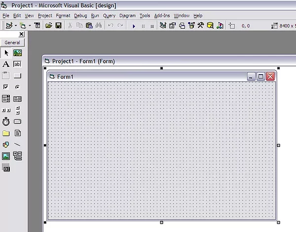
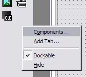
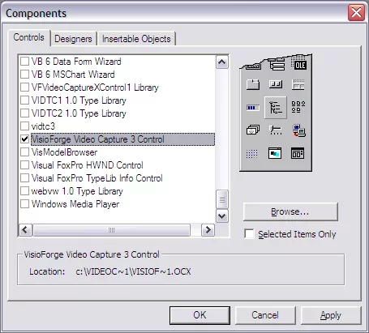
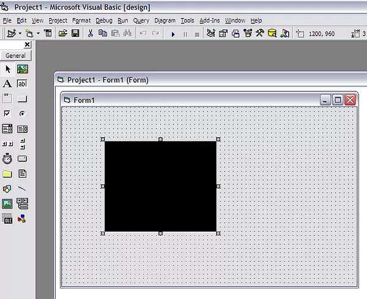

# Integrating TVFVideoCapture with Visual Basic 6

## Overview and Compatibility

Microsoft Visual Basic 6 offers excellent compatibility with our TVFVideoCapture library through its ActiveX control interface. This integration empowers developers to significantly enhance their applications with advanced video capture capabilities while maintaining optimal performance characteristics.

Due to the architecture of Visual Basic 6, which was developed during the early stages of Windows programming frameworks, the platform exclusively supports 32-bit applications. Consequently, only the x86 version of our TVFVideoCapture library is compatible with VB6 development environments.

Despite this architectural limitation, our framework delivers exceptional performance within the 32-bit environment. The library provides full access to our comprehensive feature set, ensuring developers can implement sophisticated video capture solutions regardless of the 32-bit constraint.

## Detailed Installation Process

The following step-by-step guide will walk you through the complete process of installing and configuring the TVFVideoCapture ActiveX control in your Visual Basic 6 development environment.

### Step 1: Create a New Project Environment

Begin by launching Visual Basic 6 and creating a new standard project that will serve as the foundation for your video capture implementation.

### Step 2: Access the Components Dialog

Navigate to the Project menu and select the "Components" option to open the component selection dialog. This interface allows you to browse and select from available ActiveX controls.

### Step 3: Select the TVFVideoCapture Component

In the Components dialog, scroll through the available controls and locate the "VisioForge Video Capture" item. Check the box next to it to include this component in your toolbox.

### Step 4: Verify Successful Integration

After adding the component, you should notice the new TVFVideoCapture control appearing in your VB6 toolbox. This confirms that the ActiveX control has been successfully integrated into your development environment.

## Implementation Considerations

When implementing the TVFVideoCapture control in your VB6 application, consider the following best practices:

- Initialize the control early in your application lifecycle
- Configure capture parameters before starting the capture process
- Implement proper error handling for device connectivity issues
- Release resources when they are no longer needed

## Technical Support and Additional Resources

---

For technical questions or implementation challenges, please contact our [support team](https://support.visioforge.com/) who specialize in assisting developers with integration requirements. 

For additional code examples and implementation patterns, visit our [GitHub repository](https://github.com/visioforge/) which contains numerous samples demonstrating optimal usage patterns.
