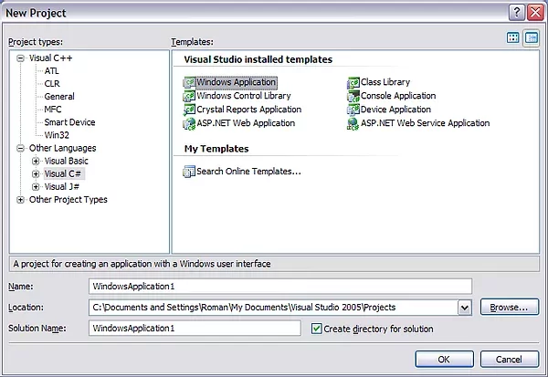
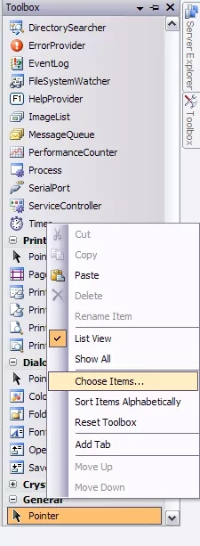
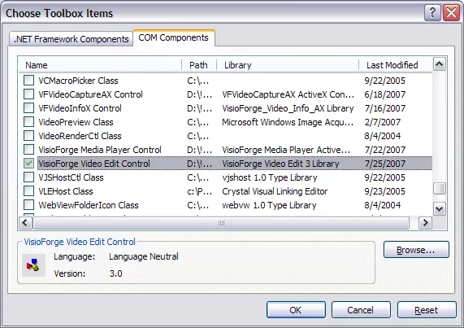
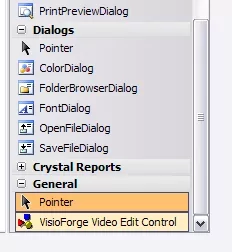

# Installation de TVFVideoCapture dans Visual Studio 2010 et versions ultérieures

## Vue d'ensemble de l'intégration de TVFVideoCapture

Le contrôle ActiveX TVFVideoCapture fournit de puissantes capacités de capture vidéo à vos projets de développement. Ce guide vous accompagne dans le processus d'installation dans les environnements Visual Studio, avec des considérations spéciales pour les développeurs Delphi.

## Prérequis d'installation

Avant de commencer le processus d'installation, assurez-vous d'avoir :

- Visual Studio 2010 ou une version ultérieure installée
- Des droits d'administrateur sur votre machine de développement
- Les contrôles ActiveX x86 et x64 enregistrés (le cas échéant)

## Processus d'installation pour différents types de projets

Vous pouvez implémenter le contrôle ActiveX TVFVideoCapture directement dans divers types de projets. L'approche d'intégration diffère légèrement selon votre environnement de développement :

### Pour les projets C++

Dans les projets C++, vous pouvez utiliser le contrôle ActiveX directement sans wrappers ni interfaces supplémentaires.

### Pour les projets C#/VB.Net

Lorsque vous travaillez avec des projets C# ou Visual Basic .NET, Visual Studio génère automatiquement un assembly wrapper personnalisé. Ce wrapper expose l'API ActiveX via du code managé, rendant l'intégration transparente.

## Guide d'installation pas à pas

Suivez ces étapes détaillées pour installer le contrôle TVFVideoCapture dans votre environnement Visual Studio :

1. Créez un nouveau projet dans le langage de votre choix (C++, C# ou Visual Basic .NET)
2. Accédez au panneau de la boîte à outils dans votre interface Visual Studio

3. Cliquez avec le bouton droit sur la boîte à outils et sélectionnez « Choose toolbox items » dans le menu contextuel

4. Dans la boîte de dialogue qui apparaît, localisez et sélectionnez le composant « VisioForge Video Capture »

5. Après la sélection, le contrôle sera ajouté à votre boîte à outils pour un accès facile

6. Ajoutez le contrôle à votre formulaire en le faisant glisser depuis la boîte à outils
7. Pour les projets .NET, Visual Studio générera automatiquement l'assembly wrapper nécessaire

## Exemples du framework et ressources

Pour des exemples d'implémentation pratiques, consultez les exemples du framework inclus dans votre paquet d'installation. Ces exemples couvrent tous les langages de programmation pris en charge et illustrent divers scénarios d'intégration.

## Recommandations pour les développeurs .NET

Bien que l'intégration ActiveX soit entièrement prise en charge, les développeurs .NET peuvent tirer profit de l'utilisation de la version native .NET du SDK. L'implémentation native offre :

- Des performances et une stabilité améliorées
- Une intégration directe avec WinForms et WPF
- La prise en charge des contrôles MAUI pour le développement multiplateforme
- Une conception d'API plus intuitive pour les environnements .NET

## Ressources et support supplémentaires

Explorez notre documentation complète pour les options de configuration avancées et les techniques d'optimisation. Notre équipe de développement met continuellement à jour les ressources pour répondre aux défis d'implémentation courants.

---
Pour obtenir une assistance technique concernant ce processus d'installation, veuillez contacter notre [équipe de support](https://support.visioforge.com/). Des exemples de code et des exemples d'implémentation supplémentaires sont disponibles sur notre [dépôt GitHub](https://github.com/visioforge/).
