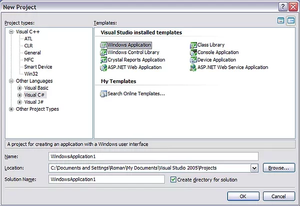

# Installing TVFVideoCapture in Visual Studio 2010 and Later

## Overview of TVFVideoCapture Integration

The TVFVideoCapture ActiveX control provides powerful video capture capabilities for your development projects. This guide walks you through the installation process in Visual Studio environments, with special considerations for Delphi developers.

## Installation Requirements

Before beginning the installation process, ensure you have:

- Visual Studio 2010 or a later version installed
- Administrator rights on your development machine
- Both x86 and x64 ActiveX controls registered (if applicable)

## Installation Process for Different Project Types

You can implement the TVFVideoCapture ActiveX control directly in various project types. The integration approach differs slightly depending on your development environment:

### For C++ Projects

In C++ projects, you can use the ActiveX control directly without additional wrappers or interfaces.

### For C#/VB.Net Projects

When working with C# or Visual Basic .NET projects, Visual Studio automatically generates a custom wrapper assembly. This wrapper exposes the ActiveX API through managed code, making integration seamless.

## Step-by-Step Installation Guide

Follow these detailed steps to install the TVFVideoCapture control in your Visual Studio environment:

1. Create a new project in your preferred language (C++, C#, or Visual Basic .NET)
2. Access the toolbox panel in your Visual Studio interface

3. Right-click on the toolbox and select "Choose toolbox items" from the context menu

4. In the dialog box that appears, locate and select the "VisioForge Video Capture" component

5. After selection, the control will be added to your toolbox for easy access

6. Add the control to your form by dragging it from the toolbox
7. For .NET projects, Visual Studio will automatically generate the necessary wrapper assembly

## Framework Samples and Resources

For practical implementation examples, refer to the framework samples included with your installation package. These samples cover all supported programming languages and demonstrate various integration scenarios.

## Recommendations for .NET Developers

While ActiveX integration is fully supported, .NET developers may benefit from using the native .NET version of the SDK. The native implementation offers:

- Enhanced performance and stability
- Direct integration with WinForms and WPF
- MAUI control support for cross-platform development
- More intuitive API design for .NET environments

## Additional Resources and Support

Explore our extensive documentation for advanced configuration options and optimization techniques. Our development team continuously updates resources to address common implementation challenges.

---

For technical assistance with this installation process, please contact our [support team](https://support.visioforge.com/). Additional code samples and implementation examples are available on our [GitHub repository](https://github.com/visioforge/).
