# Guide complet d'installation de TVFVideoEdit dans C++ Builder

> Produits liés : [VisioForge All-in-One Media Framework (Delphi / ActiveX)](https://www.visioforge.com/all-in-one-media-framework)

## Introduction à TVFVideoEdit pour C++ Builder

La bibliothèque TVFVideoEdit fournit de puissantes capacités de traitement multimédia aux applications C++ Builder. Ce guide vous accompagne dans le processus d'installation pour les différentes versions de C++ Builder. Avant de commencer le développement, vous devrez installer correctement le contrôle ActiveX dans votre environnement IDE où il sera accessible via la palette de composants.

## Processus d'installation pour Borland C++ Builder 5/6

### Accès au menu d'importation

Commencez le processus d'installation en accédant au menu Component de votre IDE :

1. Lancez votre environnement Borland C++ Builder 5/6
2. Depuis le menu principal, sélectionnez **Component -> Import ActiveX Controls**

### Sélection du contrôle d'édition vidéo

Dans la boîte de dialogue Import ActiveX Control :

1. Localisez et sélectionnez **« VisioForge Video Edit Control »** dans la liste des contrôles disponibles
2. Cliquez sur le bouton **Install** pour démarrer le processus d'importation

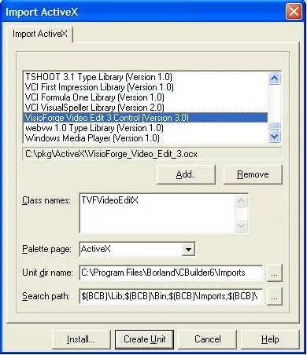

### Confirmation de l'installation

Le système vous invite à confirmer l'installation :

1. Une boîte de dialogue de confirmation apparaît
2. Cliquez sur le bouton **Yes** pour poursuivre l'installation

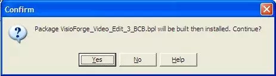

### Vérification de la réussite de l'installation

Une fois l'installation terminée :

1. Le contrôle est ajouté à votre palette de composants
2. Vous pouvez maintenant l'utiliser dans vos projets C++ Builder

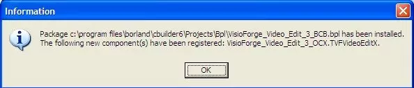

## Guide d'installation pour C++ Builder 2006 et versions ultérieures

Les versions modernes de C++ Builder nécessitent une approche d'installation différente, basée sur des paquets.

### Création d'un nouveau paquet

Tout d'abord, vous devez créer un paquet pour le composant :

1. Ouvrez C++ Builder 2006 ou une version ultérieure
2. Sélectionnez **File -> New -> Package**
3. Cela crée la base permettant d'ajouter le contrôle ActiveX

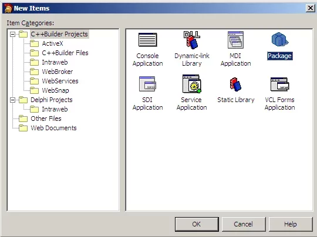

### Importation du composant ActiveX

Ensuite, importez le contrôle ActiveX dans votre environnement :

1. Naviguez vers **Component → Import Component** dans le menu principal
2. Cela ouvre l'assistant d'importation pour ajouter de nouveaux composants

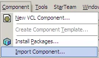

### Sélection du type d'importation

Dans l'assistant d'importation :

1. Sélectionnez l'option du bouton radio **Import ActiveX Control**
2. Cliquez sur le bouton **Next** pour passer à la sélection du composant

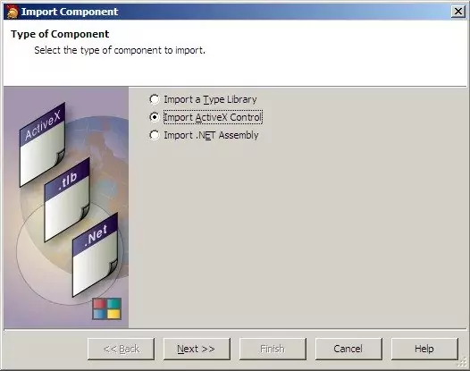

### Choix du contrôle d'édition vidéo

Parmi les contrôles ActiveX disponibles :

1. Trouvez et sélectionnez **« VisioForge Video Edit Control »** dans la liste
2. Cliquez sur **Next** pour poursuivre le processus d'importation

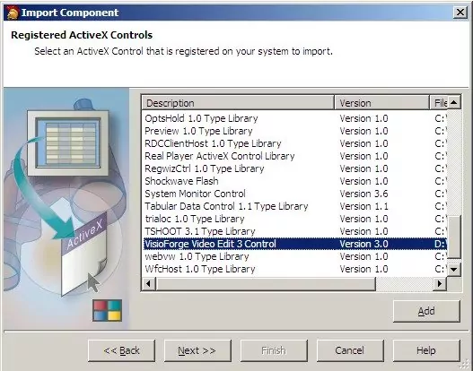

### Configuration de l'emplacement de sortie

Spécifiez l'emplacement où les fichiers du composant doivent être stockés :

1. Choisissez un dossier de sortie de paquet approprié à votre environnement de développement
2. Cliquez sur **Next** pour poursuivre la configuration

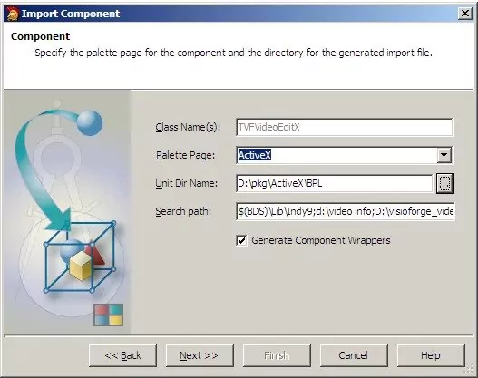

### Finalisation de l'importation du composant

Terminez le processus d'importation :

1. Sélectionnez l'option du bouton radio **Add unit to…**
2. Cliquez sur le bouton **Finish** pour créer le wrapper du composant

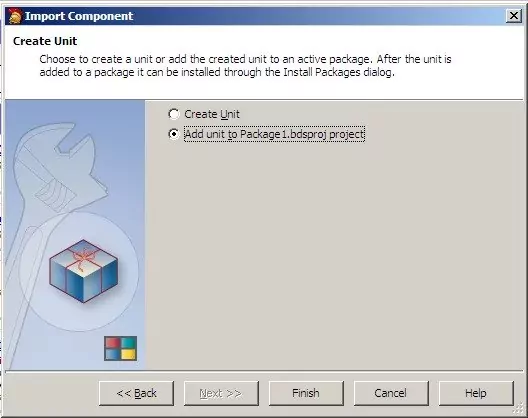

### Enregistrement du projet de paquet

Une fois l'importation terminée :

1. Le système vous invite à enregistrer votre projet de paquet
2. Choisissez un emplacement et un nom appropriés pour vos fichiers de paquet

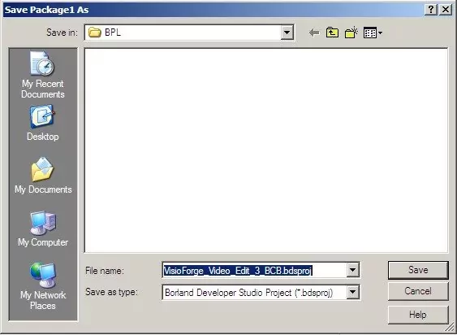

### Installation du paquet du composant

Pour rendre le composant disponible dans l'IDE :

1. Cliquez avec le bouton droit sur le paquet dans le gestionnaire de projets
2. Sélectionnez **Install** dans le menu contextuel
3. Cela compile et enregistre le paquet auprès de l'IDE

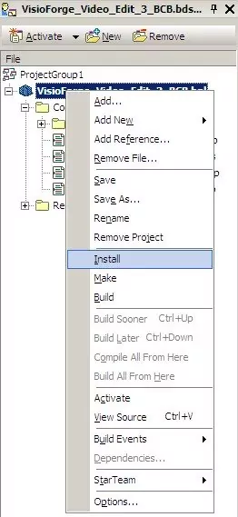

### Vérification et utilisation

Une fois installé :

1. Le contrôle TVFVideoEdit apparaît dans votre palette de composants
2. Il est désormais prêt à être utilisé dans vos applications C++ Builder
3. Vous pouvez le glisser-déposer sur les formulaires comme n'importe quel composant natif

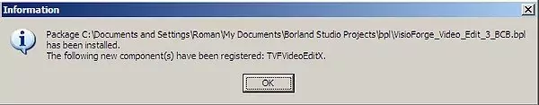

## Ressources supplémentaires et support

### Obtenir de l'aide pour l'implémentation

Si vous rencontrez des problèmes lors de l'installation ou de l'implémentation :

1. Notre équipe de support technique est disponible pour vous aider
2. Contactez le [support](https://support.visioforge.com/) avec des questions précises
3. Fournissez les détails sur votre version de Builder et votre environnement d'installation

### Exemples de code et documentation

Pour accélérer votre processus de développement :

1. Visitez notre [dépôt GitHub](https://github.com/visioforge/) pour des exemples de code
2. Trouvez des exemples d'implémentation pour les tâches courantes de traitement multimédia
3. Accédez à la documentation supplémentaire sur les fonctionnalités et l'utilisation du composant

## Dépannage des problèmes d'installation courants

Lors de l'installation du composant TVFVideoEdit, les développeurs peuvent rencontrer plusieurs problèmes courants :

1. **Dépendances manquantes :** assurez-vous que toutes les dépendances requises sont installées
2. **Problèmes d'enregistrement :** vérifiez l'état d'enregistrement ActiveX dans le registre Windows
3. **Compatibilité IDE :** vérifiez la compatibilité entre le composant et la version de Builder
4. **Conflits de paquets :** résolvez tout conflit avec des paquets existants

En suivant ce guide détaillé, vous aurez intégré TVFVideoEdit avec succès dans votre environnement C++ Builder, prêt à implémenter des fonctionnalités multimédias avancées dans vos applications.
