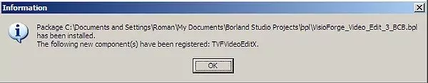

# Complete Guide to TVFVideoEdit Installation in C++ Builder

> Related products: [VisioForge All-in-One Media Framework (Delphi / ActiveX)](https://www.visioforge.com/all-in-one-media-framework)

## Introduction to TVFVideoEdit for C++ Builder

The TVFVideoEdit library provides powerful media processing capabilities for C++ Builder applications. This guide walks you through the installation process across different C++ Builder versions. Before you begin development, you'll need to properly install the ActiveX control into your IDE environment where it will be accessible through the component palette.

## Installation Process for Borland C++ Builder 5/6

### Accessing the Import Menu

Begin the installation process by navigating to the Component menu in your IDE:

1. Launch your Borland C++ Builder 5/6 environment
2. From the main menu, select **Component -> Import ActiveX Controls**

### Selecting the Video Edit Control

In the Import ActiveX Control dialog:

1. Locate and select the **"VisioForge Video Edit Control"** from the available controls list
2. Click the **Install** button to begin the import process

### Confirming Installation

The system will prompt you to confirm the installation:

1. A confirmation dialog will appear
2. Click the **Yes** button to proceed with the installation

### Verifying Successful Installation

After installation completes:

1. The control will be added to your component palette
2. You can now use it in your C++ Builder projects

## Installation Guide for C++ Builder 2006 and Later Versions

Modern versions of C++ Builder require a different installation approach using packages.

### Creating a New Package

First, you'll need to create a package for the component:

1. Open C++ Builder 2006 or later
2. Select **File -> New -> Package**
3. This will create the foundation for adding the ActiveX control

### Importing the ActiveX Component

Next, import the ActiveX control into your environment:

1. Navigate to **Component → Import Component** in the main menu
2. This opens the import wizard for adding new components

### Selecting Import Type

In the import wizard:

1. Select the **Import ActiveX Control** radio button option
2. Click the **Next** button to proceed to component selection

### Choosing the Video Edit Control

From the available ActiveX controls:

1. Find and select the **"VisioForge Video Edit 5 Control"** from the list
2. Click **Next** to continue with the import process

### Configuring Output Location

Specify where the component files should be stored:

1. Choose an appropriate package output folder for your development environment
2. Click **Next** to proceed with configuration

### Finalizing Component Import

Complete the import process:

1. Select the **Add unit to…** radio button option
2. Click the **Finish** button to create the component wrapper

### Saving the Package Project

After import completion:

1. The system will prompt you to save your package project
2. Choose an appropriate location and name for your package files

### Installing the Component Package

To make the component available in the IDE:

1. Right-click on the package in the Project Manager
2. Select **Install** from the context menu
3. This compiles and registers the package with the IDE

### Verification and Usage

Once installed:

1. The TVFVideoEdit control appears in your component palette
2. It's now ready to use in your C++ Builder applications
3. You can drag and drop it onto forms just like native components

## Additional Resources and Support

### Getting Help with Implementation

If you encounter any issues during installation or implementation:

1. Our technical support team is available to assist
2. Contact [support](https://support.visioforge.com/) with specific questions
3. Provide details about your Builder version and installation environment

### Code Examples and Documentation

To accelerate your development process:

1. Visit our [GitHub repository](https://github.com/visioforge/) for code samples
2. Find implementation examples for common media processing tasks
3. Access additional documentation on component features and usage

## Troubleshooting Common Installation Issues

When installing the TVFVideoEdit component, developers may encounter several common issues:

1. **Missing Dependencies**: Ensure all required dependencies are installed
2. **Registration Problems**: Verify ActiveX registration status in Windows registry
3. **IDE Compatibility**: Check compatibility between component and Builder version
4. **Package Conflicts**: Resolve any conflicts with existing packages

By following this detailed guide, you'll have TVFVideoEdit successfully integrated into your C++ Builder environment and ready for implementing advanced media functionality in your applications.
