# Installer TVFVideoEdit dans Delphi

> Produits liés : [VisioForge All-in-One Media Framework (Delphi / ActiveX)](https://www.visioforge.com/all-in-one-media-framework)

## Prérequis d'installation

Avant de commencer le processus d'installation, assurez-vous d'avoir :

1. Une version appropriée de Delphi installée et correctement configurée
2. Les droits d'administrateur pour l'installation des paquets
3. Téléchargé la dernière version de la bibliothèque TVFVideoEdit

## Installation dans Borland Delphi 6/7

### Étape 1 : configurer les chemins de bibliothèques

Commencez par ouvrir la fenêtre « Options » dans votre IDE Delphi.

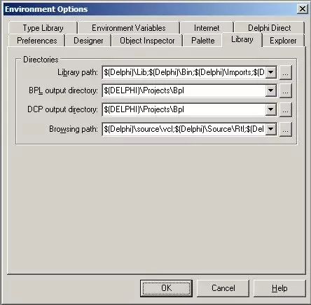

Naviguez vers la section Library et ajoutez le répertoire source à la fois aux chemins de bibliothèque et aux chemins du navigateur. Cela garantit que Delphi peut localiser les fichiers nécessaires.

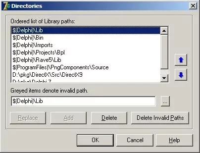

### Étape 2 : ouvrir et installer le paquet

Localisez et ouvrez le fichier principal du paquet depuis la bibliothèque.

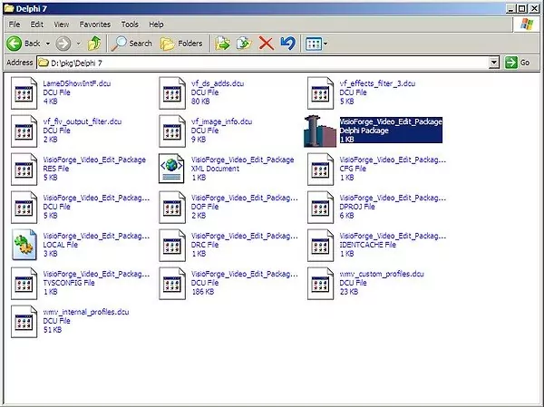

Installez le paquet en cliquant sur le bouton Install dans l'IDE. Cela enregistre les composants dans la palette de composants de Delphi.

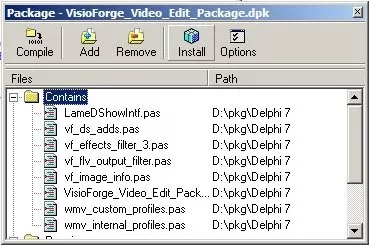

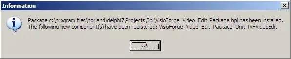

### Considérations d'architecture

La bibliothèque inclut à la fois des versions x86 et x64. Néanmoins, pour Delphi 6/7, vous devez utiliser la version x86 car ces versions de Delphi ne prennent pas en charge le développement 64 bits.

## Installation dans Delphi 2005 et versions ultérieures

### Étape 1 : lancer avec des privilèges d'administrateur

Pour Delphi 2005 et les versions ultérieures, lancez l'IDE avec des droits d'administrateur pour vous assurer de disposer des permissions d'installation appropriées.

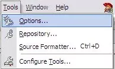

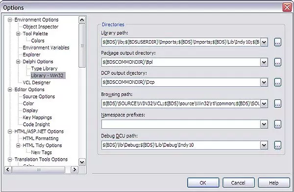

### Étape 2 : configurer les chemins de bibliothèques

Ouvrez la fenêtre Options et naviguez vers la section Library. Ajoutez le répertoire source à la fois aux chemins de bibliothèque et aux chemins du navigateur.

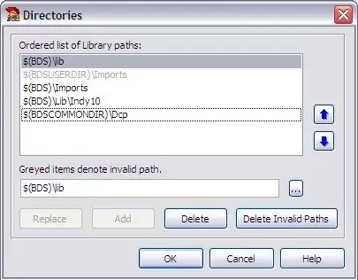

### Étape 3 : installer le paquet

Ouvrez le fichier principal du paquet depuis le répertoire source de la bibliothèque.

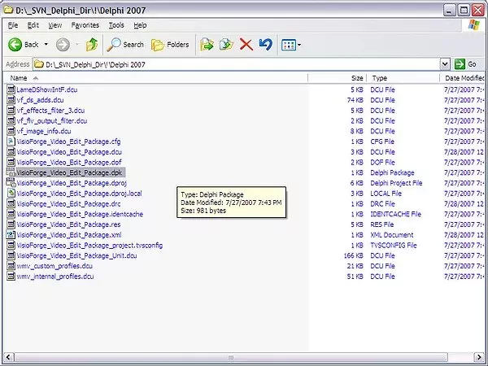

Cliquez sur le bouton Install pour enregistrer les composants dans la palette de composants de Delphi.

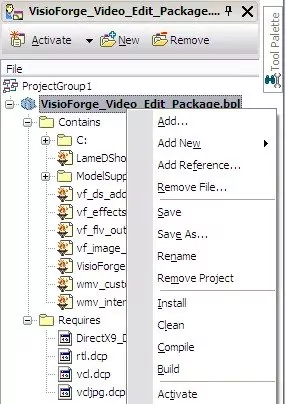

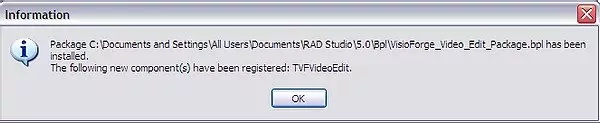

### Prise en charge des architectures

Pour Delphi 2005 et les versions ultérieures, les versions x86 et x64 sont disponibles. Vous pouvez utiliser la version 64 bits si vous devez développer des applications 64 bits. Notez que l'IDE lui-même peut nécessiter la version x86 pour les opérations à la conception.

## Installation dans Delphi 11 et versions ultérieures

Les versions modernes de Delphi proposent un processus d'installation rationalisé :

1. Ouvrez le fichier de paquet `.dproj` de la bibliothèque situé dans le dossier de la bibliothèque après installation
2. Sélectionnez la configuration de compilation Release dans le menu déroulant
3. Compilez et installez le paquet à l'aide des commandes de compilation de l'IDE
4. Les composants seront enregistrés et prêts à l'emploi

## Bonnes pratiques de configuration de projet

Vous pouvez installer à la fois des paquets x86 et x64 selon les besoins de votre projet. Veillez à avoir correctement configuré les paramètres de chemin de bibliothèque de votre application :

1. Ajoutez le chemin correct du dossier de bibliothèque aux options de votre projet
2. Configurez le chemin pour localiser correctement les fichiers `.dcu`
3. Vérifiez la compatibilité d'architecture entre votre projet et les paquets installés

## Dépannage des problèmes d'installation courants

Si vous rencontrez des problèmes lors de l'installation, vérifiez ces problèmes courants :

### Problèmes d'installation de paquet 64 bits sous Delphi

Certains problèmes spécifiques peuvent survenir lors de l'installation de paquets 64 bits. Consultez notre [guide de dépannage détaillé](../../general/install-64bit.md) pour les solutions.

### Problèmes liés aux fichiers .otares

Les problèmes d'installation liés aux fichiers `.otares` sont documentés sur notre [page de dépannage dédiée](../../general/install-otares.md).

## Ressources supplémentaires et support

Pour des exemples de code et implémentations supplémentaires, visitez notre [dépôt GitHub](https://github.com/visioforge/) où nous maintenons une collection de projets d'exemple.

Si vous avez besoin d'une assistance personnalisée pour l'installation ou l'implémentation, veuillez contacter notre [équipe de support technique](https://support.visioforge.com/) qui pourra fournir des conseils adaptés à votre environnement de développement.

---
Pour toute question technique ou assistance d'installation concernant cette bibliothèque, veuillez contacter notre [équipe de support développement](https://support.visioforge.com/). Parcourez les exemples de code et ressources supplémentaires sur notre page [GitHub](https://github.com/visioforge/).