# TVFVideoEdit Installation Guide for Delphi Developers

> Related products: [VisioForge All-in-One Media Framework (Delphi / ActiveX)](https://www.visioforge.com/all-in-one-media-framework)

## Installation Requirements

Before beginning the installation process, ensure that you have:

1. Appropriate Delphi version installed and properly configured
2. Administrative rights for package installation
3. Downloaded the latest version of the TVFVideoEdit library

## Installing in Borland Delphi 6/7

### Step 1: Configure Library Paths

Begin by opening the "Options" window in your Delphi IDE.

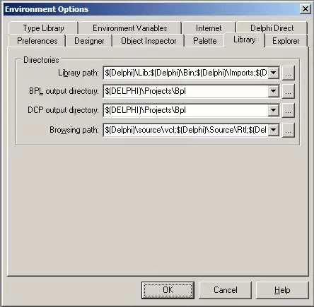

Navigate to the Library section and add the source directory to both the library and browser paths. This ensures that Delphi can locate the necessary files.

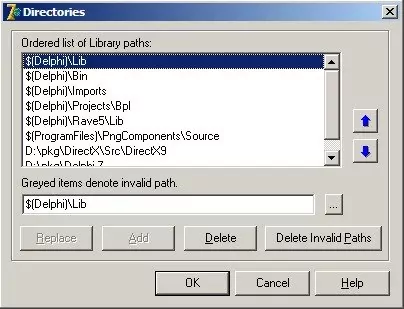

### Step 2: Open and Install the Package

Locate and open the main package file from the library.

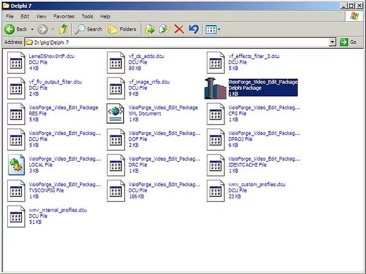

Install the package by clicking the Install button in the IDE. This registers the components with Delphi's component palette.

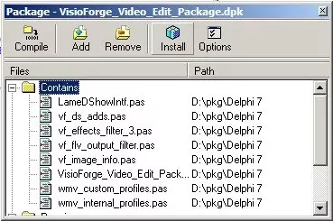

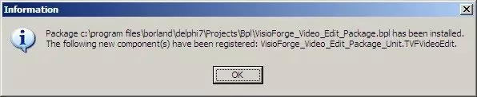

### Architecture Considerations

The library includes both x86 and x64 architecture versions. However, for Delphi 6/7, you must use the x86 version as these Delphi versions do not support 64-bit development.

## Installing in Delphi 2005 and Later

### Step 1: Launch with Administrative Privileges

For Delphi 2005 and later versions, launch the IDE with administrative rights to ensure proper installation permissions.

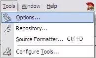

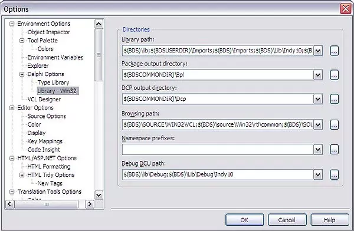

### Step 2: Configure Library Paths

Open the Options window and navigate to the Library section. Add the source directory to both the library and browser paths.

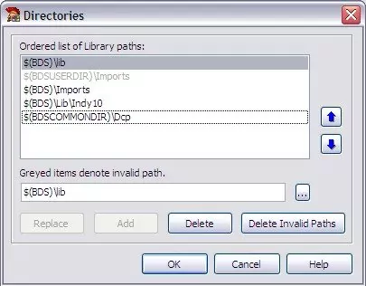

### Step 3: Install the Package

Open the main package file from the library source directory.

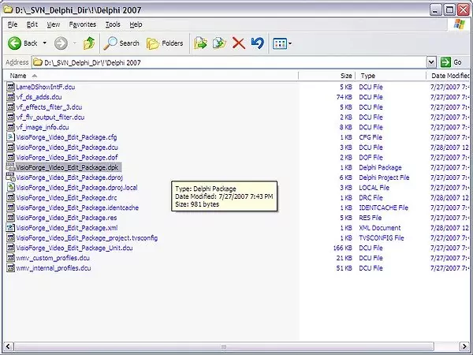

Click the Install button to register the components with Delphi's component palette.

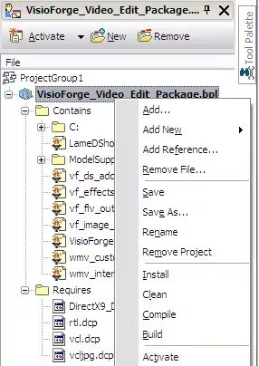

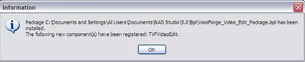

### Architecture Support

For Delphi 2005 and later versions, both x86 and x64 versions are available. You can utilize the 64-bit version if you need to develop 64-bit applications. Note that the IDE itself may require the x86 version for design-time operations.

## Installing in Delphi 11 and Later

Modern Delphi versions feature a streamlined installation process:

1. Open the library `.dproj` package file located in the library folder after installation
2. Select the Release build configuration from the dropdown menu
3. Build and install the package using the IDE's build commands
4. The components will be registered and ready to use

## Project Configuration Best Practices

You can install both x86 and x64 packages based on your project requirements. Ensure you've properly configured your application's library path settings:

1. Add the correct library folder path to your project options
2. Configure the path to properly locate `.dcu` files
3. Verify architecture compatibility between your project and the installed packages

## Troubleshooting Common Installation Issues

If you encounter problems during installation, check these common issues:

### Delphi 64-bit Package Installation Problems

Some specific issues can occur when installing 64-bit packages. See our [detailed troubleshooting guide](../../general/install-64bit.md) for solutions.

### Issues with .otares Files

Installation problems related to `.otares` files are documented in our [dedicated troubleshooting page](../../general/install-otares.md).

## Additional Resources and Support

For additional code examples and implementations, visit our [GitHub repository](https://github.com/visioforge/) where we maintain a collection of sample projects.

If you need personalized assistance with installation or implementation, please contact our [technical support team](https://support.visioforge.com/) who can provide guidance specific to your development environment.

---

For technical questions or installation assistance with this library, please reach out to our [development support team](https://support.visioforge.com/). Browse additional code samples and resources on our [GitHub](https://github.com/visioforge/) page.
