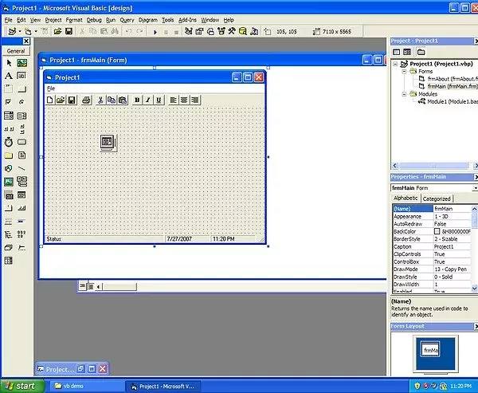
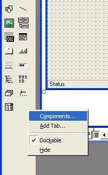
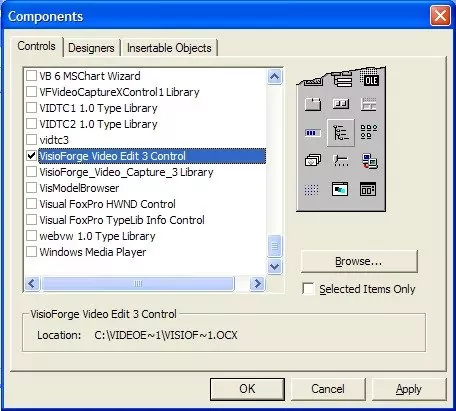
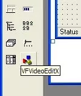

# Installation du contrôle ActiveX TVFVideoEdit dans Visual Basic 6

## Introduction

Visual Basic 6 demeure un environnement de développement populaire pour créer des applications Windows. En tirant parti de notre bibliothèque TVFVideoEdit en tant que contrôle ActiveX, les développeurs peuvent intégrer des capacités avancées d'édition et de traitement vidéo dans leurs applications VB6 sans recourir à un code complexe.

## Exigences techniques et limitations

Microsoft Visual Basic 6 fonctionne comme une plateforme de développement 32 bits et ne peut pas produire d'applications 64 bits. En raison de cette contrainte architecturale, seule la version x86 (32 bits) de notre bibliothèque est compatible avec les projets VB6. Malgré cette limitation, l'implémentation 32 bits offre d'excellentes performances et donne un accès complet à l'ensemble étendu des fonctionnalités de la bibliothèque.

## Processus d'installation

Suivez ces étapes détaillées pour installer correctement le contrôle ActiveX TVFVideoEdit dans votre environnement Visual Basic 6 :

### Étape 1 : créer un nouveau projet

Commencez par lancer Visual Basic 6 et créer un nouveau projet :

1. Ouvrez l'IDE Visual Basic 6
2. Sélectionnez « New Project » dans le menu File
3. Choisissez « Standard EXE » comme type de projet
4. Cliquez sur « OK » pour créer le projet de base

### Étape 2 : accéder à la boîte de dialogue Components

Vous devez ensuite enregistrer le contrôle ActiveX dans votre environnement de développement :

1. Dans le menu, naviguez vers « Project »
2. Sélectionnez « Components » pour ouvrir la boîte de dialogue des composants

### Étape 3 : sélectionner le contrôle TVFVideoEdit

Dans la boîte de dialogue Components :

1. Parcourez les contrôles disponibles
2. Localisez et cochez la case pour « VisioForge Video Edit Control »
3. Cliquez sur « OK » pour confirmer votre sélection

### Étape 4 : vérifier l'enregistrement du contrôle

Après un enregistrement réussi :

1. L'icône du contrôle TVFVideoEdit apparaît dans votre boîte à outils
2. Cela confirme que le contrôle est prêt à être utilisé dans votre application

### Étape 5 : implémenter le contrôle

Pour commencer à utiliser le contrôle dans votre application :

1. Sélectionnez le contrôle TVFVideoEdit dans la boîte à outils
2. Cliquez et faites glisser sur votre formulaire pour placer une instance du contrôle
3. Dimensionnez le contrôle de manière appropriée pour votre interface
4. Accédez aux propriétés et méthodes via la fenêtre Properties et le code

## Conseils d'implémentation avancée

* Définissez les propriétés appropriées du contrôle avant de charger des fichiers multimédias
* Gérez les événements pour l'interaction utilisateur et les notifications de traitement
* Tenez compte de la gestion de la mémoire lorsque vous travaillez avec des fichiers vidéo volumineux
* Testez votre application en profondeur avec divers formats multimédias

---
Pour toute question technique ou difficulté d'implémentation, contactez notre [équipe de support](https://support.visioforge.com/). Accédez à des exemples de code et ressources supplémentaires sur notre [dépôt GitHub](https://github.com/visioforge/).