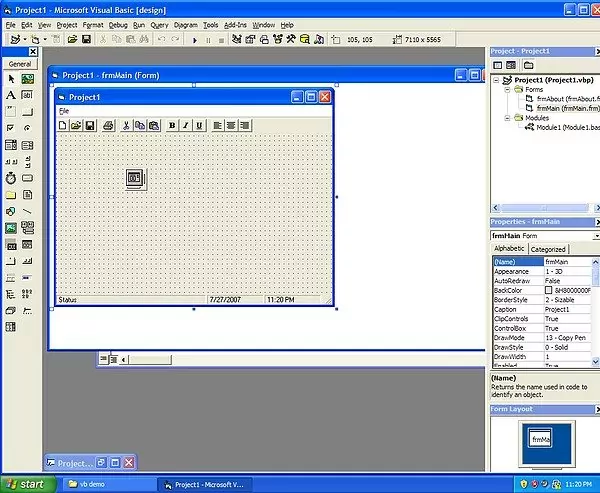
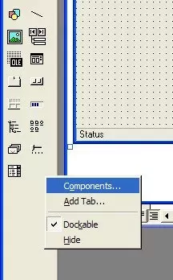
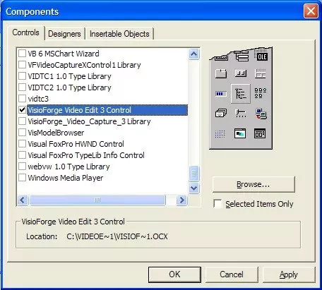
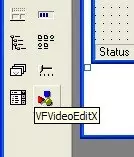
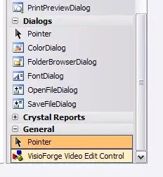

# Installing TVFVideoEdit ActiveX Control in Visual Basic 6

## Introduction

Visual Basic 6 remains a popular development environment for creating Windows applications. By leveraging our TVFVideoEdit library as an ActiveX control, developers can incorporate advanced video editing and processing capabilities into their VB6 applications without extensive coding.

## Technical Requirements and Limitations

Microsoft Visual Basic 6 operates as a 32-bit development platform and cannot produce 64-bit applications. Due to this architectural constraint, only the x86 (32-bit) version of our library is compatible with VB6 projects. Despite this limitation, the 32-bit implementation delivers excellent performance and provides full access to the library's extensive feature set.

## Installation Process

Follow these detailed steps to properly install the TVFVideoEdit ActiveX control in your Visual Basic 6 environment:

### Step 1: Create a New Project

Begin by launching Visual Basic 6 and creating a new project:

1. Open Visual Basic 6 IDE
2. Select "New Project" from the File menu
3. Choose "Standard EXE" as the project type
4. Click "OK" to create the baseline project

### Step 2: Access Components Dialog

Next, you need to register the ActiveX control within your development environment:

1. In the menu, navigate to "Project"
2. Select "Components" to open the components dialog

### Step 3: Select the TVFVideoEdit Control

From the Components dialog:

1. Scroll through the available controls
2. Locate and check the box for "VisioForge Video Edit Control"
3. Click "OK" to confirm your selection

### Step 4: Verify Control Registration

After successful registration:

1. The TVFVideoEdit control icon appears in your toolbox
2. This confirms the control is ready for use in your application

### Step 5: Implement the Control

To begin using the control in your application:

1. Select the TVFVideoEdit control from the toolbox
2. Click and drag on your form to place an instance of the control
3. Size the control appropriately for your interface
4. Access properties and methods through the Properties window and code

## Advanced Implementation Tips

* Set appropriate control properties before loading media files
* Handle events for user interaction and processing notifications
* Consider memory management when working with large video files
* Test your application thoroughly with various media formats

---
For technical questions or implementation challenges, contact our [support team](https://support.visioforge.com/). Access additional code examples and resources on our [GitHub repository](https://github.com/visioforge/).