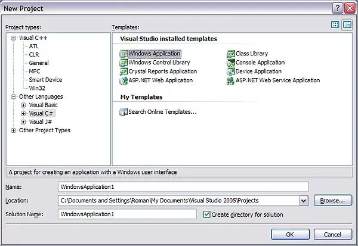
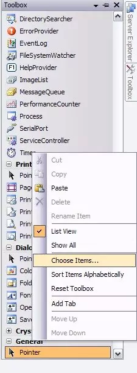
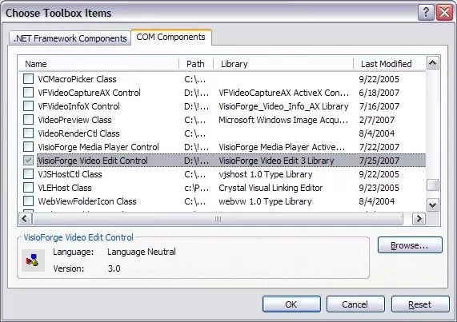
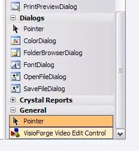

# Installer TVFVideoEdit dans Visual Studio

## Vue d'ensemble

> Produits liés : [All-in-One Media Framework (Delphi / ActiveX)](https://www.visioforge.com/all-in-one-media-framework)

TVFVideoEdit fournit de puissantes capacités d'édition vidéo via des contrôles ActiveX qui s'intègrent en douceur avec divers environnements de développement. Ce guide vous accompagne dans le processus d'installation, en particulier pour Visual Studio 2010 et les versions ultérieures.

## Informations de compatibilité

Le contrôle ActiveX peut être utilisé directement dans les projets C++ sans wrappers supplémentaires. Pour le développement en C# ou VB.Net, Visual Studio crée automatiquement un assembly wrapper personnalisé qui rend l'API ActiveX accessible dans les environnements de code managé.

## Prérequis

Avant de commencer le processus d'installation, assurez-vous d'avoir :

- Visual Studio 2010 ou version ultérieure installé sur votre machine de développement
- Des privilèges d'administrateur (requis pour l'enregistrement ActiveX)
- Les contrôles ActiveX x86 et x64 enregistrés (Visual Studio peut utiliser x86 pour le concepteur d'interface utilisateur même lorsque vous ciblez x64)

## Guide d'installation pas à pas

### Création d'un nouveau projet

1. Lancez Visual Studio et créez un nouveau projet à l'aide de C++, C# ou Visual Basic.
2. Pour cette démonstration, nous utiliserons une application Windows Forms C#, mais le processus s'applique de manière similaire aux projets VB.Net et C++ MFC.

### Ajout du contrôle ActiveX à votre boîte à outils

1. Cliquez avec le bouton droit sur le panneau Toolbox dans Visual Studio
2. Sélectionnez l'option « Choose Items » dans le menu contextuel qui apparaît

### Sélection du contrôle d'édition vidéo

1. Dans la boîte de dialogue Choose Toolbox Items, localisez l'onglet COM Components
2. Parcourez la liste ou utilisez la fonctionnalité de recherche
3. Trouvez et sélectionnez l'élément « VisioForge Video Edit Control »
4. Cliquez sur OK pour ajouter le contrôle à votre boîte à outils

### Implémentation du contrôle dans votre formulaire

1. Localisez le contrôle nouvellement ajouté dans votre boîte à outils
2. Cliquez et faites-le glisser sur la surface de conception de votre formulaire
3. Le contrôle est désormais prêt à être implémenté dans votre application

## Options d'intégration avancées

### Recommandations pour le développement .NET

Pour les développeurs travaillant sur des applications .NET, nous recommandons vivement d'envisager le [SDK .NET](https://www.visioforge.com/video-edit-sdk-net) natif comme alternative à l'intégration ActiveX. Le SDK .NET offre plusieurs avantages :

- Des performances et une stabilité accrues
- Une prise en charge native des contrôles WinForms, WPF et MAUI
- Un ensemble de fonctionnalités et de capacités d'API plus large
- Une intégration plus simple avec les pratiques de développement modernes

## Dépannage des problèmes courants

Lors de l'intégration de TVFVideoEdit, vous pouvez rencontrer ces difficultés courantes :

- Problèmes d'enregistrement : assurez-vous d'avoir des privilèges d'administrateur
- Incompatibilités d'architecture : vérifiez que les versions x86 et x64 sont correctement enregistrées
- Erreurs de référence : vérifiez que toutes les dépendances requises sont incluses dans votre projet

## Ressources supplémentaires

Si vous rencontrez des difficultés en suivant ce tutoriel ou si vous avez besoin d'une assistance spécialisée pour votre implémentation, notre équipe de développement est disponible pour vous fournir des conseils techniques.

- Accédez à des exemples de code supplémentaires sur notre [dépôt GitHub](https://github.com/visioforge/)
- Contactez notre [équipe de support technique](https://support.visioforge.com/) pour une assistance personnalisée
