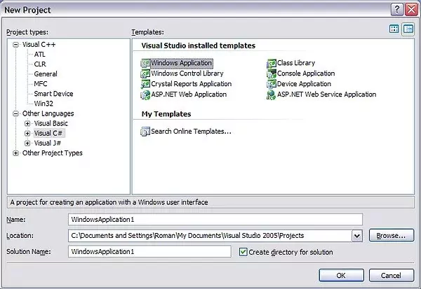
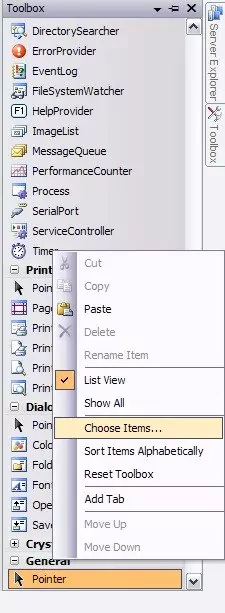
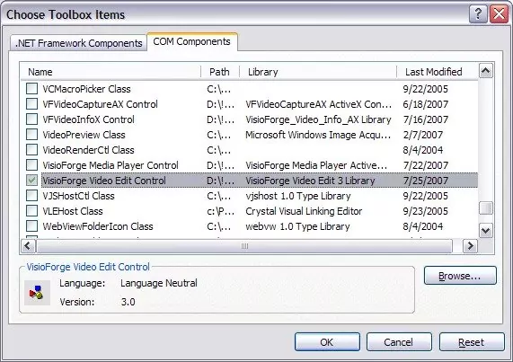
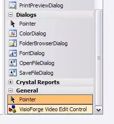

# Install TVFVideoEdit in Visual Studio

## Overview

> Related products: [All-in-One Media Framework (Delphi / ActiveX)](https://www.visioforge.com/all-in-one-media-framework)

TVFVideoEdit provides powerful video editing capabilities through ActiveX controls that integrate smoothly with various development environments. This guide walks you through the installation process specifically for Visual Studio 2010 and later versions.

## Compatibility Information

The ActiveX control can be used directly in C++ projects without additional wrappers. For C# or VB.Net development, Visual Studio automatically creates a custom wrapper assembly that enables the ActiveX API in managed code environments.

## Prerequisites

Before beginning the installation process, ensure you have:

- Visual Studio 2010 or later installed on your development machine
- Administrative privileges (required for ActiveX registration)
- Both x86 and x64 ActiveX controls registered (Visual Studio might use x86 for the UI designer even when targeting x64)

## Step-by-Step Installation Guide

### Creating a New Project

1. Start Visual Studio and create a new project using C++, C#, or Visual Basic.
2. For this demonstration, we'll use a C# Windows Forms application, but the process applies similarly to VB.Net and C++ MFC projects.

### Adding the ActiveX Control to Your Toolbox

1. Right-click on the Toolbox panel in Visual Studio
2. Select the "Choose Items" option from the context menu that appears

### Selecting the Video Edit Control

1. In the Choose Toolbox Items dialog, locate the COM Components tab
2. Browse through the list or use the search functionality
3. Find and select the "VisioForge Video Edit Control" item
4. Click OK to add the control to your toolbox

### Implementing the Control in Your Form

1. Locate the newly added control in your toolbox
2. Click and drag it onto your form design surface
3. The control is now ready for implementation in your application

## Advanced Integration Options

### .NET Development Recommendations

For developers working with .NET applications, we strongly recommend considering the native [.NET SDK](https://www.visioforge.com/video-edit-sdk-net) as an alternative to ActiveX integration. The .NET SDK offers several advantages:

- Enhanced performance and stability
- Native support for WinForms, WPF, and MAUI controls
- Broader feature set and API capabilities
- Simpler integration with modern development practices

## Troubleshooting Common Issues

When integrating TVFVideoEdit, you might encounter these common challenges:

- Registration issues: Ensure you have administrative privileges
- Architecture mismatches: Verify both x86 and x64 versions are properly registered
- Reference errors: Check that all required dependencies are included in your project

## Additional Resources

If you encounter any difficulties following this tutorial or need specialized assistance with your implementation, our development team is available to provide technical guidance.

- Access additional code samples on our [GitHub repository](https://github.com/visioforge/)
- Contact our [technical support team](https://support.visioforge.com/) for personalized assistance
