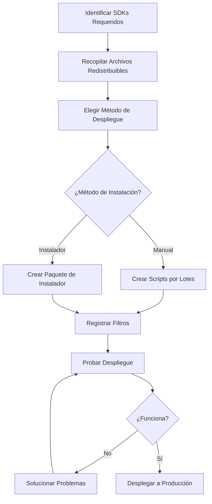

# SDKs de DirectShow - Guía de Despliegue

## Descripción General

Esta guía de despliegue completa cubre todo lo que necesita saber sobre el despliegue de SDKs de VisioForge DirectShow en entornos de producción. Desde el registro de filtros hasta la creación de instaladores profesionales, esta guía asegura que sus aplicaciones se desplieguen sin problemas.

---

## Qué se Cubre

### Temas Principales de Despliegue

#### [Registro de Filtros](filter-registration.md)

Aprenda cómo registrar filtros DirectShow utilizando múltiples métodos.

**Temas**:

- Registro manual con regsvr32
- Registro programático (C++, C#)
- Scripts por lotes para automatización
- Técnicas de verificación
- Solución de problemas de registro
- COM sin registro

**Cuándo Leer**: Esencial para todos los escenarios de despliegue

---

#### [Archivos Redistribuibles](redistributable-files.md)

Referencia completa de archivos para incluir en su despliegue.

**Temas**:

- Archivos del Filtro de Fuente FFMPEG (~80-100MB)
- Archivos del Filtro de Fuente VLC (~150-200MB)
- Archivos del Paquete de Filtros de Procesamiento (~20-180MB)
- Archivos del Paquete de Filtros de Codificación (~40-300MB)
- Archivos del SDK de Cámara Virtual (~15-35MB)
- Dependencias y estructuras de directorios

**Cuándo Leer**: Antes de crear instaladores o paquetes de despliegue

---

#### [Integración de Instaladores](installer-integration.md)

Cree instaladores profesionales con WiX, NSIS, InstallShield e Inno Setup.

**Temas**:

- WiX Toolset (MSI)
- Scripts NSIS
- Proyectos InstallShield
- Scripts Inno Setup
- Acciones personalizadas para registro
- Instalación silenciosa
- Empaquetado de prerrequisitos

**Cuándo Leer**: Al crear paquetes de instalación automatizados

---

## Inicio Rápido

### Flujo de Trabajo de Despliegue

Siga este flujo de trabajo recomendado para desplegar filtros DirectShow:



### Inicio Rápido Paso a Paso

#### Paso 1: Identifique Sus SDKs

Determine qué SDKs utiliza su aplicación:

| SDK | Propósito | Archivo Clave |
|-----|-----------|---------------|
| **Fuente FFMPEG** | Reproducción de medios, streaming | VisioForge_FFMPEG_Source_x64.ax |
| **Fuente VLC** | Reproducción multipista | VisioForge_VLC_Source.ax |
| **Filtros de Procesamiento** | Efectos, mezcla | VisioForge_VideoEffects_x64.ax |
| **Filtros de Codificación** | Codificación de video | VisioForge_NVENC_Encoder_x64.ax |
| **Cámara Virtual** | Dispositivos virtuales | VisioForge_VirtualCamera_x64.ax |

[Ver Listas Completas de Archivos →](redistributable-files.md)

---

#### Paso 2: Recopilar Archivos

Cree la estructura de carpetas de despliegue:

```
SuApp\
├── SuApp.exe
├── SuApp.exe.config
└── Filters\
    ├── VisioForge_FFMPEG_Source_x64.ax
    ├── avcodec-58.dll
    ├── avformat-58.dll
    └── ... (otras dependencias)
```

[Ver Estructuras de Directorios →](redistributable-files.md#estructura-del-directorio-de-instalacion)

---

#### Paso 3: Elegir Método de Despliegue

| Método | Mejor Para | Complejidad |
|--------|------------|-------------|
| **Script por Lotes** | Despliegue interno, pruebas | Baja |
| **WiX (MSI)** | Empresa, automatización TI | Media-Alta |
| **NSIS** | Instaladores pequeños, UI personalizada | Media |
| **InstallShield** | Apps comerciales, características avanzadas | Media |
| **Inno Setup** | Instaladores simples, código abierto | Baja-Media |

[Ver Comparaciones de Instaladores →](#eligiendo-una-tecnologia-de-instalador)

---

#### Paso 4: Registrar Filtros

**Opción A: Registro Manual (Desarrollo/Pruebas)**

```batch
@echo off
cd /d "%~dp0Filters"
regsvr32 /s VisioForge_FFMPEG_Source_x64.ax
if %ERRORLEVEL% EQU 0 (
    echo Registro exitoso
) else (
    echo Registro fallido
)
```

**Opción B: Acción Personalizada del Instalador (Producción)**

Vea la [Guía de Integración de Instaladores](installer-integration.md) para ejemplos de WiX, NSIS y otros.

[Ver Todos los Métodos de Registro →](filter-registration.md)

---

#### Paso 5: Probar Despliegue

**Lista de Verificación**:

- [ ] Instalar en máquina de prueba limpia
- [ ] Verificar que todos los archivos se copiaron correctamente
- [ ] Comprobar registro de filtros en el registro
- [ ] Probar filtro con GraphEdit/GraphStudioNext
- [ ] Ejecutar prueba de extremo a extremo de la aplicación
- [ ] Verificar que la desinstalación elimina todos los componentes
- [ ] Probar en Windows 10 y Windows 11
- Probar tanto x64 como x86 (si aplica)

[Ver Procedimientos de Prueba →](#probando-despliegues)

---

## Eligiendo una Tecnología de Instalador

### WiX Toolset

**Pros**:

- Formato MSI estándar de la industria
- Excelente para despliegue empresarial
- Soporte de Políticas de Grupo
- Fuerte integración con Windows Installer
- Comunidad activa y documentación

**Contras**:

- La sintaxis basada en XML tiene curva de aprendizaje
- Requiere paso de compilación
- UI menos flexible que instaladores personalizados

**Recomendado Para**:

- Aplicaciones empresariales
- Despliegues gestionados por TI
- Aplicaciones que requieren despliegue por Política de Grupo
- Organizaciones con infraestructura MSI existente

[Ver Ejemplos WiX →](installer-integration.md#ejemplos-wix-toolset)

---

### NSIS

**Pros**:

- Tamaño de instalador muy pequeño
- Ejecución rápida
- UI altamente personalizable
- Lenguaje de scripting simple
- Sin dependencias externas

**Contras**:

- No basado en MSI (puede no adaptarse a todas las empresas)
- Menos integración con Windows Installer
- Gestión manual de actualizaciones

**Recomendado Para**:

- Aplicaciones de consumo
- Instaladores pequeños a medianos
- Aplicaciones que requieren UI personalizada
- Creación de aplicaciones portátiles

[Ver Ejemplos NSIS →](installer-integration.md#ejemplos-nsis)

---

### InstallShield

**Pros**:

- Diseñador GUI profesional
- Conjunto completo de características
- Integración con Visual Studio
- Manejo avanzado de prerrequisitos
- Creación de suite/paquete

**Contras**:

- Requiere licencia comercial (excepto Edición Limitada)
- Puede ser complejo para instaladores simples
- Curva de aprendizaje mayor

**Recomendado Para**:

- Productos de software comercial
- Requisitos de instalación complejos
- Apariencia de instalador profesional
- Organizaciones con experiencia en InstallShield

[Ver Guía InstallShield →](installer-integration.md#integracion-installshield)

---

### Inno Setup

**Pros**:

- Gratuito y de código abierto
- Scripting Pascal fácil de aprender
- Buena documentación
- Soporte Unicode
- Desarrollo activo

**Contras**:

- No basado en MSI
- Menos características avanzadas que herramientas comerciales
- Características empresariales limitadas

**Recomendado Para**:

- Proyectos de código abierto
- Instaladores simples
- Aplicaciones pequeñas
- Despliegues conscientes del presupuesto

[Ver Ejemplos Inno Setup →](installer-integration.md#ejemplos-inno-setup)

---

## Escenarios Comunes de Despliegue

### Escenario 1: Aplicación de Reproductor Multimedia

**Requisitos**:

- Filtro de Fuente FFMPEG
- Filtros de Procesamiento (efectos de video)
- Instalador amigable para el usuario

**Enfoque Recomendado**:

1. Usar **NSIS** o **Inno Setup** para instalador amigable al consumidor
2. Incluir verificación de Visual C++ Redistributable
3. Registrar filtros durante la instalación
4. Crear acceso directo en escritorio
5. Asociar tipos de archivos multimedia (opcional)

**Archivos para Desplegar** (~100-150MB):

- VisioForge_FFMPEG_Source_x64.ax + DLLs de FFmpeg
- VisioForge_VideoEffects_x64.ax + dependencias

[Ver Lista Completa de Archivos →](redistributable-files.md#filtro-ffmpeg-source)

---

### Escenario 2: Procesamiento de Video Empresarial

**Requisitos**:

- Fuente FFMPEG + Filtros de Codificación
- Soporte de instalación silenciosa
- Despliegue basado en MSI
- Despliegue por Política de Grupo

**Enfoque Recomendado**:

1. Usar **WiX Toolset** para creación de MSI
2. Empaquetar Visual C++ Redistributable
3. Soportar parámetros de instalación silenciosa
4. Implementar registro (logging) adecuado
5. Crear documentación de despliegue

**Ejemplo**:

```bash
msiexec /i EnterpriseVideoApp.msi /quiet /norestart /l*v install.log
```

[Ver Ejemplos de Paquete WiX →](installer-integration.md#empaquetado-de-dependencias)

---

### Escenario 3: Solución de Cámara Virtual

**Requisitos**:

- SDK de Cámara Virtual
- Instalación de controladores
- Acceso a nivel de sistema

**Enfoque Recomendado**:

1. Usar **WiX** o **InstallShield** para soporte de controladores
2. Requerir privilegios de administrador
3. Instalar controladores de cámara virtual
4. Registrar filtros DirectShow
5. Proporcionar instrucciones claras de instalación

**Consideraciones Especiales**:

- Los controladores requieren firmas digitales
- Puede necesitar reinicio del sistema
- Advertencias de seguridad mejoradas

[Ver Archivos de Cámara Virtual →](redistributable-files.md#sdk-de-camara-virtual)

---

### Escenario 4: Redistribución de SDK de Desarrollo

**Requisitos**:

- Incluir filtros con su SDK
- Soportar tanto x86 como x64
- Integración flexible

**Enfoque Recomendado**:

1. Proporcionar paquetes separados x86/x64
2. Incluir scripts por lotes de registro
3. Proporcionar documentación para desarrolladores
4. Considerar distribución por paquete NuGet
5. Incluir archivos de cabecera y bibliotecas de tipos

**Estructura del Paquete**:

```
SuSDK\
├── bin\
│   ├── x86\
│   │   └── Filters\
│   └── x64\
│       └── Filters\
├── docs\
├── samples\
└── tools\
    └── register_filters.bat
```

---

## Prerrequisitos y Dependencias

### Visual C++ Redistributable

**Versión Requerida**: Visual C++ 2015-2022 Redistributable

**Enlaces de Descarga**:

- x64: <https://aka.ms/vs/17/release/vc_redist.x64.exe>
- x86: <https://aka.ms/vs/17/release/vc_redist.x86.exe>

**Claves de Registro de Detección**:

```
x64: HKLM\SOFTWARE\Microsoft\VisualStudio\14.0\VC\Runtimes\x64
x86: HKLM\SOFTWARE\Microsoft\VisualStudio\14.0\VC\Runtimes\x86
Valor: "Installed" = 1 (DWORD)
```

**Integración de Instalador**:

Vea [Empaquetado de Dependencias](installer-integration.md#empaquetado-de-dependencias) para ejemplos de WiX, NSIS y otros.

---

### Requisitos .NET

Si su aplicación usa .NET:

- **.NET Framework 4.8** - Para aplicaciones .NET Framework
- **.NET 8.0 Runtime** - Para aplicaciones .NET modernas

**Detección**:

- .NET Framework: Verificar registro `HKLM\SOFTWARE\Microsoft\NET Framework Setup\NDP\v4\Full`
- .NET 8.0: Verificar `dotnet --list-runtimes`

---

### Requisitos de Hardware (Opcional)

Para características de aceleración por hardware:

| Característica | Requisito |
|----------------|-----------|
| **Codificación NVENC** | GPU NVIDIA (GTX 600+) |
| **QuickSync** | CPU Intel con gráficos integrados |
| **Decodificación DXVA** | GPU compatible con DirectX 11 |

Documente los requisitos de hardware en su instalador o documentación.

---

## Probando Despliegues

### Configuración del Entorno de Prueba

Cree entornos de prueba aislados:

1. **VM Windows 10 Limpia** - Probar en instalación fresca
2. **VM Windows 11 Limpia** - Probar último SO
3. **Instalación Mínima** - Sin Visual Studio o herramientas de desarrollo
4. **Diferentes Cuentas de Usuario** - Probar usuario estándar vs. admin

### Lista de Verificación de Pruebas

#### Pruebas de Instalación

- [ ] El instalador se ejecuta sin errores
- [ ] Todos los archivos copiados a ubicaciones correctas
- [ ] Filtros registrados exitosamente
- [ ] Accesos directos del menú inicio creados
- [ ] Entradas de registro creadas
- [ ] Prerrequisitos detectados/instalados
- [ ] El usuario puede lanzar la aplicación
- [ ] La aplicación funciona correctamente

#### Pruebas de Desinstalación

- [ ] El desinstalador se ejecuta sin errores
- [ ] Todos los archivos eliminados
- [ ] Filtros desregistrados
- [ ] Entradas de registro limpiadas
- [ ] Accesos directos del menú inicio eliminados
- [ ] No quedan archivos huérfanos

#### Pruebas de Actualización

- [ ] La actualización desde versión anterior funciona
- [ ] Datos de usuario preservados
- [ ] Configuraciones mantenidas
- [ ] Filtros antiguos reemplazados con nuevas versiones

#### Pruebas de Instalación Silenciosa

```batch
REM Instalar silenciosamente
MiAppSetup.exe /S

REM Verificar instalación
reg query "HKLM\SOFTWARE\MiApp" /v InstallDir

REM Desinstalar silenciosamente
"%ProgramFiles%\MiApp\Uninstall.exe" /S
```

### Script de Prueba Automatizada

```powershell
# Script de prueba de despliegue PowerShell
param(
    [string]$InstallerPath,
    [string]$FilterCLSID
)

Write-Host "Probando instalación..." -ForegroundColor Cyan

# Instalar
Start-Process $InstallerPath -ArgumentList "/S" -Wait

# Verificar registro de filtro
$regPath = "HKLM:\SOFTWARE\Classes\CLSID\$FilterCLSID"
if (Test-Path $regPath) {
    Write-Host "✓ Filtro registrado" -ForegroundColor Green
} else {
    Write-Host "✗ Filtro NO registrado" -ForegroundColor Red
    Exit 1
}

# Probar con GraphEdit
$graphEdit = "C:\Program Files (x86)\Windows Kits\10\bin\*\x64\graphedt.exe"
if (Test-Path $graphEdit) {
    Write-Host "✓ Probando con GraphEdit..." -ForegroundColor Cyan
    # Agregar automatización de GraphEdit aquí
}

# Desinstalar
$uninstaller = Get-ChildItem "C:\Program Files\MyApp\Uninstall.exe" -ErrorAction SilentlyContinue
if ($uninstaller) {
    Start-Process $uninstaller.FullName -ArgumentList "/S" -Wait
    Write-Host "✓ Desinstalación completada" -ForegroundColor Green
}

# Verificar limpieza
if (Test-Path $regPath) {
    Write-Host "✗ Filtro todavía registrado después de desinstalar" -ForegroundColor Red
    Exit 1
} else {
    Write-Host "✓ Filtro desregistrado exitosamente" -ForegroundColor Green
}

Write-Host "¡Todas las pruebas pasaron!" -ForegroundColor Green
```

---

## Consideraciones de Arquitectura

### Despliegue x86 vs x64

**Aplicaciones x64**:

- Usar solo filtros x64
- Instalar en `C:\Program Files\SuApp`
- Registrar en vista de registro de 64-bits

**Aplicaciones x86**:

- Usar solo filtros x86
- Instalar en `C:\Program Files (x86)\SuApp`
- Registrar en vista de registro de 32-bits (regsvr32 maneja automáticamente)

**Aplicaciones Mixtas**:

- Incluir filtros tanto x86 como x64
- Subdirectorios separados: `Filters\x86` y `Filters\x64`
- Registro condicional basado en arquitectura del proceso

### Consideraciones de Registro

**Vistas de Registro de Windows 64-bits**:

```
HKLM\SOFTWARE\Classes\CLSID\{GUID}           ← vista 64-bits
HKLM\SOFTWARE\Wow6432Node\Classes\CLSID\{GUID} ← vista 32-bits
```

**Importante**: regsvr32 usa automáticamente la vista de registro correcta:

- `C:\Windows\System32\regsvr32.exe` → registro 64-bits
- `C:\Windows\SysWOW64\regsvr32.exe` → registro 32-bits

---

## Consideraciones de Seguridad

### Firma de Código

**Recomendado**: Firmar todos los ejecutables e instaladores con certificado Authenticode.

```batch
REM Firmar instalador con certificado
signtool sign /f MiCert.pfx /p password /t https://timestamp.digicert.com MiAppSetup.exe
```

**Beneficios**:

- Elimina advertencias de SmartScreen
- Establece confianza con los usuarios
- Requerido para controladores en modo kernel (Cámara Virtual)

### Requisitos de Permisos

**El Registro de Filtros Requiere**:

- Privilegios de administrador
- Acceso de escritura al registro HKLM
- Acceso de escritura a System32 (si se registra allí)

**Mejores Prácticas**:

- Siempre solicitar elevación en manifiesto del instalador
- Verificar privilegios antes del registro
- Proporcionar mensajes de error claros para problemas de permisos

```xml
<!-- Manifiesto de instalador requiriendo elevación -->
<requestedExecutionLevel level="requireAdministrator" />
```

---

## Solución de Problemas Comunes

### Problema: Falla el Registro de Filtro

**Síntomas**: regsvr32 devuelve error, filtro no está en registro

**Posibles Causas**:

1. Dependencias faltantes (Visual C++ Runtime, DLLs)
2. Privilegios insuficientes
3. Archivo de filtro corrupto
4. Desajuste de arquitectura

**Soluciones**:

1. Usar Dependency Walker para verificar dependencias
2. Ejecutar instalador como administrador
3. Verificar integridad de archivo (checksums)
4. Asegurar que app x86 use filtro x86, app x64 use filtro x64

[Ver Solución de Problemas Completa →](filter-registration.md#solucion-de-problemas)

---

### Problema: La Aplicación No Puede Encontrar el Filtro

**Síntomas**: La aplicación falla al crear gráfico de filtros, CLSID no encontrado

**Posibles Causas**:

1. Filtro no registrado
2. CLSID incorrecto usado
3. App de 32-bits buscando filtro de 64-bits

**Soluciones**:

```cpp
// Verificar registro de filtro programáticamente
HRESULT hr = CoCreateInstance(CLSID_FFMPEGSource, NULL, CLSCTX_INPROC_SERVER,
                               IID_IBaseFilter, (void**)&pFilter);
if (hr == REGDB_E_CLASSNOTREG) {
    // Filtro no registrado - preguntar al usuario
}
```

---

### Problema: La Instalación Silenciosa se Cuelga

**Síntomas**: El instalador deja de responder durante instalación silenciosa

**Posibles Causas**:

1. Esperando entrada del usuario
2. Reinicio requerido
3. Instalación de prerrequisito solicitando confirmación

**Soluciones**:

```bash
# Agregar parámetro /norestart
msiexec /i MiApp.msi /quiet /norestart

# NSIS: Verificar modo silencioso en script
${IfSilent}
  # Saltar interacciones UI
${EndIf}
```

---

### Problema: La Desinstalación Deja Archivos

**Síntomas**: El directorio de la aplicación todavía existe después de desinstalar

**Posibles Causas**:

1. Archivos creados después de la instalación no rastreados
2. Identificadores de archivo abiertos previniendo eliminación
3. Acción personalizada de desinstalación no ejecutándose

**Soluciones**:

- Usar tabla RemoveFile de Windows Installer para archivos dinámicos
- Implementar limpieza de archivos en acción personalizada de desinstalación
- Asegurar que la aplicación no esté ejecutándose durante desinstalación

---

## Resumen de Mejores Prácticas

### HACER

✅ **Siempre** requerir privilegios de administrador para instalación
✅ **Siempre** empaquetar o verificar Visual C++ Redistributable
✅ **Siempre** probar en máquinas limpias antes del lanzamiento
✅ **Siempre** implementar desinstalación adecuada
✅ **Siempre** registrar pasos de instalación para solución de problemas
✅ **Siempre** verificar registro de filtros después de instalar
✅ **Hacer** soporte de instalación silenciosa para despliegues empresariales
✅ **Hacer** firmar instaladores con certificado Authenticode
✅ **Hacer** proporcionar mensajes de error claros
✅ **Hacer** documentar requisitos del sistema

### NO HACER

❌ **Nunca** registrar filtros en directorio System32
❌ **Nunca** sobrescribir archivos más nuevos con versiones más antiguas
❌ **Nunca** fallar instalación si falla registro (advertir en su lugar)
❌ **Nunca** dejar entradas de registro después de desinstalar
❌ **Nunca** requerir que el usuario registre filtros manualmente
❌ **No** saltar verificaciones de prerrequisitos
❌ **No** usar rutas codificadas
❌ **No** olvidar probar escenarios de actualización
❌ **No** ignorar valores de retorno HRESULT
❌ **No** desplegar compilaciones de depuración a producción

---

## Lista de Verificación de Despliegue

Use esta lista de verificación antes de lanzar su instalador:

### Pre-Lanzamiento

- [ ] Todos los archivos redistribuibles identificados
- [ ] Arquitectura correcta (x86/x64) seleccionada
- [ ] Dependencias documentadas
- [ ] Instalador creado y probado
- [ ] Instalación silenciosa probada
- [ ] Desinstalación probada completamente
- [ ] Firma de código completada
- [ ] Guía de instalación escrita
- [ ] Requisitos del sistema documentados

### Pruebas

- [ ] Probado en Windows 10 (21H2 o posterior)
- [ ] Probado en Windows 11
- [ ] Probado en VM limpia sin herramientas de desarrollo
- [ ] Probado con cuenta de usuario estándar
- [ ] Probado actualización desde versión anterior
- [ ] Probado limpieza de desinstalación
- [ ] Probado instalación silenciosa
- [ ] Verificado registro de filtros
- [ ] Probada funcionalidad de aplicación

### Documentación

- [ ] Instrucciones de instalación escritas
- [ ] Instrucciones de desinstalación proporcionadas
- [ ] Sección de solución de problemas incluida
- [ ] Requisitos del sistema listados
- [ ] Información de contacto de soporte proporcionada

---

## Recursos Adicionales

### Documentación

- [Guía de Registro de Filtros](filter-registration.md) - Referencia completa de registro
- [Archivos Redistribuibles](redistributable-files.md) - Todos los archivos SDK listados
- [Integración de Instaladores](installer-integration.md) - Ejemplos WiX, NSIS, InstallShield

### Recursos Externos

- [Registro DirectShow (Microsoft)](https://learn.microsoft.com/en-us/windows/win32/directshow/how-to-register-directshow-filters)
- [Mejores Prácticas de Windows Installer](https://learn.microsoft.com/en-us/windows/win32/msi/windows-installer-best-practices)
- [WiX Toolset](https://www.firegiant.com/wixtoolset/)
- [NSIS](https://nsis.sourceforge.io/Main_Page)
- [Inno Setup](https://jrsoftware.org/isinfo.php)

### Herramientas

- **GraphEdit** - Pruebas de filtros (Windows SDK)
- **GraphStudioNext** - Pruebas de filtros avanzadas
- **Dependency Walker** - Análisis de dependencias DLL
- **Process Monitor** - Solución de problemas de instalación
- **Editor del Registro** - Verificación de registro

---

## Soporte

Para asistencia de despliegue:

1. Revise la sección [Solución de Problemas](#solucion-de-problemas-comunes)
2. Revise [Registro de Filtros](filter-registration.md#solucion-de-problemas)
3. Contacte soporte VisioForge: <support@visioforge.com>
4. Visite: <https://www.visioforge.com/>
