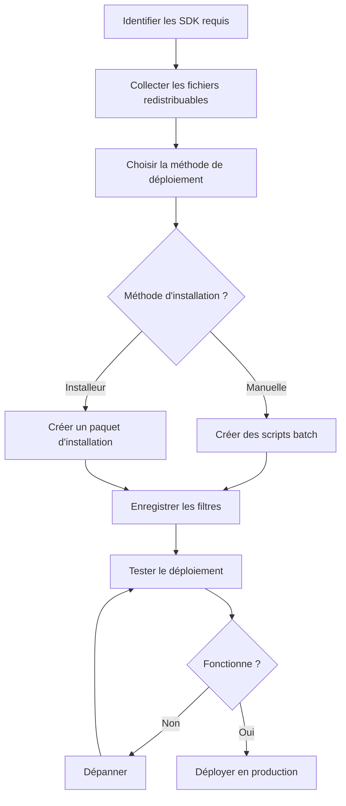

# SDK DirectShow — Guide de déploiement

## Vue d'ensemble

Ce guide complet de déploiement couvre tout ce que vous devez savoir pour déployer les SDK DirectShow VisioForge en environnement de production. De l'enregistrement des filtres à la création d'installeurs professionnels, il vous garantit un déploiement fluide de vos applications.

---

## Ce qui est traité

### Sujets clés du déploiement

#### [Enregistrement des filtres](filter-registration.md)

Apprenez à enregistrer les filtres DirectShow par plusieurs méthodes.

**Sujets** :

- Enregistrement manuel avec regsvr32
- Enregistrement par programmation (C++, C#)
- Scripts batch pour l'automatisation
- Techniques de vérification
- Dépannage des problèmes d'enregistrement
- COM sans enregistrement

**Quand le lire** : essentiel dans tous les scénarios de déploiement

---

#### [Fichiers redistribuables](redistributable-files.md)

Référence complète des fichiers à inclure dans votre déploiement.

**Sujets** :

- Fichiers du FFMPEG Source Filter (~80-100 Mo)
- Fichiers du VLC Source Filter (~150-200 Mo)
- Fichiers du Processing Filters Pack (~20-180 Mo)
- Fichiers du Encoding Filters Pack (~40-300 Mo)
- Fichiers du Virtual Camera SDK (~15-35 Mo)
- Dépendances et structures de répertoires

**Quand le lire** : avant de créer des installeurs ou des paquets de déploiement

---

#### [Intégration avec l'installeur](installer-integration.md)

Créez des installeurs professionnels avec WiX, NSIS, InstallShield et Inno Setup.

**Sujets** :

- WiX Toolset (MSI)
- Scripts NSIS
- Projets InstallShield
- Scripts Inno Setup
- Actions personnalisées pour l'enregistrement
- Installation silencieuse
- Inclusion des prérequis

**Quand le lire** : lors de la création de paquets d'installation automatisés

---

## Démarrage rapide

### Flux de déploiement

Suivez ce flux de travail recommandé pour déployer des filtres DirectShow :



### Démarrage rapide pas à pas

#### Étape 1 : identifier vos SDK

Déterminez les SDK utilisés par votre application :

| SDK | Rôle | Fichier clé |
|-----|---------|----------|
| **FFMPEG Source** | Lecture multimédia, streaming | VisioForge_FFMPEG_Source_x64.ax |
| **VLC Source** | Lecture multipiste | VisioForge_VLC_Source.ax |
| **Processing Filters** | Effets, mixage | VisioForge_Video_Effects_Pro_x64.ax |
| **Encoding Filters** | Encodage vidéo | VisioForge_NVENC_x64.ax |
| **Virtual Camera** | Périphériques virtuels | VisioForge_Virtual_Camera_x64.ax |

[Voir les listes complètes de fichiers →](redistributable-files.md)

---

#### Étape 2 : collecter les fichiers

Créez la structure de dossier de déploiement :

```
YourApp\
├── YourApp.exe
├── YourApp.exe.config
└── Filters\
    ├── VisioForge_FFMPEG_Source_x64.ax
    ├── avcodec-58.dll
    ├── avformat-58.dll
    └── ... (autres dépendances)
```

[Voir les structures de répertoires →](redistributable-files.md#installation-directory-structure)

---

#### Étape 3 : choisir la méthode de déploiement

| Méthode | Cas idéal | Complexité |
|--------|----------|------------|
| **Script batch** | Déploiement interne, tests | Faible |
| **WiX (MSI)** | Entreprise, automatisation IT | Moyenne à élevée |
| **NSIS** | Petits installeurs, interface personnalisée | Moyenne |
| **InstallShield** | Applications commerciales, fonctionnalités avancées | Moyenne |
| **Inno Setup** | Installeurs simples, open source | Faible à moyenne |

[Voir les comparaisons d'installeurs →](#choisir-une-technologie-dinstalleur)

---

#### Étape 4 : enregistrer les filtres

**Option A : enregistrement manuel (développement/tests)**

```batch
@echo off
cd /d "%~dp0Filters"
regsvr32 /s VisioForge_FFMPEG_Source_x64.ax
if %ERRORLEVEL% EQU 0 (
    echo Enregistrement reussi
) else (
    echo Echec de l'enregistrement
)
```

**Option B : action personnalisée d'installeur (production)**

Consultez le [guide d'intégration avec l'installeur](installer-integration.md) pour WiX, NSIS et d'autres exemples.

[Voir toutes les méthodes d'enregistrement →](filter-registration.md)

---

#### Étape 5 : tester le déploiement

**Liste de vérification** :

- [ ] Installer sur une machine de test vierge
- [ ] Vérifier que tous les fichiers sont copiés correctement
- [ ] Vérifier l'enregistrement des filtres dans le registre
- [ ] Tester le filtre avec GraphEdit/GraphStudioNext
- [ ] Exécuter un test de bout en bout de l'application
- [ ] Vérifier que la désinstallation supprime tous les composants
- [ ] Tester sur Windows 10 et Windows 11
- [ ] Tester en x64 et en x86 (si applicable)

[Voir les procédures de test →](#tester-les-deploiements)

---

## Choisir une technologie d'installeur

### WiX Toolset

**Avantages** :

- Format MSI standard de l'industrie
- Excellent pour le déploiement en entreprise
- Prise en charge des stratégies de groupe
- Intégration forte avec Windows Installer
- Communauté et documentation actives

**Inconvénients** :

- Syntaxe XML avec courbe d'apprentissage
- Nécessite une étape de compilation
- Interface utilisateur moins flexible que des installeurs personnalisés

**Recommandé pour** :

- Applications d'entreprise
- Déploiements gérés par l'IT
- Applications nécessitant un déploiement par stratégies de groupe
- Organisations disposant déjà d'une infrastructure MSI

[Voir les exemples WiX →](installer-integration.md#wix-toolset-examples)

---

### NSIS

**Avantages** :

- Taille d'installeur très réduite
- Exécution rapide
- Interface utilisateur très personnalisable
- Langage de script simple
- Pas de dépendances externes

**Inconvénients** :

- Non basé sur MSI (peut ne pas convenir à toutes les entreprises)
- Moins d'intégration avec Windows Installer
- Gestion manuelle des mises à niveau

**Recommandé pour** :

- Applications grand public
- Petits à moyens installeurs
- Applications nécessitant une interface personnalisée
- Création d'applications portables

[Voir les exemples NSIS →](installer-integration.md#nsis-examples)

---

### InstallShield

**Avantages** :

- Concepteur graphique professionnel
- Ensemble complet de fonctionnalités
- Intégration à Visual Studio
- Gestion avancée des prérequis
- Création de suites/bundles

**Inconvénients** :

- Licence commerciale requise (sauf édition Limited)
- Peut être complexe pour des installeurs simples
- Courbe d'apprentissage plus importante

**Recommandé pour** :

- Logiciels commerciaux
- Exigences d'installation complexes
- Apparence d'installeur professionnel
- Organisations disposant d'une expertise InstallShield

[Voir le guide InstallShield →](installer-integration.md#installshield-integration)

---

### Inno Setup

**Avantages** :

- Gratuit et open source
- Script Pascal facile à apprendre
- Bonne documentation
- Prise en charge Unicode
- Développement actif

**Inconvénients** :

- Non basé sur MSI
- Moins de fonctionnalités avancées que les outils commerciaux
- Fonctionnalités d'entreprise limitées

**Recommandé pour** :

- Projets open source
- Installeurs simples
- Petites applications
- Déploiements avec budget restreint

[Voir les exemples Inno Setup →](installer-integration.md#inno-setup-examples)

---

## Scénarios de déploiement courants

### Scénario 1 : application de lecteur multimédia

**Exigences** :

- FFMPEG Source Filter
- Filtres de traitement (effets vidéo)
- Installeur convivial

**Approche recommandée** :

1. Utiliser **NSIS** ou **Inno Setup** pour un installeur grand public
2. Inclure une vérification du redistribuable Visual C++
3. Enregistrer les filtres pendant l'installation
4. Créer un raccourci bureau
5. Associer les types de fichiers multimédias (optionnel)

**Fichiers à déployer** (~100-150 Mo) :

- VisioForge_FFMPEG_Source_x64.ax + DLL FFmpeg
- VisioForge_Video_Effects_Pro_x64.ax + dépendances

[Voir la liste complète de fichiers →](redistributable-files.md#ffmpeg-source-filter)

---

### Scénario 2 : traitement vidéo en entreprise

**Exigences** :

- FFMPEG Source + filtres d'encodage
- Prise en charge de l'installation silencieuse
- Déploiement basé sur MSI
- Déploiement par stratégies de groupe

**Approche recommandée** :

1. Utiliser **WiX Toolset** pour la création MSI
2. Inclure le redistribuable Visual C++
3. Prendre en charge les paramètres d'installation silencieuse
4. Mettre en place une journalisation correcte
5. Créer une documentation de déploiement

**Exemple** :

```bash
msiexec /i EnterpriseVideoApp.msi /quiet /norestart /l*v install.log
```

[Voir les exemples de bundle WiX →](installer-integration.md#advanced-wix-self-extracting-bundle)

---

### Scénario 3 : solution de caméra virtuelle

**Exigences** :

- Virtual Camera SDK
- Installation de pilote
- Accès au niveau système

**Approche recommandée** :

1. Utiliser **WiX** ou **InstallShield** pour la prise en charge des pilotes
2. Exiger des privilèges administrateur
3. Installer les pilotes de caméra virtuelle
4. Enregistrer les filtres DirectShow
5. Fournir des instructions d'installation claires

**Considérations particulières** :

- Les pilotes nécessitent des signatures numériques
- Un redémarrage du système peut être nécessaire
- Avertissements de sécurité renforcés

[Voir les fichiers de la caméra virtuelle →](redistributable-files.md#virtual-camera-sdk)

---

### Scénario 4 : redistribution d'un SDK de développement

**Exigences** :

- Inclure les filtres avec votre SDK
- Prendre en charge x86 et x64
- Intégration flexible

**Approche recommandée** :

1. Fournir des paquets x86/x64 distincts
2. Inclure des scripts batch d'enregistrement
3. Fournir une documentation pour les développeurs
4. Envisager la distribution via paquet NuGet
5. Inclure les fichiers d'en-tête et bibliothèques de types

**Structure du paquet** :

```
YourSDK\
├── bin\
│   ├── x86\
│   │   └── Filters\
│   └── x64\
│       └── Filters\
├── docs\
├── samples\
└── tools\
    └── register_filters.bat
```

---

## Prérequis et dépendances

### Redistribuable Visual C++

**Version requise** : Visual C++ 2015-2022 Redistributable

**Liens de téléchargement** :

- x64 : <https://aka.ms/vs/17/release/vc_redist.x64.exe>
- x86 : <https://aka.ms/vs/17/release/vc_redist.x86.exe>

**Clés de registre de détection** :

```
x64: HKLM\SOFTWARE\Microsoft\VisualStudio\14.0\VC\Runtimes\x64
x86: HKLM\SOFTWARE\Microsoft\VisualStudio\14.0\VC\Runtimes\x86
Value: "Installed" = 1 (DWORD)
```

**Intégration avec l'installeur** :

Consultez [Inclure les dépendances](installer-integration.md#bundling-dependencies) pour WiX, NSIS et d'autres exemples.

---

### Exigences .NET

Si votre application utilise .NET :

- **.NET Framework 4.8** — pour les applications .NET Framework
- **.NET 8.0 Runtime** — pour les applications .NET modernes

**Détection** :

- .NET Framework : vérifier la clé de registre `HKLM\SOFTWARE\Microsoft\NET Framework Setup\NDP\v4\Full`
- .NET 8.0 : vérifier via `dotnet --list-runtimes`

---

### Exigences matérielles (optionnelles)

Pour les fonctions d'accélération matérielle :

| Fonctionnalité | Exigence |
|---------|-------------|
| **Encodage NVENC** | GPU NVIDIA (GTX 600+) |
| **QuickSync** | CPU Intel avec graphique intégré |
| **Décodage DXVA** | GPU compatible DirectX 11 |

Documentez les exigences matérielles dans votre installeur ou votre documentation.

---

## Tester les déploiements

### Mise en place d'un environnement de test

Créez des environnements de test isolés :

1. **VM Windows 10 vierge** — tester sur installation neuve
2. **VM Windows 11 vierge** — tester sur le dernier OS
3. **Installation minimale** — sans Visual Studio ni outils de développement
4. **Différents comptes utilisateur** — tester utilisateur standard vs admin

### Liste de vérification des tests

#### Tests d'installation

- [ ] L'installeur s'exécute sans erreur
- [ ] Tous les fichiers sont copiés aux bons emplacements
- [ ] Les filtres sont enregistrés avec succès
- [ ] Les raccourcis du menu Démarrer sont créés
- [ ] Les entrées de registre sont créées
- [ ] Les prérequis sont détectés/installés
- [ ] L'utilisateur peut lancer l'application
- [ ] L'application fonctionne correctement

#### Tests de désinstallation

- [ ] Le désinstalleur s'exécute sans erreur
- [ ] Tous les fichiers sont supprimés
- [ ] Les filtres sont désenregistrés
- [ ] Les entrées de registre sont nettoyées
- [ ] Les raccourcis du menu Démarrer sont supprimés
- [ ] Aucun fichier orphelin ne reste

#### Tests de mise à niveau

- [ ] La mise à niveau depuis la version précédente fonctionne
- [ ] Les données utilisateur sont préservées
- [ ] Les paramètres sont conservés
- [ ] Les anciens filtres sont remplacés par les nouvelles versions

#### Tests d'installation silencieuse

```batch
REM Installer silencieusement
MyAppSetup.exe /S

REM Verifier l'installation
reg query "HKLM\SOFTWARE\MyApp" /v InstallDir

REM Desinstaller silencieusement
"%ProgramFiles%\MyApp\Uninstall.exe" /S
```

### Script de test automatisé

```powershell
# Script PowerShell de test de deploiement
param(
    [string]$InstallerPath,
    [string]$FilterCLSID
)

Write-Host "Test de l'installation..." -ForegroundColor Cyan

# Installer
Start-Process $InstallerPath -ArgumentList "/S" -Wait

# Verifier l'enregistrement du filtre
$regPath = "HKLM:\SOFTWARE\Classes\CLSID\$FilterCLSID"
if (Test-Path $regPath) {
    Write-Host "✓ Filtre enregistre" -ForegroundColor Green
} else {
    Write-Host "✗ Filtre NON enregistre" -ForegroundColor Red
    Exit 1
}

# Tester avec GraphEdit
$graphEdit = "C:\Program Files (x86)\Windows Kits\10\bin\*\x64\graphedt.exe"
if (Test-Path $graphEdit) {
    Write-Host "✓ Test avec GraphEdit..." -ForegroundColor Cyan
    # Ajouter l'automatisation GraphEdit ici
}

# Desinstaller
$uninstaller = Get-ChildItem "C:\Program Files\MyApp\Uninstall.exe" -ErrorAction SilentlyContinue
if ($uninstaller) {
    Start-Process $uninstaller.FullName -ArgumentList "/S" -Wait
    Write-Host "✓ Desinstallation terminee" -ForegroundColor Green
}

# Verifier le nettoyage
if (Test-Path $regPath) {
    Write-Host "✗ Filtre toujours enregistre apres desinstallation" -ForegroundColor Red
    Exit 1
} else {
    Write-Host "✓ Filtre desenregistre avec succes" -ForegroundColor Green
}

Write-Host "Tous les tests sont passes !" -ForegroundColor Green
```

---

## Considérations d'architecture

### Déploiement x86 vs x64

**Applications x64** :

- Utiliser uniquement des filtres x64
- Installer dans `C:\Program Files\YourApp`
- Enregistrer dans la vue 64 bits du registre

**Applications x86** :

- Utiliser uniquement des filtres x86
- Installer dans `C:\Program Files (x86)\YourApp`
- Enregistrer dans la vue 32 bits du registre (regsvr32 le gère automatiquement)

**Applications mixtes** :

- Inclure les filtres x86 et x64
- Sous-répertoires distincts : `Filters\x86` et `Filters\x64`
- Enregistrement conditionnel selon l'architecture du processus

### Considérations relatives au registre

**Vues du registre Windows 64 bits** :

```
HKLM\SOFTWARE\Classes\CLSID\{GUID}           ← vue 64 bits
HKLM\SOFTWARE\Wow6432Node\Classes\CLSID\{GUID} ← vue 32 bits
```

**Important** : regsvr32 utilise automatiquement la bonne vue du registre :

- `C:\Windows\System32\regsvr32.exe` → registre 64 bits
- `C:\Windows\SysWOW64\regsvr32.exe` → registre 32 bits

---

## Considérations de sécurité

### Signature de code

**Recommandé** : signez tous les exécutables et installeurs avec un certificat Authenticode.

```batch
REM Signer l'installeur avec un certificat
signtool sign /f MyCert.pfx /p password /t https://timestamp.digicert.com MyAppSetup.exe
```

**Avantages** :

- Supprime les avertissements SmartScreen
- Établit la confiance avec les utilisateurs
- Obligatoire pour les pilotes en mode noyau (caméra virtuelle)

### Exigences de permissions

**L'enregistrement de filtre requiert** :

- Privilèges administrateur
- Accès en écriture au registre HKLM
- Accès en écriture à System32 (si enregistrement à cet emplacement)

**Bonnes pratiques** :

- Toujours demander l'élévation dans le manifeste d'installeur
- Vérifier les privilèges avant l'enregistrement
- Fournir des messages d'erreur clairs pour les problèmes de permission

```xml
<!-- Manifeste d'installeur exigeant l'elevation -->
<requestedExecutionLevel level="requireAdministrator" />
```

---

## Dépannage des problèmes courants

### Problème : l'enregistrement du filtre échoue

**Symptômes** : regsvr32 retourne une erreur, le filtre n'est pas dans le registre

**Causes possibles** :

1. Dépendances manquantes (Visual C++ Runtime, DLL)
2. Privilèges insuffisants
3. Fichier de filtre corrompu
4. Incompatibilité d'architecture

**Solutions** :

1. Utiliser Dependency Walker pour vérifier les dépendances
2. Exécuter l'installeur en tant qu'administrateur
3. Vérifier l'intégrité du fichier (sommes de contrôle)
4. S'assurer qu'une appli x86 utilise un filtre x86 et qu'une appli x64 utilise un filtre x64

[Voir le dépannage complet →](filter-registration.md#troubleshooting)

---

### Problème : l'application ne trouve pas le filtre

**Symptômes** : l'application ne parvient pas à créer le graphe de filtres, CLSID introuvable

**Causes possibles** :

1. Filtre non enregistré
2. Mauvais CLSID utilisé
3. Application 32 bits cherchant un filtre 64 bits

**Solutions** :

```cpp
// Verifier l'enregistrement du filtre par programmation
HRESULT hr = CoCreateInstance(CLSID_FFMPEGSource, NULL, CLSCTX_INPROC_SERVER,
                               IID_IBaseFilter, (void**)&pFilter);
if (hr == REGDB_E_CLASSNOTREG) {
    // Filtre non enregistre - inviter l'utilisateur
}
```

---

### Problème : l'installation silencieuse se bloque

**Symptômes** : l'installeur ne répond plus pendant l'installation silencieuse

**Causes possibles** :

1. Attente d'une saisie utilisateur
2. Redémarrage requis
3. Installation d'un prérequis avec invite

**Solutions** :

```bash
# Ajouter le parametre /norestart
msiexec /i MyApp.msi /quiet /norestart

# NSIS : verifier le mode silencieux dans le script
${IfSilent}
  # Ignorer les interactions UI
${EndIf}
```

---

### Problème : la désinstallation laisse des fichiers

**Symptômes** : le répertoire de l'application existe encore après désinstallation

**Causes possibles** :

1. Fichiers créés après l'installation non suivis
2. Descripteurs de fichiers ouverts empêchant la suppression
3. L'action personnalisée de désinstallation ne s'exécute pas

**Solutions** :

- Utiliser la table RemoveFile de Windows Installer pour les fichiers dynamiques
- Implémenter le nettoyage de fichiers dans une action personnalisée de désinstallation
- S'assurer que l'application n'est pas en cours d'exécution lors de la désinstallation

---

## Résumé des bonnes pratiques

### À FAIRE

✅ **Toujours** exiger les privilèges administrateur pour l'installation
✅ **Toujours** inclure ou vérifier la présence du redistribuable Visual C++
✅ **Toujours** tester sur des machines vierges avant publication
✅ **Toujours** mettre en place une désinstallation correcte
✅ **Toujours** journaliser les étapes d'installation pour le dépannage
✅ **Toujours** vérifier l'enregistrement du filtre après installation
✅ **À faire** prendre en charge l'installation silencieuse pour les déploiements en entreprise
✅ **À faire** signer les installeurs avec un certificat Authenticode
✅ **À faire** fournir des messages d'erreur clairs
✅ **À faire** documenter les exigences système

### À NE PAS FAIRE

❌ **Jamais** enregistrer les filtres dans le répertoire System32
❌ **Jamais** écraser des fichiers plus récents par des versions plus anciennes
❌ **Jamais** faire échouer l'installation si l'enregistrement échoue (avertir à la place)
❌ **Jamais** laisser des entrées de registre après désinstallation
❌ **Jamais** demander à l'utilisateur d'enregistrer manuellement les filtres
❌ **Ne pas** ignorer les vérifications de prérequis
❌ **Ne pas** utiliser de chemins codés en dur
❌ **Ne pas** oublier de tester les scénarios de mise à niveau
❌ **Ne pas** ignorer les valeurs de retour HRESULT
❌ **Ne pas** déployer des builds de débogage en production

---

## Liste de vérification du déploiement

Utilisez cette liste avant de publier votre installeur :

### Avant publication

- [ ] Tous les fichiers redistribuables identifiés
- [ ] Architecture (x86/x64) correcte sélectionnée
- [ ] Dépendances documentées
- [ ] Installeur créé et testé
- [ ] Installation silencieuse testée
- [ ] Désinstallation testée intégralement
- [ ] Signature de code effectuée
- [ ] Guide d'installation rédigé
- [ ] Exigences système documentées

### Tests

- [ ] Testé sur Windows 10 (21H2 ou ultérieur)
- [ ] Testé sur Windows 11
- [ ] Testé sur VM vierge sans outils de développement
- [ ] Testé avec compte utilisateur standard
- [ ] Mise à niveau testée depuis la version précédente
- [ ] Nettoyage par désinstallation testé
- [ ] Installation silencieuse testée
- [ ] Enregistrement du filtre vérifié
- [ ] Fonctionnement de l'application testé

### Documentation

- [ ] Instructions d'installation rédigées
- [ ] Instructions de désinstallation fournies
- [ ] Section de dépannage incluse
- [ ] Exigences système listées
- [ ] Coordonnées de support fournies

---

## Ressources complémentaires

### Documentation

- [Guide d'enregistrement des filtres](filter-registration.md) — référence complète d'enregistrement
- [Fichiers redistribuables](redistributable-files.md) — tous les fichiers des SDK listés
- [Intégration avec l'installeur](installer-integration.md) — exemples WiX, NSIS, InstallShield

### Ressources externes

- [Enregistrement DirectShow (Microsoft)](https://learn.microsoft.com/en-us/windows/win32/directshow/how-to-register-directshow-filters)
- [Bonnes pratiques Windows Installer](https://learn.microsoft.com/en-us/windows/win32/msi/windows-installer-best-practices)
- [WiX Toolset](https://www.firegiant.com/wixtoolset/)
- [NSIS](https://nsis.sourceforge.io/Main_Page)
- [Inno Setup](https://jrsoftware.org/isinfo.php)

### Outils

- **GraphEdit** — test de filtres (Windows SDK)
- **GraphStudioNext** — test avancé de filtres
- **Dependency Walker** — analyse des dépendances DLL
- **Process Monitor** — dépannage d'installation
- **Éditeur de registre** — vérification d'enregistrement

---

## Support

Pour l'assistance au déploiement :

1. Consultez la section [Dépannage](#depannage-des-problemes-courants)
2. Consultez [Enregistrement des filtres](filter-registration.md#troubleshooting)
3. Contactez le support VisioForge : <support@visioforge.com>
4. Visitez : <https://www.visioforge.com/>
