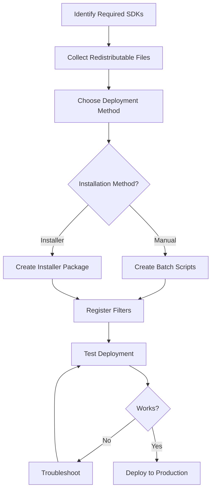

# DirectShow SDKs - Deployment Guide

## Overview

This comprehensive deployment guide covers everything you need to know about deploying VisioForge DirectShow SDKs in production environments. From filter registration to creating professional installers, this guide ensures your applications deploy smoothly.

---

## What's Covered

### Core Deployment Topics

#### [Filter Registration](filter-registration.md)

Learn how to register DirectShow filters using multiple methods.

**Topics**:

- Manual registration with regsvr32
- Programmatic registration (C++, C#)
- Batch scripts for automation
- Verification techniques
- Troubleshooting registration issues
- Registration-free COM

**When to Read**: Essential for all deployment scenarios

---

#### [Redistributable Files](redistributable-files.md)

Complete reference of files to include in your deployment.

**Topics**:

- FFMPEG Source Filter files (~80-100MB)
- VLC Source Filter files (~150-200MB)
- Processing Filters Pack files (~20-180MB)
- Encoding Filters Pack files (~40-300MB)
- Virtual Camera SDK files (~15-35MB)
- Dependencies and directory structures

**When to Read**: Before creating installers or deployment packages

---

#### [Installer Integration](installer-integration.md)

Create professional installers with WiX, NSIS, InstallShield, and Inno Setup.

**Topics**:

- WiX Toolset (MSI)
- NSIS scripts
- InstallShield projects
- Inno Setup scripts
- Custom actions for registration
- Silent installation
- Prerequisite bundling

**When to Read**: When creating automated installation packages

---

## Quick Start

### Deployment Workflow

Follow this recommended workflow for deploying DirectShow filters:



### Step-by-Step Quick Start

#### Step 1: Identify Your SDKs

Determine which SDKs your application uses:

| SDK | Purpose | Key File |
|-----|---------|----------|
| **FFMPEG Source** | Media playback, streaming | VisioForge_FFMPEG_Source_x64.ax |
| **VLC Source** | Multi-track playback | VisioForge_VLC_Source.ax |
| **Processing Filters** | Effects, mixing | VisioForge_VideoEffects_x64.ax |
| **Encoding Filters** | Video encoding | VisioForge_NVENC_Encoder_x64.ax |
| **Virtual Camera** | Virtual devices | VisioForge_VirtualCamera_x64.ax |

[View Complete File Lists →](redistributable-files.md)

---

#### Step 2: Collect Files

Create deployment folder structure:

```
YourApp\
├── YourApp.exe
├── YourApp.exe.config
└── Filters\
    ├── VisioForge_FFMPEG_Source_x64.ax
    ├── avcodec-58.dll
    ├── avformat-58.dll
    └── ... (other dependencies)
```

[View Directory Structures →](redistributable-files.md#installation-directory-structure)

---

#### Step 3: Choose Deployment Method

| Method | Best For | Complexity |
|--------|----------|------------|
| **Batch Script** | Internal deployment, testing | Low |
| **WiX (MSI)** | Enterprise, IT automation | Medium-High |
| **NSIS** | Small installers, custom UI | Medium |
| **InstallShield** | Commercial apps, advanced features | Medium |
| **Inno Setup** | Simple installers, open-source | Low-Medium |

[View Installer Comparisons →](#choosing-an-installer-technology)

---

#### Step 4: Register Filters

**Option A: Manual Registration (Development/Testing)**

```batch
@echo off
cd /d "%~dp0Filters"
regsvr32 /s VisioForge_FFMPEG_Source_x64.ax
if %ERRORLEVEL% EQU 0 (
    echo Registration successful
) else (
    echo Registration failed
)
```

**Option B: Installer Custom Action (Production)**

See [Installer Integration Guide](installer-integration.md) for WiX, NSIS, and other examples.

[View All Registration Methods →](filter-registration.md)

---

#### Step 5: Test Deployment

**Verification Checklist**:

- [ ] Install on clean test machine
- [ ] Verify all files copied correctly
- [ ] Check filter registration in registry
- [ ] Test filter with GraphEdit/GraphStudioNext
- [ ] Run application end-to-end test
- [ ] Verify uninstall removes all components
- [ ] Test on Windows 10 and Windows 11
- [ ] Test both x64 and x86 (if applicable)

[View Testing Procedures →](#testing-deployments)

---

## Choosing an Installer Technology

### WiX Toolset

**Pros**:

- Industry-standard MSI format
- Excellent for enterprise deployment
- Group Policy support
- Strong Windows Installer integration
- Active community and documentation

**Cons**:

- XML-based syntax has learning curve
- Requires compilation step
- Less flexible UI than custom installers

**Recommended For**:

- Enterprise applications
- IT-managed deployments
- Applications requiring Group Policy deployment
- Organizations with existing MSI infrastructure

[View WiX Examples →](installer-integration.md#wix-toolset-examples)

---

### NSIS

**Pros**:

- Very small installer size
- Fast execution
- Highly customizable UI
- Simple scripting language
- No external dependencies

**Cons**:

- Not MSI-based (may not suit all enterprises)
- Less Windows Installer integration
- Manual upgrade management

**Recommended For**:

- Consumer applications
- Small to medium installers
- Applications requiring custom UI
- Portable application creation

[View NSIS Examples →](installer-integration.md#nsis-examples)

---

### InstallShield

**Pros**:

- Professional GUI designer
- Comprehensive feature set
- Visual Studio integration
- Advanced prerequisite handling
- Suite/bundle creation

**Cons**:

- Commercial license required (except Limited Edition)
- Can be complex for simple installers
- Larger learning curve

**Recommended For**:

- Commercial software products
- Complex installation requirements
- Professional installer appearance
- Organizations with InstallShield expertise

[View InstallShield Guide →](installer-integration.md#installshield-integration)

---

### Inno Setup

**Pros**:

- Free and open-source
- Easy to learn Pascal scripting
- Good documentation
- Unicode support
- Active development

**Cons**:

- Not MSI-based
- Fewer advanced features than commercial tools
- Limited enterprise features

**Recommended For**:

- Open-source projects
- Simple installers
- Small applications
- Budget-conscious deployments

[View Inno Setup Examples →](installer-integration.md#inno-setup-examples)

---

## Common Deployment Scenarios

### Scenario 1: Media Player Application

**Requirements**:

- FFMPEG Source Filter
- Processing Filters (video effects)
- User-friendly installer

**Recommended Approach**:

1. Use **NSIS** or **Inno Setup** for consumer-friendly installer
2. Include Visual C++ Redistributable check
3. Register filters during installation
4. Create desktop shortcut
5. Associate media file types (optional)

**Files to Deploy** (~100-150MB):

- VisioForge_FFMPEG_Source_x64.ax + FFmpeg DLLs
- VisioForge_VideoEffects_x64.ax + dependencies

[View Complete File List →](redistributable-files.md#ffmpeg-source-filter)

---

### Scenario 2: Enterprise Video Processing

**Requirements**:

- FFMPEG Source + Encoding Filters
- Silent installation support
- MSI-based deployment
- Group Policy deployment

**Recommended Approach**:

1. Use **WiX Toolset** for MSI creation
2. Bundle Visual C++ Redistributable
3. Support silent installation parameters
4. Implement proper logging
5. Create deployment documentation

**Example**:

```bash
msiexec /i EnterpriseVideoApp.msi /quiet /norestart /l*v install.log
```

[View WiX Bundle Examples →](installer-integration.md#advanced-wix-self-extracting-bundle)

---

### Scenario 3: Virtual Camera Solution

**Requirements**:

- Virtual Camera SDK
- Driver installation
- System-level access

**Recommended Approach**:

1. Use **WiX** or **InstallShield** for driver support
2. Require administrator privileges
3. Install virtual camera drivers
4. Register DirectShow filters
5. Provide clear installation instructions

**Special Considerations**:

- Drivers require digital signatures
- May need system restart
- Enhanced security warnings

[View Virtual Camera Files →](redistributable-files.md#virtual-camera-sdk)

---

### Scenario 4: Development SDK Redistribution

**Requirements**:

- Include filters with your SDK
- Support both x86 and x64
- Flexible integration

**Recommended Approach**:

1. Provide separate x86/x64 packages
2. Include registration batch scripts
3. Provide documentation for developers
4. Consider NuGet package distribution
5. Include header files and type libraries

**Package Structure**:

```
YourSDK\
├── bin\
│   ├── x86\
│   │   └── Filters\
│   └── x64\
│       └── Filters\
├── docs\
├── samples\
└── tools\
    └── register_filters.bat
```

---

## Prerequisites and Dependencies

### Visual C++ Redistributable

**Required Version**: Visual C++ 2015-2022 Redistributable

**Download Links**:

- x64: <https://aka.ms/vs/17/release/vc_redist.x64.exe>
- x86: <https://aka.ms/vs/17/release/vc_redist.x86.exe>

**Detection Registry Keys**:

```
x64: HKLM\SOFTWARE\Microsoft\VisualStudio\14.0\VC\Runtimes\x64
x86: HKLM\SOFTWARE\Microsoft\VisualStudio\14.0\VC\Runtimes\x86
Value: "Installed" = 1 (DWORD)
```

**Installer Integration**:

See [Bundling Dependencies](installer-integration.md#bundling-dependencies) for WiX, NSIS, and other examples.

---

### .NET Requirements

If your application uses .NET:

- **.NET Framework 4.8** - For .NET Framework applications
- **.NET 8.0 Runtime** - For modern .NET applications

**Detection**:

- .NET Framework: Check registry `HKLM\SOFTWARE\Microsoft\NET Framework Setup\NDP\v4\Full`
- .NET 8.0: Check for `dotnet --list-runtimes`

---

### Hardware Requirements (Optional)

For hardware acceleration features:

| Feature | Requirement |
|---------|-------------|
| **NVENC Encoding** | NVIDIA GPU (GTX 600+) |
| **QuickSync** | Intel CPU with integrated graphics |
| **DXVA Decoding** | DirectX 11 compatible GPU |

Document hardware requirements in your installer or documentation.

---

## Testing Deployments

### Test Environment Setup

Create isolated test environments:

1. **Clean Windows 10 VM** - Test on fresh installation
2. **Clean Windows 11 VM** - Test latest OS
3. **Minimal Installation** - No Visual Studio or dev tools
4. **Different User Accounts** - Test standard user vs. admin

### Testing Checklist

#### Installation Testing

- [ ] Installer runs without errors
- [ ] All files copied to correct locations
- [ ] Filters registered successfully
- [ ] Start menu shortcuts created
- [ ] Registry entries created
- [ ] Prerequisites detected/installed
- [ ] User can launch application
- [ ] Application functions correctly

#### Uninstallation Testing

- [ ] Uninstaller runs without errors
- [ ] All files removed
- [ ] Filters unregistered
- [ ] Registry entries cleaned
- [ ] Start menu shortcuts removed
- [ ] No orphaned files remain

#### Upgrade Testing

- [ ] Upgrade from previous version works
- [ ] User data preserved
- [ ] Settings maintained
- [ ] Old filters replaced with new versions

#### Silent Installation Testing

```batch
REM Install silently
MyAppSetup.exe /S

REM Verify installation
reg query "HKLM\SOFTWARE\MyApp" /v InstallDir

REM Uninstall silently
"%ProgramFiles%\MyApp\Uninstall.exe" /S
```

### Automated Testing Script

```powershell
# PowerShell deployment test script
param(
    [string]$InstallerPath,
    [string]$FilterCLSID
)

Write-Host "Testing installation..." -ForegroundColor Cyan

# Install
Start-Process $InstallerPath -ArgumentList "/S" -Wait

# Verify filter registration
$regPath = "HKLM:\SOFTWARE\Classes\CLSID\$FilterCLSID"
if (Test-Path $regPath) {
    Write-Host "✓ Filter registered" -ForegroundColor Green
} else {
    Write-Host "✗ Filter NOT registered" -ForegroundColor Red
    Exit 1
}

# Test with GraphEdit
$graphEdit = "C:\Program Files (x86)\Windows Kits\10\bin\*\x64\graphedt.exe"
if (Test-Path $graphEdit) {
    Write-Host "✓ Testing with GraphEdit..." -ForegroundColor Cyan
    # Add GraphEdit automation here
}

# Uninstall
$uninstaller = Get-ChildItem "C:\Program Files\MyApp\Uninstall.exe" -ErrorAction SilentlyContinue
if ($uninstaller) {
    Start-Process $uninstaller.FullName -ArgumentList "/S" -Wait
    Write-Host "✓ Uninstall completed" -ForegroundColor Green
}

# Verify cleanup
if (Test-Path $regPath) {
    Write-Host "✗ Filter still registered after uninstall" -ForegroundColor Red
    Exit 1
} else {
    Write-Host "✓ Filter unregistered successfully" -ForegroundColor Green
}

Write-Host "All tests passed!" -ForegroundColor Green
```

---

## Architecture Considerations

### x86 vs x64 Deployment

**x64 Applications**:

- Use x64 filters only
- Install to `C:\Program Files\YourApp`
- Register in 64-bit registry view

**x86 Applications**:

- Use x86 filters only
- Install to `C:\Program Files (x86)\YourApp`
- Register in 32-bit registry view (regsvr32 handles automatically)

**Mixed Applications**:

- Include both x86 and x64 filters
- Separate subdirectories: `Filters\x86` and `Filters\x64`
- Conditional registration based on process architecture

### Registry Considerations

**64-bit Windows Registry Views**:

```
HKLM\SOFTWARE\Classes\CLSID\{GUID}           ← 64-bit view
HKLM\SOFTWARE\Wow6432Node\Classes\CLSID\{GUID} ← 32-bit view
```

**Important**: regsvr32 automatically uses correct registry view:

- `C:\Windows\System32\regsvr32.exe` → 64-bit registry
- `C:\Windows\SysWOW64\regsvr32.exe` → 32-bit registry

---

## Security Considerations

### Code Signing

**Recommended**: Sign all executables and installers with Authenticode certificate.

```batch
REM Sign installer with certificate
signtool sign /f MyCert.pfx /p password /t https://timestamp.digicert.com MyAppSetup.exe
```

**Benefits**:

- Removes SmartScreen warnings
- Establishes trust with users
- Required for kernel-mode drivers (Virtual Camera)

### Permission Requirements

**Filter Registration Requires**:

- Administrator privileges
- Write access to HKLM registry
- Write access to System32 (if registering there)

**Best Practices**:

- Always request elevation in installer manifest
- Check privileges before registration
- Provide clear error messages for permission issues

```xml
<!-- Installer manifest requiring elevation -->
<requestedExecutionLevel level="requireAdministrator" />
```

---

## Troubleshooting Common Issues

### Issue: Filter Registration Fails

**Symptoms**: regsvr32 returns error, filter not in registry

**Possible Causes**:

1. Missing dependencies (Visual C++ Runtime, DLLs)
2. Insufficient privileges
3. Corrupted filter file
4. Architecture mismatch

**Solutions**:

1. Use Dependency Walker to check dependencies
2. Run installer as administrator
3. Verify file integrity (checksums)
4. Ensure x86 app uses x86 filter, x64 uses x64 filter

[View Complete Troubleshooting →](filter-registration.md#troubleshooting)

---

### Issue: Application Can't Find Filter

**Symptoms**: Application fails to create filter graph, CLSID not found

**Possible Causes**:

1. Filter not registered
2. Wrong CLSID used
3. 32-bit app looking for 64-bit filter

**Solutions**:

```cpp
// Verify filter registration programmatically
HRESULT hr = CoCreateInstance(CLSID_FFMPEGSource, NULL, CLSCTX_INPROC_SERVER,
                               IID_IBaseFilter, (void**)&pFilter);
if (hr == REGDB_E_CLASSNOTREG) {
    // Filter not registered - prompt user
}
```

---

### Issue: Silent Installation Hangs

**Symptoms**: Installer stops responding during silent install

**Possible Causes**:

1. Waiting for user input
2. Reboot required
3. Prerequisite installation prompting

**Solutions**:

```bash
# Add /norestart parameter
msiexec /i MyApp.msi /quiet /norestart

# NSIS: Check silent mode in script
${IfSilent}
  # Skip UI interactions
${EndIf}
```

---

### Issue: Uninstall Leaves Files

**Symptoms**: Application directory still exists after uninstall

**Possible Causes**:

1. Files created after installation not tracked
2. Open file handles preventing deletion
3. Uninstall custom action not running

**Solutions**:

- Use Windows Installer RemoveFile table for dynamic files
- Implement file cleanup in uninstall custom action
- Ensure application not running during uninstall

---

## Best Practices Summary

### DO

✅ **Always** require administrator privileges for installation
✅ **Always** bundle or check for Visual C++ Redistributable
✅ **Always** test on clean machines before release
✅ **Always** implement proper uninstall
✅ **Always** log installation steps for troubleshooting
✅ **Always** verify filter registration after install
✅ **Do** support silent installation for enterprise deployments
✅ **Do** sign installers with Authenticode certificate
✅ **Do** provide clear error messages
✅ **Do** document system requirements

### DON'T

❌ **Never** register filters to System32 directory
❌ **Never** overwrite newer files with older versions
❌ **Never** fail installation if registration fails (warn instead)
❌ **Never** leave registry entries after uninstall
❌ **Never** require user to manually register filters
❌ **Don't** skip prerequisite checks
❌ **Don't** use hardcoded paths
❌ **Don't** forget to test upgrade scenarios
❌ **Don't** ignore HRESULT return values
❌ **Don't** deploy debug builds to production

---

## Deployment Checklist

Use this checklist before releasing your installer:

### Pre-Release

- [ ] All redistributable files identified
- [ ] Correct architecture (x86/x64) selected
- [ ] Dependencies documented
- [ ] Installer created and tested
- [ ] Silent installation tested
- [ ] Uninstall tested completely
- [ ] Code signing completed
- [ ] Installation guide written
- [ ] System requirements documented

### Testing

- [ ] Tested on Windows 10 (21H2 or later)
- [ ] Tested on Windows 11
- [ ] Tested on clean VM without dev tools
- [ ] Tested with standard user account
- [ ] Tested upgrade from previous version
- [ ] Tested uninstall cleanup
- [ ] Tested silent installation
- [ ] Verified filter registration
- [ ] Tested application functionality

### Documentation

- [ ] Installation instructions written
- [ ] Uninstallation instructions provided
- [ ] Troubleshooting section included
- [ ] System requirements listed
- [ ] Support contact information provided

---

## Additional Resources

### Documentation

- [Filter Registration Guide](filter-registration.md) - Complete registration reference
- [Redistributable Files](redistributable-files.md) - All SDK files listed
- [Installer Integration](installer-integration.md) - WiX, NSIS, InstallShield examples

### External Resources

- [DirectShow Registration (Microsoft)](https://learn.microsoft.com/en-us/windows/win32/directshow/how-to-register-directshow-filters)
- [Windows Installer Best Practices](https://learn.microsoft.com/en-us/windows/win32/msi/windows-installer-best-practices)
- [WiX Toolset](https://www.firegiant.com/wixtoolset/)
- [NSIS](https://nsis.sourceforge.io/Main_Page)
- [Inno Setup](https://jrsoftware.org/isinfo.php)

### Tools

- **GraphEdit** - Filter testing (Windows SDK)
- **GraphStudioNext** - Advanced filter testing
- **Dependency Walker** - DLL dependency analysis
- **Process Monitor** - Installation troubleshooting
- **Registry Editor** - Registration verification

---

## Support

For deployment assistance:

1. Check [Troubleshooting](#troubleshooting-common-issues) section
2. Review [Filter Registration](filter-registration.md#troubleshooting)
3. Contact VisioForge support: <support@visioforge.com>
4. Visit: <https://www.visioforge.com/>
