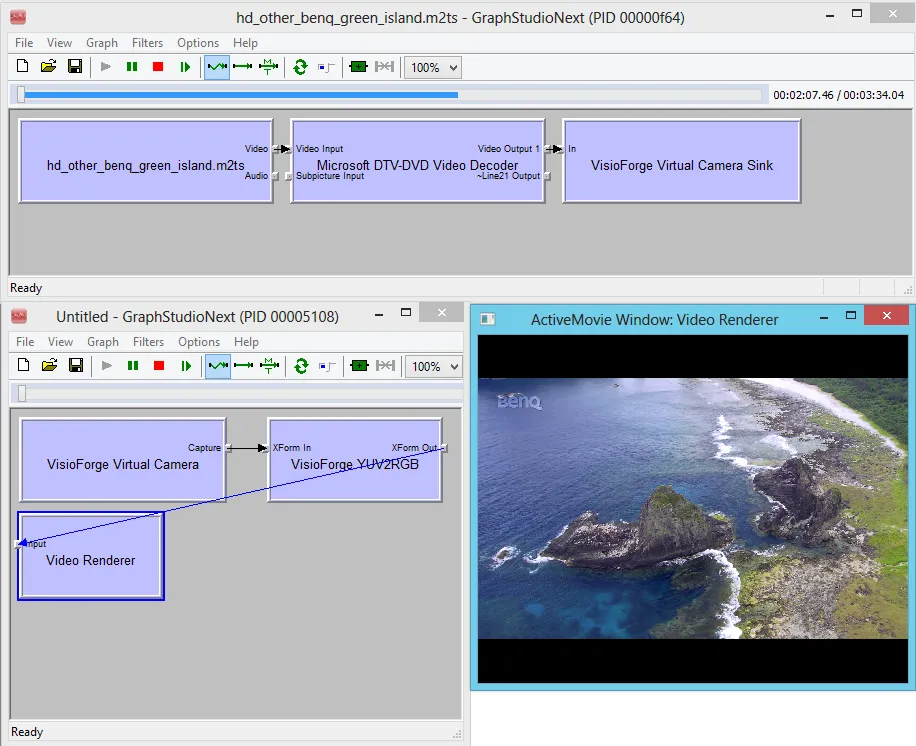

# Virtual Camera SDK DirectShow

## Vue d'ensemble

Notre SDK robuste de caméra virtuelle basé sur DirectShow permet aux développeurs d'implémenter de puissantes fonctionnalités de caméra virtuelle dans leurs applications. Le SDK fournit des filtres de type sink (puits) pouvant être utilisés en sortie dans les environnements Video Capture SDK ou Video Edit SDK, tandis que les filtres source peuvent être utilisés comme sources vidéo pour diverses applications de capture.

Grâce à cette boîte à outils polyvalente, vous pouvez diffuser du contenu vidéo depuis pratiquement n'importe quelle source directement vers une caméra virtuelle. Ces périphériques virtuels sont entièrement compatibles avec les plateformes de communication populaires telles que `Skype`, `Zoom`, `Microsoft Teams`, les navigateurs web et de nombreuses autres applications qui prennent en charge les caméras virtuelles DirectShow. Le SDK inclut également des capacités complètes de diffusion audio pour des solutions multimédia complètes.

Pour vous aider à démarrer rapidement, le paquet SDK inclut une application d'exemple pleinement fonctionnelle qui démontre comment diffuser le contenu vidéo de fichiers vers des caméras virtuelles.

Téléchargez le SDK depuis notre [page produit](https://www.visioforge.com/virtual-camera-sdk) pour commencer dès aujourd'hui à intégrer des fonctionnalités de caméra virtuelle dans vos applications.

---

## Installation

Avant d'utiliser les exemples de code et d'intégrer le SDK dans votre application, vous devez d'abord installer le Virtual Camera SDK depuis la [page produit](https://www.visioforge.com/virtual-camera-sdk).

**Étapes d'installation** :

1. Téléchargez l'installeur du SDK depuis la page produit
2. Exécutez l'installeur avec des privilèges administrateur
3. L'installeur enregistrera le pilote de caméra virtuelle et tous les filtres DirectShow nécessaires
4. Les applications d'exemple et le code source seront disponibles dans le répertoire d'installation

**Remarque** : le pilote de caméra virtuelle et les filtres doivent être correctement enregistrés sur le système avant de pouvoir être utilisés dans vos applications. L'installeur s'en charge automatiquement.

---

## Fonctionnalités et capacités clés

* **Prise en charge de plusieurs sources** : diffusez vers la caméra virtuelle depuis des fichiers, des flux réseau ou des périphériques de capture
* **Compatibilité d'architecture** : prise en charge complète des architectures x86/x64
* **Prise en charge haute résolution** : diffusion de contenu vidéo jusqu'à la résolution 4K
* **Options de personnalisation** : définir et implémenter des noms de caméra personnalisés
* **Intégration SDK** : intégration transparente avec d'autres outils de développement
* **Prise en charge audio** : capacités complètes de diffusion audio
* **Applications professionnelles** : idéal pour la téléconférence, le streaming et les applications vidéo professionnelles

## Implémentation technique

### Exemple d'architecture de graphe DirectShow

Le diagramme ci-dessous illustre l'implémentation standard du graphe DirectShow lors de l'utilisation du Virtual Camera SDK :



### Enregistrement de licence via le registre

Vous pouvez enregistrer le filtre avec votre clé de licence valide via le système de registre Windows.

Configurez la licence avec la clé de registre suivante :

```reg
HKEY_LOCAL_MACHINE\SOFTWARE\VisioForge\Virtual Camera SDK\License
```

Définissez votre clé de licence achetée comme valeur chaîne à cet emplacement du registre.

### Lignes directrices de déploiement

Pour un déploiement correct, copiez et enregistrez COM les filtres DirectShow du SDK — ce sont les fichiers du dossier `Redist` avec l'extension `.ax`. L'enregistrement peut être effectué via `regsvr32.exe` ou par enregistrement COM dans votre installeur d'application. Notez que des privilèges administrateur sont requis pour un enregistrement réussi.

### Configuration de l'application sans signal

Vous pouvez configurer une application pour qu'elle s'exécute automatiquement lorsque la caméra virtuelle n'est connectée à aucune source vidéo.

Configurez l'application sans signal via cette clé de registre :

```reg
HKEY_LOCAL_MACHINE\SOFTWARE\VisioForge\Virtual Camera SDK\StartupEXE
```

Définissez le nom du fichier exécutable comme valeur chaîne.

### Configuration de l'image sans signal

Au lieu d'afficher un écran noir lorsqu'aucune source vidéo n'est disponible, vous pouvez configurer une image personnalisée à afficher.

Configurez l'image sans signal via cette clé de registre :

```reg
HKEY_LOCAL_MACHINE\SOFTWARE\VisioForge\Virtual Camera SDK\BackgroundImage
```

Définissez le chemin du fichier image comme valeur chaîne.

## Référence des interfaces

### Interface IVFVirtualCameraSink

L'interface `IVFVirtualCameraSink` sert à configurer le filtre puits de caméra virtuelle, principalement pour l'enregistrement de licence.

**GUID de l'interface** : `{A96631D2-4AC9-4F09-9F34-FF8229087DEB}`

**Hérite de** : `IUnknown`

#### Définition C#

```csharp
using System;
using System.Runtime.InteropServices;

/// <summary>
/// Interface du puits de camera virtuelle pour la configuration de licence.
/// </summary>
[ComImport]
[System.Security.SuppressUnmanagedCodeSecurity]
[Guid("A96631D2-4AC9-4F09-9F34-FF8229087DEB")]
[InterfaceType(ComInterfaceType.InterfaceIsIUnknown)]
public interface IVFVirtualCameraSink
{
    /// <summary>
    /// Definit la cle de licence pour le filtre puits de camera virtuelle.
    /// </summary>
    /// <param name="license">Chaine de cle de licence ("TRIAL" pour la version d'essai)</param>
    /// <returns>HRESULT (0 pour succes)</returns>
    [PreserveSig]
    int set_license([MarshalAs(UnmanagedType.LPStr)] string license);
}
```

!!! note "Le C++/Delphi natif prend ANSI ; la démo C# fournie utilise LPWStr"
    Le paramètre natif `IVFVirtualCameraSink::set_license` est `LPCSTR` (ANSI) en C++ et `PAnsiChar` en Delphi. Le wrapper de démo C# fourni avec le SDK déclare `[MarshalAs(UnmanagedType.LPWStr)]` — un écart de marshalling connu dans la démo. Les clés de licence en ASCII pur (par ex. `"TRIAL"`, chaînes de licence encodées en hex) effectuent un aller-retour propre dans les deux cas ; si vous avez besoin de correspondre exactement à l'ABI natif, utilisez `LPStr` comme indiqué ci-dessus.

**Exemple d'utilisation (C#)** :

```csharp
// Ajouter le filtre Virtual Camera Sink
var sinkFilter = FilterGraphTools.AddFilterFromClsid(
    filterGraph,
    Consts.CLSID_VFVirtualCameraSink,
    "VisioForge Virtual Camera Sink");

// Definir la licence
var sinkIntf = sinkFilter as IVFVirtualCameraSink;
if (sinkIntf != null)
{
    sinkIntf.set_license("YOUR-LICENSE-KEY"); // ou "TRIAL" pour la version d'essai
}
```

#### Définition C++

```cpp
#include <unknwn.h>

// {A96631D2-4AC9-4F09-9F34-FF8229087DEB}
DEFINE_GUID(IID_IVFVirtualCameraSink,
    0xa96631d2, 0x4ac9, 0x4f09, 0x9f, 0x34, 0xff, 0x82, 0x29, 0x8, 0x7d, 0xeb);

/// <summary>
/// Interface du puits de camera virtuelle pour la configuration de licence.
/// </summary>
DECLARE_INTERFACE_(IVFVirtualCameraSink, IUnknown)
{
    /// <summary>
    /// Definit la cle de licence pour le filtre puits de camera virtuelle.
    /// </summary>
    /// <param name="license">Cle de licence en chaine ANSI ("TRIAL" pour la version d'essai)</param>
    /// <returns>HRESULT (S_OK pour succes)</returns>
    STDMETHOD(set_license) (THIS_
        LPCSTR license
        ) PURE;
};
```

**Exemple d'utilisation (C++)** :

```cpp
IBaseFilter* pSinkFilter = nullptr;
IVFVirtualCameraSink* pSinkIntf = nullptr;

// Creer le filtre Virtual Camera Sink
hr = CoCreateInstance(CLSID_VFVirtualCameraSink, NULL, CLSCTX_INPROC_SERVER,
                     IID_IBaseFilter, (void**)&pSinkFilter);

if (SUCCEEDED(hr))
{
    // Interroger l'interface
    hr = pSinkFilter->QueryInterface(IID_IVFVirtualCameraSink, (void**)&pSinkIntf);
    if (SUCCEEDED(hr))
    {
        // Definir la licence — LPCSTR (ANSI), pas une chaine large
        hr = pSinkIntf->set_license("YOUR-LICENSE-KEY"); // ou "TRIAL"
        pSinkIntf->Release();
    }
}
```

#### Définition Delphi

```delphi
uses
  ActiveX, ComObj;

const
  IID_IVFVirtualCameraSink: TGUID = '{A96631D2-4AC9-4F09-9F34-FF8229087DEB}';

type
  /// <summary>
  /// Interface du puits de camera virtuelle pour la configuration de licence.
  /// </summary>
  IVFVirtualCameraSink = interface(IUnknown)
    ['{A96631D2-4AC9-4F09-9F34-FF8229087DEB}']

    /// <summary>
    /// Definit la cle de licence pour le filtre puits de camera virtuelle.
    /// </summary>
    /// <param name="license">Cle de licence en chaine ANSI ('TRIAL' pour la version d'essai)</param>
    /// <returns>HRESULT (S_OK pour succes)</returns>
    function set_license(license: PAnsiChar): HRESULT; stdcall;
  end;
```

**Exemple d'utilisation (Delphi)** :

```delphi
var
  SinkFilter: IBaseFilter;
  SinkIntf: IVFVirtualCameraSink;
begin
  // Creer le filtre Virtual Camera Sink
  if Succeeded(CoCreateInstance(CLSID_VFVirtualCameraSink, nil,
                                CLSCTX_INPROC_SERVER,
                                IID_IBaseFilter, SinkFilter)) then
  begin
    // Interroger l'interface
    if Succeeded(SinkFilter.QueryInterface(IID_IVFVirtualCameraSink, SinkIntf)) then
    begin
      // Definir la licence — PAnsiChar (chaine ANSI)
      SinkIntf.set_license(PAnsiChar(AnsiString('YOUR-LICENSE-KEY'))); // ou AnsiString('TRIAL')
      SinkIntf := nil;
    end;
  end;
end;
```

---

## Bibliothèques tierces et intégration

Le Virtual Camera SDK contient des composants tiers utilisés dans les applications de démonstration. Ces composants ne sont pas requis pour la fonctionnalité de base du SDK.

Les applications de démonstration Delphi et .NET utilisent des bibliothèques tierces pour simplifier le développement DirectShow. Les applications de démonstration C++ sont construites sans dépendances externes.

### Intégration .NET

Les applications .NET utilisent [DirectShowLib.Net (LGPL)](https://sourceforge.net/projects/directshownet/) pour implémenter la fonctionnalité DirectShow dans des environnements de code managé.

Les développeurs peuvent créer des applications console, WinForms ou WPF avec .NET. Les applications de démonstration incluses utilisent WinForms pour l'interface utilisateur.

### Intégration Delphi

Les applications Delphi utilisent [DSPack (MPL)](https://code.google.com/archive/p/dspack/) pour implémenter la fonctionnalité DirectShow. Bien que les versions modernes de Delphi incluent une prise en charge DirectShow intégrée, DSPack est utilisé dans les applications de démonstration pour maintenir la compatibilité avec les versions plus anciennes de Delphi.

### Intégration C++

Les applications de démonstration C++ ne nécessitent pas de bibliothèques tierces et sont construites avec le SDK DirectShow standard (qui fait partie du SDK Windows).

Les développeurs peuvent utiliser MFC, ATL ou d'autres frameworks C++ pour construire leurs applications. Les applications de démonstration incluses sont construites avec MFC.

## Configuration système requise

Le SDK est compatible avec les systèmes d'exploitation Microsoft Windows suivants :

* Windows 7, 8, 8.1, 10 et 11
* Windows Server 2008, 2012, 2016, 2019 et 2022

## Historique des versions et mises à jour

### Version 14.0

* Optimisations et améliorations de performance
* Compatibilité Windows 11 améliorée
* Prise en charge améliorée des navigateurs web modernes
* Mises à jour mineures et corrections de bogues

### Version 12.0

* Améliorations de la prise en charge de Windows 10
* Améliorations de performance
* Prise en charge de la résolution 8K ajoutée
* Compatibilité améliorée avec Mozilla Firefox et Microsoft Edge
* Diverses mises à jour mineures

### Version 11.0

* Corrections de bogues critiques
* Compatibilité Google Chrome mise à jour
* Résolution des problèmes de clics audio dans divers navigateurs web et applications

### Version 10.0

* Prise en charge des fréquences d'images élevées ajoutée
* Améliorations de performance significatives
* Mises à jour mineures et corrections de bogues

### Version 9.0

* Prise en charge de la résolution vidéo 4K ajoutée
* Prise en charge mise à jour pour les navigateurs web contemporains
* Diverses mises à jour mineures et améliorations

### Version 8.0

* Ajout de la fonctionnalité d'image d'arrière-plan pour les scénarios sans signal
* Implémentation de l'exécution automatique d'application pour les conditions sans signal
* Compatibilité Skype améliorée

### Version 7.1

* Prise en charge de la diffusion audio via sortie audio virtuelle et entrée microphone virtuelle
* Prise en charge du format audio PCM avec fréquences d'échantillonnage et configuration de canaux personnalisables
* Corrections de bogues et améliorations de performance
* Résolutions vidéo supplémentaires ajoutées

### Version 7.0

* Première version en tant que produit autonome
* Précédemment inclus dans Video Edit SDK et Video Capture SDK
* Compatible avec toute application DirectShow

## Ressources supplémentaires

* [Contrat de licence utilisateur final](../../eula.md)
