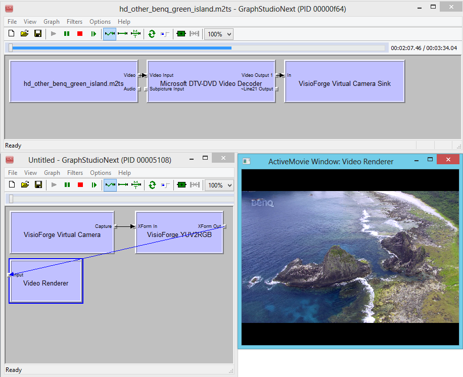

# DirectShow Virtual Camera SDK

## Overview

Our robust DirectShow-based Virtual Camera SDK enables developers to implement powerful virtual camera functionality in their applications. The SDK provides sink filters that can be utilized as output in Video Capture SDK or Video Edit SDK environments, while the source filters can be employed as video sources for various capture applications.

With this versatile toolkit, you can stream video content from virtually any source directly to a virtual camera device. These virtual devices are fully compatible with popular communication platforms such as `Skype`, `Zoom`, `Microsoft Teams`, web browsers, and numerous other applications that support DirectShow virtual cameras. The SDK also includes comprehensive audio streaming capabilities for complete multimedia solutions.

To help you get started quickly, the SDK package includes a fully-functional sample application that demonstrates how to stream video content from files to virtual camera devices.

Download the SDK from our [product page](https://www.visioforge.com/virtual-camera-sdk) to start integrating virtual camera functionality into your applications today.

## Key Features and Capabilities

* **Multiple Source Support**: Stream video to virtual camera from files, network streams, or capture devices
* **Architecture Compatibility**: Full x86/x64 architecture support
* **High-Resolution Support**: Stream video content up to 4K resolution
* **Customization Options**: Define and implement custom camera names
* **SDK Integration**: Seamless integration with other development tools
* **Audio Support**: Complete audio streaming capabilities
* **Professional Applications**: Perfect for teleconferencing, streaming, and professional video applications

## Technical Implementation

### Sample DirectShow Graph Architecture

The diagram below illustrates the standard DirectShow graph implementation when using the Virtual Camera SDK:



### License Registration via Registry

You can register the filter with your valid license key using the Windows registry system.

Configure licensing using the following registry key:

```reg
HKEY_LOCAL_MACHINE\SOFTWARE\VisioForge\Virtual Camera SDK\License
```

Set your purchased license key as a string value in this registry location.

### Deployment Guidelines

For proper deployment, copy and COM-register the SDK DirectShow filters - these are the files in the `Redist` folder with .ax extension. Registration can be performed using `regsvr32.exe` or through COM registration in your application installer. Please note that administrative privileges are required for successful registration.

### No-Signal Application Configuration

You can configure an application to run automatically when the virtual camera is not connected to any video source.

Configure the no-signal application using this registry key:

```reg
HKEY_LOCAL_MACHINE\SOFTWARE\VisioForge\Virtual Camera SDK\StartupEXE
```

Set the executable file name as a string value.

### No-Signal Image Configuration

Instead of displaying a black screen when no video source is available, you can configure a custom image to be shown.

Configure the no-signal image using this registry key:

```reg
HKEY_LOCAL_MACHINE\SOFTWARE\VisioForge\Virtual Camera SDK\BackgroundImage
```

Set the image file path as a string value.

## Third-Party Libraries and Integration

The Virtual Camera SDK contains third-party components that are used in the demo applications. These components are not required for the core SDK functionality.

The Delphi and .NET demonstration applications utilize third-party libraries to simplify DirectShow development. The C++ demo applications are built without external dependencies.

### .NET Integration

.NET applications leverage [DirectShowLib.Net (LGPL)](http://directshownet.sourceforge.net) to implement DirectShow functionality in managed code environments.

Developers can create console applications, WinForms, or WPF applications using .NET. The included demo applications utilize WinForms for the user interface.

### Delphi Integration

Delphi applications use [DSPack (MPL)](http://code.google.com/p/dspack/) to implement DirectShow functionality. While modern Delphi versions include built-in DirectShow support, DSPack is utilized in the demo applications to maintain compatibility with older Delphi versions.

### C++ Integration

The C++ demo applications do not require third-party libraries and are built using the standard DirectShow SDK.

The DirectShow SDK can be obtained from the [Microsoft website](https://www.microsoft.com/en-us/download/details.aspx?id=8279).

Developers can utilize MFC, ATL, or other C++ frameworks to build their applications. The included demo applications are built with MFC.

## System Requirements

The SDK is compatible with the following Microsoft Windows operating systems:

* Windows 7, 8, 8.1, 10, and 11
* Windows Server 2008, 2012, 2016, 2019, and 2022

## Version History and Updates

### Version 14.0

* Performance optimizations and enhancements
* Improved Windows 11 compatibility
* Enhanced support for modern web browsers
* Minor updates and bug fixes

### Version 12.0

* Windows 10 support improvements
* Performance enhancements
* 8K resolution support added
* Improved Mozilla Firefox and Microsoft Edge compatibility
* Various minor updates

### Version 11.0

* Critical bug fixes implemented
* Updated Google Chrome compatibility
* Resolved audio clicks issues in various web browsers and applications

### Version 10.0

* High frame rate support added
* Significant performance improvements
* Minor updates and bug fixes

### Version 9.0

* 4K video resolution support added
* Updated support for contemporary web browsers
* Various minor updates and improvements

### Version 8.0

* Added background image functionality for no-signal scenarios
* Implemented application auto-run for no-signal conditions
* Enhanced Skype compatibility

### Version 7.1

* Audio streaming support via virtual audio output and virtual microphone input
* PCM audio format support with customizable sample rates and channel configuration
* Bug fixes and performance improvements
* Additional video resolutions added

### Version 7.0

* Initial release as a standalone product
* Previously included in Video Edit SDK and Video Capture SDK
* Compatible with any DirectShow application

## Additional Resources

* [End User License Agreement](../../eula.md)
