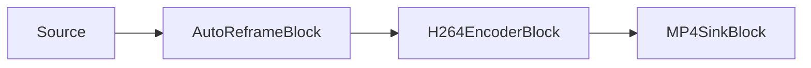

# Auto-Reencuadre con IA (video vertical que sigue al sujeto) — AutoReframeBlock

`AutoReframeBlock` convierte metraje horizontal en una relación de aspecto de salida fija — normalmente
vertical 9:16 para Shorts, Reels y TikTok — recortando dinámicamente alrededor de un sujeto detectado y
escalando el recorte a la resolución de salida configurada. Ejecuta la detección de objetos sobre un flujo
muestreado, sigue al sujeto seleccionado, suaviza la posición del recorte a lo largo del tiempo para que se
deslice en lugar de temblar, y regresa suavemente al centro del fotograma cuando no hay ningún sujeto.



El bloque reside en `VisioForge.Core.AI` (`VisioForge.DotNet.Core.AI`), usa `AutoReframeSettings` y tiene un
`Input` de video y un `Output` de video. Internamente es una cadena de un sample grabber RGBA (para la
detección) → `videocrop` → `videoscale` → `capsfilter` (tamaño de salida) → `videoconvert`. La detección se
ejecuta en el hilo de streaming de la canalización, por lo que un modelo lento puede limitar la
canalización; mantenga `DetectionInterval` en unos pocos fotogramas para repartir el coste.

## Cómo funciona

1. En cada fotograma el bloque muestrea los píxeles RGBA. Cada `DetectionInterval` fotogramas ejecuta el
   detector YOLO y elige un sujeto según `TargetSelection` y `ClassLabelFilter`.
2. Una ventana de recorte se centra en ese sujeto. El tamaño de la ventana de recorte es fijo durante toda
   la ejecución (solo depende del tamaño de origen, de la **relación de aspecto de píxel** de origen y de la
   **relación de aspecto de salida**), por lo que solo se mueve la **posición** del recorte y las caps
   posteriores no se renegocian por fotograma. Las fuentes anamórficas (con píxeles no cuadrados) se
   recortan teniendo en cuenta el PAR: el recorte se dimensiona en el espacio de píxeles para que su aspecto
   de visualización coincida con el aspecto de salida, y el escalado a la salida de píxeles cuadrados
   restaura las proporciones de visualización reales.
3. La posición del recorte se suaviza con una media móvil exponencial (`Smoothing`) y una zona muerta
   (`DeadZoneFraction`) que suprime el micro-temblor, y luego se limita para que el recorte permanezca
   completamente dentro del fotograma.
4. El recorte se aplica en vivo a `videocrop`, y `videoscale` + `capsfilter` lo escalan a
   `OutputWidth` x `OutputHeight`.
5. Cuando no se ha visto ningún sujeto durante más de `LostTargetTimeout`, el recorte regresa suavemente al
   centro del fotograma.

## Configuración

`AutoReframeSettings` se construye con un `YoloDetectorSettings` (el detector usado para localizar sujetos).

| Propiedad | Predeterminado | Descripción |
| --- | --- | --- |
| `OutputWidth` | `1080` | Ancho de salida en píxeles (positivo, par). |
| `OutputHeight` | `1920` | Alto de salida en píxeles (positivo, par). `1080x1920` es 9:16. |
| `DetectionInterval` | `5` | Ejecuta la detección cada N fotogramas; el recorte suavizado sigue deslizándose entre medias. |
| `Smoothing` | `0.85` | Factor de retención de la EMA en `[0, 1)`. Cuanto más alto, más lento el deslizamiento. |
| `DeadZoneFraction` | `0.05` | Semi-ancho de la zona muerta como fracción de la dimensión del fotograma; suprime micro-movimientos. |
| `TargetSelection` | `Largest` | `Largest` (caja más grande), `FirstDetected` o `ClassLabel` (mayor confianza de la clase). |
| `ClassLabelFilter` | `"person"` | Solo las detecciones con esta etiqueta son candidatas; use `null` para seguir cualquier clase. |
| `LostTargetTimeout` | `1 s` | Cuánto tiempo puede estar ausente el sujeto antes de que el recorte regrese al centro. |

Se usan `ConfidenceThreshold` e `IoUThreshold` del detector para la detección. El bloque siempre ejecuta la
detección con el dibujado desactivado, por lo que las cajas de detección nunca quedan grabadas en el
fotograma de salida — `YoloDetectorSettings.DrawDetections` no tiene efecto aquí.

!!! note "Licencias de modelos"
    El SDK no incluye los pesos de los modelos. Proporcione su propio archivo YOLO `.onnx` y verifique su
    licencia (código de entrenamiento, pesos y conjunto de datos) por separado — el formato ONNX no cambia
    la licencia de un modelo.

## Ejemplo: archivo horizontal a MP4 vertical 9:16

```csharp
using VisioForge.Core.MediaBlocks;
using VisioForge.Core.MediaBlocks.AI;
using VisioForge.Core.MediaBlocks.Sinks;
using VisioForge.Core.MediaBlocks.Sources;
using VisioForge.Core.MediaBlocks.VideoEncoders;
using VisioForge.Core.Types.X;
using VisioForge.Core.Types.X.AI;
using VisioForge.Core.Types.X.Sinks;
using VisioForge.Core.Types.X.Sources;
using VisioForge.Core.Types.X.VideoEncoders;

var pipeline = new MediaBlocksPipeline();

// Solo video: el flujo de audio no se conecta, así que no lo renderice.
var source = new UniversalSourceBlock(
    await UniversalSourceSettings.CreateAsync("landscape.mp4", renderVideo: true, renderAudio: false));

var detector = new YoloDetectorSettings(@"C:\models\yolox_nano.onnx")
{
    Model = ObjectDetectorModel.YOLOX,
};

var reframeSettings = new AutoReframeSettings(detector)
{
    OutputWidth = 1080,
    OutputHeight = 1920,      // 9:16
    DetectionInterval = 5,
    Smoothing = 0.85,
    ClassLabelFilter = "person",
    TargetSelection = AutoReframeTargetSelection.Largest,
};

var reframe = new AutoReframeBlock(reframeSettings);
reframe.OnReframeUpdated += (s, e) =>
{
    if (e.HasTarget)
    {
        Console.WriteLine(
            $"Following {e.TrackedLabel} ({e.Confidence:P0}); crop {e.CropRect} at {e.Timestamp}");
    }
};

var h264 = new H264EncoderBlock(new OpenH264EncoderSettings());
var mp4 = new MP4SinkBlock(new MP4SinkSettings("vertical.mp4"));

pipeline.Connect(source.VideoOutput, reframe.Input);
pipeline.Connect(reframe.Output, h264.Input);
pipeline.Connect(h264.Output, mp4.CreateNewInput(MediaBlockPadMediaType.Video));

var eosReached = new TaskCompletionSource<bool>(TaskCreationOptions.RunContinuationsAsynchronously);
pipeline.OnStop += (s, e) => eosReached.TrySetResult(true);

if (!await pipeline.StartAsync())
{
    Console.WriteLine("Pipeline failed to start (check the model path and source file).");
    await pipeline.DisposeAsync();
    return;
}

// Espere el fin del flujo (el pipeline se detiene por sí solo y el muxer finaliza el MP4)
// y luego libere el pipeline.
await eosReached.Task;
await pipeline.StopAsync();
await pipeline.DisposeAsync();
```

## El evento OnReframeUpdated

`OnReframeUpdated` se dispara en cada fotograma procesado con un `ReframeEventArgs`:

| Miembro | Descripción |
| --- | --- |
| `CropRect` | La ventana de recorte aplicada al fotograma de origen, en coordenadas de píxeles del origen (antes de la corrección de PAR). En fuentes anamórficas su proporción ancho:alto difiere deliberadamente de la relación de aspecto de salida — téngalo en cuenta al dibujar geometría de superposición. |
| `HasTarget` | Si se estaba siguiendo un sujeto en este fotograma. |
| `TargetBox` | La caja del sujeto seguido en coordenadas de origen, o `null`. |
| `TrackedLabel` | La etiqueta de clase del sujeto seguido, o `null`. |
| `Confidence` | La confianza del sujeto seguido (0..1), o `0`. |
| `Timestamp` | La marca de tiempo del fotograma de origen. |

Úselo para dibujar una superposición en pantalla de la región de recorte, registrar qué sujeto se está
siguiendo o renderizar una vista previa lado a lado del original y la salida reencuadrada.

## Consejos

- **Relaciones de aspecto.** `1080x1920` es 9:16; `1080x1080` es 1:1; `1080x1350` es 4:5. Cualquier
  `OutputWidth`/`OutputHeight` par funciona.
- **Suavidad vs. capacidad de respuesta.** Suba `Smoothing` (por ejemplo `0.9`) para un movimiento más lento
  y calmado; bájelo (por ejemplo `0.7`) para seguir con más precisión a un sujeto que se mueve rápido.
- **Temblor.** Si el recorte tiembla sobre un sujeto casi estático, aumente `DeadZoneFraction`.
- **Clase.** Establezca `ClassLabelFilter` para seguir una clase específica (por ejemplo `"person"`,
  `"dog"`, `"sports ball"`), o `null` para seguir lo que sea más grande.
- **Coste.** La detección es el coste principal. Aumente `DetectionInterval` para ejecutarla con menos
  frecuencia; el recorte sigue deslizándose en los fotogramas intermedios.
