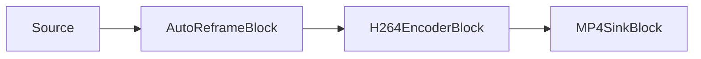

# Recadrage automatique par IA (vidéo verticale qui suit le sujet) — AutoReframeBlock

`AutoReframeBlock` transforme des séquences horizontales en un rapport d'aspect de sortie fixe — généralement
vertical 9:16 pour Shorts, Reels et TikTok — en recadrant dynamiquement autour d'un sujet détecté et en
mettant le recadrage à l'échelle de la résolution de sortie configurée. Il exécute la détection d'objets sur
un flux échantillonné, suit le sujet sélectionné, lisse la position du recadrage au fil du temps pour qu'il
glisse au lieu de trembler, et revient doucement au centre de l'image lorsqu'aucun sujet n'est présent.



Le bloc réside dans `VisioForge.Core.AI` (`VisioForge.DotNet.Core.AI`), utilise `AutoReframeSettings` et
possède un `Input` vidéo et un `Output` vidéo. En interne, il s'agit d'une chaîne composée d'un sample
grabber RGBA (pour la détection) → `videocrop` → `videoscale` → `capsfilter` (taille de sortie) →
`videoconvert`. La détection s'exécute sur le thread de streaming du pipeline, donc un modèle lent peut
brider le pipeline ; conservez `DetectionInterval` à quelques images pour répartir le coût.

## Fonctionnement

1. À chaque image, le bloc échantillonne les pixels RGBA. Toutes les `DetectionInterval` images, il exécute
   le détecteur YOLO et choisit un sujet selon `TargetSelection` et `ClassLabelFilter`.
2. Une fenêtre de recadrage est centrée sur ce sujet. La taille de la fenêtre de recadrage est fixe pendant
   toute l'exécution (elle dépend uniquement de la taille source, du **rapport d'aspect de pixel** source et
   du **rapport d'aspect de sortie**), donc seule la **position** du recadrage se déplace et les caps en
   aval ne se renégocient pas à chaque image. Les sources anamorphiques (pixels non carrés) sont recadrées
   en tenant compte du PAR : le recadrage est dimensionné dans l'espace des pixels pour que son aspect
   d'affichage corresponde à l'aspect de sortie, et la mise à l'échelle vers la sortie en pixels carrés
   restaure les vraies proportions d'affichage.
3. La position du recadrage est lissée avec une moyenne mobile exponentielle (`Smoothing`) et une zone morte
   (`DeadZoneFraction`) qui supprime le micro-tremblement, puis limitée pour que le recadrage reste
   entièrement à l'intérieur de l'image.
4. Le recadrage est appliqué en direct à `videocrop`, et `videoscale` + `capsfilter` le mettent à l'échelle
   de `OutputWidth` x `OutputHeight`.
5. Lorsqu'aucun sujet n'a été vu pendant plus de `LostTargetTimeout`, le recadrage revient doucement au
   centre de l'image.

## Paramètres

`AutoReframeSettings` est construit avec un `YoloDetectorSettings` (le détecteur utilisé pour localiser les
sujets).

| Propriété | Par défaut | Description |
| --- | --- | --- |
| `OutputWidth` | `1080` | Largeur de sortie en pixels (positive, paire). |
| `OutputHeight` | `1920` | Hauteur de sortie en pixels (positive, paire). `1080x1920` correspond à 9:16. |
| `DetectionInterval` | `5` | Exécute la détection toutes les N images ; le recadrage lissé continue de glisser entre-temps. |
| `Smoothing` | `0.85` | Facteur de rétention de l'EMA dans `[0, 1)`. Plus il est élevé, plus le glissement est lent. |
| `DeadZoneFraction` | `0.05` | Demi-largeur de la zone morte en fraction de la dimension de l'image ; supprime les micro-déplacements. |
| `TargetSelection` | `Largest` | `Largest` (plus grande boîte), `FirstDetected` ou `ClassLabel` (plus grande confiance de la classe). |
| `ClassLabelFilter` | `"person"` | Seules les détections avec cette étiquette sont candidates ; utilisez `null` pour suivre n'importe quelle classe. |
| `LostTargetTimeout` | `1 s` | Durée pendant laquelle le sujet peut être absent avant que le recadrage ne revienne au centre. |

Les valeurs `ConfidenceThreshold` et `IoUThreshold` du détecteur sont utilisées pour la détection. Le bloc
exécute toujours la détection avec le dessin désactivé, donc les boîtes de détection ne sont jamais
incrustées dans l'image de sortie — `YoloDetectorSettings.DrawDetections` n'a aucun effet ici.

!!! note "Licences des modèles"
    Le SDK ne fournit pas les poids des modèles. Fournissez votre propre fichier YOLO `.onnx` et vérifiez sa
    licence (code d'entraînement, poids et jeu de données) séparément — le format ONNX ne change pas la
    licence d'un modèle.

## Exemple : fichier horizontal vers MP4 vertical 9:16

```csharp
using VisioForge.Core.MediaBlocks;
using VisioForge.Core.MediaBlocks.AI;
using VisioForge.Core.MediaBlocks.Sinks;
using VisioForge.Core.MediaBlocks.Sources;
using VisioForge.Core.MediaBlocks.VideoEncoders;
using VisioForge.Core.Types.X;
using VisioForge.Core.Types.X.AI;
using VisioForge.Core.Types.X.Sinks;
using VisioForge.Core.Types.X.Sources;
using VisioForge.Core.Types.X.VideoEncoders;

var pipeline = new MediaBlocksPipeline();

// Vidéo uniquement : le flux audio n'est pas connecté, ne le rendez donc pas.
var source = new UniversalSourceBlock(
    await UniversalSourceSettings.CreateAsync("landscape.mp4", renderVideo: true, renderAudio: false));

var detector = new YoloDetectorSettings(@"C:\models\yolox_nano.onnx")
{
    Model = ObjectDetectorModel.YOLOX,
};

var reframeSettings = new AutoReframeSettings(detector)
{
    OutputWidth = 1080,
    OutputHeight = 1920,      // 9:16
    DetectionInterval = 5,
    Smoothing = 0.85,
    ClassLabelFilter = "person",
    TargetSelection = AutoReframeTargetSelection.Largest,
};

var reframe = new AutoReframeBlock(reframeSettings);
reframe.OnReframeUpdated += (s, e) =>
{
    if (e.HasTarget)
    {
        Console.WriteLine(
            $"Following {e.TrackedLabel} ({e.Confidence:P0}); crop {e.CropRect} at {e.Timestamp}");
    }
};

var h264 = new H264EncoderBlock(new OpenH264EncoderSettings());
var mp4 = new MP4SinkBlock(new MP4SinkSettings("vertical.mp4"));

pipeline.Connect(source.VideoOutput, reframe.Input);
pipeline.Connect(reframe.Output, h264.Input);
pipeline.Connect(h264.Output, mp4.CreateNewInput(MediaBlockPadMediaType.Video));

var eosReached = new TaskCompletionSource<bool>(TaskCreationOptions.RunContinuationsAsynchronously);
pipeline.OnStop += (s, e) => eosReached.TrySetResult(true);

if (!await pipeline.StartAsync())
{
    Console.WriteLine("Pipeline failed to start (check the model path and source file).");
    await pipeline.DisposeAsync();
    return;
}

// Attendez la fin du flux (le pipeline s'arrête de lui-même et le muxer finalise le MP4),
// puis libérez le pipeline.
await eosReached.Task;
await pipeline.StopAsync();
await pipeline.DisposeAsync();
```

## L'événement OnReframeUpdated

`OnReframeUpdated` se déclenche à chaque image traitée avec un `ReframeEventArgs` :

| Membre | Description |
| --- | --- |
| `CropRect` | La fenêtre de recadrage appliquée à l'image source, en coordonnées de pixels source (avant correction du PAR). Sur les sources anamorphiques, son rapport largeur:hauteur diffère délibérément du rapport d'aspect de sortie — tenez-en compte pour dessiner la géométrie d'un overlay. |
| `HasTarget` | Si un sujet était suivi sur cette image. |
| `TargetBox` | La boîte du sujet suivi en coordonnées source, ou `null`. |
| `TrackedLabel` | L'étiquette de classe du sujet suivi, ou `null`. |
| `Confidence` | La confiance du sujet suivi (0..1), ou `0`. |
| `Timestamp` | L'horodatage de l'image source. |

Utilisez-le pour piloter une superposition à l'écran de la zone de recadrage, journaliser quel sujet est
suivi, ou afficher un aperçu côte à côte de l'original et de la sortie recadrée.

## Conseils

- **Rapports d'aspect.** `1080x1920` correspond à 9:16 ; `1080x1080` à 1:1 ; `1080x1350` à 4:5. Toute
  valeur `OutputWidth`/`OutputHeight` paire fonctionne.
- **Fluidité vs. réactivité.** Augmentez `Smoothing` (par exemple `0.9`) pour un mouvement plus lent et
  calme ; diminuez-le (par exemple `0.7`) pour suivre plus précisément un sujet rapide.
- **Tremblement.** Si le recadrage tremble sur un sujet presque statique, augmentez `DeadZoneFraction`.
- **Classe.** Définissez `ClassLabelFilter` pour suivre une classe spécifique (par exemple `"person"`,
  `"dog"`, `"sports ball"`), ou `null` pour suivre l'objet le plus grand.
- **Coût.** La détection est le coût principal. Augmentez `DetectionInterval` pour l'exécuter moins souvent ;
  le recadrage continue de glisser sur les images intermédiaires.
