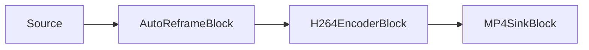

# AI Auto-Reframe (Subject-Following Vertical Video) — AutoReframeBlock

`AutoReframeBlock` converts landscape footage into a fixed output aspect ratio — typically vertical 9:16
for Shorts, Reels, and TikTok — by dynamically cropping around a detected subject and scaling the crop to
the configured output resolution. It runs object detection on a sampled stream, follows the selected
subject, smooths the crop position over time so it glides instead of jittering, and eases back to the
frame center when no subject is present.



The block lives in `VisioForge.Core.AI` (`VisioForge.DotNet.Core.AI`), uses `AutoReframeSettings`, and has
one video `Input` and one video `Output`. Internally it is a chain of an RGBA sample grabber (for
detection) → `videocrop` → `videoscale` → `capsfilter` (output size) → `videoconvert`. Detection runs on
the pipeline streaming thread, so a slow model can throttle the pipeline; keep `DetectionInterval` at a
few frames to spread the cost.

## How it works

1. On each frame the block taps the RGBA pixels. Every `DetectionInterval` frames it runs the YOLO
   detector and picks a subject according to `TargetSelection` and `ClassLabelFilter`.
2. A crop window is centered on that subject. The crop window size is fixed for the whole run (it depends
   only on the source size, the source **pixel aspect ratio**, and the **output aspect ratio**), so only
   the crop **position** moves and downstream caps do not renegotiate per frame. Anamorphic
   (non-square-pixel) sources are cropped PAR-aware: the crop is sized in pixel space so its display
   aspect matches the output aspect, and the scale to the square-pixel output restores true display
   proportions.
3. The crop position is smoothed with an exponential moving average (`Smoothing`) and a dead zone
   (`DeadZoneFraction`) that suppresses micro-jitter, then clamped so the crop stays fully inside the
   frame.
4. The crop is applied live to `videocrop`, and `videoscale` + `capsfilter` scale it to
   `OutputWidth` x `OutputHeight`.
5. When no subject has been seen for longer than `LostTargetTimeout`, the crop eases back to the frame
   center.

## Settings

`AutoReframeSettings` is constructed with a `YoloDetectorSettings` (the detector used to locate subjects).

| Property | Default | Description |
| --- | --- | --- |
| `OutputWidth` | `1080` | Output width in pixels (positive, even). |
| `OutputHeight` | `1920` | Output height in pixels (positive, even). `1080x1920` is 9:16. |
| `DetectionInterval` | `5` | Run detection every N frames; the smoothed crop keeps gliding in between. |
| `Smoothing` | `0.85` | EMA retention factor in `[0, 1)`. Higher glides more slowly. |
| `DeadZoneFraction` | `0.05` | Dead-zone half-width as a fraction of the frame dimension; suppresses micro-moves. |
| `TargetSelection` | `Largest` | `Largest` (biggest box), `FirstDetected`, or `ClassLabel` (highest-confidence of the class). |
| `ClassLabelFilter` | `"person"` | Only detections with this label are candidates; set to `null` to follow any class. |
| `LostTargetTimeout` | `1 s` | How long the subject may be absent before the crop eases to center. |

The detector's `ConfidenceThreshold` and `IoUThreshold` are used for detection. The block always runs
detection with drawing disabled, so detection boxes are never baked into the output frame —
`YoloDetectorSettings.DrawDetections` has no effect here.

!!! note "Model licenses"
    The SDK does not ship model weights. Supply your own YOLO `.onnx` file and verify its license
    (training code, weights, and dataset) separately — the ONNX format does not change a model's license.

## Example: landscape file to vertical 9:16 MP4

```csharp
using VisioForge.Core.MediaBlocks;
using VisioForge.Core.MediaBlocks.AI;
using VisioForge.Core.MediaBlocks.Sinks;
using VisioForge.Core.MediaBlocks.Sources;
using VisioForge.Core.MediaBlocks.VideoEncoders;
using VisioForge.Core.Types.X;
using VisioForge.Core.Types.X.AI;
using VisioForge.Core.Types.X.Sinks;
using VisioForge.Core.Types.X.Sources;
using VisioForge.Core.Types.X.VideoEncoders;

var pipeline = new MediaBlocksPipeline();

// Video-only: the audio stream is not connected, so do not render it.
var source = new UniversalSourceBlock(
    await UniversalSourceSettings.CreateAsync("landscape.mp4", renderVideo: true, renderAudio: false));

var detector = new YoloDetectorSettings(@"C:\models\yolox_nano.onnx")
{
    Model = ObjectDetectorModel.YOLOX,
};

var reframeSettings = new AutoReframeSettings(detector)
{
    OutputWidth = 1080,
    OutputHeight = 1920,      // 9:16
    DetectionInterval = 5,
    Smoothing = 0.85,
    ClassLabelFilter = "person",
    TargetSelection = AutoReframeTargetSelection.Largest,
};

var reframe = new AutoReframeBlock(reframeSettings);
reframe.OnReframeUpdated += (s, e) =>
{
    if (e.HasTarget)
    {
        Console.WriteLine(
            $"Following {e.TrackedLabel} ({e.Confidence:P0}); crop {e.CropRect} at {e.Timestamp}");
    }
};

var h264 = new H264EncoderBlock(new OpenH264EncoderSettings());
var mp4 = new MP4SinkBlock(new MP4SinkSettings("vertical.mp4"));

pipeline.Connect(source.VideoOutput, reframe.Input);
pipeline.Connect(reframe.Output, h264.Input);
pipeline.Connect(h264.Output, mp4.CreateNewInput(MediaBlockPadMediaType.Video));

var eosReached = new TaskCompletionSource<bool>(TaskCreationOptions.RunContinuationsAsynchronously);
pipeline.OnStop += (s, e) => eosReached.TrySetResult(true);

if (!await pipeline.StartAsync())
{
    Console.WriteLine("Pipeline failed to start (check the model path and source file).");
    await pipeline.DisposeAsync();
    return;
}

// Wait for end-of-stream (the pipeline stops itself and the muxer finalizes the MP4),
// then release the pipeline.
await eosReached.Task;
await pipeline.StopAsync();
await pipeline.DisposeAsync();
```

## The OnReframeUpdated event

`OnReframeUpdated` fires on every processed frame with a `ReframeEventArgs`:

| Member | Description |
| --- | --- |
| `CropRect` | The crop window applied to the source frame, in source-frame pixel coordinates (pre-PAR-correction). On anamorphic sources its width:height ratio deliberately differs from the output aspect ratio — account for this when drawing overlay geometry. |
| `HasTarget` | Whether a subject was being followed on this frame. |
| `TargetBox` | The followed subject box in source coordinates, or `null`. |
| `TrackedLabel` | The followed subject class label, or `null`. |
| `Confidence` | The followed subject confidence (0..1), or `0`. |
| `Timestamp` | The source frame timestamp. |

Use it to drive an on-screen overlay of the crop region, to log which subject is being followed, or to
render a side-by-side preview of the original and the reframed output.

## Tips

- **Aspect ratios.** `1080x1920` is 9:16; `1080x1080` is 1:1; `1080x1350` is 4:5. Any even
  `OutputWidth`/`OutputHeight` works.
- **Smoothness vs. responsiveness.** Raise `Smoothing` (for example `0.9`) for slower, calmer motion;
  lower it (for example `0.7`) to track a fast-moving subject more tightly.
- **Jitter.** If the crop twitches on a nearly-static subject, increase `DeadZoneFraction`.
- **Class.** Set `ClassLabelFilter` to follow a specific class (for example `"person"`, `"dog"`,
  `"sports ball"`), or `null` to follow whatever is largest.
- **Cost.** Detection is the main cost. Increase `DetectionInterval` to run it less often; the crop still
  glides on the frames in between.
