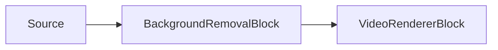

# Eliminación de fondo con IA (Matting) — BackgroundRemovalBlock

`BackgroundRemovalBlock` ejecuta un modelo ONNX de segmentación o matting sobre fotogramas de video RGBA,
estima una máscara alfa de primer plano por píxel y compone un fondo de reemplazo en el fotograma. Úselo
para matting de retratos, difuminado de fondo virtual, salida de pantalla verde virtual, reemplazo de
fondo estático o salida RGBA transparente.



El bloque reside en `VisioForge.Core.AI` (`VisioForge.DotNet.Core.AI`), usa `BackgroundRemovalSettings`
(que extiende `OnnxInferenceSettings`) y tiene una entrada `Input` de video y una salida `Output` de video.
Utiliza un capturador de muestras interno para fotogramas RGBA y ejecuta la inferencia en el hilo de
streaming del pipeline, por lo que un modelo lento puede limitar el rendimiento del pipeline. No genera
un evento de reconocimiento — la salida es el fotograma de video procesado.

## Modelos y licencias

Configure `BackgroundRemovalSettings.Model` con la familia que coincida con el archivo `.onnx` suministrado.
El SDK no incluye los pesos del modelo en el paquete NuGet; su aplicación proporciona el archivo `.onnx`.

| Modelo | Entrada y salida esperadas | Notas |
| --- | --- | --- |
| `BackgroundRemovalModel.MODNet` (predeterminado) | Entrada cuadrada, `512x512` por defecto; redimensionado directo; RGB normalizado a -1..1; salida de matte alfa `[1, 1, H, W]` en 0..1. | Matting de retratos, Apache-2.0. |
| `BackgroundRemovalModel.PPMattingV2` | Tamaño fijo del modelo; redimensionado directo; RGB normalizado a -1..1; salida de matte alfa `[1, 1, H, W]` en 0..1. | Matting humano en tiempo real de PaddleSeg, Apache-2.0. |
| `BackgroundRemovalModel.U2Net` | `320x320`; redimensionado directo; normalización RGB con media/desviación estándar de ImageNet; la primera salida se reescala por fotograma a 0..1. | Segmentación de objetos destacados / retratos, Apache-2.0. Configure `InputWidth`/`InputHeight` a `320` si el modelo usa dimensiones de entrada dinámicas. |
| `BackgroundRemovalModel.BiRefNet` | Típicamente `1024x1024`; redimensionado directo; normalización RGB con media/desviación estándar de ImageNet; los logits en bruto se mapean mediante sigmoide a 0..1. | Opción de mayor precisión y más pesada. El código es MIT; verifique el checkpoint específico porque algunos pesos se entrenan con datos no comerciales. Configure `InputWidth`/`InputHeight` a `1024` si el modelo usa dimensiones de entrada dinámicas. |
| `BackgroundRemovalModel.Custom` | Use `InputWidth`, `InputHeight` y `NormalizeTo01` de `BackgroundRemovalSettings`. | Para un modelo que no sigue las convenciones integradas. |

!!! note "Licencias de los modelos"
    La licencia de un modelo la determina su origen (código de entrenamiento, pesos y conjunto de datos),
    no el formato ONNX. `MODNet`, `PPMattingV2` y `U2Net` son Apache-2.0. El código de `BiRefNet` es MIT,
    pero debe verificar la licencia del checkpoint exacto que distribuya.

## Cómo funciona el pipeline de matting

`BackgroundRemovalBlock` es un procesador de fotogramas, no una fuente ni un renderizador independiente.
El bloque anterior entrega fotogramas RGBA a un capturador de muestras interno, el bloque ejecuta el modelo
ONNX configurado cuando el fotograma se selecciona para inferencia, y el fotograma de salida se envía aguas
abajo con la misma temporización de video.

El tamaño de entrada del modelo ONNX se resuelve a partir de los metadatos del modelo cuando este tiene
dimensiones fijas. Si el modelo usa dimensiones dinámicas, se usan en su lugar `InputWidth` e `InputHeight`
de `BackgroundRemovalSettings` — que por defecto son `512x512` (ajustado para `MODNet`) y **no** se ajustan
automáticamente por modelo, así que configúrelos usted mismo para `U2Net` (`320x320`) o `BiRefNet` (`1024x1024`).
El fotograma se redimensiona directamente a ese tamaño de tensor y se convierte de píxeles RGBA a un tensor
de punto flotante RGB `NCHW`. La familia del modelo controla la normalización:

- `MODNet` y `PPMattingV2` usan valores RGB normalizados a `-1..1`.
- `U2Net` y `BiRefNet` usan normalización RGB con media/desviación estándar al estilo ImageNet.
- `Custom` usa las opciones genéricas `NormalizeTo01`, `InputWidth` e `InputHeight`.

Tras la inferencia, el bloque lee la primera salida de punto flotante como matte de primer plano. Las dos
últimas dimensiones de la salida se tratan como alto y ancho del matte. Las salidas de `MODNet`,
`PPMattingV2` y `Custom` se esperan ya en `0..1`; `U2Net` se normaliza por min/max en cada fotograma;
los logits en bruto de `BiRefNet` se convierten con sigmoide. Si `MaskFeatherAmount` es mayor que `0`, el
matte se difumina a la resolución del modelo antes de la composición.

El compositor muestrea ese matte de vuelta sobre el fotograma original con interpolación bilineal. Para
`Blur`, `SolidColor` e `Image`, cada píxel se mezcla como `primer_plano * alfa + fondo * (1 - alfa)`.
`MaskThreshold` puede endurecer los bordes inciertos forzando los valores de alfa muy bajos hacia el fondo
y los muy altos hacia el primer plano. Para `Transparent`, el bloque conserva los píxeles RGB del primer
plano y escribe el matte en el canal alfa de salida, por lo que el resultado visible depende de que el
renderizador o codificador aguas abajo preserve el canal alfa RGBA.

### Elegir un modelo de matting

Use `MODNet` o `PPMattingV2` primero para el reemplazo de fondo de retratos en tiempo real. Están diseñados
para matting humano y tienen tamaños de entrada más bajos que los modelos de alta precisión para objetos
destacados. `U2Net` es una buena opción de respaldo cuando el sujeto no es siempre una persona, pero su
salida es un matte de estilo segmentación que puede necesitar `MaskFeatherAmount` para bordes suaves.
`BiRefNet` es la opción de mayor calidad pero más pesada: puede producir mejor detalle fino, pero su
tamaño de entrada típico de `1024x1024` es mucho más costoso, especialmente en CPU. Use `Custom` solo
cuando su modelo ONNX siga una convención de preprocesamiento o salida diferente y haya verificado esas
opciones contra el modelo exportado.

## Modos de reemplazo

`BackgroundRemovalSettings.ReplacementMode` selecciona cómo se reemplazan los píxeles de fondo con alfa bajo.

| Modo | Opciones usadas | Resultado |
| --- | --- | --- |
| `BackgroundReplacementMode.Blur` (predeterminado) | `BlurRadius` | Reemplaza el fondo con una copia difuminada del fotograma original. |
| `BackgroundReplacementMode.SolidColor` | `ReplacementColor` | Rellena el fondo con un color sólido; por defecto verde (una pantalla verde virtual). |
| `BackgroundReplacementMode.Image` | `BackgroundImagePath`, `ReplacementColor` como reserva | Carga una imagen estática y la escala al tamaño del fotograma. Si la imagen no se puede cargar, el bloque recurre a `ReplacementColor`. |
| `BackgroundReplacementMode.Transparent` | Máscara alfa de primer plano | Escribe la máscara en el canal alfa del fotograma. Use un renderizador, codificador o compositor aguas abajo que preserve el canal alfa. |

Controles adicionales del matte:

| Propiedad | Valor predeterminado | Descripción |
| --- | --- | --- |
| `MaskThreshold` | `0` | Endurecimiento de bordes opcional. Rango efectivo 0..0.5 (los valores por encima de 0.5 se limitan). Los valores en o por debajo del umbral se convierten en fondo, y los valores en o por encima de `1 - umbral` se convierten en primer plano. `0` mantiene el matte suave original del modelo sin cambios. |
| `MaskFeatherAmount` | `0` | Radio de difuminado opcional en el espacio del matte, en píxeles del matte (resolución del modelo), que suaviza los bordes entre primer plano y fondo — el control opuesto a `MaskThreshold`. |
| `FramesToSkip` | `0` | Heredado de `OnnxInferenceSettings`. El modelo se ejecuta cada `FramesToSkip + 1` fotogramas, mientras que el último matte se compone en cada fotograma. |
| `Provider` / `DeviceId` | `Auto` / `0` | Proveedor de ejecución ONNX e índice del dispositivo de hardware. |
| `InputWidth` / `InputHeight` | `512` / `512` | Usados para modelos de matting con entrada dinámica. Los modelos de tamaño fijo reportan su propio tamaño de entrada. |

## Ejemplo de pipeline

```csharp
using VisioForge.Core.MediaBlocks;
using VisioForge.Core.MediaBlocks.AI;
using VisioForge.Core.MediaBlocks.VideoRendering;
using VisioForge.Core.Types.X.AI;

var settings = new BackgroundRemovalSettings(modelPath)
{
    Model = BackgroundRemovalModel.PPMattingV2,
    ReplacementMode = BackgroundReplacementMode.Blur,
    BlurRadius = 15f,
    MaskFeatherAmount = 2,
    Provider = OnnxExecutionProvider.Auto,
    FramesToSkip = 2,
    MaskThreshold = 0.05f,
};

var backgroundRemoval = new BackgroundRemovalBlock(settings);

var videoRenderer = new VideoRendererBlock(pipeline, videoView) { IsSync = false };

pipeline.Connect(source.Output, backgroundRemoval.Input);
pipeline.Connect(backgroundRemoval.Output, videoRenderer.Input);

await pipeline.StartAsync();

Console.WriteLine($"Active provider: {backgroundRemoval.ActiveProvider}");
```

!!! note "Rendimiento"
    El modelo no se ejecuta en cada fotograma cuando `FramesToSkip` es mayor que `0`, pero el bloque
    sigue componiendo el fondo de reemplazo en cada fotograma a partir del matte en caché. Esto reduce
    el costo de CPU/GPU sin parpadeos de vuelta al fondo original entre fotogramas de inferencia.

## Uso con VideoCaptureCoreX y MediaPlayerCoreX

```csharp
var backgroundRemoval = new BackgroundRemovalBlock(settings);

core.Video_Processing_AddBlock(backgroundRemoval); // antes de StartAsync (VideoCaptureCoreX)
// player.Video_Processing_AddBlock(backgroundRemoval); // antes de OpenAsync/PlayAsync (MediaPlayerCoreX)

await core.StartAsync();
```

Consulte [Uso de bloques de IA con VideoCaptureCoreX y MediaPlayerCoreX](x-engines.md) para conocer la API
completa de bloques de procesamiento, el orden de inserción y las reglas de ciclo de vida compartidas por
todos los bloques de IA de video.

## Casos de uso

- **Videoconferencias y aplicaciones de webcam** — pantalla verde virtual o difuminado de fondo sin
  necesidad de una pantalla verde física.
- **Streaming en vivo y superposiciones de transmisión** — componer a un presentador sobre un fondo o
  escena de marca.
- **Estudio virtual / video de fotografía de producto** — reemplazar un fondo simple con una escena
  personalizada.
- **Difuminado de privacidad** — difuminar el fondo en una grabación para que solo el sujeto en primer
  plano quede nítido.

## Solución de problemas

| Síntoma | Causa probable | Solución |
| --- | --- | --- |
| Los bordes alrededor del cabello/dedos se ven duros o con bloques | Los bordes del matte no están suavizados | Aumente `MaskFeatherAmount`. |
| El fondo se filtra a través de áreas sólidas (artefactos semitransparentes) | El matte es demasiado suave para una escena de alto contraste | Aumente `MaskThreshold` (rango efectivo 0..0.5) para endurecer la división entre primer plano y fondo. |
| Recorte/escala incorrectos en la salida | `InputWidth`/`InputHeight` no coinciden con el modelo | Para un modelo de entrada dinámica, configúrelos al tamaño esperado por ese modelo (`320` para `U2Net`, `1024` para `BiRefNet`); un modelo de tamaño fijo reporta y usa su propio tamaño de todos modos. |
| El modo `Transparent` muestra un fondo opaco | El renderizador/codificador aguas abajo no preserva el canal alfa | Use un renderizador/codificador/compositor con capacidad RGBA; `Transparent` solo escribe el canal alfa, no obliga al resto del pipeline a respetarlo. |
| Uso elevado de CPU/GPU | El modelo de matting se ejecuta en cada fotograma | Aumente `FramesToSkip` — el último matte se sigue componiendo en cada fotograma, por lo que el movimiento no parpadea de vuelta al fondo original entre fotogramas de inferencia. |

## Preguntas frecuentes

### ¿Con qué modelo de matting debería empezar?

`MODNet` (el predeterminado) o `PPMattingV2` para escenarios de retrato/webcam en tiempo real — ambos
están ajustados para matting humano con un tamaño de entrada relativamente bajo. Use `BiRefNet` solo si
necesita mayor precisión de detalle fino y puede permitirse su costo de entrada `1024x1024` más pesado.

### ¿Puedo usar una pantalla verde virtual sin una física?

Sí — configure `ReplacementMode = BackgroundReplacementMode.SolidColor` (por defecto es verde) en lugar
de `Blur`, `Image` o `Transparent`.

### ¿Este bloque requiere una GPU?

No, pero un proveedor de ejecución GPU reduce la latencia por fotograma, lo cual es más importante para
el tamaño de entrada mayor de `BiRefNet` o para video en vivo con alta tasa de fotogramas.

### ¿Puedo generar un video transparente (alfa) en lugar de componer un fondo?

Sí — configure `ReplacementMode = BackgroundReplacementMode.Transparent`. El bloque escribe el alfa de
primer plano en el canal alfa del fotograma; su renderizador, codificador o compositor aguas abajo debe
preservar RGBA para aprovecharlo.

## Demo

- **[Demo de Eliminación de Fondo](https://github.com/visioforge/.Net-SDK-s-samples/tree/master/Media%20Blocks%20SDK/WPF/CSharp/Background%20Removal%20Demo)** —
  demo WPF con fuentes de webcam, archivo y RTSP, modelos de matting descargables, y modos de reemplazo
  por difuminado, color sólido, imagen y transparente.
