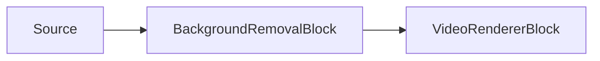

# Suppression d'arrière-plan par IA (matting) — BackgroundRemovalBlock

`BackgroundRemovalBlock` exécute un modèle ONNX de segmentation ou de matting sur des images vidéo
RGBA, estime un masque alpha de premier plan par pixel, et compose un arrière-plan de remplacement
dans l'image. Utilisez-le pour le matting de portrait, le flou d'arrière-plan virtuel, la sortie en
incrustation (green screen) virtuelle, le remplacement d'arrière-plan statique ou la sortie RGBA
transparente.



Le bloc se trouve dans `VisioForge.Core.AI` (`VisioForge.DotNet.Core.AI`), utilise
`BackgroundRemovalSettings` (qui étend `OnnxInferenceSettings`), et possède une entrée `Input` et une
sortie `Output` vidéo. Il utilise un capteur d'échantillons interne pour les images RGBA et exécute
l'inférence sur le thread de streaming du pipeline, de sorte qu'un modèle lent peut freiner le
pipeline. Il ne déclenche aucun événement de reconnaissance — la sortie est l'image vidéo traitée.

## Modèles et licences

Définissez `BackgroundRemovalSettings.Model` sur la famille correspondant au fichier `.onnx` fourni.
Le SDK ne fournit pas les poids des modèles dans le paquet NuGet ; votre application doit fournir le
fichier `.onnx`.

| Modèle | Entrée et sortie attendues | Remarques |
| --- | --- | --- |
| `BackgroundRemovalModel.MODNet` (par défaut) | Entrée carrée, `512x512` par défaut ; redimensionnement direct ; RGB normalisé entre -1 et 1 ; matte alpha de sortie `[1, 1, H, W]` entre 0 et 1. | Matting de portrait, Apache-2.0. |
| `BackgroundRemovalModel.PPMattingV2` | Taille fixe selon le modèle ; redimensionnement direct ; RGB normalisé entre -1 et 1 ; matte alpha de sortie `[1, 1, H, W]` entre 0 et 1. | Matting humain temps réel issu de PaddleSeg, Apache-2.0. |
| `BackgroundRemovalModel.U2Net` | `320x320` ; redimensionnement direct ; normalisation RGB moyenne/écart-type ImageNet ; la première sortie est remise à l'échelle par image entre 0 et 1. | Segmentation d'objet saillant / portrait, Apache-2.0. Définissez `InputWidth`/`InputHeight` à `320` si le modèle utilise des dimensions d'entrée dynamiques. |
| `BackgroundRemovalModel.BiRefNet` | Généralement `1024x1024` ; redimensionnement direct ; normalisation RGB moyenne/écart-type ImageNet ; les logits bruts sont convertis via sigmoïde entre 0 et 1. | Option de précision supérieure et plus lourde. Le code est sous licence MIT ; vérifiez le point de contrôle (checkpoint) spécifique, car certains poids sont entraînés sur des données non commerciales. Définissez `InputWidth`/`InputHeight` à `1024` si le modèle utilise des dimensions d'entrée dynamiques. |
| `BackgroundRemovalModel.Custom` | Utilise `InputWidth`, `InputHeight` et `NormalizeTo01` de `BackgroundRemovalSettings`. | Pour un modèle qui ne suit pas les conventions intégrées. |

!!! note "Licences des modèles"
    La licence d'un modèle est déterminée par son origine (code d'entraînement, poids et jeu de
    données), pas par le format ONNX. `MODNet`, `PPMattingV2` et `U2Net` sont sous licence Apache-2.0.
    Le code de `BiRefNet` est sous licence MIT, mais vous devez vérifier la licence du point de
    contrôle exact que vous distribuez.

## Fonctionnement du pipeline de matting

`BackgroundRemovalBlock` est un processeur d'images, pas une source ou un moteur de rendu distinct.
Le bloc en amont fournit des images RGBA à un capteur d'échantillons interne, le bloc exécute le
modèle ONNX configuré lorsque l'image est sélectionnée pour l'inférence, et l'image de sortie est
transmise en aval avec la même synchronisation vidéo.

La taille d'entrée du modèle ONNX est résolue à partir des métadonnées du modèle lorsque celui-ci a
des dimensions fixes. Si le modèle utilise des dimensions dynamiques, `InputWidth` et `InputHeight`
de `BackgroundRemovalSettings` sont utilisés à la place — ils valent par défaut `512x512` (ajusté
pour `MODNet`) et ne sont **pas** adaptés automatiquement par modèle, vous devez donc les définir
vous-même pour `U2Net` (`320x320`) ou `BiRefNet` (`1024x1024`). L'image est redimensionnée
directement à cette taille de tenseur et convertie des pixels RGBA en un tenseur `NCHW` RGB à
virgule flottante. La famille de modèle contrôle la normalisation :

- `MODNet` et `PPMattingV2` utilisent des valeurs RGB normalisées entre `-1` et `1`.
- `U2Net` et `BiRefNet` utilisent une normalisation RGB de type moyenne/écart-type ImageNet.
- `Custom` utilise les paramètres génériques `NormalizeTo01`, `InputWidth` et `InputHeight`.

Après l'inférence, le bloc lit la première sortie flottante comme une matte de premier plan. Les
deux dernières dimensions de sortie sont traitées comme la hauteur et la largeur de la matte. Les
sorties de `MODNet`, `PPMattingV2` et `Custom` sont censées être déjà comprises entre `0` et `1` ;
`U2Net` est normalisé par min/max par image ; les logits bruts de `BiRefNet` sont convertis avec une
sigmoïde. Si `MaskFeatherAmount` est supérieur à `0`, la matte est floutée à la résolution du modèle
avant la composition.

Le compositeur ré-échantillonne cette matte sur l'image d'origine par interpolation bilinéaire. Pour
`Blur`, `SolidColor` et `Image`, chaque pixel est mélangé selon `premier_plan * alpha + arrière_plan *
(1 - alpha)`. `MaskThreshold` peut durcir les bords incertains en forçant les valeurs alpha très
faibles vers l'arrière-plan et les valeurs très élevées vers le premier plan. Pour `Transparent`, le
bloc conserve les pixels RGB du premier plan et écrit la matte dans le canal alpha de sortie ; le
résultat visible dépend donc du fait que le moteur de rendu ou l'encodeur en aval préserve l'alpha
RGBA.

### Choisir un modèle de matting

Utilisez `MODNet` ou `PPMattingV2` en premier lieu pour le remplacement d'arrière-plan de portrait en
temps réel. Ils sont conçus pour le matting humain et ont des tailles d'entrée plus faibles que les
modèles haute précision d'objets saillants. `U2Net` est un bon repli lorsque le sujet n'est pas
toujours une personne, mais sa sortie est une matte de type segmentation qui peut nécessiter
`MaskFeatherAmount` pour des bords doux. `BiRefNet` est l'option de qualité la plus lourde : il peut
produire un meilleur niveau de détail, mais sa taille d'entrée typique de `1024x1024` est beaucoup
plus coûteuse, en particulier sur CPU. N'utilisez `Custom` que lorsque votre modèle ONNX suit une
convention de prétraitement ou de sortie différente et que vous avez vérifié ces paramètres par
rapport au modèle exporté.

## Modes de remplacement

`BackgroundRemovalSettings.ReplacementMode` sélectionne la façon dont les pixels d'arrière-plan à
faible alpha sont remplacés.

| Mode | Paramètres utilisés | Résultat |
| --- | --- | --- |
| `BackgroundReplacementMode.Blur` (par défaut) | `BlurRadius` | Remplace l'arrière-plan par une copie floutée de l'image d'origine. |
| `BackgroundReplacementMode.SolidColor` | `ReplacementColor` | Remplit l'arrière-plan avec une couleur unie ; vert par défaut (une incrustation virtuelle). |
| `BackgroundReplacementMode.Image` | `BackgroundImagePath`, `ReplacementColor` en repli | Charge une image statique et l'adapte à la taille de l'image vidéo. Si l'image ne peut pas être chargée, le bloc revient à `ReplacementColor`. |
| `BackgroundReplacementMode.Transparent` | Masque alpha de premier plan | Écrit le masque dans le canal alpha de l'image. Utilisez un moteur de rendu, un encodeur ou un compositeur en aval qui préserve l'alpha. |

Contrôles supplémentaires de la matte :

| Propriété | Par défaut | Description |
| --- | --- | --- |
| `MaskThreshold` | `0` | Durcissement optionnel des bords. Plage effective 0..0,5 (les valeurs au-dessus de 0,5 sont plafonnées). Les valeurs inférieures ou égales au seuil deviennent arrière-plan, et les valeurs supérieures ou égales à `1 - seuil` deviennent premier plan. `0` conserve la matte souple brute du modèle inchangée. |
| `MaskFeatherAmount` | `0` | Rayon de flou optionnel dans l'espace de la matte, exprimé en pixels de la matte (résolution du modèle), qui adoucit les bords premier plan/arrière-plan — le contrôle opposé à `MaskThreshold`. |
| `FramesToSkip` | `0` | Hérité de `OnnxInferenceSettings`. Le modèle s'exécute toutes les `FramesToSkip + 1` images, tandis que la dernière matte est composée sur chaque image. |
| `Provider` / `DeviceId` | `Auto` / `0` | Fournisseur d'exécution ONNX et index du périphérique matériel. |
| `InputWidth` / `InputHeight` | `512` / `512` | Utilisés pour les modèles de matting à entrée dynamique. Les modèles à taille fixe indiquent leur propre taille d'entrée. |

## Exemple de pipeline

```csharp
using VisioForge.Core.MediaBlocks;
using VisioForge.Core.MediaBlocks.AI;
using VisioForge.Core.MediaBlocks.VideoRendering;
using VisioForge.Core.Types.X.AI;

var settings = new BackgroundRemovalSettings(modelPath)
{
    Model = BackgroundRemovalModel.PPMattingV2,
    ReplacementMode = BackgroundReplacementMode.Blur,
    BlurRadius = 15f,
    MaskFeatherAmount = 2,
    Provider = OnnxExecutionProvider.Auto,
    FramesToSkip = 2,
    MaskThreshold = 0.05f,
};

var backgroundRemoval = new BackgroundRemovalBlock(settings);

var videoRenderer = new VideoRendererBlock(pipeline, videoView) { IsSync = false };

pipeline.Connect(source.Output, backgroundRemoval.Input);
pipeline.Connect(backgroundRemoval.Output, videoRenderer.Input);

await pipeline.StartAsync();

Console.WriteLine($"Active provider: {backgroundRemoval.ActiveProvider}");
```

!!! note "Performance"
    Le modèle ne s'exécute pas sur chaque image lorsque `FramesToSkip` est supérieur à `0`, mais le
    bloc continue de composer l'arrière-plan de remplacement sur chaque image à partir de la matte
    mise en cache. Cela réduit le coût CPU/GPU sans scintillement de retour vers l'arrière-plan
    d'origine entre les images d'inférence.

## Utilisation avec VideoCaptureCoreX et MediaPlayerCoreX

```csharp
var backgroundRemoval = new BackgroundRemovalBlock(settings);

core.Video_Processing_AddBlock(backgroundRemoval); // avant StartAsync (VideoCaptureCoreX)
// player.Video_Processing_AddBlock(backgroundRemoval); // avant OpenAsync/PlayAsync (MediaPlayerCoreX)

await core.StartAsync();
```

Consultez [Utiliser les blocs d'IA avec VideoCaptureCoreX et MediaPlayerCoreX](x-engines.md) pour
l'API complète des blocs de traitement, l'ordre d'insertion et les règles de cycle de vie partagées
par chaque bloc d'IA vidéo.

## Cas d'usage

- **Visioconférence et applications webcam** — incrustation virtuelle ou flou d'arrière-plan sans
  fond vert physique.
- **Diffusion en direct et habillages de diffusion** — composer un présentateur devant un
  arrière-plan de marque ou une scène.
- **Studio virtuel / vidéo de photographie de produit** — remplacer un fond neutre par une scène
  personnalisée.
- **Floutage de confidentialité** — flouter l'arrière-plan d'un enregistrement pour que seul le
  sujet au premier plan reste net.

## Dépannage

| Symptôme | Cause probable | Correction |
| --- | --- | --- |
| Les bords autour des cheveux/doigts semblent durs ou en blocs | Bords de la matte non adoucis | Augmentez `MaskFeatherAmount`. |
| L'arrière-plan transparaît à travers des zones unies (artefacts semi-transparents) | La matte est trop souple pour une scène à fort contraste | Augmentez `MaskThreshold` (plage effective 0..0,5) pour durcir la séparation premier plan/arrière-plan. |
| Recadrage/mise à l'échelle incorrects dans la sortie | `InputWidth`/`InputHeight` ne correspondent pas au modèle | Pour un modèle à entrée dynamique, définissez-les sur la taille attendue par ce modèle (`320` pour `U2Net`, `1024` pour `BiRefNet`) ; un modèle à taille fixe indique et utilise sa propre taille quoi qu'il arrive. |
| Le mode `Transparent` affiche un arrière-plan opaque | Le moteur de rendu/encodeur en aval ne préserve pas l'alpha | Utilisez un moteur de rendu/encodeur/compositeur compatible RGBA ; `Transparent` écrit uniquement le canal alpha, il ne force pas le reste du pipeline à le respecter. |
| Utilisation CPU/GPU élevée | Le modèle de matting s'exécute sur chaque image | Augmentez `FramesToSkip` — la dernière matte est tout de même composée sur chaque image, donc le mouvement ne scintille pas vers l'arrière-plan d'origine entre les images d'inférence. |

## Foire aux questions

### Quel modèle de matting devrais-je choisir en premier ?

`MODNet` (le modèle par défaut) ou `PPMattingV2` pour les scénarios de portrait/webcam en temps réel
— les deux sont optimisés pour le matting humain avec une taille d'entrée relativement faible.
Utilisez `BiRefNet` uniquement si vous avez besoin d'une précision de détail supérieure et si vous
pouvez vous permettre son coût d'entrée plus lourd de `1024x1024`.

### Puis-je utiliser une incrustation virtuelle sans fond vert physique ?

Oui — définissez `ReplacementMode = BackgroundReplacementMode.SolidColor` (vert par défaut) au lieu
de `Blur`, `Image` ou `Transparent`.

### Ce bloc nécessite-t-il un GPU ?

Non, mais un fournisseur d'exécution GPU réduit la latence par image, ce qui compte le plus pour la
taille d'entrée plus importante de `BiRefNet` ou pour de la vidéo en direct à fréquence d'images
élevée.

### Puis-je produire une vidéo transparente (alpha) au lieu de composer un arrière-plan ?

Oui — définissez `ReplacementMode = BackgroundReplacementMode.Transparent`. Le bloc écrit l'alpha du
premier plan dans le canal alpha de l'image ; votre moteur de rendu, votre encodeur ou votre
compositeur en aval doit préserver le RGBA pour en tirer parti.

## Démo

- **[Démo de suppression d'arrière-plan](https://github.com/visioforge/.Net-SDK-s-samples/tree/master/Media%20Blocks%20SDK/WPF/CSharp/Background%20Removal%20Demo)** —
  démo WPF avec sources webcam, fichier et RTSP, modèles de matting téléchargeables, modes de
  remplacement flou, couleur unie, image et transparent.
