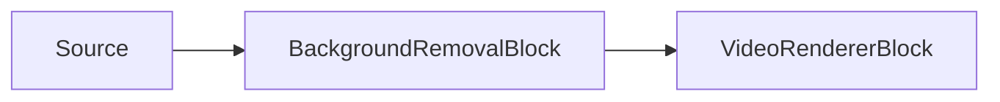

# AI Background Removal (Matting) — BackgroundRemovalBlock

`BackgroundRemovalBlock` runs an ONNX segmentation or matting model on RGBA video frames, estimates a
per-pixel foreground alpha mask, and composites a replacement background into the frame. Use it for
portrait matting, virtual background blur, virtual green-screen output, static background replacement,
or transparent RGBA output.



The block lives in `VisioForge.Core.AI` (`VisioForge.DotNet.Core.AI`), uses `BackgroundRemovalSettings`
(which extends `OnnxInferenceSettings`), and has one video `Input` and one video `Output`. It uses an
internal sample grabber for RGBA frames and runs inference on the pipeline streaming thread, so a slow
model can throttle the pipeline. It does not raise a recognition event — the output is the processed
video frame.

## Models and licensing

Set `BackgroundRemovalSettings.Model` to the family that matches the supplied `.onnx` file. The SDK
does not ship model weights in the NuGet package; your application supplies the `.onnx` file.

| Model | Expected input and output | Notes |
| --- | --- | --- |
| `BackgroundRemovalModel.MODNet` (default) | Square input, default `512x512`; direct resize; RGB normalized to -1..1; output alpha matte `[1, 1, H, W]` in 0..1. | Portrait matting, Apache-2.0. |
| `BackgroundRemovalModel.PPMattingV2` | Model fixed size; direct resize; RGB normalized to -1..1; output alpha matte `[1, 1, H, W]` in 0..1. | Real-time human matting from PaddleSeg, Apache-2.0. |
| `BackgroundRemovalModel.U2Net` | `320x320`; direct resize; RGB ImageNet mean/std normalization; first output is rescaled per frame to 0..1. | Salient-object / portrait segmentation, Apache-2.0. Set `InputWidth`/`InputHeight` to `320` if the model uses dynamic input dimensions. |
| `BackgroundRemovalModel.BiRefNet` | Typically `1024x1024`; direct resize; RGB ImageNet mean/std normalization; raw logits are mapped through sigmoid to 0..1. | Higher accuracy and heavier. Code is MIT; verify the specific checkpoint because some weights are trained on non-commercial data. Set `InputWidth`/`InputHeight` to `1024` if the model uses dynamic input dimensions. |
| `BackgroundRemovalModel.Custom` | Uses `InputWidth`, `InputHeight`, and `NormalizeTo01` from `BackgroundRemovalSettings`. | For a model that does not match the built-in conventions. |

!!! note "Model licenses"
    A model's license is set by its origin (training code, weights, and dataset), not by the ONNX
    format. `MODNet`, `PPMattingV2`, and `U2Net` are Apache-2.0. `BiRefNet` code is MIT, but you
    must verify the license of the exact checkpoint you ship.

## How the matting pipeline works

`BackgroundRemovalBlock` is a frame processor, not a separate source or renderer. The upstream block
delivers RGBA frames to an internal sample grabber, the block runs the configured ONNX model when the
frame is selected for inference, and the output frame is pushed downstream with the same video timing.

The ONNX model input size is resolved from the model metadata when the model has fixed dimensions. If
the model uses dynamic dimensions, `InputWidth` and `InputHeight` from `BackgroundRemovalSettings`
are used instead — these default to `512x512` (tuned for `MODNet`) and are **not** adjusted
per-model automatically, so set them yourself for `U2Net` (`320x320`) or `BiRefNet` (`1024x1024`).
The frame is resized directly to that tensor size and converted from RGBA pixels to an RGB `NCHW`
floating-point tensor. The model family controls the normalization:

- `MODNet` and `PPMattingV2` use RGB values normalized to `-1..1`.
- `U2Net` and `BiRefNet` use ImageNet-style RGB mean/std normalization.
- `Custom` uses the generic `NormalizeTo01`, `InputWidth`, and `InputHeight` settings.

After inference, the block reads the first float output as a foreground matte. The last two output
dimensions are treated as matte height and width. `MODNet`, `PPMattingV2`, and `Custom` outputs are
expected to already be in `0..1`; `U2Net` is min/max-normalized per frame; `BiRefNet` raw logits are
converted with sigmoid. If `MaskFeatherAmount` is greater than `0`, the matte is blurred at model
resolution before compositing.

The compositor samples that matte back onto the original frame with bilinear interpolation. For
`Blur`, `SolidColor`, and `Image`, each pixel is blended as `foreground * alpha + background * (1 -
alpha)`. `MaskThreshold` can harden uncertain edges by forcing very low alpha values to background and
very high values to foreground. For `Transparent`, the block keeps the foreground RGB pixels and
writes the matte into the output alpha channel, so the visible result depends on the downstream
renderer or encoder preserving RGBA alpha.

### Choosing a matting model

Use `MODNet` or `PPMattingV2` first for real-time portrait background replacement. They are designed
for human matting and have lower input sizes than high-accuracy salient-object models. `U2Net` is a
good fallback when the subject is not always a person, but its output is a segmentation-style matte
that may need `MaskFeatherAmount` for soft edges. `BiRefNet` is the heavier quality option: it can
produce better fine detail, but its typical `1024x1024` input size is much more expensive, especially
on CPU. Use `Custom` only when your ONNX model follows a different preprocessing or output
convention and you have verified those settings against the exported model.

## Replacement modes

`BackgroundRemovalSettings.ReplacementMode` selects how low-alpha background pixels are replaced.

| Mode | Settings used | Result |
| --- | --- | --- |
| `BackgroundReplacementMode.Blur` (default) | `BlurRadius` | Replaces the background with a blurred copy of the original frame. |
| `BackgroundReplacementMode.SolidColor` | `ReplacementColor` | Fills the background with a solid color; defaults to green (a virtual green screen). |
| `BackgroundReplacementMode.Image` | `BackgroundImagePath`, `ReplacementColor` fallback | Loads a static image and scales it to the frame size. If the image cannot be loaded, the block falls back to `ReplacementColor`. |
| `BackgroundReplacementMode.Transparent` | Foreground alpha mask | Writes the mask to the frame alpha channel. Use an RGBA renderer, encoder, or downstream compositor that preserves alpha. |

Additional matte controls:

| Property | Default | Description |
| --- | --- | --- |
| `MaskThreshold` | `0` | Optional edge hardening. Effective range 0..0.5 (values above 0.5 are clamped). Values at or below the threshold become background, and values at or above `1 - threshold` become foreground. `0` keeps the model's raw soft matte unchanged. |
| `MaskFeatherAmount` | `0` | Optional matte-space blur radius, in matte (model-resolution) pixels, that softens foreground/background edges — the opposite control to `MaskThreshold`. |
| `FramesToSkip` | `0` | Inherited from `OnnxInferenceSettings`. The model runs every `FramesToSkip + 1` frames, while the last matte is composited on every frame. |
| `Provider` / `DeviceId` | `Auto` / `0` | ONNX execution provider and hardware device index. |
| `InputWidth` / `InputHeight` | `512` / `512` | Used for dynamic-input matting models. Fixed-size models report their own input size. |

## Pipeline example

```csharp
using VisioForge.Core.MediaBlocks;
using VisioForge.Core.MediaBlocks.AI;
using VisioForge.Core.MediaBlocks.VideoRendering;
using VisioForge.Core.Types.X.AI;

var settings = new BackgroundRemovalSettings(modelPath)
{
    Model = BackgroundRemovalModel.PPMattingV2,
    ReplacementMode = BackgroundReplacementMode.Blur,
    BlurRadius = 15f,
    MaskFeatherAmount = 2,
    Provider = OnnxExecutionProvider.Auto,
    FramesToSkip = 2,
    MaskThreshold = 0.05f,
};

var backgroundRemoval = new BackgroundRemovalBlock(settings);

var videoRenderer = new VideoRendererBlock(pipeline, videoView) { IsSync = false };

pipeline.Connect(source.Output, backgroundRemoval.Input);
pipeline.Connect(backgroundRemoval.Output, videoRenderer.Input);

await pipeline.StartAsync();

Console.WriteLine($"Active provider: {backgroundRemoval.ActiveProvider}");
```

!!! note "Performance"
    The model is not run on every frame when `FramesToSkip` is greater than `0`, but the block still
    composites the replacement background on every frame from the cached matte. This lowers CPU/GPU
    cost without flickering back to the original background between inference frames.

## Use with VideoCaptureCoreX and MediaPlayerCoreX

```csharp
var backgroundRemoval = new BackgroundRemovalBlock(settings);

core.Video_Processing_AddBlock(backgroundRemoval); // before StartAsync (VideoCaptureCoreX)
// player.Video_Processing_AddBlock(backgroundRemoval); // before OpenAsync/PlayAsync (MediaPlayerCoreX)

await core.StartAsync();
```

See [Using AI blocks with VideoCaptureCoreX and MediaPlayerCoreX](x-engines.md) for the full
processing-block API, insertion order, and lifecycle rules shared by every video AI block.

## Use cases

- **Video conferencing and webcam apps** — virtual green screen or background blur without a physical
  green screen.
- **Livestreaming and broadcast overlays** — composite a presenter over a branded background or scene.
- **Virtual studio / product photography video** — replace a plain backdrop with a custom scene.
- **Privacy blurring** — blur the background in a recording so only the foreground subject is sharp.

## Troubleshooting

| Symptom | Likely cause | Fix |
| --- | --- | --- |
| Edges around hair/fingers look hard or blocky | Matte edges not softened | Raise `MaskFeatherAmount`. |
| Background bleeds through solid areas (semi-transparent artifacts) | Matte is too soft for a high-contrast scene | Raise `MaskThreshold` (effective range 0..0.5) to harden the foreground/background split. |
| Wrong crop/scale in the output | `InputWidth`/`InputHeight` don't match the model | For a dynamic-input model, set them to that model's expected size (`320` for `U2Net`, `1024` for `BiRefNet`); a fixed-size model reports and uses its own size regardless. |
| `Transparent` mode shows an opaque background | Downstream renderer/encoder doesn't preserve alpha | Use an RGBA-capable renderer/encoder/compositor; `Transparent` only writes the alpha channel, it doesn't force the rest of the pipeline to honor it. |
| High CPU/GPU usage | Matting model running on every frame | Raise `FramesToSkip` — the last matte is still composited every frame, so motion doesn't flicker back to the original background between inference frames. |

## Frequently Asked Questions

### Which matting model should I start with?

`MODNet` (the default) or `PPMattingV2` for real-time portrait/webcam scenarios — both are tuned for
human matting at a relatively low input size. Use `BiRefNet` only if you need higher fine-detail
accuracy and can afford its heavier `1024x1024` input cost.

### Can I use a virtual green screen without a physical one?

Yes — set `ReplacementMode = BackgroundReplacementMode.SolidColor` (it defaults to green) instead of
`Blur`, `Image`, or `Transparent`.

### Does this block require a GPU?

No, but a GPU execution provider reduces per-frame latency, which matters most for `BiRefNet`'s larger
input size or for high frame-rate live video.

### Can I output a transparent (alpha) video instead of compositing a background?

Yes — set `ReplacementMode = BackgroundReplacementMode.Transparent`. The block writes the foreground
alpha into the frame's alpha channel; your renderer, encoder, or downstream compositor must preserve
RGBA to make use of it.

## Demo

- **[Background Removal Demo](https://github.com/visioforge/.Net-SDK-s-samples/tree/master/Media%20Blocks%20SDK/WPF/CSharp/Background%20Removal%20Demo)** —
  WPF demo with webcam, file, and RTSP sources, downloadable matting models, blur, solid color,
  image, and transparent replacement modes.
