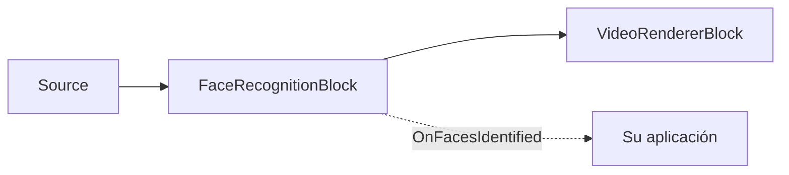

# SDK de reconocimiento facial para .NET — FaceRecognitionBlock

`FaceRecognitionBlock` es el componente de reconocimiento facial de los paquetes de IA .NET de
VisioForge — reconoce **quién** aparece en el fotograma, en el dispositivo, sin API en la nube.
Ejecuta un pipeline de dos etapas: un detector YuNet localiza los rostros y sus cinco puntos de
referencia, cada rostro se alinea a un recorte canónico de 112x112 y se convierte en un embedding
(SFace o ArcFace), y el embedding se compara 1:N contra una `FaceGallery` registrada mediante
similitud de coseno. El reconocimiento se ejecuta en un hilo en segundo plano, de modo que el video
en vivo nunca se detiene; el hilo de streaming solo dibuja los resultados más recientes.



## Registrar y reconocer

```csharp
using VisioForge.Core.MediaBlocks.AI;
using VisioForge.Core.Types.X.AI;

var settings = new FaceRecognitionSettings(
    "face_detection_yunet_2023mar.onnx",
    "face_recognition_sface_2021dec.onnx")
{
    EmbeddingModel = FaceEmbeddingModel.SFace, // o ArcFace para un reconocedor de 512-D
    RecognitionThreshold = 0.36f,              // similitud de coseno para una coincidencia
    DrawResults = true,
};

var face = new FaceRecognitionBlock(settings);

// Registre identidades desde una ruta de archivo o un SKBitmap en memoria (se permiten varias fotos por persona).
face.Enroll("Alice", "alice.jpg");
face.Enroll("Bob", "bob.jpg");
face.Gallery.Save("faces.dat"); // vuelva a cargarla más tarde con face.Gallery.Load("faces.dat")

face.OnFacesIdentified += (sender, e) =>
{
    foreach (var f in e.Faces)
    {
        var who = string.IsNullOrEmpty(f.Identity) ? "Unknown" : f.Identity;
        Console.WriteLine($"{who} ({f.Similarity:P0}) at {f.BoundingBox}");
    }
};

pipeline.Connect(source.Output, face.Input);
pipeline.Connect(face.Output, videoRenderer.Input);

await pipeline.StartAsync();
```

Los modelos predeterminados — [YuNet](https://github.com/opencv/opencv_zoo) (MIT) y
[SFace](https://github.com/opencv/opencv_zoo) (Apache-2.0) — están diseñados para trabajar juntos
(SFace se alinea con los cinco puntos de referencia de YuNet). La longitud del embedding se lee del
modelo, de modo que un reconocedor de estilo ArcFace (por ejemplo
[AuraFace](https://huggingface.co/fal/AuraFace-v1), Apache-2.0, 512-D) se integra simplemente
cambiando `EmbeddingModel` a `FaceEmbeddingModel.ArcFace`. Mantenga una galería por modelo de
embedding — los embeddings de modelos distintos no son comparables entre sí. Los pesos de los
modelos no se incluyen en el paquete NuGet.

Cada `FaceRecognitionResult` incluye la `Identity` encontrada (`null` cuando es desconocida), la
`Similarity` (similitud de coseno de la mejor coincidencia en la galería), `DetectionScore`, el
`BoundingBox` alineado con los ejes, el `Polygon` de las esquinas del cuadro, los cinco
`Landmarks` faciales y el vector `Embedding` en bruto normalizado con L2.

## Configuración del reconocimiento facial

`FaceRecognitionSettings(detectorModelPath, embeddingModelPath)`:

| Propiedad | Predeterminado | Descripción |
| --- | --- | --- |
| `DetectorModelPath` | — | Ruta del modelo ONNX de detección facial, normalmente YuNet. Obligatorio. |
| `EmbeddingModelPath` | — | Ruta del modelo ONNX de embedding facial, normalmente SFace o de estilo ArcFace. Obligatorio. |
| `EmbeddingModel` | `SFace` | Selecciona el preprocesamiento de recorte alineado para la familia del modelo de embedding (`SFace` o `ArcFace`). |
| `Gallery` | `null` | Identidades registradas usadas para la comparación 1:N. Cuando es `null`/está vacía, los rostros se detectan y se calcula su embedding, pero se reportan como desconocidos. `FaceRecognitionBlock.Gallery` expone la galería activa. |
| `Provider` / `DeviceId` | `Auto` / `0` | Proveedor de ejecución ONNX e índice del dispositivo de hardware. |
| `FramesToSkip` | `0` | Omite fotogramas entre ejecuciones de reconocimiento en video en vivo. |
| `DetectionInputSize` | `320` | Tamaño de entrada cuadrado del detector. YuNet requiere un múltiplo de 32; los valores que no lo son se redondean internamente hacia arriba. |
| `DetectionConfidenceThreshold` | `0.6` | Puntuación mínima del detector de rostros. |
| `NmsThreshold` | `0.3` | Umbral de IoU para suprimir cuadros de rostros superpuestos. |
| `MaxFaces` | `20` | Número máximo de rostros detectados por fotograma. |
| `RecognitionThreshold` | `0.36` | Similitud de coseno mínima para reportar una identidad conocida (el umbral de misma identidad de SFace). |
| `DrawResults` / `DrawLandmarks` | `true` / `false` | Dibuja cuadros, etiquetas y, opcionalmente, los cinco puntos de referencia faciales. |
| `BoxColor` / `BoxThickness` / `LabelFontSize` | LimeGreen / `2` / `0` | Estilo de la superposición; `LabelFontSize = 0` ajusta la escala automáticamente según la altura del fotograma. |

## FaceGallery

`FaceGallery` es una galería en memoria, segura para subprocesos, de identidades registradas. Cada
identidad puede almacenar varios embeddings normalizados con L2 (registra varias fotos por persona
para mayor robustez); una consulta coincide según la máxima similitud de coseno entre todos los
embeddings almacenados de todas las identidades.

- `Add(name, embedding)` — registra una copia normalizada del embedding; lanza una excepción si su
  longitud no coincide con los embeddings ya presentes en la galería (un modelo de embedding
  distinto).
- `Identify(embedding, threshold, out score)` — devuelve el nombre de la identidad con mejor
  coincidencia cuando su puntuación alcanza `threshold`; en caso contrario, `null`; `score` siempre
  recibe la mejor puntuación encontrada.
- `Remove(name)`, `Clear()`, `Count`, `GetNames()`.
- `Save(path)` / `Load(path)` — guarda y restaura desde un archivo binario versionado.

`FaceRecognitionBlock.Enroll(name, imagePath)` y `Enroll(name, SKBitmap)` calculan el embedding por
usted y llaman internamente a `Gallery.Add`.

!!! warning "Privacidad"
    El reconocimiento facial procesa datos biométricos. Asegúrese de que su uso cumple con las leyes
    de privacidad y protección de datos aplicables (GDPR, BIPA, CCPA y similares) en su
    jurisdicción.

## Uso con VideoCaptureCoreX y MediaPlayerCoreX

```csharp
var face = new FaceRecognitionBlock(settings);
face.Enroll("Alice", "alice.jpg");
face.OnFacesIdentified += Face_OnFacesIdentified;

core.Video_Processing_AddBlock(face); // antes de StartAsync (VideoCaptureCoreX)
// player.Video_Processing_AddBlock(face); // antes de OpenAsync/PlayAsync (MediaPlayerCoreX)

await core.StartAsync();
```

Consulte [Uso de bloques de IA con VideoCaptureCoreX y MediaPlayerCoreX](x-engines.md) para conocer
la API completa de bloques de procesamiento, el orden de inserción y las reglas de ciclo de vida
compartidas por todos los bloques de IA de video.

## Casos de uso

- **Control de acceso y asistencia** — reconoce a empleados o residentes registrados en una cámara
  de puerta o un kiosco, en el dispositivo, sin enviar rostros a un servicio en la nube de terceros.
- **Personalización** — saluda por su nombre a un usuario registrado que regresa en una aplicación
  de kiosco o espejo inteligente.
- **Alertas VIP / lista de vigilancia** — genera un evento de la aplicación cuando se detecta una
  identidad registrada específica.
- **Deduplicación de material grabado** — agrupa segmentos de video según qué identidades
  registradas aparecen en ellos.

`FaceRecognitionBlock` es un componente de *identificación 1:N* (quién es esta persona, dentro de
una galería conocida), no un sistema de *verificación 1:1* ni de detección de vida/anti-suplantación
— añada comprobaciones adicionales si su escenario las necesita (por ejemplo, autorización de
pagos).

## Solución de problemas

| Síntoma | Causa probable | Solución |
| --- | --- | --- |
| Todos se reportan como "Unknown" | `RecognitionThreshold` demasiado alto, o la galería está vacía/no asignada | Confirme que `Gallery` tiene identidades registradas; baje ligeramente `RecognitionThreshold` si las fotos de registro son de menor calidad. |
| Se reporta la identidad incorrecta para un rostro conocido | Desajuste del modelo de embedding entre la galería y el reconocedor, o muy pocas fotos de registro | Nunca mezcle embeddings de distintos valores de `EmbeddingModel` en una misma galería; registre 2-3 fotos por persona desde distintos ángulos/iluminación. |
| Los rostros se pasan por alto por completo | `DetectionConfidenceThreshold` demasiado alto, o los rostros son más pequeños de lo que `DetectionInputSize` puede resolver | Baje `DetectionConfidenceThreshold`; aumente `DetectionInputSize` (debe seguir siendo múltiplo de 32) para rostros pequeños/lejanos. |
| `FaceGallery.Load` lanza `InvalidDataException` | El archivo no fue escrito por `FaceGallery.Save`, o proviene de una versión del SDK incompatible | Cargue solo archivos que su propia aplicación haya escrito con `Save`; el formato está versionado y rechaza por diseño archivos corruptos o ajenos. |
| Alto uso de CPU con varios rostros en pantalla | El reconocimiento se ejecuta por cada rostro detectado | Baje `MaxFaces`, aumente `FramesToSkip`, o use un proveedor de ejecución en GPU. |

## Preguntas frecuentes

### ¿Este SDK de reconocimiento facial funciona en la nube o en el dispositivo?

Totalmente en el dispositivo. `FaceRecognitionBlock` ejecuta la detección YuNet y el embedding
SFace/ArcFace mediante inferencia local con ONNX Runtime — ningún fotograma ni embedding se envía a
un servicio externo.

### ¿Puede usar este SDK de reconocimiento facial desde C#?

Sí — todo el SDK, incluyendo `FaceRecognitionBlock`, `FaceRecognitionSettings` y `FaceGallery`, es
una API nativa de C#/.NET (`VisioForge.DotNet.Core.AI`), utilizable desde cualquier aplicación .NET
en Windows, macOS, Linux, Android o iOS.

### ¿Cómo registro a una nueva persona?

Llame a `FaceRecognitionBlock.Enroll(name, imagePath)` o `Enroll(name, SKBitmap)` con una o más
fotos claras de la persona; el bloque calcula el embedding y lo añade a `Gallery` por usted. Guarde
la galería con `FaceGallery.Save(path)` y restáurela más tarde con `FaceGallery.Load(path)`.

### ¿El SDK incluye detección facial sin reconocimiento?

Sí, de forma indirecta — `FaceRecognitionResult` reporta `DetectionScore` y `BoundingBox` para cada
rostro detectado, coincida o no con una entrada de la galería. Deje `Gallery` vacía para usar el
bloque como un detector de rostros puro.

### ¿Es mejor SFace o ArcFace?

SFace (el valor predeterminado, 128-D, Apache-2.0) se combina directamente con los cinco puntos de
referencia del detector YuNet y es más ligero. Los reconocedores de estilo ArcFace (por ejemplo
AuraFace, 512-D) pueden ser más precisos para algunos conjuntos de datos. Evalúe ambos con sus
propias fotos de registro y el hardware de destino antes de elegir.

## Demos

- **[Face Recognition Demo](https://github.com/visioforge/.Net-SDK-s-samples/tree/master/Media%20Blocks%20SDK/WPF/CSharp/Face%20Recognition%20Demo)** — demo de Media Blocks para WPF con registro e identidad facial 1:N en vivo.
- **[Face Recognition MB](https://github.com/visioforge/.Net-SDK-s-samples/tree/master/Media%20Blocks%20SDK/MAUI/Face%20Recognition%20MB)** — el mismo demo de Media Blocks para MAUI (Android, iOS, Windows, macOS).
- **[Face Recognition CLI](https://github.com/visioforge/.Net-SDK-s-samples/tree/master/Media%20Blocks%20SDK/Console/Face%20Recognition%20CLI)** — demo de consola sin interfaz gráfica.

Los demos dedicados de reconocimiento facial para `VideoCaptureCoreX`/`MediaPlayerCoreX`
(`Capture Face Recognition X`, `Capture Face Recognition X WPF`, `Player Face Recognition X`,
`Player Face Recognition X WPF`) forman parte del conjunto de demos del SDK y se enlazarán aquí una
vez publicados en el repositorio público de muestras.
