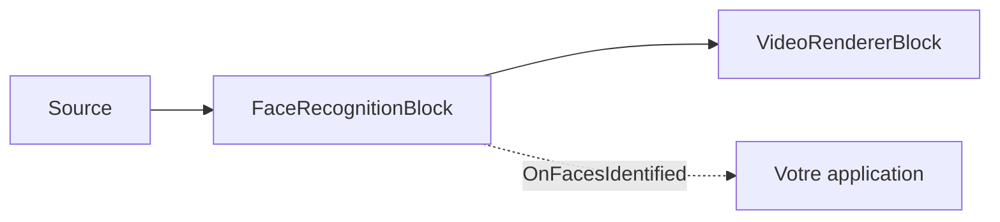

# SDK de reconnaissance faciale pour .NET — FaceRecognitionBlock

`FaceRecognitionBlock` est le composant de reconnaissance faciale des paquets IA .NET de VisioForge —
il reconnaît **qui** se trouve dans l'image, en local, sans API cloud. Il exécute un pipeline en deux
étapes : un détecteur YuNet localise les visages et leurs cinq points de repère, chaque visage est
aligné sur un recadrage canonique de 112x112 puis transformé en embedding (SFace ou ArcFace), et
l'embedding est comparé 1:N à une `FaceGallery` inscrite par similarité cosinus. La reconnaissance
s'exécute sur un thread d'arrière-plan, si bien que la vidéo en direct ne se bloque jamais ; le thread
de diffusion se contente de dessiner les résultats les plus récents.



## Inscrire et reconnaître

```csharp
using VisioForge.Core.MediaBlocks.AI;
using VisioForge.Core.Types.X.AI;

var settings = new FaceRecognitionSettings(
    "face_detection_yunet_2023mar.onnx",
    "face_recognition_sface_2021dec.onnx")
{
    EmbeddingModel = FaceEmbeddingModel.SFace, // ou ArcFace pour un reconnaisseur en 512 dimensions
    RecognitionThreshold = 0.36f,              // similarité cosinus pour une correspondance
    DrawResults = true,
};

var face = new FaceRecognitionBlock(settings);

// Inscrire des identités à partir d'un chemin de fichier ou d'un SKBitmap en mémoire (plusieurs photos par personne sont autorisées).
face.Enroll("Alice", "alice.jpg");
face.Enroll("Bob", "bob.jpg");
face.Gallery.Save("faces.dat"); // à recharger plus tard avec face.Gallery.Load("faces.dat")

face.OnFacesIdentified += (sender, e) =>
{
    foreach (var f in e.Faces)
    {
        var who = string.IsNullOrEmpty(f.Identity) ? "Unknown" : f.Identity;
        Console.WriteLine($"{who} ({f.Similarity:P0}) at {f.BoundingBox}");
    }
};

pipeline.Connect(source.Output, face.Input);
pipeline.Connect(face.Output, videoRenderer.Input);

await pipeline.StartAsync();
```

Les modèles par défaut — [YuNet](https://github.com/opencv/opencv_zoo) (MIT) et
[SFace](https://github.com/opencv/opencv_zoo) (Apache-2.0) — sont conçus pour fonctionner ensemble
(SFace s'aligne sur les cinq points de repère de YuNet). La longueur de l'embedding est lue depuis le
modèle, si bien qu'un reconnaisseur de type ArcFace (par exemple
[AuraFace](https://huggingface.co/fal/AuraFace-v1), Apache-2.0, 512 dimensions) s'intègre simplement
en basculant `EmbeddingModel` sur `FaceEmbeddingModel.ArcFace`. Conservez une seule galerie par modèle
d'embedding — les embeddings de modèles différents ne sont pas comparables. Les poids des modèles ne
sont pas fournis dans le paquet NuGet.

Chaque `FaceRecognitionResult` transporte l'`Identity` correspondante (`null` si inconnue), la
`Similarity` (similarité cosinus de la meilleure correspondance dans la galerie), le `DetectionScore`,
la `BoundingBox` alignée sur les axes, le `Polygon` des coins du cadre, les cinq `Landmarks` faciaux et
le vecteur `Embedding` brut normalisé L2.

## Paramètres de reconnaissance faciale

`FaceRecognitionSettings(detectorModelPath, embeddingModelPath)` :

| Propriété | Par défaut | Description |
| --- | --- | --- |
| `DetectorModelPath` | — | Chemin du modèle ONNX de détection de visages, généralement YuNet. Obligatoire. |
| `EmbeddingModelPath` | — | Chemin du modèle ONNX d'embedding facial, généralement SFace ou de type ArcFace. Obligatoire. |
| `EmbeddingModel` | `SFace` | Sélectionne le prétraitement de recadrage aligné pour la famille du modèle d'embedding (`SFace` ou `ArcFace`). |
| `Gallery` | `null` | Identités inscrites utilisées pour la correspondance 1:N. Lorsque la galerie est `null`/vide, les visages sont détectés et encodés mais signalés comme inconnus. `FaceRecognitionBlock.Gallery` expose la galerie active. |
| `Provider` / `DeviceId` | `Auto` / `0` | Fournisseur d'exécution ONNX et index du périphérique matériel. |
| `FramesToSkip` | `0` | Ignore des images entre deux exécutions de reconnaissance sur la vidéo en direct. |
| `DetectionInputSize` | `320` | Taille carrée d'entrée du détecteur. YuNet exige un multiple de 32 ; les valeurs non multiples sont arrondies à la hausse en interne. |
| `DetectionConfidenceThreshold` | `0.6` | Score minimal du détecteur de visages. |
| `NmsThreshold` | `0.3` | Seuil IoU pour supprimer les cadres de visages qui se chevauchent. |
| `MaxFaces` | `20` | Nombre maximal de visages détectés par image. |
| `RecognitionThreshold` | `0.36` | Similarité cosinus minimale pour signaler une identité connue (seuil de même identité de SFace). |
| `DrawResults` / `DrawLandmarks` | `true` / `false` | Dessine les cadres, les étiquettes et, en option, les cinq points de repère faciaux. |
| `BoxColor` / `BoxThickness` / `LabelFontSize` | Vert citron / `2` / `0` | Style de la superposition ; `LabelFontSize = 0` s'adapte automatiquement à la hauteur de l'image. |

## FaceGallery

`FaceGallery` est une galerie d'identités inscrites, en mémoire et thread-safe. Chaque identité peut
contenir plusieurs embeddings normalisés L2 (inscrivez plusieurs photos par personne pour plus de
robustesse) ; une requête correspond à la similarité cosinus maximale sur l'ensemble des embeddings
stockés pour toutes les identités.

- `Add(name, embedding)` — inscrit une copie normalisée de l'embedding ; lève une exception si sa
  longueur ne correspond pas aux embeddings déjà présents dans la galerie (modèle d'embedding
  différent).
- `Identify(embedding, threshold, out score)` — renvoie le nom de l'identité correspondant le mieux
  lorsque son score atteint `threshold`, sinon `null` ; `score` reçoit toujours le meilleur score
  trouvé.
- `Remove(name)`, `Clear()`, `Count`, `GetNames()`.
- `Save(path)` / `Load(path)` — enregistre dans un fichier binaire versionné et le restaure.

`FaceRecognitionBlock.Enroll(name, imagePath)` et `Enroll(name, SKBitmap)` calculent l'embedding pour
vous et appellent `Gallery.Add` en interne.

!!! warning "Confidentialité"
    La reconnaissance faciale traite des données biométriques. Assurez-vous que votre usage respecte
    les lois applicables en matière de confidentialité et de protection des données (RGPD, BIPA, CCPA
    et lois similaires) dans votre juridiction.

## Utilisation avec VideoCaptureCoreX et MediaPlayerCoreX

```csharp
var face = new FaceRecognitionBlock(settings);
face.Enroll("Alice", "alice.jpg");
face.OnFacesIdentified += Face_OnFacesIdentified;

core.Video_Processing_AddBlock(face); // avant StartAsync (VideoCaptureCoreX)
// player.Video_Processing_AddBlock(face); // avant OpenAsync/PlayAsync (MediaPlayerCoreX)

await core.StartAsync();
```

Consultez [Utiliser les blocs IA avec VideoCaptureCoreX et MediaPlayerCoreX](x-engines.md) pour l'API
complète des blocs de traitement, l'ordre d'insertion et les règles de cycle de vie partagées par tous
les blocs vidéo IA.

## Cas d'usage

- **Contrôle d'accès et pointage** — reconnaître les employés ou résidents inscrits à une caméra de
  porte ou une borne, en local, sans envoyer de visages vers un service cloud tiers.
- **Personnalisation** — saluer par son nom un utilisateur inscrit qui revient, dans une borne ou une
  application de miroir intelligent.
- **Alertes VIP / liste de surveillance** — déclencher un événement applicatif lorsqu'une identité
  inscrite spécifique est repérée.
- **Déduplication de séquences** — regrouper des segments vidéo selon les identités inscrites qui y
  apparaissent.

`FaceRecognitionBlock` est un composant d'*identification 1:N* (qui est-ce, parmi une galerie
connue), pas un système de *vérification 1:1* ou de détection de vivacité/anti-usurpation — ajoutez
des contrôles supplémentaires si votre scénario en a besoin (par exemple, l'autorisation de paiement).

## Dépannage

| Symptôme | Cause probable | Solution |
| --- | --- | --- |
| Tout le monde est signalé comme « Unknown » | `RecognitionThreshold` trop élevé, ou la galerie est vide/non assignée | Vérifiez que `Gallery` contient des identités inscrites ; abaissez légèrement `RecognitionThreshold` si les photos d'inscription sont de qualité moindre. |
| Une mauvaise identité est signalée pour un visage connu | Incompatibilité de modèle d'embedding entre la galerie et le reconnaisseur, ou trop peu de photos d'inscription | Ne mélangez jamais des embeddings de valeurs `EmbeddingModel` différentes dans une même galerie ; inscrivez 2 à 3 photos par personne sous des angles/éclairages différents. |
| Des visages ne sont pas du tout détectés | `DetectionConfidenceThreshold` trop élevé, ou visages plus petits que ce que `DetectionInputSize` peut résoudre | Abaissez `DetectionConfidenceThreshold` ; augmentez `DetectionInputSize` (doit rester un multiple de 32) pour les visages petits/éloignés. |
| `FaceGallery.Load` lève `InvalidDataException` | Le fichier n'a pas été écrit par `FaceGallery.Save`, ou provient d'une version de SDK incompatible | Ne chargez que des fichiers écrits par votre propre application avec `Save` ; le format est versionné et rejette par conception les fichiers corrompus ou étrangers. |
| Usage CPU élevé avec plusieurs visages à l'écran | La reconnaissance s'exécute pour chaque visage détecté | Réduisez `MaxFaces`, augmentez `FramesToSkip`, ou utilisez un fournisseur d'exécution GPU. |

## Foire aux questions

### Ce SDK de reconnaissance faciale est-il basé sur le cloud ou local ?

Entièrement local. `FaceRecognitionBlock` exécute la détection YuNet et l'embedding SFace/ArcFace via
une inférence ONNX Runtime locale — aucune image ni aucun embedding n'est envoyé à un service externe.

### Puis-je utiliser ce SDK de reconnaissance faciale depuis C# ?

Oui — l'ensemble du SDK, y compris `FaceRecognitionBlock`, `FaceRecognitionSettings` et `FaceGallery`,
est une API C#/.NET native (`VisioForge.DotNet.Core.AI`), utilisable depuis n'importe quelle
application .NET sous Windows, macOS, Linux, Android ou iOS.

### Comment inscrire une nouvelle personne ?

Appelez `FaceRecognitionBlock.Enroll(name, imagePath)` ou `Enroll(name, SKBitmap)` avec une ou
plusieurs photos nettes de la personne ; le bloc calcule l'embedding et l'ajoute à `Gallery` pour vous.
Persistez la galerie avec `FaceGallery.Save(path)` et restaurez-la plus tard avec
`FaceGallery.Load(path)`.

### Le SDK inclut-il la détection de visages sans reconnaissance ?

Oui, indirectement — `FaceRecognitionResult` renvoie `DetectionScore` et `BoundingBox` pour chaque
visage détecté, qu'il corresponde ou non à une entrée de la galerie. Laissez `Gallery` vide pour
utiliser le bloc comme un simple détecteur de visages.

### SFace ou ArcFace, lequel est le meilleur ?

SFace (l'option par défaut, 128 dimensions, Apache-2.0) s'associe directement aux cinq points de
repère du détecteur YuNet et est plus léger. Les reconnaisseurs de type ArcFace (par exemple AuraFace,
512 dimensions) peuvent être plus précis pour certains jeux de données. Comparez les deux sur vos
propres photos d'inscription et votre matériel cible avant de choisir.

## Démos

- **[Face Recognition Demo](https://github.com/visioforge/.Net-SDK-s-samples/tree/master/Media%20Blocks%20SDK/WPF/CSharp/Face%20Recognition%20Demo)** — démo WPF Media Blocks avec inscription et identification faciale 1:N en direct.
- **[Face Recognition MB](https://github.com/visioforge/.Net-SDK-s-samples/tree/master/Media%20Blocks%20SDK/MAUI/Face%20Recognition%20MB)** — la même démo Media Blocks pour MAUI (Android, iOS, Windows, macOS).
- **[Face Recognition CLI](https://github.com/visioforge/.Net-SDK-s-samples/tree/master/Media%20Blocks%20SDK/Console/Face%20Recognition%20CLI)** — démo console sans interface graphique.

Des démos dédiées `VideoCaptureCoreX`/`MediaPlayerCoreX` pour la reconnaissance faciale
(`Capture Face Recognition X`, `Capture Face Recognition X WPF`, `Player Face Recognition X`,
`Player Face Recognition X WPF`) font partie du jeu de démos du SDK et seront reliées ici une fois
publiées sur le dépôt public d'exemples.
