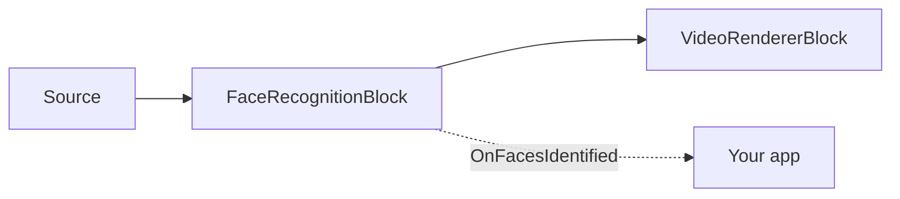

# Face Recognition SDK for .NET — FaceRecognitionBlock

`FaceRecognitionBlock` is the face recognition SDK component of VisioForge's .NET AI packages — it
recognizes **who** is in the frame, on-device, with no cloud API. It runs a two-stage pipeline: a YuNet
detector finds faces and their five landmarks, each face is aligned to a canonical 112x112 crop and
turned into an embedding (SFace or ArcFace), and the embedding is matched 1:N against an enrolled
`FaceGallery` by cosine similarity. Recognition runs on a background thread, so live video never
stalls; the streaming thread only draws the most recent results.



## Enroll and recognize

```csharp
using VisioForge.Core.MediaBlocks.AI;
using VisioForge.Core.Types.X.AI;

var settings = new FaceRecognitionSettings(
    "face_detection_yunet_2023mar.onnx",
    "face_recognition_sface_2021dec.onnx")
{
    EmbeddingModel = FaceEmbeddingModel.SFace, // or ArcFace for a 512-D recognizer
    RecognitionThreshold = 0.36f,              // cosine similarity for a match
    DrawResults = true,
};

var face = new FaceRecognitionBlock(settings);

// Enroll identities from a file path or an in-memory SKBitmap (several photos per person are allowed).
face.Enroll("Alice", "alice.jpg");
face.Enroll("Bob", "bob.jpg");
face.Gallery.Save("faces.dat"); // reload later with face.Gallery.Load("faces.dat")

face.OnFacesIdentified += (sender, e) =>
{
    foreach (var f in e.Faces)
    {
        var who = string.IsNullOrEmpty(f.Identity) ? "Unknown" : f.Identity;
        Console.WriteLine($"{who} ({f.Similarity:P0}) at {f.BoundingBox}");
    }
};

pipeline.Connect(source.Output, face.Input);
pipeline.Connect(face.Output, videoRenderer.Input);

await pipeline.StartAsync();
```

The default models — [YuNet](https://github.com/opencv/opencv_zoo) (MIT) and
[SFace](https://github.com/opencv/opencv_zoo) (Apache-2.0) — are designed to work together (SFace
aligns with YuNet's five landmarks). The embedding length is read from the model, so an ArcFace-style
recognizer (for example [AuraFace](https://huggingface.co/fal/AuraFace-v1), Apache-2.0, 512-D) drops
in by switching `EmbeddingModel` to `FaceEmbeddingModel.ArcFace`. Keep one gallery per embedding
model — embeddings from different models are not comparable. Model weights are not shipped in the
NuGet package.

Each `FaceRecognitionResult` carries the matched `Identity` (`null` when unknown), `Similarity`
(cosine similarity of the best gallery match), `DetectionScore`, the axis-aligned `BoundingBox`, the
box-corner `Polygon`, the five facial `Landmarks`, and the raw L2-normalized `Embedding` vector.

## Face recognition settings

`FaceRecognitionSettings(detectorModelPath, embeddingModelPath)`:

| Property | Default | Description |
| --- | --- | --- |
| `DetectorModelPath` | — | Face detection ONNX model path, usually YuNet. Required. |
| `EmbeddingModelPath` | — | Face embedding ONNX model path, usually SFace or ArcFace-style. Required. |
| `EmbeddingModel` | `SFace` | Selects the aligned-crop preprocessing for the embedding model family (`SFace` or `ArcFace`). |
| `Gallery` | `null` | Enrolled identities used for 1:N matching. When `null`/empty, faces are detected and embedded but reported as unknown. `FaceRecognitionBlock.Gallery` exposes the active gallery. |
| `Provider` / `DeviceId` | `Auto` / `0` | ONNX execution provider and hardware device index. |
| `FramesToSkip` | `0` | Skip frames between recognition runs on live video. |
| `DetectionInputSize` | `320` | Square detector input size. YuNet requires a multiple of 32; non-multiples are rounded up internally. |
| `DetectionConfidenceThreshold` | `0.6` | Minimum face detector score. |
| `NmsThreshold` | `0.3` | IoU threshold for suppressing overlapping face boxes. |
| `MaxFaces` | `20` | Maximum faces detected per frame. |
| `RecognitionThreshold` | `0.36` | Minimum cosine similarity for reporting a known identity (the SFace same-identity threshold). |
| `DrawResults` / `DrawLandmarks` | `true` / `false` | Draw boxes, labels, and optionally the five facial landmarks. |
| `BoxColor` / `BoxThickness` / `LabelFontSize` | LimeGreen / `2` / `0` | Overlay styling; `LabelFontSize = 0` auto-scales to frame height. |

## FaceGallery

`FaceGallery` is a thread-safe, in-memory gallery of enrolled identities. Each identity can hold
several L2-normalized embeddings (enroll multiple photos per person for robustness); a query matches
by the maximum cosine similarity across all stored embeddings of all identities.

- `Add(name, embedding)` — enrolls a normalized copy of the embedding; throws if its length doesn't
  match the embeddings already in the gallery (a different embedding model).
- `Identify(embedding, threshold, out score)` — returns the best-matching identity name when its
  score meets `threshold`, otherwise `null`; `score` always receives the best score found.
- `Remove(name)`, `Clear()`, `Count`, `GetNames()`.
- `Save(path)` / `Load(path)` — persist to and restore from a versioned binary file.

`FaceRecognitionBlock.Enroll(name, imagePath)` and `Enroll(name, SKBitmap)` compute the embedding for
you and call `Gallery.Add` internally.

!!! warning "Privacy"
    Face recognition processes biometric data. Ensure your use complies with the applicable privacy
    and data-protection laws (GDPR, BIPA, CCPA, and similar) in your jurisdiction.

## Use with VideoCaptureCoreX and MediaPlayerCoreX

```csharp
var face = new FaceRecognitionBlock(settings);
face.Enroll("Alice", "alice.jpg");
face.OnFacesIdentified += Face_OnFacesIdentified;

core.Video_Processing_AddBlock(face); // before StartAsync (VideoCaptureCoreX)
// player.Video_Processing_AddBlock(face); // before OpenAsync/PlayAsync (MediaPlayerCoreX)

await core.StartAsync();
```

See [Using AI blocks with VideoCaptureCoreX and MediaPlayerCoreX](x-engines.md) for the full
processing-block API, insertion order, and lifecycle rules shared by every video AI block.

## Use cases

- **Access control and attendance** — recognize enrolled employees or residents at a door camera or
  kiosk, on-device, without sending faces to a third-party cloud service.
- **Personalization** — greet a returning, enrolled user by name in a kiosk or smart-mirror app.
- **VIP / watchlist alerts** — raise an application event when a specific enrolled identity is seen.
- **Deduplicating footage** — group video segments by which enrolled identities appear in them.

`FaceRecognitionBlock` is a *1:N identification* component (who is this, out of a known gallery),
not a *1:1 verification* or liveness/anti-spoofing system — build additional checks on top if your
scenario needs them (for example, payment authorization).

## Troubleshooting

| Symptom | Likely cause | Fix |
| --- | --- | --- |
| Everyone is reported as "Unknown" | `RecognitionThreshold` too high, or the gallery is empty/not assigned | Confirm `Gallery` has enrolled identities; lower `RecognitionThreshold` slightly if enrollment photos are lower quality. |
| Wrong identity reported for a known face | Embedding model mismatch between the gallery and the recognizer, or too few enrollment photos | Never mix embeddings from different `EmbeddingModel` values in one gallery; enroll 2-3 photos per person from different angles/lighting. |
| Faces are missed entirely | `DetectionConfidenceThreshold` too high, or faces smaller than `DetectionInputSize` can resolve | Lower `DetectionConfidenceThreshold`; raise `DetectionInputSize` (must stay a multiple of 32) for small/distant faces. |
| `FaceGallery.Load` throws `InvalidDataException` | The file wasn't written by `FaceGallery.Save`, or is from an incompatible SDK version | Only load files your own app wrote with `Save`; the format is versioned and rejects corrupt/foreign files by design. |
| High CPU usage with several faces on screen | Recognition runs per detected face | Lower `MaxFaces`, raise `FramesToSkip`, or use a GPU execution provider. |

## Frequently Asked Questions

### Is this face recognition SDK cloud-based or on-device?

Fully on-device. `FaceRecognitionBlock` runs YuNet detection and SFace/ArcFace embedding through local
ONNX Runtime inference — no frame or embedding is sent to an external service.

### Can I use this face recognition SDK from C#?

Yes — the entire SDK, including `FaceRecognitionBlock`, `FaceRecognitionSettings`, and `FaceGallery`,
is a native C#/.NET API (`VisioForge.DotNet.Core.AI`), usable from any .NET application on Windows,
macOS, Linux, Android, or iOS.

### How do I enroll a new person?

Call `FaceRecognitionBlock.Enroll(name, imagePath)` or `Enroll(name, SKBitmap)` with one or more clear
photos of the person; the block computes the embedding and adds it to `Gallery` for you. Persist the
gallery with `FaceGallery.Save(path)` and restore it later with `FaceGallery.Load(path)`.

### Does the SDK include face detection without recognition?

Yes, indirectly — `FaceRecognitionResult` reports `DetectionScore` and `BoundingBox` for every
detected face, whether or not it matches a gallery entry. Leave `Gallery` empty to use the block as a
pure face detector.

### Is SFace or ArcFace better?

SFace (the default, 128-D, Apache-2.0) pairs directly with the YuNet detector's five landmarks and is
lighter. ArcFace-style recognizers (for example AuraFace, 512-D) can be more accurate for some
datasets. Benchmark both against your own enrollment photos and target hardware before choosing.

## Demos

- **[Face Recognition Demo](https://github.com/visioforge/.Net-SDK-s-samples/tree/master/Media%20Blocks%20SDK/WPF/CSharp/Face%20Recognition%20Demo)** — WPF Media Blocks demo with enrollment and live 1:N face identity.
- **[Face Recognition MB](https://github.com/visioforge/.Net-SDK-s-samples/tree/master/Media%20Blocks%20SDK/MAUI/Face%20Recognition%20MB)** — the same Media Blocks demo for MAUI (Android, iOS, Windows, macOS).
- **[Face Recognition CLI](https://github.com/visioforge/.Net-SDK-s-samples/tree/master/Media%20Blocks%20SDK/Console/Face%20Recognition%20CLI)** — headless console demo.

Dedicated `VideoCaptureCoreX`/`MediaPlayerCoreX` face-recognition demos (`Capture Face Recognition X`,
`Capture Face Recognition X WPF`, `Player Face Recognition X`, `Player Face Recognition X WPF`) are
in the SDK's demo set and will be linked here once published to the public samples repository.
