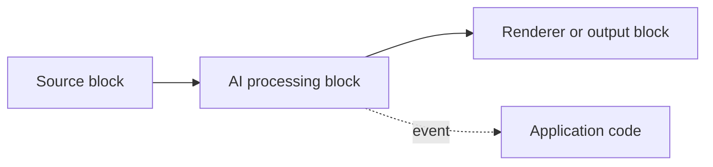

# IA en VisioForge .NET SDK

El soporte de IA de VisioForge está implementado como Media Blocks ordinarios.
Las mismas instancias de bloque pueden colocarse en un `MediaBlocksPipeline`
manual, insertarse en `VideoCaptureCoreX` o insertarse en `MediaPlayerCoreX`.

Los paquetes de IA no sustituyen a los motores multimedia. Añaden bloques de
procesamiento de paso continuo: el contenido multimedia sigue fluyendo aguas
abajo, se dibujan superposiciones opcionales en el fotograma y el bloque
lanza su propio evento con los resultados del reconocimiento.

## Por qué IA en el dispositivo

Todos los bloques de esta página se ejecutan localmente, en el mismo proceso,
sobre ONNX Runtime (vídeo) o Whisper.net/GGML (voz) — no hay llamadas a una
API en la nube, ni facturación por solicitud, ni dependencia de red en el
momento de la inferencia. Eso importa en tres escenarios habituales:

- **Privacidad y cumplimiento normativo** — los fotogramas de vídeo y audio
  nunca salen del dispositivo, lo que simplifica las revisiones de
  GDPR/CCPA/BIPA en aplicaciones de cámara y micrófono (consulte la
  [nota de privacidad](face-recognition.md) específica sobre reconocimiento
  facial).
- **Implementaciones sin conexión y en el borde (edge)** — quioscos, cámaras
  industriales, vehículos y dispositivos de campo pueden ejecutar el
  reconocimiento sin conectividad.
- **Coste y latencia predecibles** — el rendimiento depende del hardware en
  el que se ejecuta, no de los límites de frecuencia o el precio por
  llamada de una API de terceros.

Cada bloque acepta un `OnnxExecutionProvider` (`Auto`, `CPU`, `CUDA`,
`DirectML`, `CoreML`) y un `DeviceId`, de modo que el mismo código puede
ejecutarse solo con CPU en un pipeline de CI y aprovechar una GPU NVIDIA,
DirectX 12 o Apple en una máquina de producción sin cambiar el código.
`Auto` elige el mejor proveedor presente en la compilación nativa de ONNX
Runtime cargada en tiempo de ejecución.

## Paquetes

| Paquete | Propósito principal |
| --- | --- |
| `VisioForge.DotNet.Core.AI` | IA de vídeo con ONNX: OCR, detección de objetos, analítica, reconocimiento facial, matrículas y eliminación de fondo, además de inferencia personalizada. |
| `VisioForge.DotNet.Core.AI.Whisper` | Voz a texto local con Whisper ASR y Silero VAD. |

Ambos paquetes hacen referencia a los tipos del SDK principal. Añada los
mismos paquetes de tiempo de ejecución nativo que ya utiliza su aplicación
anfitriona para Media Blocks, Video Capture X o Media Player X.

## Bloques

| Bloque | Medio | Evento | Uso típico | Detalles |
| --- | --- | --- | --- | --- |
| `OcrBlock` | Vídeo | `OnTextDetected` | Reconocer regiones de texto con modelos PaddleOCR. | [OCR](ocr.md) |
| `YOLOObjectDetectorBlock` | Vídeo | `OnObjectsDetected` | Ejecutar detección de objetos independiente en cada fotograma. | [Detección de objetos](object-detection.md) |
| `ObjectAnalyticsBlock` | Vídeo | `OnAnalyticsUpdated` | Rastrear objetos a lo largo del tiempo, contar cruces de línea y monitorizar zonas poligonales. | [Analítica de objetos](object-analytics.md) |
| `FaceRecognitionBlock` | Vídeo | `OnFacesIdentified` | Detectar rostros y compararlos con una galería registrada. | [Reconocimiento facial](face-recognition.md) |
| `LicensePlateRecognizerBlock` | Vídeo | `OnPlateRecognized` | Detectar y leer matrículas de vehículos. | [Reconocimiento de matrículas](license-plate-recognition.md) |
| `BackgroundRemovalBlock` | Vídeo | ninguno | Sustituir, difuminar o hacer transparente el fondo. | [Eliminación de fondo](background-removal.md) |
| `OnnxInferenceBlock` | Vídeo | `OnInference` | Ejecutar un modelo ONNX personalizado y recibir los tensores de salida en bruto. | [Inferencia ONNX](onnx-inference.md) |
| `SpeechToTextBlock` | Audio | `OnSpeechRecognized` | Transcribir audio en vivo o de archivo con Whisper. | [Voz a texto](speech-to-text.md) |

## Cómo elegir el bloque de IA adecuado

- **¿Necesita leer texto en un fotograma** (señalización, documentos,
  pantallas)? Use [`OcrBlock`](ocr.md).
- **¿Necesita leer la matrícula de un vehículo concreto**, no texto
  genérico? Use
  [`LicensePlateRecognizerBlock`](license-plate-recognition.md) — ejecuta
  un detector de matrículas dedicado más una cabeza OCR específica para
  matrículas, lo que resulta más preciso y rápido que aplicar OCR genérico
  a toda la escena.
- **¿Necesita cuadros y etiquetas para objetos, fotograma a fotograma**? Use
  [`YOLOObjectDetectorBlock`](object-detection.md).
- **¿Necesita contar personas/vehículos que cruzan una línea, o rastrear el
  tiempo de permanencia en una zona**, y no solo cuadros por fotograma? Use
  [`ObjectAnalyticsBlock`](object-analytics.md) — añade seguimiento
  ByteTrack, líneas de disparo (tripwires) y zonas poligonales sobre las
  mismas familias de detectores.
- **¿Necesita saber *quién* está en el encuadre**, no solo *que* hay una
  persona en el encuadre? Use
  [`FaceRecognitionBlock`](face-recognition.md).
- **¿Necesita un fondo virtual, difuminado o salida transparente** para una
  llamada o transmisión? Use
  [`BackgroundRemovalBlock`](background-removal.md).
- **¿Tiene un modelo ONNX personalizado** que no pertenece a ninguna de las
  familias integradas de detección o matting? Use
  [`OnnxInferenceBlock`](onnx-inference.md) y gestione usted mismo el
  postprocesamiento.
- **¿Necesita una transcripción, subtítulos en vivo o subtítulos
  SRT/VTT** a partir de audio? Use
  [`SpeechToTextBlock`](speech-to-text.md).

## Rutas de integración admitidas

Use un pipeline de Media Blocks manual cuando necesite control total sobre la
topología:

Use `VideoCaptureCoreX` cuando la aplicación ya utiliza el motor de captura
de alto nivel y solo necesita insertar uno o más bloques de IA en el grafo
de captura. Registre los bloques de vídeo o audio antes de `StartAsync`.

Use `MediaPlayerCoreX` cuando la aplicación ya utiliza el motor de
reproducción de alto nivel. Registre los bloques de vídeo o audio antes de
`OpenAsync` / `PlayAsync`.

## Reglas de ciclo de vida

Los bloques de IA deben registrarse antes de que el motor construya el
pipeline:

- `VideoCaptureCoreX`: añada los bloques antes de `StartAsync`.
- `MediaPlayerCoreX`: añada los bloques antes de `OpenAsync` / `PlayAsync`.
- Media Blocks manual: conecte el bloque antes de `StartAsync`.

Una vez que el pipeline se inicia, el pipeline es propietario de las
instancias de bloque conectadas y las desecha cuando la sesión se detiene.
Cree una instancia de bloque nueva para la siguiente sesión de captura o
reproducción.

Los eventos de los bloques se lanzan desde subprocesos del pipeline o del
bloque en segundo plano. Mantenga los controladores breves y traslade las
actualizaciones de la interfaz de usuario al despachador de la UI o al
subproceso principal.

## Más detalles

Bloques de IA de vídeo (`VisioForge.DotNet.Core.AI`):

- [OCR — reconocimiento de texto](ocr.md)
- [Detección de objetos](object-detection.md)
- [Analítica de objetos — seguimiento, líneas de disparo y zonas poligonales](object-analytics.md)
- [Reconocimiento facial](face-recognition.md)
- [Reconocimiento de matrículas (ANPR)](license-plate-recognition.md)
- [Eliminación de fondo (matting)](background-removal.md)
- [Inferencia ONNX genérica](onnx-inference.md)

Voz a texto (`VisioForge.DotNet.Core.AI.Whisper`):

- [Voz a texto y subtítulos en vivo](speech-to-text.md)

Integración con motores:

- [Uso de bloques de IA con VideoCaptureCoreX y MediaPlayerCoreX](x-engines.md)

## Preguntas frecuentes

### ¿Los bloques de IA necesitan conexión a internet para funcionar?

No. La inferencia es totalmente local, mediante ONNX Runtime (bloques de
vídeo) o Whisper.net/GGML (`SpeechToTextBlock`). Ningún fotograma ni
muestra de audio se envía a un servicio en la nube durante la inferencia.

### ¿Qué plataformas admiten los bloques de IA?

Los mismos bloques multiplataforma que se usan en pipelines de Media
Blocks, `VideoCaptureCoreX` y `MediaPlayerCoreX` — Windows, macOS, Linux,
Android e iOS.

### ¿Necesito una GPU?

No. Todos los bloques usan por defecto `OnnxExecutionProvider.Auto`, que se
ejecuta en la CPU cuando no hay ningún proveedor de GPU disponible.
Establecer `Provider` en `CUDA`, `DirectML` o `CoreML` acelera la
inferencia cuando están presentes la GPU correspondiente y la compilación
de ONNX Runtime adecuada.

### ¿Dónde consigo los archivos de modelo ONNX y Whisper?

Los pesos de los modelos no se incluyen dentro de los paquetes NuGet
`VisioForge.DotNet.Core.AI` / `VisioForge.DotNet.Core.AI.Whisper`. Su
aplicación proporciona los archivos `.onnx` / `.bin` — apunte la
configuración del bloque a una ruta local. Las propias demos del SDK
descargan los modelos que utilizan desde GitHub Releases en la primera
ejecución y los almacenan en caché localmente.

### ¿Qué licencia se aplica a los modelos que usan las demos?

Varía según la familia de modelos y es independiente de la licencia del
propio SDK — consulte la sección "Modelos y licencias" en la página de
cada bloque
([OCR](ocr.md#modelos-y-licencias),
[detección de objetos](object-detection.md#familias-de-detectores-admitidas),
[reconocimiento facial](face-recognition.md),
[eliminación de fondo](background-removal.md#modelos-y-licencias)). En
resumen: PP-OCR, YOLOX, RT-DETR, YuNet, SFace y los modelos ANPR de
FastALPR son Apache-2.0/MIT; los pesos estándar de Ultralytics YOLOv8 son
AGPL-3.0 y requieren una licencia comercial de Ultralytics en un producto
de código cerrado; los pesos GGML de Whisper son MIT.

### ¿Puedo ejecutar más de un bloque de IA en el mismo pipeline?

Sí. Encadene varios bloques de vídeo (por ejemplo, `OcrBlock` seguido de
`BackgroundRemovalBlock`) conectando `Output` con `Input` en secuencia, o
registre varios bloques de vídeo/audio en
`VideoCaptureCoreX`/`MediaPlayerCoreX` con
`Video_Processing_AddBlock`/`Audio_Processing_AddBlock`. Cada bloque añade
su propio coste de inferencia al pipeline, así que mida el rendimiento de
extremo a extremo en su hardware de destino al combinar varios.
