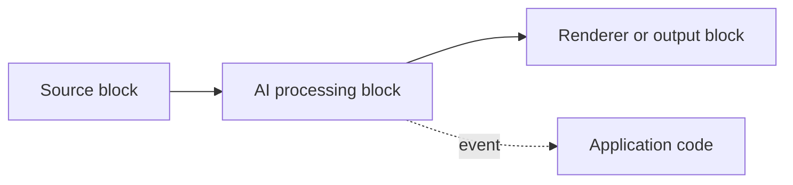

# IA dans VisioForge .NET SDK

La prise en charge de l'IA VisioForge est implémentée sous forme de blocs média
ordinaires. Les mêmes instances de bloc peuvent être placées dans un
`MediaBlocksPipeline` manuel, insérées dans `VideoCaptureCoreX`, ou insérées
dans `MediaPlayerCoreX`.

Les paquets IA ne remplacent pas les moteurs média. Ils ajoutent des blocs de
traitement en passe-plat : le média continue en aval, des superpositions
optionnelles sont dessinées dans l'image, et le bloc déclenche son propre
événement avec les résultats de reconnaissance.

## Pourquoi l'IA embarquée

Chaque bloc de cette page s'exécute localement, dans le même processus, sur
ONNX Runtime (vidéo) ou Whisper.net/GGML (audio) — il n'y a aucun appel à une
API cloud, aucune facturation par requête, et aucune dépendance réseau au
moment de l'inférence. Cela compte pour trois scénarios courants :

- **Confidentialité et conformité** — les images vidéo et les échantillons
  audio ne quittent jamais l'appareil, ce qui simplifie les revues RGPD/CCPA/
  BIPA pour les applications utilisant caméra et microphone (voir la
  [note sur la confidentialité](face-recognition.md) spécifique à la
  reconnaissance faciale).
- **Déploiements hors ligne et en périphérie** — les bornes interactives,
  caméras industrielles, véhicules et appareils de terrain peuvent exécuter la
  reconnaissance sans connectivité.
- **Coût et latence prévisibles** — le débit dépend du matériel sur lequel
  vous vous exécutez, et non des limites de débit ou de la tarification par
  appel d'une API tierce.

Chaque bloc accepte un `OnnxExecutionProvider` (`Auto`, `CPU`, `CUDA`,
`DirectML`, `CoreML`) et un `DeviceId`, de sorte que le même code peut
s'exécuter uniquement sur CPU dans un pipeline CI et tirer parti d'un GPU
NVIDIA, DirectX 12 ou Apple sur une machine déployée sans modification de
code. `Auto` choisit le meilleur fournisseur présent dans la version native
d'ONNX Runtime chargée au moment de l'exécution.

## Paquets

| Paquet | Objectif principal |
| --- | --- |
| `VisioForge.DotNet.Core.AI` | IA vidéo ONNX : OCR, détection d'objets, analytique, reconnaissance faciale, plaques d'immatriculation et suppression d'arrière-plan, plus inférence personnalisée. |
| `VisioForge.DotNet.Core.AI.Whisper` | Speech-to-text local avec Whisper ASR et Silero VAD. |

Les deux paquets référencent les types du SDK principal. Ajoutez les mêmes
paquets d'exécution natifs que ceux déjà utilisés par votre application hôte
pour Media Blocks, Video Capture X ou Media Player X.

## Blocs

| Bloc | Média | Événement | Usage typique | Détails |
| --- | --- | --- | --- | --- |
| `OcrBlock` | Vidéo | `OnTextDetected` | Reconnaître des zones de texte avec les modèles PaddleOCR. | [OCR](ocr.md) |
| `YOLOObjectDetectorBlock` | Vidéo | `OnObjectsDetected` | Exécuter la détection d'objets autonome sur chaque image. | [Détection d'objets](object-detection.md) |
| `ObjectAnalyticsBlock` | Vidéo | `OnAnalyticsUpdated` | Suivre les objets dans le temps, compter les franchissements de ligne et surveiller les zones polygonales. | [Analytique d'objets](object-analytics.md) |
| `FaceRecognitionBlock` | Vidéo | `OnFacesIdentified` | Détecter les visages et les comparer à une galerie enregistrée. | [Reconnaissance faciale](face-recognition.md) |
| `LicensePlateRecognizerBlock` | Vidéo | `OnPlateRecognized` | Détecter et lire les plaques d'immatriculation. | [Reconnaissance de plaques d'immatriculation](license-plate-recognition.md) |
| `BackgroundRemovalBlock` | Vidéo | aucun | Remplacer, flouter ou rendre transparent l'arrière-plan. | [Suppression d'arrière-plan](background-removal.md) |
| `OnnxInferenceBlock` | Vidéo | `OnInference` | Exécuter un modèle ONNX personnalisé et recevoir les tenseurs de sortie bruts. | [Inférence ONNX](onnx-inference.md) |
| `SpeechToTextBlock` | Audio | `OnSpeechRecognized` | Transcrire l'audio en direct ou depuis un fichier avec Whisper. | [Speech-to-text](speech-to-text.md) |

## Choisir le bon bloc IA

- **Besoin de lire du texte dans une image** (signalétique, documents,
  écrans) ? Utilisez [`OcrBlock`](ocr.md).
- **Besoin de lire une plaque d'immatriculation spécifique**, pas du texte
  général ? Utilisez
  [`LicensePlateRecognizerBlock`](license-plate-recognition.md) — il exécute
  un détecteur de plaques dédié plus une tête OCR spécifique aux plaques, ce
  qui est à la fois plus précis et plus rapide que d'appliquer un OCR
  générique sur une scène entière.
- **Besoin de boîtes et d'étiquettes pour des objets, image par image** ?
  Utilisez [`YOLOObjectDetectorBlock`](object-detection.md).
- **Besoin de compter les personnes/véhicules franchissant une ligne, ou de
  suivre le temps de présence dans une zone**, pas seulement des boîtes par
  image ? Utilisez [`ObjectAnalyticsBlock`](object-analytics.md) — il ajoute
  le suivi ByteTrack, des lignes de déclenchement (tripwires) et des zones
  polygonales par-dessus les mêmes familles de détecteurs.
- **Besoin de savoir *qui* est dans l'image**, pas seulement *qu'une*
  personne est dans l'image ? Utilisez
  [`FaceRecognitionBlock`](face-recognition.md).
- **Besoin d'un arrière-plan virtuel, d'un flou ou d'une sortie
  transparente** pour un appel ou un flux ? Utilisez
  [`BackgroundRemovalBlock`](background-removal.md).
- **Vous avez un modèle ONNX personnalisé** qui ne fait pas partie des
  familles de détecteurs ou de matting intégrées ? Utilisez
  [`OnnxInferenceBlock`](onnx-inference.md) et prenez en charge vous-même le
  post-traitement.
- **Besoin d'une transcription, de sous-titres en direct ou de sous-titres
  SRT/VTT** à partir de l'audio ? Utilisez
  [`SpeechToTextBlock`](speech-to-text.md).

## Chemins d'intégration pris en charge

Utilisez un pipeline Media Blocks manuel lorsque vous avez besoin d'un
contrôle total de la topologie :

Utilisez `VideoCaptureCoreX` lorsque l'application utilise déjà le moteur de
capture de haut niveau et a seulement besoin d'insérer un ou plusieurs blocs
IA dans le graphe de capture. Enregistrez les blocs vidéo ou audio avant
`StartAsync`.

Utilisez `MediaPlayerCoreX` lorsque l'application utilise déjà le moteur de
lecture de haut niveau. Enregistrez les blocs vidéo ou audio avant
`OpenAsync` / `PlayAsync`.

## Règles de cycle de vie

Les blocs IA doivent être enregistrés avant que le moteur ne construise le
pipeline :

- `VideoCaptureCoreX` : ajoutez les blocs avant `StartAsync`.
- `MediaPlayerCoreX` : ajoutez les blocs avant `OpenAsync` / `PlayAsync`.
- Media Blocks manuel : connectez le bloc avant `StartAsync`.

Une fois le pipeline démarré, le pipeline possède les instances de bloc
connectées et les libère à l'arrêt de la session. Créez une nouvelle instance
de bloc pour la prochaine session de capture ou de lecture.

Les événements de bloc sont déclenchés depuis les threads de travail du
pipeline ou du bloc. Gardez les gestionnaires courts et transférez les mises
à jour d'interface utilisateur vers le dispatcher d'interface ou le thread
principal.

## Pour aller plus loin

Blocs IA vidéo (`VisioForge.DotNet.Core.AI`) :

- [OCR — reconnaissance de texte](ocr.md)
- [Détection d'objets](object-detection.md)
- [Analytique d'objets — suivi, lignes de déclenchement et zones polygonales](object-analytics.md)
- [Reconnaissance faciale](face-recognition.md)
- [Reconnaissance de plaques d'immatriculation (ANPR)](license-plate-recognition.md)
- [Suppression d'arrière-plan (matting)](background-removal.md)
- [Inférence ONNX générique](onnx-inference.md)

Speech-to-text (`VisioForge.DotNet.Core.AI.Whisper`) :

- [Speech-to-text et sous-titres en direct](speech-to-text.md)

Intégration au moteur :

- [Utiliser les blocs IA avec VideoCaptureCoreX et MediaPlayerCoreX](x-engines.md)

## Foire aux questions

### Les blocs IA nécessitent-ils une connexion internet pour fonctionner ?

Non. L'inférence est entièrement locale, via ONNX Runtime (blocs vidéo) ou
Whisper.net/GGML (`SpeechToTextBlock`). Aucune image ni aucun échantillon
audio n'est envoyé à un service cloud au moment de l'inférence.

### Quelles plateformes les blocs IA prennent-ils en charge ?

Les mêmes blocs multiplateformes utilisés dans les pipelines Media Blocks,
`VideoCaptureCoreX` et `MediaPlayerCoreX` — Windows, macOS, Linux, Android et
iOS.

### Ai-je besoin d'un GPU ?

Non. Chaque bloc utilise par défaut `OnnxExecutionProvider.Auto`, qui
s'exécute sur le CPU lorsqu'aucun fournisseur GPU n'est disponible. Définir
`Provider` sur `CUDA`, `DirectML` ou `CoreML` accélère l'inférence lorsque le
GPU correspondant et la version d'ONNX Runtime adéquate sont présents.

### Où puis-je obtenir les fichiers de modèles ONNX et Whisper ?

Les poids des modèles ne sont pas fournis dans les paquets NuGet
`VisioForge.DotNet.Core.AI` / `VisioForge.DotNet.Core.AI.Whisper`. Votre
application fournit les fichiers `.onnx` / `.bin` — pointez les paramètres du
bloc vers un chemin local. Les démos du SDK téléchargent elles-mêmes les
modèles qu'elles utilisent depuis GitHub Releases lors de la première
exécution et les mettent en cache localement.

### Quelle licence s'applique aux modèles utilisés par les démos ?

Cela varie selon la famille de modèles et est indépendant de la licence du
SDK lui-même — voir la section « Modèles et licences » sur la page de chaque
bloc ([OCR](ocr.md#modeles-et-licences),
[détection d'objets](object-detection.md#familles-de-detecteurs-prises-en-charge),
[reconnaissance faciale](face-recognition.md),
[suppression d'arrière-plan](background-removal.md#modeles-et-licences)). En
résumé : PP-OCR, YOLOX, RT-DETR, YuNet, SFace et les modèles ANPR FastALPR
sont sous licence Apache-2.0/MIT ; les poids Ultralytics YOLOv8 standard sont
sous licence AGPL-3.0 et nécessitent une licence commerciale Ultralytics dans
un produit propriétaire ; les poids GGML de Whisper sont sous licence MIT.

### Puis-je exécuter plusieurs blocs IA dans le même pipeline ?

Oui. Enchaînez plusieurs blocs vidéo (par exemple `OcrBlock` puis
`BackgroundRemovalBlock`) en connectant `Output` à `Input` en séquence, ou
enregistrez plusieurs blocs vidéo/audio sur
`VideoCaptureCoreX`/`MediaPlayerCoreX` avec
`Video_Processing_AddBlock`/`Audio_Processing_AddBlock`. Chaque bloc ajoute
son propre coût d'inférence au pipeline ; mesurez donc les performances de
bout en bout sur votre matériel cible lorsque vous en combinez plusieurs.
