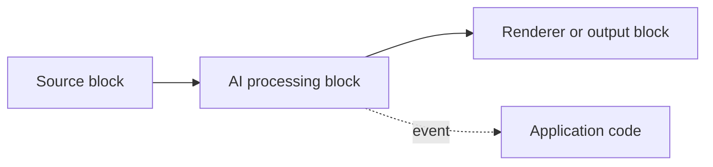

# AI in VisioForge .NET SDK

VisioForge AI support is implemented as ordinary Media Blocks. The same block
instances can be placed in a manual `MediaBlocksPipeline`, inserted into
`VideoCaptureCoreX`, or inserted into `MediaPlayerCoreX`.

The AI packages do not replace the media engines. They add pass-through
processing blocks: media continues downstream, optional overlays are drawn into
the frame, and the block raises its own event with recognition results.

## Why on-device AI

Every block on this page runs locally, in-process, on ONNX Runtime (video) or
Whisper.net/GGML (speech) — there is no cloud API call, no per-request billing,
and no network dependency at inference time. That matters for three common
scenarios:

- **Privacy and compliance** — video and audio frames never leave the device,
  which simplifies GDPR/CCPA/BIPA reviews for camera and microphone
  applications (see the [privacy note](face-recognition.md) on face
  recognition specifically).
- **Offline and edge deployments** — kiosks, industrial cameras, vehicles, and
  field devices can run recognition without connectivity.
- **Predictable cost and latency** — throughput depends on the hardware you
  run on, not on a third-party API's rate limits or per-call pricing.

Each block accepts an `OnnxExecutionProvider` (`Auto`, `CPU`, `CUDA`,
`DirectML`, `CoreML`) and a `DeviceId`, so the same code can run CPU-only in a
CI pipeline and take advantage of an NVIDIA, DirectX 12, or Apple GPU on a
deployed machine without a code change. `Auto` picks the best provider present
in the loaded ONNX Runtime native build at run time.

## Packages

| Package | Main purpose |
| --- | --- |
| `VisioForge.DotNet.Core.AI` | ONNX video AI: OCR, object detection, analytics, face recognition, license plates, background removal, and custom inference. |
| `VisioForge.DotNet.Core.AI.Whisper` | Local speech-to-text with Whisper ASR and Silero VAD. |

Both packages reference the core SDK types. Add the same native runtime packages
that your host application already uses for Media Blocks, Video Capture X, or
Media Player X.

## Blocks

| Block | Media | Event | Typical use | Details |
| --- | --- | --- | --- | --- |
| `OcrBlock` | Video | `OnTextDetected` | Recognize text regions with PaddleOCR models. | [OCR](ocr.md) |
| `YOLOObjectDetectorBlock` | Video | `OnObjectsDetected` | Run standalone object detection on each frame. | [Object detection](object-detection.md) |
| `ObjectAnalyticsBlock` | Video | `OnAnalyticsUpdated` | Track objects over time, count line crossings, and monitor polygon zones. | [Object analytics](object-analytics.md) |
| `FaceRecognitionBlock` | Video | `OnFacesIdentified` | Detect faces and match them against an enrolled gallery. | [Face recognition](face-recognition.md) |
| `LicensePlateRecognizerBlock` | Video | `OnPlateRecognized` | Detect and read license plates. | [License plate recognition](license-plate-recognition.md) |
| `BackgroundRemovalBlock` | Video | none | Replace, blur, or make the background transparent. | [Background removal](background-removal.md) |
| `OnnxInferenceBlock` | Video | `OnInference` | Run a custom ONNX model and receive raw output tensors. | [ONNX inference](onnx-inference.md) |
| `SpeechToTextBlock` | Audio | `OnSpeechRecognized` | Transcribe live or file audio with Whisper. | [Speech-to-text](speech-to-text.md) |

## Choosing the right AI block

- **Need to read text in a frame** (signage, documents, screens)? Use
  [`OcrBlock`](ocr.md).
- **Need to read a specific vehicle license plate**, not general text? Use
  [`LicensePlateRecognizerBlock`](license-plate-recognition.md) — it runs a
  dedicated plate detector plus a plate-specific OCR head, which is both more
  accurate and faster than pointing generic OCR at a whole scene.
- **Need boxes and labels for objects, one frame at a time**? Use
  [`YOLOObjectDetectorBlock`](object-detection.md).
- **Need to count people/vehicles crossing a line, or track dwell time in a
  zone**, not just per-frame boxes? Use
  [`ObjectAnalyticsBlock`](object-analytics.md) — it adds ByteTrack tracking,
  tripwires, and polygon zones on top of the same detector families.
- **Need to know *who* is in frame**, not just *that* a person is in frame?
  Use [`FaceRecognitionBlock`](face-recognition.md).
- **Need a virtual background, blur, or transparent output** for a call or
  stream? Use [`BackgroundRemovalBlock`](background-removal.md).
- **Have a custom ONNX model** that isn't one of the built-in detector or
  matting families? Use [`OnnxInferenceBlock`](onnx-inference.md) and own the
  post-processing yourself.
- **Need a transcript, live captions, or SRT/VTT subtitles** from audio? Use
  [`SpeechToTextBlock`](speech-to-text.md).

## Supported integration paths

Use a manual Media Blocks pipeline when you need full topology control:

Use `VideoCaptureCoreX` when the application already uses the high-level capture
engine and only needs to insert one or more AI blocks into the capture graph.
Register video or audio blocks before `StartAsync`.

Use `MediaPlayerCoreX` when the application already uses the high-level playback
engine. Register video or audio blocks before `OpenAsync` / `PlayAsync`.

## Lifecycle rules

AI blocks must be registered before the engine builds the pipeline:

- `VideoCaptureCoreX`: add blocks before `StartAsync`.
- `MediaPlayerCoreX`: add blocks before `OpenAsync` / `PlayAsync`.
- Manual Media Blocks: connect the block before `StartAsync`.

After the pipeline starts, the pipeline owns wired block instances and disposes
them when the session stops. Create a fresh block instance for the next capture
or playback session.

Block events are raised from pipeline or block worker threads. Keep handlers
short and marshal UI updates to the UI dispatcher or main thread.

## More detail

Video AI blocks (`VisioForge.DotNet.Core.AI`):

- [OCR — text recognition](ocr.md)
- [Object detection](object-detection.md)
- [Object analytics — tracking, tripwires, and polygon zones](object-analytics.md)
- [Face recognition](face-recognition.md)
- [License plate recognition (ANPR)](license-plate-recognition.md)
- [Background removal (matting)](background-removal.md)
- [Generic ONNX inference](onnx-inference.md)

Speech-to-text (`VisioForge.DotNet.Core.AI.Whisper`):

- [Speech-to-text and live subtitles](speech-to-text.md)

Engine integration:

- [Using AI blocks with VideoCaptureCoreX and MediaPlayerCoreX](x-engines.md)

## Frequently Asked Questions

### Do the AI blocks require an internet connection to run?

No. Inference is entirely local, using ONNX Runtime (video blocks) or
Whisper.net/GGML (`SpeechToTextBlock`). No frame or audio sample is sent to a
cloud service at inference time.

### Which platforms do the AI blocks support?

The same cross-platform blocks used in Media Blocks pipelines, `VideoCaptureCoreX`,
and `MediaPlayerCoreX` — Windows, macOS, Linux, Android, and iOS.

### Do I need a GPU?

No. Every block defaults to `OnnxExecutionProvider.Auto`, which runs on the CPU
when no GPU provider is available. Setting `Provider` to `CUDA`, `DirectML`, or
`CoreML` accelerates inference when the corresponding GPU and ONNX Runtime
build are present.

### Where do I get the ONNX and Whisper model files?

Model weights are not shipped inside the `VisioForge.DotNet.Core.AI` /
`VisioForge.DotNet.Core.AI.Whisper` NuGet packages. Your application supplies
the `.onnx` / `.bin` files — point the block's settings at a local path. The
SDK's own demos download the models they use from GitHub Releases on first
run and cache them locally.

### What license applies to the models the demos use?

It varies by model family and is independent of the SDK's own license — see
the "Models and licensing" section on each block's page
([OCR](ocr.md#models-and-licensing),
[object detection](object-detection.md#supported-detector-families),
[face recognition](face-recognition.md),
[background removal](background-removal.md#models-and-licensing)). In short:
PP-OCR, YOLOX, RT-DETR, YuNet, SFace, and the FastALPR ANPR models are
Apache-2.0/MIT; stock Ultralytics YOLOv8 weights are AGPL-3.0 and need a
commercial Ultralytics license in a closed-source product; Whisper GGML
weights are MIT.

### Can I run more than one AI block in the same pipeline?

Yes. Chain multiple video blocks (for example `OcrBlock` then
`BackgroundRemovalBlock`) by connecting `Output` to `Input` in sequence, or
register several video/audio blocks on `VideoCaptureCoreX`/`MediaPlayerCoreX`
with `Video_Processing_AddBlock`/`Audio_Processing_AddBlock`. Each block adds
its own inference cost to the pipeline, so measure end-to-end performance on
your target hardware when combining several.
