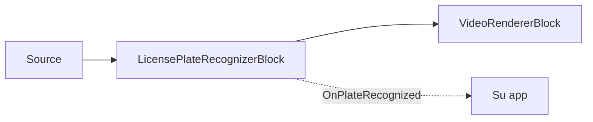

# Reconocimiento de matrículas (ANPR) — LicensePlateRecognizerBlock

`LicensePlateRecognizerBlock` lee matrículas de vehículos mediante una canalización especializada de
dos etapas: un detector de matrículas dedicado (YOLO) localiza las matrículas en el fotograma, y luego un
modelo OCR específico para matrículas lee los caracteres de cada matrícula recortada. Ambos modelos
provienen de la familia FastALPR (MIT): un detector de matrículas YOLOv9-T y una cabeza de reconocimiento
`fast-plate-ocr`. Una cabeza global cubre EE. UU. y más de 90 países; una cabeza europea está ajustada
para matrículas de la UE. La geometría y el alfabeto del modelo de reconocimiento se leen del propio
modelo, por lo que seleccionar una región es simplemente apuntar `RecognitionModelPath` a esa cabeza.



## Uso

```csharp
using VisioForge.Core.MediaBlocks.AI;
using VisioForge.Core.Types.X.AI;

var settings = new LicensePlateRecognizerSettings(detectorModelPath, recognitionModelPath)
{
    Provider = OnnxExecutionProvider.Auto,
    DetectionConfidenceThreshold = 0.35f,
    OcrConfidenceThreshold = 0.3f,
    DrawResults = true,
};

var anpr = new LicensePlateRecognizerBlock(settings);
anpr.OnPlateRecognized += (sender, e) =>
{
    foreach (var plate in e.Plates)
    {
        Console.WriteLine($"Plate: {plate.Text} ({plate.Confidence:P0}) at {plate.BoundingBox}");
    }
};

pipeline.Connect(source.Output, anpr.Input);
pipeline.Connect(anpr.Output, videoRenderer.Input);

await pipeline.StartAsync();
```

Cada `LicensePlateResult` incluye el `Text` reconocido (normalizado: en mayúsculas, sin caracteres no
alfanuméricos), la `Confidence` media (0..1), el `BoundingBox` alineado a los ejes y el `Polygon` de
detección (cuatro vértices `OcrPoint`), todo en píxeles del fotograma de origen.

## Configuración clave

`LicensePlateRecognizerSettings(detectorModelPath, recognitionModelPath)`:

| Propiedad | Valor por defecto | Descripción |
| --- | --- | --- |
| `DetectorModelPath` | — | Modelo ONNX de detección de matrículas (FastALPR YOLOv9-T de extremo a extremo). Obligatorio. |
| `RecognitionModelPath` | — | Modelo ONNX de OCR de matrículas (cabeza `fast-plate-ocr` de FastALPR, global o UE). Obligatorio. |
| `Provider` / `DeviceId` | `Auto` / `0` | Proveedor de ejecución ONNX e índice del dispositivo de hardware. |
| `FramesToSkip` | `0` | Omite fotogramas entre ejecuciones de reconocimiento en vídeo en directo. |
| `DetectionInputSize` | `640` | Tamaño de entrada cuadrado para el modelo de detección (modelos de forma dinámica). |
| `DetectionConfidenceThreshold` | `0.35` | Puntuación mínima del detector que debe alcanzar un cuadro de matrícula. |
| `OcrConfidenceThreshold` | `0.3` | Confianza media mínima del OCR que debe alcanzar una matrícula reconocida para ser reportada. |
| `MaxDetections` | `10` | Número máximo de matrículas detectadas por fotograma. |
| `DrawResults` | `true` | Dibuja los cuadros y el texto de las matrículas en el fotograma de vídeo. |
| `BoxColor` / `BoxThickness` | Amarillo / `3` | Estilo de la superposición. |
| `LabelFontSize` | `0` | `0` escala automáticamente según la altura del fotograma. |

## Modelos y licencias

Tanto el detector como la cabeza de reconocimiento son modelos FastALPR con licencia MIT; el SDK no
distribuye los pesos del modelo dentro del paquete NuGet. Para mayor precisión en escenas concurridas
con muchas matrículas pequeñas o distantes, ejecute un detector de vehículos de propósito general
dedicado (por ejemplo, [`YOLOObjectDetectorBlock`](object-detection.md)) antes en la canalización para
recortar las regiones del vehículo antes del ANPR.

## Uso con VideoCaptureCoreX y MediaPlayerCoreX

```csharp
var anpr = new LicensePlateRecognizerBlock(settings);
anpr.OnPlateRecognized += Anpr_OnPlateRecognized;

core.Video_Processing_AddBlock(anpr); // antes de StartAsync (VideoCaptureCoreX)
// player.Video_Processing_AddBlock(anpr); // antes de OpenAsync/PlayAsync (MediaPlayerCoreX)

await core.StartAsync();
```

Consulte [Uso de bloques de IA con VideoCaptureCoreX y MediaPlayerCoreX](x-engines.md) para conocer la
API completa de bloques de procesamiento, el orden de inserción y las reglas de ciclo de vida
compartidas por todos los bloques de IA de vídeo.

## Casos de uso

- **Acceso y pago de estacionamiento** — reconocer una matrícula en la cámara de una barrera para
  abrirla o iniciar una sesión de estacionamiento.
- **Registro de peajes y control de acceso** — registrar qué matrículas pasaron por una cámara fija y
  cuándo.
- **Gestión de flotas y patios** — rastrear vehículos que entran o salen de un lote o depósito privado.
- **Herramientas de apoyo a la aplicación de normas de tráfico** — marcar matrículas para revisión
  manual (las decisiones finales de aplicación de la ley siempre deben incluir un paso de revisión
  humana).

## Solución de problemas

| Síntoma | Causa probable | Solución |
| --- | --- | --- |
| No se detecta ninguna matrícula | `DetectionConfidenceThreshold` demasiado alto, o la matrícula es demasiado pequeña respecto a `DetectionInputSize` | Reduzca `DetectionConfidenceThreshold`; aumente `DetectionInputSize` para matrículas distantes o pequeñas, o recorte más cerca del vehículo antes en la canalización. |
| Se detecta la matrícula pero el texto es incorrecto o está vacío | `OcrConfidenceThreshold` demasiado alto, o cabeza de reconocimiento regional incorrecta | Reduzca `OcrConfidenceThreshold`; confirme que `RecognitionModelPath` corresponde a su región (cabeza global o UE). |
| Solo se reportan algunas matrículas en una escena concurrida | Se alcanzó `MaxDetections` | Aumente `MaxDetections` si espera más de 10 matrículas por fotograma. |
| El texto de la matrícula incluye caracteres extraños | Se lee directamente de `LicensePlateResult.Text` esperando el OCR sin procesar | `Text` ya está normalizado (mayúsculas, sin caracteres no alfanuméricos) — si aún ve ruido, compruebe que se cargó la cabeza de reconocimiento regional correcta. |

## Preguntas frecuentes

### ¿Este SDK ANPR funciona fuera de EE. UU. y Europa?

La cabeza de reconocimiento global de FastALPR cubre EE. UU. y más de 90 países; existe una cabeza
europea independiente ajustada para matrículas de la UE. Apunte `RecognitionModelPath` a la cabeza que
corresponda a su región objetivo.

### ¿Necesito entrenar mi propio modelo de detección de matrículas?

No — `LicensePlateRecognizerBlock` usa el detector FastALPR YOLOv9-T y la cabeza de reconocimiento
`fast-plate-ocr` listos para usar; solo necesita proporcionar los dos archivos `.onnx`.

### ¿Puedo usar LicensePlateRecognizerBlock en una escena de tráfico amplia con muchos vehículos?

Sí, hasta `MaxDetections` matrículas por fotograma (10 por defecto, configurable). Para escenas muy
concurridas con matrículas pequeñas o distantes, considere ejecutar un detector de vehículos
([`YOLOObjectDetectorBlock`](object-detection.md)) antes en la canalización para recortar las regiones
de vehículo primero.

### ¿Se considera la matrícula un dato personal o biométrico?

Las matrículas suelen tratarse como datos personales bajo las regulaciones de privacidad (aunque no
son biométricas en el mismo sentido que una huella facial). Revise las regulaciones aplicables (RGPD,
leyes estatales de ANPR y similares) para su jurisdicción y caso de uso antes de implementar la
solución.

## Demos

- **[Demo de Reconocimiento de Matrículas](https://github.com/visioforge/.Net-SDK-s-samples/tree/master/Media%20Blocks%20SDK/WPF/CSharp/License%20Plate%20Recognition%20Demo)** — demo de canalización Media Blocks en WPF.
