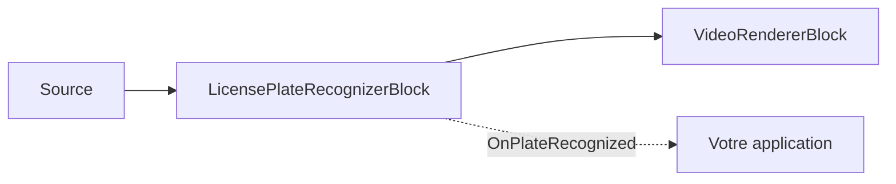

# Reconnaissance de plaques d'immatriculation (ANPR) — LicensePlateRecognizerBlock

`LicensePlateRecognizerBlock` lit les plaques d'immatriculation des véhicules grâce à un pipeline
spécialisé en deux étapes : un détecteur de plaques dédié (YOLO) localise les plaques dans l'image,
puis un modèle OCR spécifique aux plaques lit les caractères de chaque plaque recadrée. Les deux
modèles proviennent de la famille FastALPR (MIT) : un détecteur de plaques YOLOv9-T et une tête de
reconnaissance `fast-plate-ocr`. Une tête globale couvre les États-Unis et plus de 90 pays ; une tête
européenne est optimisée pour les plaques de l'UE. La géométrie et l'alphabet du modèle de
reconnaissance sont lus directement dans le modèle, si bien que sélectionner une région consiste
simplement à pointer `RecognitionModelPath` vers cette tête.



## Utilisation

```csharp
using VisioForge.Core.MediaBlocks.AI;
using VisioForge.Core.Types.X.AI;

var settings = new LicensePlateRecognizerSettings(detectorModelPath, recognitionModelPath)
{
    Provider = OnnxExecutionProvider.Auto,
    DetectionConfidenceThreshold = 0.35f,
    OcrConfidenceThreshold = 0.3f,
    DrawResults = true,
};

var anpr = new LicensePlateRecognizerBlock(settings);
anpr.OnPlateRecognized += (sender, e) =>
{
    foreach (var plate in e.Plates)
    {
        Console.WriteLine($"Plate: {plate.Text} ({plate.Confidence:P0}) at {plate.BoundingBox}");
    }
};

pipeline.Connect(source.Output, anpr.Input);
pipeline.Connect(anpr.Output, videoRenderer.Input);

await pipeline.StartAsync();
```

Chaque `LicensePlateResult` transporte le `Text` reconnu (normalisé : mis en majuscules, caractères
non alphanumériques supprimés), la `Confidence` moyenne (0..1), le `BoundingBox` aligné sur les axes,
et le `Polygon` de détection (quatre sommets `OcrPoint`), tous exprimés en pixels de l'image source.

## Paramètres clés

`LicensePlateRecognizerSettings(detectorModelPath, recognitionModelPath)` :

| Propriété | Valeur par défaut | Description |
| --- | --- | --- |
| `DetectorModelPath` | — | Modèle ONNX de détection de plaques (FastALPR YOLOv9-T de bout en bout). Obligatoire. |
| `RecognitionModelPath` | — | Modèle ONNX d'OCR de plaques (tête FastALPR `fast-plate-ocr`, globale ou UE). Obligatoire. |
| `Provider` / `DeviceId` | `Auto` / `0` | Fournisseur d'exécution ONNX et index du périphérique matériel. |
| `FramesToSkip` | `0` | Nombre d'images ignorées entre deux passes de reconnaissance sur une vidéo en direct. |
| `DetectionInputSize` | `640` | Taille d'entrée carrée pour le modèle de détection (modèles à forme dynamique). |
| `DetectionConfidenceThreshold` | `0.35` | Score minimal du détecteur qu'une boîte de plaque doit atteindre. |
| `OcrConfidenceThreshold` | `0.3` | Confiance OCR moyenne minimale qu'une plaque reconnue doit atteindre pour être signalée. |
| `MaxDetections` | `10` | Nombre maximal de plaques détectées par image. |
| `DrawResults` | `true` | Dessine les boîtes et le texte des plaques dans l'image vidéo. |
| `BoxColor` / `BoxThickness` | Jaune / `3` | Style de la superposition. |
| `LabelFontSize` | `0` | `0` adapte automatiquement la taille à la hauteur de l'image. |

## Modèles et licences

Le détecteur et la tête de reconnaissance sont tous deux des modèles FastALPR sous licence MIT ; le
SDK ne fournit pas les poids des modèles dans le paquet NuGet. Pour une meilleure précision sur des
scènes chargées comportant de nombreuses plaques petites ou éloignées, exécutez en amont un
détecteur de véhicules généraliste dédié (par exemple
[`YOLOObjectDetectorBlock`](object-detection.md)) afin de recadrer les zones du véhicule avant
l'ANPR.

## Utilisation avec VideoCaptureCoreX et MediaPlayerCoreX

```csharp
var anpr = new LicensePlateRecognizerBlock(settings);
anpr.OnPlateRecognized += Anpr_OnPlateRecognized;

core.Video_Processing_AddBlock(anpr); // avant StartAsync (VideoCaptureCoreX)
// player.Video_Processing_AddBlock(anpr); // avant OpenAsync/PlayAsync (MediaPlayerCoreX)

await core.StartAsync();
```

Consultez [Utiliser les blocs IA avec VideoCaptureCoreX et MediaPlayerCoreX](x-engines.md) pour
l'API complète des blocs de traitement, l'ordre d'insertion et les règles de cycle de vie communes à
tous les blocs vidéo IA.

## Cas d'usage

- **Accès et paiement de parking** — reconnaître une plaque à la caméra d'une barrière pour l'ouvrir
  ou démarrer une session de stationnement.
- **Journalisation des péages et du contrôle d'accès** — enregistrer les plaques qui sont passées
  devant une caméra fixe et à quel moment.
- **Gestion de flotte et de cour de dépôt** — suivre les véhicules entrant et sortant d'un parking ou
  d'un dépôt privé.
- **Outillage d'aide à la verbalisation routière** — signaler des plaques pour une vérification
  manuelle (les décisions finales de verbalisation doivent toujours comporter une étape de
  vérification humaine).

## Dépannage

| Symptôme | Cause probable | Solution |
| --- | --- | --- |
| Aucune plaque n'est détectée | `DetectionConfidenceThreshold` trop élevé, ou plaque trop petite par rapport à `DetectionInputSize` | Abaissez `DetectionConfidenceThreshold` ; augmentez `DetectionInputSize` pour les plaques petites/éloignées, ou recadrez plus près du véhicule en amont. |
| Plaque détectée mais texte erroné/vide | `OcrConfidenceThreshold` trop élevé, ou mauvaise tête de reconnaissance régionale | Abaissez `OcrConfidenceThreshold` ; vérifiez que `RecognitionModelPath` correspond à votre région (tête globale ou UE). |
| Seules certaines plaques d'une scène chargée sont signalées | `MaxDetections` atteint | Augmentez `MaxDetections` si vous attendez plus de 10 plaques par image. |
| Le texte de la plaque contient des caractères indésirables | Lecture directe de `LicensePlateResult.Text`, en attendant un OCR brut | `Text` est déjà normalisé (mis en majuscules, caractères non alphanumériques supprimés) — si le bruit persiste, vérifiez que la bonne tête de reconnaissance régionale est chargée. |

## Foire aux questions

### Ce SDK ANPR fonctionne-t-il en dehors des États-Unis et de l'Europe ?

La tête de reconnaissance globale FastALPR couvre les États-Unis et plus de 90 pays ; une tête
européenne distincte est optimisée pour les plaques de l'UE. Pointez `RecognitionModelPath` vers la
tête correspondant à votre région cible.

### Dois-je entraîner mon propre modèle de détection de plaques ?

Non — `LicensePlateRecognizerBlock` utilise directement le détecteur FastALPR YOLOv9-T et la tête de
reconnaissance `fast-plate-ocr` ; vous n'avez qu'à fournir les deux fichiers `.onnx`.

### Puis-je utiliser LicensePlateRecognizerBlock sur une scène de circulation large avec de nombreux véhicules ?

Oui, jusqu'à `MaxDetections` plaques par image (10 par défaut, configurable). Pour les scènes très
chargées avec des plaques petites/éloignées, envisagez d'exécuter en amont un détecteur de véhicules
([`YOLOObjectDetectorBlock`](object-detection.md)) pour recadrer d'abord les zones du véhicule.

### Les données de plaque d'immatriculation sont-elles considérées comme des données personnelles/biométriques ?

Les plaques d'immatriculation sont généralement traitées comme des données personnelles au regard
des réglementations sur la protection de la vie privée (bien que non biométriques au même titre
qu'une empreinte faciale). Examinez les réglementations applicables (RGPD, lois ANPR locales et
similaires) pour votre juridiction et votre cas d'usage avant tout déploiement.

## Démos

- **[Démo de reconnaissance de plaques d'immatriculation](https://github.com/visioforge/.Net-SDK-s-samples/tree/master/Media%20Blocks%20SDK/WPF/CSharp/License%20Plate%20Recognition%20Demo)** — démo de pipeline Media Blocks en WPF.
