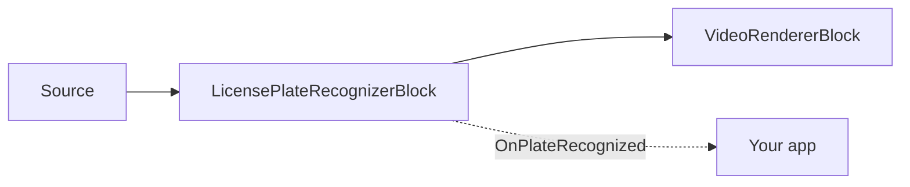

# License Plate Recognition (ANPR) — LicensePlateRecognizerBlock

`LicensePlateRecognizerBlock` reads vehicle license plates with a specialized two-stage pipeline: a
dedicated license-plate detector (YOLO) locates plates in the frame, then a plate-specific OCR model
reads the characters of each cropped plate. Both models come from the FastALPR family (MIT): a
YOLOv9-T plate detector and a `fast-plate-ocr` recognition head. A global head covers the USA and
90+ countries; a European head is tuned for EU plates. The recognition model's geometry and alphabet
are read from the model itself, so selecting a region is simply a matter of pointing
`RecognitionModelPath` at that head.



## Usage

```csharp
using VisioForge.Core.MediaBlocks.AI;
using VisioForge.Core.Types.X.AI;

var settings = new LicensePlateRecognizerSettings(detectorModelPath, recognitionModelPath)
{
    Provider = OnnxExecutionProvider.Auto,
    DetectionConfidenceThreshold = 0.35f,
    OcrConfidenceThreshold = 0.3f,
    DrawResults = true,
};

var anpr = new LicensePlateRecognizerBlock(settings);
anpr.OnPlateRecognized += (sender, e) =>
{
    foreach (var plate in e.Plates)
    {
        Console.WriteLine($"Plate: {plate.Text} ({plate.Confidence:P0}) at {plate.BoundingBox}");
    }
};

pipeline.Connect(source.Output, anpr.Input);
pipeline.Connect(anpr.Output, videoRenderer.Input);

await pipeline.StartAsync();
```

Each `LicensePlateResult` carries the recognized `Text` (normalized: uppercased, non-alphanumeric
characters stripped), the mean `Confidence` (0..1), the axis-aligned `BoundingBox`, and the detection
`Polygon` (four `OcrPoint` vertices), all in source-frame pixels.

## Key settings

`LicensePlateRecognizerSettings(detectorModelPath, recognitionModelPath)`:

| Property | Default | Description |
| --- | --- | --- |
| `DetectorModelPath` | — | License-plate detection ONNX model (FastALPR YOLOv9-T end-to-end). Required. |
| `RecognitionModelPath` | — | Plate-OCR ONNX model (FastALPR `fast-plate-ocr` head, global or EU). Required. |
| `Provider` / `DeviceId` | `Auto` / `0` | ONNX execution provider and hardware device index. |
| `FramesToSkip` | `0` | Skip frames between recognition runs on live video. |
| `DetectionInputSize` | `640` | Square input size for the detection model (dynamic-shape models). |
| `DetectionConfidenceThreshold` | `0.35` | Minimum detector score a plate box must reach. |
| `OcrConfidenceThreshold` | `0.3` | Minimum mean OCR confidence a recognized plate must reach to be reported. |
| `MaxDetections` | `10` | Maximum plates detected per frame. |
| `DrawResults` | `true` | Draw plate boxes and text into the video frame. |
| `BoxColor` / `BoxThickness` | Yellow / `3` | Overlay styling. |
| `LabelFontSize` | `0` | `0` auto-scales to frame height. |

## Models and licensing

Both the detector and the recognition head are MIT-licensed FastALPR models; the SDK does not ship
model weights in the NuGet package. For higher accuracy on busy scenes with many small or distant
plates, run a dedicated general-purpose vehicle detector (for example
[`YOLOObjectDetectorBlock`](object-detection.md)) upstream to crop vehicle regions before ANPR.

## Use with VideoCaptureCoreX and MediaPlayerCoreX

```csharp
var anpr = new LicensePlateRecognizerBlock(settings);
anpr.OnPlateRecognized += Anpr_OnPlateRecognized;

core.Video_Processing_AddBlock(anpr); // before StartAsync (VideoCaptureCoreX)
// player.Video_Processing_AddBlock(anpr); // before OpenAsync/PlayAsync (MediaPlayerCoreX)

await core.StartAsync();
```

See [Using AI blocks with VideoCaptureCoreX and MediaPlayerCoreX](x-engines.md) for the full
processing-block API, insertion order, and lifecycle rules shared by every video AI block.

## Use cases

- **Parking access and payment** — recognize a plate at a gate camera to open a barrier or start a
  parking session.
- **Toll and access-control logging** — record which plates passed a fixed camera and when.
- **Fleet and yard management** — track vehicles entering/leaving a private lot or depot.
- **Traffic enforcement support tooling** — flag plates for manual review (final enforcement decisions
  should always have a human-review step).

## Troubleshooting

| Symptom | Likely cause | Fix |
| --- | --- | --- |
| Plates aren't detected at all | `DetectionConfidenceThreshold` too high, or plate too small relative to `DetectionInputSize` | Lower `DetectionConfidenceThreshold`; raise `DetectionInputSize` for distant/small plates, or crop closer to the vehicle upstream. |
| Plate detected but text is wrong/empty | `OcrConfidenceThreshold` too high, or wrong regional recognition head | Lower `OcrConfidenceThreshold`; confirm `RecognitionModelPath` matches your region (global vs. EU head). |
| Only some plates in a busy scene are reported | `MaxDetections` reached | Raise `MaxDetections` if you expect more than 10 plates per frame. |
| Plate text includes stray characters | Read directly from `LicensePlateResult.Text`, expecting raw OCR | `Text` is already normalized (uppercased, non-alphanumeric characters stripped) — if you still see noise, check that the correct regional recognition head is loaded. |

## Frequently Asked Questions

### Does this ANPR SDK work outside the USA and Europe?

The FastALPR global recognition head covers the USA and 90+ countries; a separate European head is
tuned for EU plates. Point `RecognitionModelPath` at whichever head matches your target region.

### Do I need to train my own plate-detection model?

No — `LicensePlateRecognizerBlock` uses the FastALPR YOLOv9-T detector and `fast-plate-ocr`
recognition head out of the box; you only need to supply the two `.onnx` files.

### Can I use LicensePlateRecognizerBlock on a wide traffic scene with many vehicles?

Yes, up to `MaxDetections` plates per frame (default 10, configurable). For very busy scenes with
small/distant plates, consider running a vehicle detector
([`YOLOObjectDetectorBlock`](object-detection.md)) upstream to crop vehicle regions first.

### Is license plate data considered personal/biometric data?

License plates are commonly treated as personal data under privacy regulations (though not biometric
in the same sense as a face embedding). Review the applicable regulations (GDPR, state ANPR laws, and
similar) for your jurisdiction and use case before deploying.

## Demos

- **[License Plate Recognition Demo](https://github.com/visioforge/.Net-SDK-s-samples/tree/master/Media%20Blocks%20SDK/WPF/CSharp/License%20Plate%20Recognition%20Demo)** — WPF Media Blocks pipeline demo.
