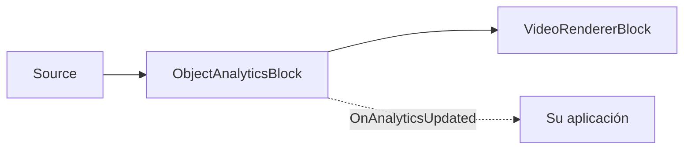

# Análisis de objetos — seguimiento multiobjeto, líneas de conteo y zonas poligonales

`ObjectAnalyticsBlock` realiza un seguimiento multiobjeto estable (ByteTrack), detección direccional
de cruce de línea (tripwire) y ocupación de zonas poligonales sobre cualquier detector de objetos ONNX
compatible (YOLOv8, YOLOX, RT-DETR). Dibuja superposiciones (cajas, etiquetas, IDs de seguimiento,
trazas, líneas, zonas, contadores) y genera un evento `OnAnalyticsUpdated` con los objetos rastreados,
los eventos de cruce y las instantáneas de zona.



## Uso

```csharp
using SkiaSharp;
using VisioForge.Core.MediaBlocks;
using VisioForge.Core.MediaBlocks.AI;
using VisioForge.Core.Types.X.AI;

// Configuración del detector — reutiliza cualquier modelo YOLO compatible.
var detector = new YoloDetectorSettings("yolox_nano.onnx")
{
    Model = ObjectDetectorModel.YOLOX,
    ConfidenceThreshold = 0.6f,
    DrawDetections = false, // El renderizador de analíticas dibuja en su lugar.
};

var settings = new ObjectAnalyticsSettings(detector);

// Agregue una línea de conteo (direccional Start -> End).
settings.Lines.Add(new LineZoneSettings
{
    Id = "door",
    Start = new SKPoint(200, 200),
    End = new SKPoint(400, 200),
    Anchor = DetectionAnchor.BottomCenter, // Contacto con los pies.
});

// Agregue una zona poligonal.
settings.Zones.Add(new PolygonZoneSettings
{
    Id = "area",
    Points = new[]
    {
        new SKPoint(100, 100), new SKPoint(300, 100),
        new SKPoint(300, 300), new SKPoint(100, 300),
    },
});

var analytics = new ObjectAnalyticsBlock(settings);
analytics.OnAnalyticsUpdated += (s, e) =>
{
    foreach (var obj in e.Objects)
        Console.WriteLine($"ID #{obj.TrackerId}: {obj.Label} {obj.Confidence:P0}");

    foreach (var c in e.LineCrossings)
        Console.WriteLine($"{c.LineId}: {c.Label}#{c.TrackerId} {c.Direction}");
};

pipeline.Connect(source.Output, analytics.Input);
pipeline.Connect(analytics.Output, videoRenderer.Input);

await pipeline.StartAsync();
```

El bloque ejecuta la inferencia de forma síncrona en el hilo de streaming del pipeline. Use
`FramesToSkip` en la configuración del detector para reducir la frecuencia de inferencia; en los
fotogramas omitidos solo se vuelven a dibujar la geometría estática y los contadores, sin cajas de
objetos ni trazas obsoletas.

## Zonas poligonales — ocupación a partir de cajas rastreadas

Las zonas poligonales forman parte de `ObjectAnalyticsBlock`, no de la salida independiente de
`YOLOObjectDetectorBlock`: el detector produce objetos `OnnxDetection` normales con una caja
alineada a los ejes, no un polígono por objeto. El polígono describe un área definida por la
aplicación, como una puerta, una zona de cola, una plaza de aparcamiento o una región restringida.

```csharp
settings.Zones.Add(new PolygonZoneSettings
{
    Id = "checkout",
    Points = new[]
    {
        new SKPoint(0.15f, 0.25f),
        new SKPoint(0.85f, 0.25f),
        new SKPoint(0.80f, 0.80f),
        new SKPoint(0.20f, 0.80f),
    },
    UseNormalizedCoordinates = true,
    Anchor = DetectionAnchor.BottomCenter,
    Color = SKColors.Cyan,
});
```

`Points` debe contener al menos tres vértices finitos y distintos, y debe formar un polígono de área
no nula y sin autointersección. De forma predeterminada, los puntos son coordenadas en píxeles del
fotograma de origen. Establezca `UseNormalizedCoordinates = true` para usar coordenadas `0..1`, que se
resuelven en píxeles del fotograma en cada fotograma procesado, de modo que la misma zona funciona en
distintas resoluciones de origen.

Para cada objeto rastreado, el bloque resuelve el `DetectionAnchor` seleccionado (`Center` o el
predeterminado `BottomCenter`, que representa mejor los pies de una persona o el punto de contacto de
un vehículo) a partir del cuadro delimitador del objeto y lo evalúa contra el polígono. Un punto sobre
el borde del polígono cuenta como interior.

El estado de la zona se basa en el seguimiento: cuando el ancla de una pista pasa de fuera a dentro,
su ID de seguimiento se reporta en `PolygonZoneSnapshot.EnteredTrackerIds`; cuando pasa de dentro a
fuera, aparece en `ExitedTrackerIds`. `TrackerIds` y `CurrentCount` describen las pistas actualmente
dentro de la zona. Si una pista desaparece estando aún dentro, se reporta en `ExpiredTrackerIds`
(consulte `ZoneExitReason.TrackExpired`); esto evita dejar la zona marcada como ocupada para siempre
en silencio cuando el detector pierde un objeto.

El renderizador de superposición dibuja los polígonos configurados y los contadores cuando
`ObjectAnalyticsOverlaySettings` `DrawZones` y `DrawZoneCounts` están habilitados (ambos
predeterminados en `true`).

## Cruces de línea

Las zonas de línea son tripwires direccionales. La dirección se define mediante
`LineZoneSettings.Start -> End`. Cuando el ancla de un objeto rastreado cruza el segmento finito desde
el lado negativo hacia el lado positivo, el resultado es `LineCrossingDirection.In`; el movimiento
opuesto es `Out`. Invertir `Start` y `End` invierte la dirección reportada. `LineZoneSettings.DeadbandPixels`
suprime el parpadeo cerca de la línea manteniendo el último lado estable hasta que el ancla se aleja lo
suficiente del tripwire.

`ObjectAnalyticsEventArgs` contiene:

| Propiedad | Descripción |
| --- | --- |
| `Objects` | `OnnxDetection[]` rastreados observados en el fotograma procesado actual; cada `TrackerId` es asignado por ByteTrack. |
| `LineCrossings` | `LineCrossingResult[]` con `LineId`, `TrackerId`, `ClassId`, `Label` y `Direction`. |
| `Zones` | `PolygonZoneSnapshot[]` con `ZoneId`, `CurrentCount`, `TrackerIds`, `EnteredTrackerIds`, `ExitedTrackerIds` y `ExpiredTrackerIds`. |

## Configuración de analíticas

`ObjectAnalyticsSettings(YoloDetectorSettings detector)` combina la configuración del detector, del
rastreador, del filtro, de la superposición y de las zonas; `Tracker`, `Filter` y `Overlay` toman por
defecto una nueva instancia de configuración cada uno.

!!! note "La confianza del detector se sobrescribe"
    En tiempo de ejecución, el bloque de analíticas reduce la confianza efectiva del detector a
    `ByteTrackerSettings.LowConfidenceThreshold` (predeterminado `0.1`) para que ByteTrack pueda usar
    detecciones de baja confianza en su segunda pasada de asociación; un detector que solo use alta
    confianza no lograría recuperar pistas temporalmente ocluidas.

`ByteTrackerSettings` (rastreador multiobjeto ByteTrack):

| Propiedad | Predeterminado | Descripción |
| --- | --- | --- |
| `LowConfidenceThreshold` | `0.1` | Confianza mínima para que una detección se considere siquiera. |
| `HighConfidenceThreshold` | `0.25` | Confianza por encima de la cual una detección se incorpora a la primera etapa de asociación (alta confianza). |
| `NewTrackThreshold` | `0.35` | Confianza mínima que debe alcanzar una detección de alta confianza para iniciar una nueva pista. |
| `FirstAssociationThreshold` | `0.8` | Costo máximo aceptado para la primera etapa de asociación. |
| `SecondAssociationThreshold` | `0.5` | Costo máximo aceptado para la segunda etapa de asociación (baja confianza). |
| `UnconfirmedAssociationThreshold` | `0.7` | Costo máximo aceptado para emparejar pistas no confirmadas con las detecciones de alta confianza restantes. |
| `LostTrackBuffer` | `30` | Número de llamadas `Update` del rastreador (no segundos) que una pista puede permanecer perdida antes de expirar. |
| `FuseDetectionScore` | `true` | Combina la confianza de detección en el costo de asociación (`1 - IoU * confidence`). |
| `ClassAwareMatching` | `true` | Cuando está habilitado, una pista y una detección con IDs de clase distintos reciben un costo no emparejable. |

`DetectionFilterSettings` (se aplica antes del seguimiento; el filtrado por confianza corresponde al
rastreador):

| Propiedad | Predeterminado | Descripción |
| --- | --- | --- |
| `IncludedClassIds` | `null` | Cuando no está vacío, solo se conservan estos IDs de clase. |
| `ExcludedClassIds` | `null` | IDs de clase a rechazar. La exclusión prevalece cuando un ID aparece en ambas listas. |
| `MinimumBoxArea` | `0` | Área mínima del cuadro delimitador en píxeles (`width * height`); las cajas más pequeñas se rechazan. |

`ObjectAnalyticsOverlaySettings` (controla solo la superposición renderizada; los eventos se siguen
generando aunque el dibujo esté deshabilitado):

| Propiedad | Predeterminado | Descripción |
| --- | --- | --- |
| `DrawBoxes` / `DrawLabels` / `DrawTrackIds` | `true` / `true` / `true` | Dibuja cajas, etiquetas + confianza, e IDs de seguimiento. |
| `DrawTraces` | `true` | Dibuja las trazas de movimiento. |
| `DrawLines` / `DrawZones` / `DrawZoneCounts` | `true` / `true` / `true` | Dibuja líneas de conteo, zonas poligonales y contadores de ocupación. |
| `BoxThickness` / `LineThickness` / `TraceThickness` | `2` / `3` / `2` | Grosores de trazo de la superposición, en píxeles. |
| `LabelFontSize` | `0` | `0` escala automáticamente a `max(20, frame.Height / 16)`. |
| `TraceLength` | `30` | Número máximo de puntos conservados en una traza de movimiento. |

`LineZoneSettings` (`Id`, `Start`, `End`, `Anchor`, `DeadbandPixels`, `UseNormalizedCoordinates`,
`Color`) y `PolygonZoneSettings` (`Id`, `Points`, `Anchor`, `UseNormalizedCoordinates`, `Color`)
configuran zonas individuales tal como se muestra arriba.

## API directa de analíticas en C#

Los tipos puros de analíticas en C# (`ByteTracker`, `LineZone`, `PolygonZone`, `DetectionFilter`)
también están disponibles directamente, sin un pipeline de Media Blocks:

```csharp
using SkiaSharp;
using VisioForge.Core.AI;
using VisioForge.Core.AI.Analytics;
using VisioForge.Core.AI.Analytics.Tracking;
using VisioForge.Core.AI.Analytics.Zones;
using VisioForge.Core.Types.X.AI;

var tracker = new ByteTracker(new ByteTrackerSettings());
var filtered = DetectionFilter.Apply(detections, new DetectionFilterSettings
{
    IncludedClassIds = new[] { (int)CocoClass.Person },
    MinimumBoxArea = 1200,
});

var update = tracker.Update(filtered);
var zone = new PolygonZone(new PolygonZoneSettings
{
    Id = "area",
    Points = new[] { new SKPoint(100, 100), new SKPoint(500, 100), new SKPoint(500, 400), new SKPoint(100, 400) },
});

var snapshot = zone.Update(update);
Console.WriteLine($"Inside: {snapshot.CurrentCount}");
```

## Uso con VideoCaptureCoreX y MediaPlayerCoreX

```csharp
var analytics = new ObjectAnalyticsBlock(settings);
analytics.OnAnalyticsUpdated += Analytics_OnAnalyticsUpdated;

core.Video_Processing_AddBlock(analytics); // antes de StartAsync (VideoCaptureCoreX)
// player.Video_Processing_AddBlock(analytics); // antes de OpenAsync/PlayAsync (MediaPlayerCoreX)

await core.StartAsync();
```

Consulte [Uso de bloques de IA con VideoCaptureCoreX y MediaPlayerCoreX](x-engines.md) para conocer la
API completa de bloques de procesamiento, el orden de inserción y las reglas de ciclo de vida
compartidas por todos los bloques de IA de vídeo.

## Casos de uso

- **Conteo de personas y análisis de afluencia** — cuenta entradas/salidas por una puerta con una
  [línea de conteo](#cruces-de-linea), u ocupación en una sala/pasillo con una
  [zona poligonal](#zonas-poligonales-ocupacion-a-partir-de-cajas-rastreadas).
- **Monitoreo de colas y tiempo de permanencia** — rastrea cuánto tiempo permanece un `TrackerId`
  dentro de una zona usando la instantánea `CurrentCount`/`TrackerIds` de cada fotograma.
- **Conteo de vehículos y dirección de tráfico** — un tripwire direccional reporta `In`/`Out` por
  carril o entrada.
- **Alertas de área restringida / perímetro** — genere una alerta en su aplicación cuando
  `EnteredTrackerIds` no esté vacío para una zona que debería permanecer vacía.
- **Mapas de calor en retail** — acumula las posiciones de `Objects` a lo largo del tiempo desde
  `OnAnalyticsUpdated` para construir un mapa de calor de movimiento fuera del bloque.

## Solución de problemas

| Síntoma | Causa probable | Solución |
| --- | --- | --- |
| Los IDs de seguimiento cambian constantemente para el mismo objeto | `LostTrackBuffer` demasiado bajo para la duración de la oclusión, o `ClassAwareMatching` rechazando una detección límite | Aumente `ByteTrackerSettings.LostTrackBuffer`; confirme que el detector reporta un `ClassId` consistente para el objeto. |
| Los objetos parpadean dentro y fuera de una zona en el límite | Falta de banda muerta o desajuste de ancla | Para líneas, aumente `LineZoneSettings.DeadbandPixels`. Para zonas, confirme que `Anchor` coincide con su escenario (`BottomCenter` para contacto de pies/suelo, `Center` en caso contrario). |
| Una zona nunca reporta la salida de un objeto que claramente se fue | La pista se perdió antes de poder reportar `Out`/salida; revise `ExpiredTrackerIds` | Esto es esperado: `PolygonZoneSnapshot.ExpiredTrackerIds` reporta pistas que desaparecieron estando aún dentro, a diferencia de `ExitedTrackerIds` (salidas por movimiento). |
| La dirección del cruce de línea está invertida respecto a lo esperado | El orden de `Start`/`End` define la dirección | Intercambie `Start` y `End` en el `LineZoneSettings`. |
| La superposición dibuja cajas/etiquetas que no desea | `ObjectAnalyticsOverlaySettings` predeterminado dibuja todo | Establezca los indicadores `Draw*` específicos (`DrawBoxes`, `DrawTraces`, `DrawZoneCounts`, ...) en `false`; los eventos se siguen generando independientemente de la configuración de superposición. |
| Las coordenadas no coinciden entre distintas resoluciones de cámara | Los puntos de zona/línea están definidos en píxeles fijos | Establezca `UseNormalizedCoordinates = true` en `LineZoneSettings`/`PolygonZoneSettings` y use fracciones `0..1` en su lugar. |

## Preguntas frecuentes

### ¿Cuál es la diferencia entre una zona de línea y una zona poligonal?

Una zona de línea (`LineZoneSettings`) es un tripwire direccional que reporta un evento de cruce
(`LineCrossingResult`) en el instante en que el ancla de un objeto rastreado la cruza. Una zona
poligonal (`PolygonZoneSettings`) es un área cuya ocupación actual (`PolygonZoneSnapshot`) se reporta
en cada actualización; usa líneas para contar cruces y zonas para saber "quién/cuántos están dentro
ahora mismo".

### ¿ObjectAnalyticsBlock funciona con cualquier detector de objetos?

Funciona con cualquier detector compatible con `YoloDetectorSettings` — `YOLOv8`, `YOLOX` y `RTDETR` —
envolviendo la configuración de ese detector en `ObjectAnalyticsSettings(detector)`.

### ¿Puedo usar el rastreador sin un pipeline de Media Blocks?

Sí — `ByteTracker`, `LineZone`, `PolygonZone` y `DetectionFilter` son tipos públicos de C# que puede
invocar directamente contra sus propias detecciones; consulte
[API directa de analíticas en C#](#api-directa-de-analiticas-en-c).

### ¿Cuántas líneas y zonas puede rastrear un solo bloque a la vez?

No hay un límite fijo en la API — `ObjectAnalyticsSettings.Lines` y `.Zones` son listas simples a las
que puede agregar tantas entradas como necesite su escenario; cada una se evalúa de forma
independiente contra los mismos objetos rastreados en cada fotograma.

## Demos

- **[YOLO Object Detection Demo](https://github.com/visioforge/.Net-SDK-s-samples/tree/master/Media%20Blocks%20SDK/WPF/CSharp/YOLO%20Object%20Detection%20Demo)** — incluye tanto el modo de detección de objetos independiente como el modo de analíticas de objetos.
- **[Polygon Zone Demo](https://github.com/visioforge/.Net-SDK-s-samples/tree/master/Media%20Blocks%20SDK/WPF/CSharp/Polygon%20Zone%20Demo)** — ocupación de polígonos con eventos en vivo de pistas actuales, entradas, salidas y expiradas.
- **[Tripwire Analytics Demo](https://github.com/visioforge/.Net-SDK-s-samples/tree/master/Media%20Blocks%20SDK/WPF/CSharp/Tripwire%20Analytics%20Demo)** — cruce de línea direccional e IDs de seguimiento.
