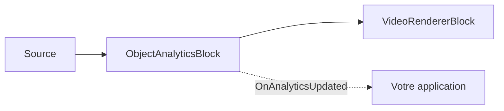

# Analyse d'objets — suivi multi-objets, lignes de comptage et zones polygonales

`ObjectAnalyticsBlock` effectue un suivi multi-objets stable (ByteTrack), une détection de franchissement
de ligne directionnelle et un calcul d'occupation par zone polygonale, au-dessus de n'importe quel
détecteur d'objets ONNX pris en charge (YOLOv8, YOLOX, RT-DETR). Il dessine des superpositions (boîtes,
étiquettes, ID de suivi, traces, lignes, zones, compteurs) et déclenche un événement `OnAnalyticsUpdated`
avec les objets suivis, les événements de franchissement et les instantanés de zone.



## Utilisation

```csharp
using SkiaSharp;
using VisioForge.Core.MediaBlocks;
using VisioForge.Core.MediaBlocks.AI;
using VisioForge.Core.Types.X.AI;

// Paramètres du détecteur — réutilisez n'importe quel modèle YOLO pris en charge.
var detector = new YoloDetectorSettings("yolox_nano.onnx")
{
    Model = ObjectDetectorModel.YOLOX,
    ConfidenceThreshold = 0.6f,
    DrawDetections = false, // Le moteur de rendu analytics dessine à la place.
};

var settings = new ObjectAnalyticsSettings(detector);

// Ajouter une ligne de comptage directionnelle (Start -> End).
settings.Lines.Add(new LineZoneSettings
{
    Id = "door",
    Start = new SKPoint(200, 200),
    End = new SKPoint(400, 200),
    Anchor = DetectionAnchor.BottomCenter, // Contact avec les pieds.
});

// Ajouter une zone polygonale.
settings.Zones.Add(new PolygonZoneSettings
{
    Id = "area",
    Points = new[]
    {
        new SKPoint(100, 100), new SKPoint(300, 100),
        new SKPoint(300, 300), new SKPoint(100, 300),
    },
});

var analytics = new ObjectAnalyticsBlock(settings);
analytics.OnAnalyticsUpdated += (s, e) =>
{
    foreach (var obj in e.Objects)
        Console.WriteLine($"ID #{obj.TrackerId}: {obj.Label} {obj.Confidence:P0}");

    foreach (var c in e.LineCrossings)
        Console.WriteLine($"{c.LineId}: {c.Label}#{c.TrackerId} {c.Direction}");
};

pipeline.Connect(source.Output, analytics.Input);
pipeline.Connect(analytics.Output, videoRenderer.Input);

await pipeline.StartAsync();
```

Le bloc exécute l'inférence de manière synchrone sur le thread de streaming du pipeline. Utilisez
`FramesToSkip` dans les paramètres du détecteur pour réduire la fréquence d'inférence ; sur les images
ignorées, seules la géométrie statique et les compteurs sont redessinés — aucune boîte ni trace d'objet
obsolète.

## Zones polygonales — occupation à partir des boîtes suivies

Les zones polygonales font partie d'`ObjectAnalyticsBlock`, et non de la sortie autonome de
`YOLOObjectDetectorBlock` — le détecteur produit des objets `OnnxDetection` ordinaires avec une boîte
alignée sur les axes, pas un polygone par objet. Le polygone décrit une zone définie par l'application,
comme une porte d'entrée, une zone de file d'attente, une place de stationnement ou une zone restreinte.

```csharp
settings.Zones.Add(new PolygonZoneSettings
{
    Id = "checkout",
    Points = new[]
    {
        new SKPoint(0.15f, 0.25f),
        new SKPoint(0.85f, 0.25f),
        new SKPoint(0.80f, 0.80f),
        new SKPoint(0.20f, 0.80f),
    },
    UseNormalizedCoordinates = true,
    Anchor = DetectionAnchor.BottomCenter,
    Color = SKColors.Cyan,
});
```

`Points` doit contenir au moins trois sommets finis et distincts, et doit former un polygone d'aire non
nulle et non auto-intersectant. Par défaut, les points sont exprimés en coordonnées pixel de l'image
source. Définissez `UseNormalizedCoordinates = true` pour des coordonnées `0..1`, résolues en pixels
d'image à chaque image traitée, afin que la même zone fonctionne quelle que soit la résolution de la
source.

Pour chaque objet suivi, le bloc résout l'ancre `DetectionAnchor` sélectionnée (`Center` ou la valeur par
défaut `BottomCenter`, qui représente mieux les pieds d'une personne ou le point de contact d'un
véhicule) à partir de la boîte englobante de l'objet, puis la teste par rapport au polygone. Un point sur
le bord du polygone compte comme intérieur.

L'état de zone repose sur le suivi : lorsqu'une piste passe de l'extérieur à l'intérieur, son ID de
suivi est rapporté dans `PolygonZoneSnapshot.EnteredTrackerIds` ; lorsqu'elle passe de l'intérieur à
l'extérieur, il apparaît dans `ExitedTrackerIds`. `TrackerIds` et `CurrentCount` décrivent les pistes
actuellement présentes dans la zone. Si une piste disparaît alors qu'elle était encore à l'intérieur,
elle est signalée dans `ExpiredTrackerIds` (voir `ZoneExitReason.TrackExpired`) — cela évite de laisser
silencieusement la zone occupée indéfiniment lorsque le détecteur perd un objet.

Le moteur de rendu de superposition dessine les polygones configurés et les compteurs lorsque
`DrawZones` et `DrawZoneCounts` d'`ObjectAnalyticsOverlaySettings` sont activés (les deux valent `true`
par défaut).

## Franchissements de ligne

Les lignes de zone sont des lignes de comptage directionnelles. La direction est définie par
`LineZoneSettings.Start -> End`. Lorsque l'ancre d'un objet suivi franchit le segment fini du côté
négatif vers le côté positif, le résultat est `LineCrossingDirection.In` ; le mouvement inverse donne
`Out`. Inverser `Start` et `End` inverse la direction rapportée. `LineZoneSettings.DeadbandPixels`
supprime les tremblements près de la ligne en conservant le dernier côté stable jusqu'à ce que l'ancre
s'éloigne suffisamment de la ligne de comptage.

`ObjectAnalyticsEventArgs` contient :

| Propriété | Description |
| --- | --- |
| `Objects` | `OnnxDetection[]` suivis, observés dans l'image traitée actuelle ; chaque `TrackerId` est attribué par ByteTrack. |
| `LineCrossings` | `LineCrossingResult[]` avec `LineId`, `TrackerId`, `ClassId`, `Label` et `Direction`. |
| `Zones` | `PolygonZoneSnapshot[]` avec `ZoneId`, `CurrentCount`, `TrackerIds`, `EnteredTrackerIds`, `ExitedTrackerIds` et `ExpiredTrackerIds`. |

## Paramètres analytics

`ObjectAnalyticsSettings(YoloDetectorSettings detector)` combine la configuration du détecteur, du
traceur, du filtre, de la superposition et des zones ; `Tracker`, `Filter` et `Overlay` prennent chacun
par défaut une nouvelle instance de paramètres.

!!! note "La confiance du détecteur est remplacée"
    À l'exécution, le bloc analytics abaisse la confiance effective du détecteur à
    `ByteTrackerSettings.LowConfidenceThreshold` (`0.1` par défaut) afin que ByteTrack puisse utiliser
    des détections à faible confiance lors de sa seconde passe d'association — un détecteur limité aux
    détections à haute confiance manquerait la récupération de pistes temporairement occultées.

`ByteTrackerSettings` (traceur multi-objets ByteTrack) :

| Propriété | Par défaut | Description |
| --- | --- | --- |
| `LowConfidenceThreshold` | `0.1` | Confiance minimale pour qu'une détection soit prise en compte. |
| `HighConfidenceThreshold` | `0.25` | Confiance au-delà de laquelle une détection rejoint la première étape d'association (haute confiance). |
| `NewTrackThreshold` | `0.35` | Confiance minimale qu'une détection à haute confiance doit atteindre pour démarrer une nouvelle piste. |
| `FirstAssociationThreshold` | `0.8` | Coût maximal accepté pour la première étape d'association. |
| `SecondAssociationThreshold` | `0.5` | Coût maximal accepté pour la seconde étape d'association (faible confiance). |
| `UnconfirmedAssociationThreshold` | `0.7` | Coût maximal accepté pour associer les pistes non confirmées aux détections à haute confiance restantes. |
| `LostTrackBuffer` | `30` | Nombre d'appels `Update` du traceur (pas de secondes) pendant lesquels une piste peut rester perdue avant d'expirer. |
| `FuseDetectionScore` | `true` | Fusionne la confiance de la détection dans le coût d'association (`1 - IoU * confiance`). |
| `ClassAwareMatching` | `true` | Lorsqu'activé, une piste et une détection avec des ID de classe différents obtiennent un coût non associable. |

`DetectionFilterSettings` (appliqué avant le suivi ; le filtrage de confiance revient au traceur) :

| Propriété | Par défaut | Description |
| --- | --- | --- |
| `IncludedClassIds` | `null` | Lorsque non vide, seuls ces ID de classe sont conservés. |
| `ExcludedClassIds` | `null` | ID de classe à rejeter. L'exclusion l'emporte lorsqu'un ID figure dans les deux listes. |
| `MinimumBoxArea` | `0` | Aire minimale de la boîte englobante en pixels (`largeur * hauteur`) ; les boîtes plus petites sont rejetées. |

`ObjectAnalyticsOverlaySettings` (contrôle uniquement la superposition affichée — les événements sont
toujours déclenchés même lorsque le dessin est désactivé) :

| Propriété | Par défaut | Description |
| --- | --- | --- |
| `DrawBoxes` / `DrawLabels` / `DrawTrackIds` | `true` / `true` / `true` | Dessine les boîtes, les étiquettes + la confiance, et les ID de suivi. |
| `DrawTraces` | `true` | Dessine les traces de mouvement. |
| `DrawLines` / `DrawZones` / `DrawZoneCounts` | `true` / `true` / `true` | Dessine les lignes de comptage, les zones polygonales et les compteurs d'occupation. |
| `BoxThickness` / `LineThickness` / `TraceThickness` | `2` / `3` / `2` | Épaisseurs des traits de la superposition, en pixels. |
| `LabelFontSize` | `0` | `0` met à l'échelle automatiquement sur `max(20, frame.Height / 16)`. |
| `TraceLength` | `30` | Nombre maximal de points conservés dans une trace de mouvement. |

`LineZoneSettings` (`Id`, `Start`, `End`, `Anchor`, `DeadbandPixels`, `UseNormalizedCoordinates`,
`Color`) et `PolygonZoneSettings` (`Id`, `Points`, `Anchor`, `UseNormalizedCoordinates`, `Color`)
configurent chaque zone individuellement comme montré ci-dessus.

## API analytics C# directe

Les types analytics purement C# (`ByteTracker`, `LineZone`, `PolygonZone`, `DetectionFilter`) sont
également disponibles directement, sans pipeline Media Blocks :

```csharp
using SkiaSharp;
using VisioForge.Core.AI;
using VisioForge.Core.AI.Analytics;
using VisioForge.Core.AI.Analytics.Tracking;
using VisioForge.Core.AI.Analytics.Zones;
using VisioForge.Core.Types.X.AI;

var tracker = new ByteTracker(new ByteTrackerSettings());
var filtered = DetectionFilter.Apply(detections, new DetectionFilterSettings
{
    IncludedClassIds = new[] { (int)CocoClass.Person },
    MinimumBoxArea = 1200,
});

var update = tracker.Update(filtered);
var zone = new PolygonZone(new PolygonZoneSettings
{
    Id = "area",
    Points = new[] { new SKPoint(100, 100), new SKPoint(500, 100), new SKPoint(500, 400), new SKPoint(100, 400) },
});

var snapshot = zone.Update(update);
Console.WriteLine($"Inside: {snapshot.CurrentCount}");
```

## Utilisation avec VideoCaptureCoreX et MediaPlayerCoreX

```csharp
var analytics = new ObjectAnalyticsBlock(settings);
analytics.OnAnalyticsUpdated += Analytics_OnAnalyticsUpdated;

core.Video_Processing_AddBlock(analytics); // avant StartAsync (VideoCaptureCoreX)
// player.Video_Processing_AddBlock(analytics); // avant OpenAsync/PlayAsync (MediaPlayerCoreX)

await core.StartAsync();
```

Consultez [Utilisation des blocs IA avec VideoCaptureCoreX et MediaPlayerCoreX](x-engines.md) pour
l'API complète des blocs de traitement, l'ordre d'insertion et les règles de cycle de vie communes à
chaque bloc IA vidéo.

## Cas d'usage

- **Comptage de personnes et analyse de fréquentation** — comptez les entrées/sorties par une porte
  avec une [ligne de comptage](#franchissements-de-ligne), ou l'occupation d'une pièce/allée avec une
  [zone polygonale](#zones-polygonales-occupation-a-partir-des-boites-suivies).
- **Surveillance de file d'attente et du temps d'attente** — suivez la durée pendant laquelle un
  `TrackerId` reste dans une zone à l'aide de l'instantané `CurrentCount`/`TrackerIds` à chaque image.
- **Comptage de véhicules et direction du trafic** — une ligne de comptage directionnelle rapporte
  `In`/`Out` par voie ou par allée.
- **Alertes de zone restreinte / périmètre** — déclenchez une alerte dans votre application lorsque
  `EnteredTrackerIds` n'est pas vide pour une zone censée rester vide.
- **Cartographie thermique en commerce de détail** — accumulez les positions d'`Objects` au fil du
  temps depuis `OnAnalyticsUpdated` pour construire une carte thermique des mouvements en dehors du
  bloc lui-même.

## Dépannage

| Symptôme | Cause probable | Correction |
| --- | --- | --- |
| Les ID de suivi changent en permanence pour le même objet | `LostTrackBuffer` trop faible pour la durée d'occlusion, ou `ClassAwareMatching` rejetant une détection limite | Augmentez `ByteTrackerSettings.LostTrackBuffer` ; vérifiez que le détecteur rapporte un `ClassId` cohérent pour l'objet. |
| Les objets scintillent en entrant et sortant d'une zone à la limite | Absence de zone morte / incohérence d'ancre | Pour les lignes, augmentez `LineZoneSettings.DeadbandPixels`. Pour les zones, vérifiez que `Anchor` correspond à votre scénario (`BottomCenter` pour le contact pieds/sol, `Center` sinon). |
| Une zone ne signale jamais la sortie d'un objet qui l'a clairement quittée | La piste a été perdue avant de pouvoir signaler `Out`/la sortie — vérifiez `ExpiredTrackerIds` | Ceci est attendu : `PolygonZoneSnapshot.ExpiredTrackerIds` rapporte les pistes ayant disparu alors qu'elles étaient encore à l'intérieur, distinct des `ExitedTrackerIds` (sorties basées sur le mouvement). |
| La direction du franchissement de ligne est inversée par rapport à ce que vous attendez | L'ordre `Start`/`End` définit la direction | Inversez `Start` et `End` dans `LineZoneSettings`. |
| La superposition dessine des boîtes/étiquettes que vous ne voulez pas | `ObjectAnalyticsOverlaySettings` par défaut dessine tout | Définissez les indicateurs `Draw*` spécifiques (`DrawBoxes`, `DrawTraces`, `DrawZoneCounts`, ...) sur `false` ; les événements sont toujours déclenchés indépendamment des paramètres de superposition. |
| Les coordonnées ne correspondent pas selon les résolutions de caméra | Points de zone/ligne définis en pixels fixes | Définissez `UseNormalizedCoordinates = true` sur `LineZoneSettings`/`PolygonZoneSettings` et utilisez des fractions `0..1` à la place. |

## Foire aux questions

### Quelle est la différence entre une ligne de zone et une zone polygonale ?

Une ligne de zone (`LineZoneSettings`) est une ligne de comptage directionnelle qui signale un
événement de franchissement (`LineCrossingResult`) à l'instant où l'ancre d'un objet suivi la franchit.
Une zone polygonale (`PolygonZoneSettings`) est une aire dont l'occupation actuelle
(`PolygonZoneSnapshot`) est rapportée à chaque mise à jour — utilisez les lignes pour compter les
franchissements, les zones pour savoir « qui/combien sont présents actuellement ».

### ObjectAnalyticsBlock fonctionne-t-il avec n'importe quel détecteur d'objets ?

Il fonctionne avec tout détecteur pris en charge par `YoloDetectorSettings` — `YOLOv8`, `YOLOX` et
`RTDETR` — en enveloppant les paramètres de ce détecteur dans `ObjectAnalyticsSettings(detector)`.

### Puis-je utiliser le traceur sans pipeline Media Blocks ?

Oui — `ByteTracker`, `LineZone`, `PolygonZone` et `DetectionFilter` sont des types C# publics que vous
pouvez appeler directement sur vos propres détections ; voir
[API analytics C# directe](#api-analytics-c-directe).

### Combien de lignes et de zones un seul bloc peut-il suivre à la fois ?

L'API n'impose aucune limite fixe — `ObjectAnalyticsSettings.Lines` et `.Zones` sont de simples listes
auxquelles vous pouvez ajouter autant d'entrées que votre scénario l'exige ; chacune est évaluée
indépendamment par rapport aux mêmes objets suivis à chaque image.

## Démos

- **[YOLO Object Detection Demo](https://github.com/visioforge/.Net-SDK-s-samples/tree/master/Media%20Blocks%20SDK/WPF/CSharp/YOLO%20Object%20Detection%20Demo)** — inclut à la fois la détection d'objets autonome et les modes d'analyse d'objets.
- **[Polygon Zone Demo](https://github.com/visioforge/.Net-SDK-s-samples/tree/master/Media%20Blocks%20SDK/WPF/CSharp/Polygon%20Zone%20Demo)** — occupation de zone polygonale avec événements de piste actuels, entrantes, sortantes et expirées en direct.
- **[Tripwire Analytics Demo](https://github.com/visioforge/.Net-SDK-s-samples/tree/master/Media%20Blocks%20SDK/WPF/CSharp/Tripwire%20Analytics%20Demo)** — franchissement de ligne directionnel et ID de suivi.
