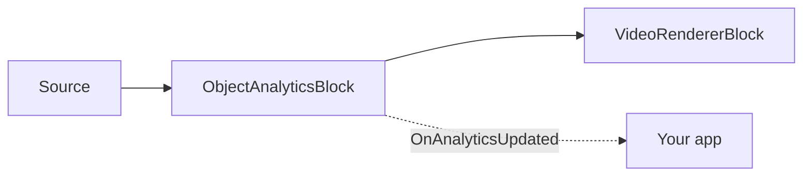

# Object Analytics — Multi-Object Tracking, Tripwires, and Polygon Zones

`ObjectAnalyticsBlock` performs stable multi-object tracking (ByteTrack), directed tripwire line
crossing, and polygon-zone occupancy on top of any supported ONNX object detector (YOLOv8, YOLOX,
RT-DETR). It draws overlays (boxes, labels, track IDs, traces, lines, zones, counters) and raises an
`OnAnalyticsUpdated` event with tracked objects, crossing events, and zone snapshots.



## Usage

```csharp
using SkiaSharp;
using VisioForge.Core.MediaBlocks;
using VisioForge.Core.MediaBlocks.AI;
using VisioForge.Core.Types.X.AI;

// Detector settings — reuse any supported YOLO model.
var detector = new YoloDetectorSettings("yolox_nano.onnx")
{
    Model = ObjectDetectorModel.YOLOX,
    ConfidenceThreshold = 0.6f,
    DrawDetections = false, // The analytics renderer draws instead.
};

var settings = new ObjectAnalyticsSettings(detector);

// Add a tripwire line (directed Start -> End).
settings.Lines.Add(new LineZoneSettings
{
    Id = "door",
    Start = new SKPoint(200, 200),
    End = new SKPoint(400, 200),
    Anchor = DetectionAnchor.BottomCenter, // Feet contact.
});

// Add a polygon zone.
settings.Zones.Add(new PolygonZoneSettings
{
    Id = "area",
    Points = new[]
    {
        new SKPoint(100, 100), new SKPoint(300, 100),
        new SKPoint(300, 300), new SKPoint(100, 300),
    },
});

var analytics = new ObjectAnalyticsBlock(settings);
analytics.OnAnalyticsUpdated += (s, e) =>
{
    foreach (var obj in e.Objects)
        Console.WriteLine($"ID #{obj.TrackerId}: {obj.Label} {obj.Confidence:P0}");

    foreach (var c in e.LineCrossings)
        Console.WriteLine($"{c.LineId}: {c.Label}#{c.TrackerId} {c.Direction}");
};

pipeline.Connect(source.Output, analytics.Input);
pipeline.Connect(analytics.Output, videoRenderer.Input);

await pipeline.StartAsync();
```

The block runs inference synchronously on the pipeline streaming thread. Use `FramesToSkip` on the
detector settings to reduce inference frequency; on skipped frames only static geometry and counters
are redrawn — no stale object boxes or traces.

## Polygon zones — occupancy from tracked boxes

Polygon zones are part of `ObjectAnalyticsBlock`, not standalone `YOLOObjectDetectorBlock` output —
the detector produces ordinary `OnnxDetection` objects with an axis-aligned box, not a polygon per
object. The polygon describes an application-defined area, such as a doorway, queue area, parking
bay, or restricted region.

```csharp
settings.Zones.Add(new PolygonZoneSettings
{
    Id = "checkout",
    Points = new[]
    {
        new SKPoint(0.15f, 0.25f),
        new SKPoint(0.85f, 0.25f),
        new SKPoint(0.80f, 0.80f),
        new SKPoint(0.20f, 0.80f),
    },
    UseNormalizedCoordinates = true,
    Anchor = DetectionAnchor.BottomCenter,
    Color = SKColors.Cyan,
});
```

`Points` must contain at least three finite, distinct vertices and must form a non-zero-area,
non-self-intersecting polygon. By default points are source-frame pixel coordinates. Set
`UseNormalizedCoordinates = true` for `0..1` coordinates, resolved to frame pixels on every processed
frame, so the same zone works across different source resolutions.

For each tracked object, the block resolves the selected `DetectionAnchor` (`Center` or the default
`BottomCenter`, which better represents a person's feet or a vehicle's contact point) from the
object's bounding box and tests it against the polygon. A point on the polygon edge counts as inside.

Zone state is tracker-based: when a track's anchor moves from outside to inside, its tracker ID is
reported in `PolygonZoneSnapshot.EnteredTrackerIds`; when it moves from inside to outside, it appears
in `ExitedTrackerIds`. `TrackerIds` and `CurrentCount` describe the tracks currently inside the zone.
If a track disappears while still inside, it is reported in `ExpiredTrackerIds` (see
`ZoneExitReason.TrackExpired`) — this avoids silently leaving the zone occupied forever when the
detector loses an object.

The overlay renderer draws configured polygons and counters when `ObjectAnalyticsOverlaySettings`
`DrawZones` and `DrawZoneCounts` are enabled (both default `true`).

## Line crossings

Line zones are directed tripwires. The direction is defined by `LineZoneSettings.Start -> End`. When
a tracked object's anchor crosses the finite segment from the negative side to the positive side, the
result is `LineCrossingDirection.In`; the opposite movement is `Out`. Reversing `Start` and `End`
reverses the reported direction. `LineZoneSettings.DeadbandPixels` suppresses jitter near the line by
keeping the last stable side until the anchor moves far enough away from the tripwire.

`ObjectAnalyticsEventArgs` contains:

| Property | Description |
| --- | --- |
| `Objects` | Tracked `OnnxDetection[]` observed in the current processed frame; each `TrackerId` is assigned by ByteTrack. |
| `LineCrossings` | `LineCrossingResult[]` with `LineId`, `TrackerId`, `ClassId`, `Label`, and `Direction`. |
| `Zones` | `PolygonZoneSnapshot[]` with `ZoneId`, `CurrentCount`, `TrackerIds`, `EnteredTrackerIds`, `ExitedTrackerIds`, and `ExpiredTrackerIds`. |

## Analytics settings

`ObjectAnalyticsSettings(YoloDetectorSettings detector)` combines detector, tracker, filter, overlay,
and zone configuration; `Tracker`, `Filter`, and `Overlay` each default to a new settings instance.

!!! note "Detector confidence is overridden"
    At runtime the analytics block lowers the effective detector confidence to
    `ByteTrackerSettings.LowConfidenceThreshold` (default `0.1`) so ByteTrack can use low-confidence
    detections in its second association pass — a high-confidence-only detector would miss recovering
    temporarily occluded tracks.

`ByteTrackerSettings` (ByteTrack multi-object tracker):

| Property | Default | Description |
| --- | --- | --- |
| `LowConfidenceThreshold` | `0.1` | Minimum confidence for a detection to be considered at all. |
| `HighConfidenceThreshold` | `0.25` | Confidence above which a detection joins the first (high-confidence) association stage. |
| `NewTrackThreshold` | `0.35` | Minimum confidence a high-confidence detection must reach to start a new track. |
| `FirstAssociationThreshold` | `0.8` | Maximum accepted cost for the first association stage. |
| `SecondAssociationThreshold` | `0.5` | Maximum accepted cost for the second (low-confidence) association stage. |
| `UnconfirmedAssociationThreshold` | `0.7` | Maximum accepted cost for matching unconfirmed tracks against remaining high-confidence detections. |
| `LostTrackBuffer` | `30` | Number of tracker `Update` calls (not seconds) a track may stay lost before it expires. |
| `FuseDetectionScore` | `true` | Fuse detection confidence into the association cost (`1 - IoU * confidence`). |
| `ClassAwareMatching` | `true` | When enabled, a track and a detection with different class IDs get an unmatchable cost. |

`DetectionFilterSettings` (applied before tracking; confidence filtering belongs to the tracker):

| Property | Default | Description |
| --- | --- | --- |
| `IncludedClassIds` | `null` | When non-empty, only these class IDs are retained. |
| `ExcludedClassIds` | `null` | Class IDs to reject. Exclusion wins when an ID appears in both lists. |
| `MinimumBoxArea` | `0` | Minimum bounding-box pixel area (`width * height`); smaller boxes are rejected. |

`ObjectAnalyticsOverlaySettings` (controls only the rendered overlay — events are still raised when
drawing is disabled):

| Property | Default | Description |
| --- | --- | --- |
| `DrawBoxes` / `DrawLabels` / `DrawTrackIds` | `true` / `true` / `true` | Draw boxes, labels + confidence, and tracker IDs. |
| `DrawTraces` | `true` | Draw movement traces. |
| `DrawLines` / `DrawZones` / `DrawZoneCounts` | `true` / `true` / `true` | Draw tripwire lines, polygon zones, and occupancy counts. |
| `BoxThickness` / `LineThickness` / `TraceThickness` | `2` / `3` / `2` | Overlay stroke thicknesses, in pixels. |
| `LabelFontSize` | `0` | `0` auto-scales to `max(20, frame.Height / 16)`. |
| `TraceLength` | `30` | Maximum points kept in a movement trace. |

`LineZoneSettings` (`Id`, `Start`, `End`, `Anchor`, `DeadbandPixels`, `UseNormalizedCoordinates`,
`Color`) and `PolygonZoneSettings` (`Id`, `Points`, `Anchor`, `UseNormalizedCoordinates`, `Color`)
configure individual zones as shown above.

## Direct C# analytics API

The pure C# analytics types (`ByteTracker`, `LineZone`, `PolygonZone`, `DetectionFilter`) are also
available directly, without a Media Blocks pipeline:

```csharp
using SkiaSharp;
using VisioForge.Core.AI;
using VisioForge.Core.AI.Analytics;
using VisioForge.Core.AI.Analytics.Tracking;
using VisioForge.Core.AI.Analytics.Zones;
using VisioForge.Core.Types.X.AI;

var tracker = new ByteTracker(new ByteTrackerSettings());
var filtered = DetectionFilter.Apply(detections, new DetectionFilterSettings
{
    IncludedClassIds = new[] { (int)CocoClass.Person },
    MinimumBoxArea = 1200,
});

var update = tracker.Update(filtered);
var zone = new PolygonZone(new PolygonZoneSettings
{
    Id = "area",
    Points = new[] { new SKPoint(100, 100), new SKPoint(500, 100), new SKPoint(500, 400), new SKPoint(100, 400) },
});

var snapshot = zone.Update(update);
Console.WriteLine($"Inside: {snapshot.CurrentCount}");
```

## Use with VideoCaptureCoreX and MediaPlayerCoreX

```csharp
var analytics = new ObjectAnalyticsBlock(settings);
analytics.OnAnalyticsUpdated += Analytics_OnAnalyticsUpdated;

core.Video_Processing_AddBlock(analytics); // before StartAsync (VideoCaptureCoreX)
// player.Video_Processing_AddBlock(analytics); // before OpenAsync/PlayAsync (MediaPlayerCoreX)

await core.StartAsync();
```

See [Using AI blocks with VideoCaptureCoreX and MediaPlayerCoreX](x-engines.md) for the full
processing-block API, insertion order, and lifecycle rules shared by every video AI block.

## Use cases

- **People counting and footfall analytics** — count entries/exits through a doorway with a
  [line zone](#line-crossings), or occupancy in a room/aisle with a [polygon zone](#polygon-zones-occupancy-from-tracked-boxes).
- **Queue and dwell-time monitoring** — track how long a `TrackerId` stays inside a zone using the
  `CurrentCount`/`TrackerIds` snapshot each frame.
- **Vehicle counting and traffic direction** — a directed tripwire reports `In`/`Out` per lane or
  driveway.
- **Restricted-area / perimeter alerts** — raise an alert in your app when `EnteredTrackerIds` is
  non-empty for a zone that should stay empty.
- **Retail heat-mapping** — accumulate `Objects` positions over time from `OnAnalyticsUpdated` to
  build a movement heat-map outside the block itself.

## Troubleshooting

| Symptom | Likely cause | Fix |
| --- | --- | --- |
| Tracker IDs keep changing for the same object | `LostTrackBuffer` too low for the occlusion length, or `ClassAwareMatching` rejecting a borderline detection | Raise `ByteTrackerSettings.LostTrackBuffer`; confirm the detector reports a consistent `ClassId` for the object. |
| Objects flicker in and out of a zone at the boundary | No deadband/anchor mismatch | For lines, raise `LineZoneSettings.DeadbandPixels`. For zones, confirm `Anchor` matches your scenario (`BottomCenter` for feet/ground contact, `Center` otherwise). |
| A zone never reports an exit for an object that clearly left | The track was lost before it could report `Out`/exit — check `ExpiredTrackerIds` | This is expected: `PolygonZoneSnapshot.ExpiredTrackerIds` reports tracks that disappeared while still inside, distinct from `ExitedTrackerIds` (movement-based exits). |
| Line crossing direction is reversed from what you expect | `Start`/`End` order defines direction | Swap `Start` and `End` on the `LineZoneSettings`. |
| Overlay draws boxes/labels you don't want | Default `ObjectAnalyticsOverlaySettings` draws everything | Set the specific `Draw*` flags (`DrawBoxes`, `DrawTraces`, `DrawZoneCounts`, ...) to `false`; events are still raised regardless of overlay settings. |
| Coordinates don't line up across different camera resolutions | Zone/line points defined in fixed pixels | Set `UseNormalizedCoordinates = true` on the `LineZoneSettings`/`PolygonZoneSettings` and use `0..1` fractions instead. |

## Frequently Asked Questions

### What's the difference between a line zone and a polygon zone?

A line zone (`LineZoneSettings`) is a directed tripwire that reports a crossing event
(`LineCrossingResult`) the instant a tracked object's anchor crosses it. A polygon zone
(`PolygonZoneSettings`) is an area whose current occupancy (`PolygonZoneSnapshot`) is reported every
update — use lines for counting crossings, zones for "who/how many are inside right now".

### Does ObjectAnalyticsBlock work with any object detector?

It works with any detector supported by `YoloDetectorSettings` — `YOLOv8`, `YOLOX`, and `RTDETR` — by
wrapping that detector's settings in `ObjectAnalyticsSettings(detector)`.

### Can I use the tracker without a Media Blocks pipeline?

Yes — `ByteTracker`, `LineZone`, `PolygonZone`, and `DetectionFilter` are public C# types you can call
directly against your own detections; see [Direct C# analytics API](#direct-c-analytics-api).

### How many lines and zones can one block track at once?

There's no fixed limit in the API — `ObjectAnalyticsSettings.Lines` and `.Zones` are plain lists you
can add as many entries to as your scenario needs; each is evaluated independently against the same
tracked objects every frame.

## Demos

- **[YOLO Object Detection Demo](https://github.com/visioforge/.Net-SDK-s-samples/tree/master/Media%20Blocks%20SDK/WPF/CSharp/YOLO%20Object%20Detection%20Demo)** — includes both standalone object detection and object analytics modes.
- **[Polygon Zone Demo](https://github.com/visioforge/.Net-SDK-s-samples/tree/master/Media%20Blocks%20SDK/WPF/CSharp/Polygon%20Zone%20Demo)** — polygon occupancy with live current, entered, exited, and expired track events.
- **[Tripwire Analytics Demo](https://github.com/visioforge/.Net-SDK-s-samples/tree/master/Media%20Blocks%20SDK/WPF/CSharp/Tripwire%20Analytics%20Demo)** — directed line crossing and track IDs.
