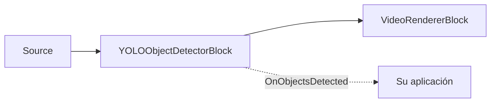

# Detección de objetos — YOLOObjectDetectorBlock

`YOLOObjectDetectorBlock` detecta objetos directamente en el flujo de vídeo. Captura fotogramas RGBA
con un capturador de muestras interno, ejecuta el detector ONNX configurado, opcionalmente dibuja
cuadros y etiquetas en el fotograma, y genera el evento `OnObjectsDetected` para los fotogramas
procesados que contienen detecciones. Utilícelo cuando necesite cuadros y etiquetas sin seguimiento,
líneas de disparo (tripwires) ni analítica de zonas — consulte
[Analítica de objetos](object-analytics.md) para detección con seguimiento y zonas.



## Familias de detectores admitidas

Configure `YoloDetectorSettings.Model` para que coincida con el formato del modelo ONNX.

| Modelo | Decodificador y preprocesamiento | Nota de licenciamiento |
| --- | --- | --- |
| `ObjectDetectorModel.YOLOv8` (predeterminado) | Formato Ultralytics YOLOv8 / YOLO11 `[1, 4 + numClasses, numAnchors]`; letterbox centrado, RGB, normalizado a 0..1, NMS por clase. | Los modelos Ultralytics son AGPL-3.0; un producto de código cerrado requiere una licencia comercial de Ultralytics. |
| `ObjectDetectorModel.YOLOX` | Formato YOLOX `[1, numAnchors, 5 + numClasses]`; letterbox superior izquierdo, BGR, sin normalización 0..1, NMS por clase. | La familia de modelos YOLOX es Apache-2.0. |
| `ObjectDetectorModel.RTDETR` | Formato de transformador RT-DETR / D-FINE con `logits` y `pred_boxes`; redimensionado directo, RGB, normalizado a 0..1, sin NMS. | Las familias de modelos RT-DETR / D-FINE son Apache-2.0. |

El SDK no incluye los pesos del detector en el paquete NuGet. El ajuste `IoUThreshold` solo se aplica
a las familias basadas en NMS (YOLOv8, YOLOX); RT-DETR no usa NMS y lo ignora. `NormalizeTo01` solo lo
respeta YOLOv8 — YOLOX y RT-DETR fijan su normalización a su convención de entrenamiento.

!!! note "Licencias de los modelos"
    La licencia de un modelo la determina su origen (código de entrenamiento y pesos publicados), no
    el formato ONNX. Evite modelos con licencia AGPL/GPL (por ejemplo, los pesos estándar de
    Ultralytics YOLO) en un producto de código cerrado sin una licencia comercial.

## ¿Independiente o ObjectAnalyticsBlock?

Utilice `YOLOObjectDetectorBlock` cuando cada fotograma pueda tratarse de forma independiente: dibujar
cuadros, recopilar etiquetas, activar alertas simples o alimentar las detecciones a su propia lógica.
Utilice [`ObjectAnalyticsBlock`](object-analytics.md) cuando necesite identificadores de seguimiento
estables, eventos de cruce de línea, ocupación de zonas poligonales, trazas de objetos y contadores.
`ObjectAnalyticsBlock` reutiliza internamente `YoloDetectorSettings` para su detector, pero su
renderizador y su modelo de eventos están construidos en torno a objetos rastreados en lugar de
detecciones sin procesar por fotograma.

## Uso

```csharp
using VisioForge.Core.MediaBlocks;
using VisioForge.Core.MediaBlocks.AI;
using VisioForge.Core.MediaBlocks.VideoRendering;
using VisioForge.Core.Types.VideoProcessing;
using VisioForge.Core.Types.X.AI;

var detectorSettings = new YoloDetectorSettings(modelPath)
{
    Model = ObjectDetectorModel.YOLOX,
    ConfidenceThreshold = 0.6f,
    IoUThreshold = 0.45f,
    DrawDetections = true,
    DrawLabels = true,
    FramesToSkip = 0,
    Provider = OnnxExecutionProvider.Auto,
};

var detector = new YOLOObjectDetectorBlock(detectorSettings);
detector.OnObjectsDetected += (sender, e) =>
{
    foreach (OnnxDetection obj in e.Objects)
    {
        Console.WriteLine($"{obj.Label} #{obj.ClassId} {obj.Confidence:P0} at {obj.Box}");
    }
};

var videoRenderer = new VideoRendererBlock(pipeline, videoView) { IsSync = false };

pipeline.Connect(source.Output, detector.Input);
pipeline.Connect(detector.Output, videoRenderer.Input);

await pipeline.StartAsync();

Console.WriteLine($"Active provider: {detector.ActiveProvider}");
```

Cada `OnnxDetection` contiene el `Box` delimitador en coordenadas de píxeles del fotograma de origen,
`ClassId`, `Label`, `Confidence` y `TrackerId`. En la detección independiente, `TrackerId` siempre es
`-1` porque ningún rastreador ha asignado una identidad.

## Configuración clave

`YoloDetectorSettings` extiende `OnnxInferenceSettings`.

| Propiedad | Predeterminado | Descripción |
| --- | --- | --- |
| `ModelPath` | — | Ruta absoluta al archivo `.onnx` del detector. Obligatorio. |
| `Model` | `ObjectDetectorModel.YOLOv8` | Selecciona el decodificador y la convención de preprocesamiento. |
| `ConfidenceThreshold` | `0.60` | Confianza mínima para reportar una detección. |
| `IoUThreshold` | `0.45` | Umbral de supresión de no-máximos para YOLOv8 y YOLOX. RT-DETR no usa NMS. |
| `Labels` | `null` | Nombres de clase opcionales. Cuando es `null`, el detector usa las etiquetas COCO-80 predeterminadas. |
| `DrawDetections` | `true` | Dibuja los cuadros de detección en el fotograma de vídeo. |
| `BoxColor` / `BoxThickness` | Lima / `2` | Estilo de superposición de los cuadros. |
| `DrawLabels` / `LabelFontSize` | `true` / `0` | Dibuja etiquetas y valores de confianza. `0` escala automáticamente el texto de la etiqueta según la altura del fotograma. |
| `InputWidth` / `InputHeight` | `640` / `640` | Se usa para modelos de entrada dinámica. Los modelos de tamaño fijo reportan su propio tamaño de entrada. |
| `NormalizeTo01` | `true` | Solo lo respeta la familia YOLOv8. |
| `Provider` / `DeviceId` | `Auto` / `0` | Proveedor de ejecución ONNX e índice del dispositivo de hardware. |
| `FramesToSkip` | `0` | Omite fotogramas entre ejecuciones de inferencia para reducir la carga de CPU/GPU. |

`YOLOObjectDetectorBlock.ActiveProvider` reporta el proveedor realmente utilizado una vez que el
bloque se ha construido.

## Uso con VideoCaptureCoreX y MediaPlayerCoreX

```csharp
var detector = new YOLOObjectDetectorBlock(detectorSettings);
detector.OnObjectsDetected += Detector_OnObjectsDetected;

core.Video_Processing_AddBlock(detector); // antes de StartAsync (VideoCaptureCoreX)
// player.Video_Processing_AddBlock(detector); // antes de OpenAsync/PlayAsync (MediaPlayerCoreX)

await core.StartAsync();
```

Consulte [Uso de bloques de IA con VideoCaptureCoreX y MediaPlayerCoreX](x-engines.md) para conocer la
API completa de bloques de procesamiento, el orden de inserción y las reglas de ciclo de vida
compartidas por todos los bloques de IA de vídeo.

## Casos de uso

- **Seguridad y vigilancia** — señalar la presencia de personas, vehículos o clases de objetos
  específicas en una transmisión de cámara.
- **Analítica minorista** — detectar productos, cestas o personas en un pasillo de tienda para una
  capa de lógica de negocio posterior.
- **Monitoreo industrial y de seguridad** — detectar elementos de EPP requeridos, obstáculos o equipos
  en un fotograma (con un modelo entrenado para esas clases).
- **Monitoreo de vida silvestre y tráfico** — detectar animales o vehículos en una transmisión de
  cámara fija.
- **Prefiltrado para una canalización más pesada** — usar la detección independiente como un primer
  paso económico y ejecutar un bloque más costoso (OCR, reconocimiento facial) solo en los fotogramas
  o regiones donde se detectó algo.

¿Necesita identidades que persistan entre fotogramas, conteos de cruce de línea u ocupación de zonas
en lugar de cuadros sin procesar por fotograma? Utilice [Analítica de objetos](object-analytics.md) —
envuelve las mismas familias de detectores con seguimiento ByteTrack, líneas de disparo y zonas
poligonales.

## Solución de problemas

| Síntoma | Causa probable | Solución |
| --- | --- | --- |
| No hay detecciones en absoluto | `ConfidenceThreshold` demasiado alto para el modelo/escena, o se seleccionó la familia `Model` incorrecta para el archivo ONNX | Reduzca `ConfidenceThreshold`; confirme que `Model` coincide con el formato del modelo exportado (YOLOv8 vs YOLOX vs RT-DETR). |
| Demasiados falsos positivos / cuadros duplicados | `IoUThreshold` demasiado alto (supresión débil) — solo familias basadas en NMS | Reduzca `IoUThreshold`. Tenga en cuenta que RT-DETR no usa NMS e ignora este ajuste. |
| Los cuadros están desplazados respecto al objeto real | Familia `Model` incorrecta para el archivo ONNX — cada familia usa una convención distinta de letterbox/orden de color | Configure `Model` para que coincida exactamente con el modelo exportado; un decodificador incorrecto produce silenciosamente cuadros con apariencia plausible pero erróneos. |
| Las etiquetas muestran números en lugar de nombres | `Labels` es `null` y el modelo no es COCO-80 | Configure `Labels` con el arreglo de nombres de clase con el que se entrenó su modelo. |
| Uso elevado de CPU/GPU en vídeo en vivo | La inferencia se ejecuta en cada fotograma | Aumente `FramesToSkip`; el bloque sigue pasando todos los fotogramas, simplemente infiere con menor frecuencia. |

## Preguntas frecuentes

### ¿Con qué familia de detectores debería empezar?

`YOLOv8` (el predeterminado) si utiliza pesos estándar exportados de Ultralytics, pero revise primero
la nota de licenciamiento AGPL-3.0. `YOLOX` y `RT-DETR` son alternativas Apache-2.0 sin requisito de
licencia comercial.

### ¿Puedo usar mi propio modelo YOLO entrenado?

Sí — siempre que se haya exportado en el formato de una de las tres familias admitidas
(`YOLOv8`/`YOLOX`/`RTDETR`) y configure `Model` y `Labels` para que coincidan con las clases de su
entrenamiento.

### ¿YOLOObjectDetectorBlock rastrea objetos entre fotogramas?

No — cada detección es independiente por fotograma (`TrackerId` siempre es `-1`). Utilice
[`ObjectAnalyticsBlock`](object-analytics.md) cuando necesite identidades estables, líneas de disparo
o zonas.

### ¿Se requiere una GPU para la detección en tiempo real?

No, pero un proveedor de ejecución GPU (`CUDA`, `DirectML` o `CoreML`) reduce la latencia por
fotograma en comparación con la CPU, lo cual es especialmente relevante en tasas de fotogramas altas
o con modelos de detector más grandes.

## Demos

- **[YOLO Object Detection Demo](https://github.com/visioforge/.Net-SDK-s-samples/tree/master/Media%20Blocks%20SDK/WPF/CSharp/YOLO%20Object%20Detection%20Demo)** — demo de Media Blocks para WPF que cubre tanto la detección independiente como el modo de analítica de objetos.
- **[YOLO Object Detection MB](https://github.com/visioforge/.Net-SDK-s-samples/tree/master/Media%20Blocks%20SDK/MAUI/YOLO%20Object%20Detection%20MB)** — la misma demo de Media Blocks para MAUI.

Las demos dedicadas de detección de objetos para `VideoCaptureCoreX`/`MediaPlayerCoreX`
(`Capture Object Detection X`, `Capture Object Detection X WPF`, `Player Object Detection X`,
`Player Object Detection X WPF`) forman parte del conjunto de demos del SDK y se enlazarán aquí una
vez publicadas en el repositorio público de muestras.
