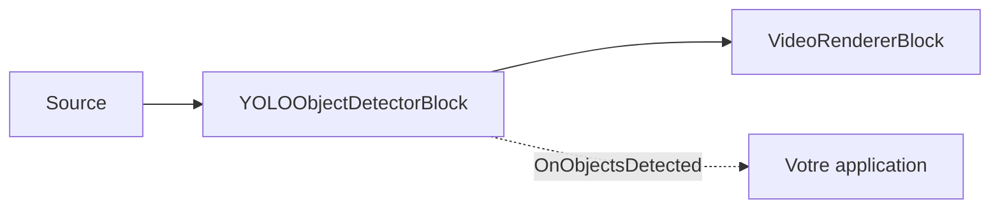

# Détection d'objets — YOLOObjectDetectorBlock

`YOLOObjectDetectorBlock` détecte les objets directement dans le flux vidéo. Il capte les images RGBA
via un capteur d'échantillons vidéo interne, exécute le détecteur ONNX configuré, dessine
éventuellement des boîtes et des étiquettes dans l'image, et déclenche `OnObjectsDetected` pour les
images traitées contenant des détections. Utilisez-le lorsque vous avez besoin de boîtes et
d'étiquettes sans suivi, sans lignes de franchissement ni analyse de zones — voir
[Analytique d'objets](object-analytics.md) pour une détection suivie et sensible aux zones.



## Familles de détecteurs prises en charge

Définissez `YoloDetectorSettings.Model` pour correspondre à la structure du modèle ONNX.

| Modèle | Décodeur et prétraitement | Remarque sur la licence |
| --- | --- | --- |
| `ObjectDetectorModel.YOLOv8` (par défaut) | Structure Ultralytics YOLOv8 / YOLO11 `[1, 4 + numClasses, numAnchors]` ; letterbox centré, RGB, normalisé sur 0..1, NMS par classe. | Les modèles Ultralytics sont sous licence AGPL-3.0 ; un produit à code source fermé nécessite une licence commerciale Ultralytics. |
| `ObjectDetectorModel.YOLOX` | Structure YOLOX `[1, numAnchors, 5 + numClasses]` ; letterbox en haut à gauche, BGR, sans normalisation 0..1, NMS par classe. | La famille de modèles YOLOX est sous licence Apache-2.0. |
| `ObjectDetectorModel.RTDETR` | Structure transformeur RT-DETR / D-FINE avec `logits` et `pred_boxes` ; redimensionnement direct, RGB, normalisé sur 0..1, sans NMS. | Les familles de modèles RT-DETR / D-FINE sont sous licence Apache-2.0. |

Le SDK ne fournit pas les poids du détecteur dans le paquet NuGet. Le paramètre `IoUThreshold` ne
s'applique qu'aux familles basées sur NMS (YOLOv8, YOLOX) ; RT-DETR n'utilise pas de NMS et l'ignore.
`NormalizeTo01` n'est respecté que par YOLOv8 — YOLOX et RT-DETR fixent leur normalisation selon leur
propre convention d'entraînement.

!!! note "Licences des modèles"
    La licence d'un modèle est déterminée par son origine (code d'entraînement + poids publiés), pas
    par le format ONNX. Évitez les modèles sous licence AGPL/GPL (par exemple les poids YOLO
    Ultralytics standards) dans un produit à code source fermé sans licence commerciale.

## Autonome ou ObjectAnalyticsBlock ?

Utilisez `YOLOObjectDetectorBlock` lorsque chaque image peut être traitée indépendamment : dessiner
des boîtes, collecter des étiquettes, déclencher des alertes simples, ou transmettre les détections à
votre propre logique. Utilisez [`ObjectAnalyticsBlock`](object-analytics.md) lorsque vous avez besoin
d'identifiants de suivi stables, d'événements de franchissement de ligne, d'occupation de zones
polygonales, de traces d'objets et de compteurs. `ObjectAnalyticsBlock` réutilise en interne
`YoloDetectorSettings` pour son détecteur, mais son moteur de rendu et son modèle d'événements sont
conçus autour des objets suivis plutôt que des détections brutes par image.

## Utilisation

```csharp
using VisioForge.Core.MediaBlocks;
using VisioForge.Core.MediaBlocks.AI;
using VisioForge.Core.MediaBlocks.VideoRendering;
using VisioForge.Core.Types.VideoProcessing;
using VisioForge.Core.Types.X.AI;

var detectorSettings = new YoloDetectorSettings(modelPath)
{
    Model = ObjectDetectorModel.YOLOX,
    ConfidenceThreshold = 0.6f,
    IoUThreshold = 0.45f,
    DrawDetections = true,
    DrawLabels = true,
    FramesToSkip = 0,
    Provider = OnnxExecutionProvider.Auto,
};

var detector = new YOLOObjectDetectorBlock(detectorSettings);
detector.OnObjectsDetected += (sender, e) =>
{
    foreach (OnnxDetection obj in e.Objects)
    {
        Console.WriteLine($"{obj.Label} #{obj.ClassId} {obj.Confidence:P0} at {obj.Box}");
    }
};

var videoRenderer = new VideoRendererBlock(pipeline, videoView) { IsSync = false };

pipeline.Connect(source.Output, detector.Input);
pipeline.Connect(detector.Output, videoRenderer.Input);

await pipeline.StartAsync();

Console.WriteLine($"Active provider: {detector.ActiveProvider}");
```

Chaque `OnnxDetection` contient la boîte englobante `Box` en coordonnées de pixels de l'image source,
`ClassId`, `Label`, `Confidence`, et `TrackerId`. En détection autonome, `TrackerId` vaut toujours
`-1` car aucun tracker n'a attribué d'identité.

## Paramètres clés

`YoloDetectorSettings` étend `OnnxInferenceSettings`.

| Propriété | Par défaut | Description |
| --- | --- | --- |
| `ModelPath` | — | Chemin absolu vers le fichier `.onnx` du détecteur. Obligatoire. |
| `Model` | `ObjectDetectorModel.YOLOv8` | Sélectionne le décodeur et la convention de prétraitement. |
| `ConfidenceThreshold` | `0.60` | Confiance minimale pour qu'une détection soit signalée. |
| `IoUThreshold` | `0.45` | Seuil de suppression non maximale pour YOLOv8 et YOLOX. RT-DETR n'utilise pas de NMS. |
| `Labels` | `null` | Noms de classes optionnels. Si `null`, le détecteur utilise les étiquettes COCO-80 par défaut. |
| `DrawDetections` | `true` | Dessine les boîtes de détection dans l'image vidéo. |
| `BoxColor` / `BoxThickness` | Vert citron / `2` | Style de superposition des boîtes. |
| `DrawLabels` / `LabelFontSize` | `true` / `0` | Dessine les étiquettes et les valeurs de confiance. `0` adapte automatiquement la taille du texte à la hauteur de l'image. |
| `InputWidth` / `InputHeight` | `640` / `640` | Utilisé pour les modèles à entrée dynamique. Les modèles à taille fixe indiquent leur propre taille d'entrée. |
| `NormalizeTo01` | `true` | Respecté uniquement par la famille YOLOv8. |
| `Provider` / `DeviceId` | `Auto` / `0` | Fournisseur d'exécution ONNX et index du périphérique matériel. |
| `FramesToSkip` | `0` | Ignore des images entre les exécutions d'inférence pour réduire la charge CPU/GPU. |

`YOLOObjectDetectorBlock.ActiveProvider` indique le fournisseur réellement utilisé une fois le bloc
construit.

## Utilisation avec VideoCaptureCoreX et MediaPlayerCoreX

```csharp
var detector = new YOLOObjectDetectorBlock(detectorSettings);
detector.OnObjectsDetected += Detector_OnObjectsDetected;

core.Video_Processing_AddBlock(detector); // avant StartAsync (VideoCaptureCoreX)
// player.Video_Processing_AddBlock(detector); // avant OpenAsync/PlayAsync (MediaPlayerCoreX)

await core.StartAsync();
```

Consultez [Utiliser les blocs IA avec VideoCaptureCoreX et MediaPlayerCoreX](x-engines.md) pour
l'API complète des blocs de traitement, l'ordre d'insertion et les règles de cycle de vie communes à
chaque bloc IA vidéo.

## Cas d'usage

- **Sécurité et surveillance** — signaler la présence de personnes, de véhicules ou de classes
  d'objets spécifiques dans un flux de caméra.
- **Analytique pour le commerce de détail** — détecter des produits, des paniers ou des personnes dans une allée de
  magasin pour une couche de logique métier en aval.
- **Surveillance industrielle et sécurité au travail** — détecter les équipements de protection
  individuelle requis, les obstacles ou l'équipement dans une image (avec un modèle entraîné pour
  ces classes).
- **Surveillance de la faune et du trafic** — détecter des animaux ou des véhicules dans un flux de
  caméra fixe.
- **Pré-filtrage pour un pipeline plus lourd** — utiliser la détection autonome comme première passe
  peu coûteuse, et n'exécuter un bloc plus coûteux (OCR, reconnaissance faciale) que sur les images
  ou les régions où quelque chose a été détecté.

Besoin d'identités persistantes entre les images, de comptages de franchissement de ligne ou
d'occupation de zones plutôt que de simples boîtes par image ? Utilisez
[Analytique d'objets](object-analytics.md) — il enveloppe les mêmes familles de détecteurs avec le
suivi ByteTrack, les lignes de franchissement et les zones polygonales.

## Dépannage

| Symptôme | Cause probable | Solution |
| --- | --- | --- |
| Aucune détection | `ConfidenceThreshold` trop élevé pour le modèle/la scène, ou mauvaise famille `Model` sélectionnée pour le fichier ONNX | Réduisez `ConfidenceThreshold` ; vérifiez que `Model` correspond à la structure du modèle exporté (YOLOv8, YOLOX ou RT-DETR). |
| Trop de faux positifs / boîtes en double | `IoUThreshold` trop élevé (suppression faible) — familles basées sur NMS uniquement | Réduisez `IoUThreshold`. Notez que RT-DETR n'utilise pas de NMS et ignore ce paramètre. |
| Les boîtes sont décalées par rapport à l'objet réel | Mauvaise famille `Model` pour le fichier ONNX — chaque famille utilise une convention différente de letterbox/ordre des couleurs | Définissez `Model` exactement selon le modèle exporté ; un décodeur mal associé produit silencieusement des boîtes plausibles mais incorrectes. |
| Les étiquettes affichent des nombres au lieu de noms | `Labels` vaut `null` et le modèle n'est pas COCO-80 | Définissez `Labels` avec le tableau de noms de classes utilisé pour l'entraînement de votre modèle. |
| Utilisation CPU/GPU élevée en vidéo en direct | L'inférence s'exécute sur chaque image | Augmentez `FramesToSkip` ; le bloc continue de transmettre chaque image, il infère simplement moins souvent. |

## Foire aux questions

### Par quelle famille de détecteurs devrais-je commencer ?

`YOLOv8` (la valeur par défaut) si vous utilisez des poids Ultralytics standards exportés, mais
vérifiez d'abord la remarque sur la licence AGPL-3.0. `YOLOX` et `RT-DETR` sont des alternatives
sous licence Apache-2.0 ne nécessitant pas de licence commerciale.

### Puis-je utiliser mon propre modèle YOLO entraîné ?

Oui — à condition qu'il ait été exporté selon la structure de l'une des trois familles prises en
charge (`YOLOv8`/`YOLOX`/`RTDETR`) et que vous définissiez `Model` et `Labels` en fonction de vos
classes d'entraînement.

### YOLOObjectDetectorBlock suit-il les objets d'une image à l'autre ?

Non — chaque détection est indépendante par image (`TrackerId` vaut toujours `-1`). Utilisez
[`ObjectAnalyticsBlock`](object-analytics.md) lorsque vous avez besoin d'identités stables, de
lignes de franchissement ou de zones.

### Un GPU est-il nécessaire pour une détection en temps réel ?

Non, mais un fournisseur d'exécution GPU (`CUDA`, `DirectML` ou `CoreML`) réduit la latence par
image par rapport au CPU, ce qui compte le plus pour des fréquences d'images élevées ou des modèles
de détecteur plus volumineux.

## Démos

- **[YOLO Object Detection Demo](https://github.com/visioforge/.Net-SDK-s-samples/tree/master/Media%20Blocks%20SDK/WPF/CSharp/YOLO%20Object%20Detection%20Demo)** — démo WPF Media Blocks couvrant à la fois la détection autonome et les modes d'analyse d'objets.
- **[YOLO Object Detection MB](https://github.com/visioforge/.Net-SDK-s-samples/tree/master/Media%20Blocks%20SDK/MAUI/YOLO%20Object%20Detection%20MB)** — la même démo Media Blocks pour MAUI.

Des démos dédiées de détection d'objets `VideoCaptureCoreX`/`MediaPlayerCoreX` (`Capture Object
Detection X`, `Capture Object Detection X WPF`, `Player Object Detection X`, `Player Object
Detection X WPF`) figurent dans l'ensemble de démos du SDK et seront liées ici une fois publiées
dans le dépôt d'échantillons public.
