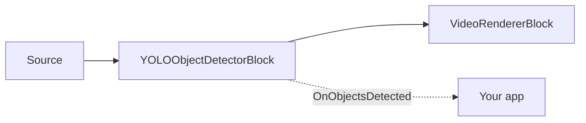

# Object Detection — YOLOObjectDetectorBlock

`YOLOObjectDetectorBlock` detects objects directly in the video stream. It taps RGBA frames with an
internal sample grabber, runs the configured ONNX detector, optionally draws boxes and labels into
the frame, and raises `OnObjectsDetected` for processed frames that contain detections. Use it when
you need boxes and labels without tracking, tripwires, or zone analytics — see
[Object analytics](object-analytics.md) for tracked, zone-aware detection.



## Supported detector families

Set `YoloDetectorSettings.Model` to match the ONNX model layout.

| Model | Decoder and preprocessing | Licensing note |
| --- | --- | --- |
| `ObjectDetectorModel.YOLOv8` (default) | Ultralytics YOLOv8 / YOLO11 layout `[1, 4 + numClasses, numAnchors]`; centered letterbox, RGB, normalized to 0..1, class-wise NMS. | Ultralytics models are AGPL-3.0; a closed-source product requires a commercial Ultralytics license. |
| `ObjectDetectorModel.YOLOX` | YOLOX layout `[1, numAnchors, 5 + numClasses]`; top-left letterbox, BGR, no 0..1 normalization, class-wise NMS. | YOLOX model family is Apache-2.0. |
| `ObjectDetectorModel.RTDETR` | RT-DETR / D-FINE transformer layout with `logits` and `pred_boxes`; direct resize, RGB, normalized to 0..1, NMS-free. | RT-DETR / D-FINE model families are Apache-2.0. |

The SDK does not ship detector weights in the NuGet package. The `IoUThreshold` setting applies only
to the NMS-based families (YOLOv8, YOLOX); RT-DETR is NMS-free and ignores it. `NormalizeTo01` is
honored only by YOLOv8 — YOLOX and RT-DETR fix their normalization to their training convention.

!!! note "Model licenses"
    A model's license is set by its origin (training code + published weights), not by the ONNX
    format. Avoid AGPL/GPL-licensed models (for example stock Ultralytics YOLO weights) in a
    closed-source product without a commercial license.

## Standalone or ObjectAnalyticsBlock?

Use `YOLOObjectDetectorBlock` when each frame can be handled independently: draw boxes, collect
labels, trigger simple alerts, or feed detections into your own logic. Use
[`ObjectAnalyticsBlock`](object-analytics.md) when you need stable tracker IDs, line-crossing events,
polygon-zone occupancy, object traces, and counters. `ObjectAnalyticsBlock` internally reuses
`YoloDetectorSettings` for its detector, but its renderer and event model are built around tracked
objects rather than raw per-frame detections.

## Usage

```csharp
using VisioForge.Core.MediaBlocks;
using VisioForge.Core.MediaBlocks.AI;
using VisioForge.Core.MediaBlocks.VideoRendering;
using VisioForge.Core.Types.VideoProcessing;
using VisioForge.Core.Types.X.AI;

var detectorSettings = new YoloDetectorSettings(modelPath)
{
    Model = ObjectDetectorModel.YOLOX,
    ConfidenceThreshold = 0.6f,
    IoUThreshold = 0.45f,
    DrawDetections = true,
    DrawLabels = true,
    FramesToSkip = 0,
    Provider = OnnxExecutionProvider.Auto,
};

var detector = new YOLOObjectDetectorBlock(detectorSettings);
detector.OnObjectsDetected += (sender, e) =>
{
    foreach (OnnxDetection obj in e.Objects)
    {
        Console.WriteLine($"{obj.Label} #{obj.ClassId} {obj.Confidence:P0} at {obj.Box}");
    }
};

var videoRenderer = new VideoRendererBlock(pipeline, videoView) { IsSync = false };

pipeline.Connect(source.Output, detector.Input);
pipeline.Connect(detector.Output, videoRenderer.Input);

await pipeline.StartAsync();

Console.WriteLine($"Active provider: {detector.ActiveProvider}");
```

Each `OnnxDetection` contains the bounding `Box` in source-frame pixel coordinates, `ClassId`,
`Label`, `Confidence`, and `TrackerId`. In standalone detection `TrackerId` is always `-1` because no
tracker has assigned an identity.

## Key settings

`YoloDetectorSettings` extends `OnnxInferenceSettings`.

| Property | Default | Description |
| --- | --- | --- |
| `ModelPath` | — | Absolute path to the detector `.onnx` file. Required. |
| `Model` | `ObjectDetectorModel.YOLOv8` | Selects the decoder and preprocessing convention. |
| `ConfidenceThreshold` | `0.60` | Minimum confidence for a reported detection. |
| `IoUThreshold` | `0.45` | Non-maximum suppression threshold for YOLOv8 and YOLOX. RT-DETR is NMS-free. |
| `Labels` | `null` | Optional class names. When `null`, the detector uses the default COCO-80 labels. |
| `DrawDetections` | `true` | Draw detection boxes into the video frame. |
| `BoxColor` / `BoxThickness` | Lime / `2` | Box overlay styling. |
| `DrawLabels` / `LabelFontSize` | `true` / `0` | Draw labels and confidence values. `0` auto-scales label text to frame height. |
| `InputWidth` / `InputHeight` | `640` / `640` | Used for dynamic-input models. Fixed-size models report their own input size. |
| `NormalizeTo01` | `true` | Honored by the YOLOv8 family only. |
| `Provider` / `DeviceId` | `Auto` / `0` | ONNX execution provider and hardware device index. |
| `FramesToSkip` | `0` | Skip frames between inference runs to reduce CPU/GPU load. |

`YOLOObjectDetectorBlock.ActiveProvider` reports the provider actually engaged after the block is
built.

## Use with VideoCaptureCoreX and MediaPlayerCoreX

```csharp
var detector = new YOLOObjectDetectorBlock(detectorSettings);
detector.OnObjectsDetected += Detector_OnObjectsDetected;

core.Video_Processing_AddBlock(detector); // before StartAsync (VideoCaptureCoreX)
// player.Video_Processing_AddBlock(detector); // before OpenAsync/PlayAsync (MediaPlayerCoreX)

await core.StartAsync();
```

See [Using AI blocks with VideoCaptureCoreX and MediaPlayerCoreX](x-engines.md) for the full
processing-block API, insertion order, and lifecycle rules shared by every video AI block.

## Use cases

- **Security and surveillance** — flag the presence of people, vehicles, or specific object classes
  in a camera feed.
- **Retail analytics** — detect products, baskets, or people in a store aisle for a downstream
  business-logic layer.
- **Industrial and safety monitoring** — detect required PPE items, obstacles, or equipment in a
  frame (with a model trained for those classes).
- **Wildlife and traffic monitoring** — detect animals or vehicles in a fixed camera feed.
- **Pre-filtering for a heavier pipeline** — use standalone detection as a cheap first pass, and only
  run a more expensive block (OCR, face recognition) on frames or regions where something was detected.

Need identities that persist across frames, line-crossing counts, or zone occupancy instead of raw
per-frame boxes? Use [Object analytics](object-analytics.md) — it wraps the same detector families
with ByteTrack tracking, tripwires, and polygon zones.

## Troubleshooting

| Symptom | Likely cause | Fix |
| --- | --- | --- |
| No detections at all | `ConfidenceThreshold` too high for the model/scene, or the wrong `Model` family selected for the ONNX file | Lower `ConfidenceThreshold`; confirm `Model` matches the exported model's layout (YOLOv8 vs YOLOX vs RT-DETR). |
| Too many false positives / duplicate boxes | `IoUThreshold` too high (weak suppression) — NMS-based families only | Lower `IoUThreshold`. Note RT-DETR is NMS-free and ignores this setting. |
| Boxes are offset from the real object | Wrong `Model` family for the ONNX file — each family uses a different letterbox/color-order convention | Set `Model` to match the exported model exactly; a mismatched decoder silently produces plausible-looking but wrong boxes. |
| Labels show numbers instead of names | `Labels` is `null` and the model isn't COCO-80 | Set `Labels` to the class-name array your model was trained with. |
| High CPU/GPU usage on live video | Inference running on every frame | Raise `FramesToSkip`; the block still passes every frame through, it just infers less often. |

## Frequently Asked Questions

### Which detector family should I start with?

`YOLOv8` (the default) if you're using stock Ultralytics-exported weights, but check the AGPL-3.0
licensing note first. `YOLOX` and `RT-DETR` are Apache-2.0 alternatives with no commercial-license
requirement.

### Can I use my own trained YOLO model?

Yes — as long as it was exported in the layout of one of the three supported families
(`YOLOv8`/`YOLOX`/`RTDETR`) and you set `Model` and `Labels` to match your training classes.

### Does YOLOObjectDetectorBlock track objects across frames?

No — each detection is independent per frame (`TrackerId` is always `-1`). Use
[`ObjectAnalyticsBlock`](object-analytics.md) when you need stable identities, tripwires, or zones.

### Is a GPU required for real-time detection?

No, but a GPU execution provider (`CUDA`, `DirectML`, or `CoreML`) lowers per-frame latency
compared to CPU, which matters most for high frame rates or larger detector models.

## Demos

- **[YOLO Object Detection Demo](https://github.com/visioforge/.Net-SDK-s-samples/tree/master/Media%20Blocks%20SDK/WPF/CSharp/YOLO%20Object%20Detection%20Demo)** — WPF Media Blocks demo covering both standalone detection and object analytics modes.
- **[YOLO Object Detection MB](https://github.com/visioforge/.Net-SDK-s-samples/tree/master/Media%20Blocks%20SDK/MAUI/YOLO%20Object%20Detection%20MB)** — the same Media Blocks demo for MAUI.

Dedicated `VideoCaptureCoreX`/`MediaPlayerCoreX` object-detection demos (`Capture Object Detection X`,
`Capture Object Detection X WPF`, `Player Object Detection X`, `Player Object Detection X WPF`) are
in the SDK's demo set and will be linked here once published to the public samples repository.
