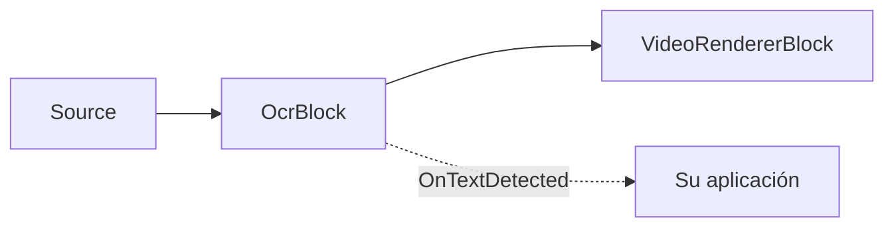

# Reconocimiento de texto OCR — OcrBlock

`OcrBlock` reconoce texto en cualquier fuente de video o imagen. Internamente ejecuta el pipeline
multietapa PP-OCR — detección de texto (DBNet) → clasificación opcional de ángulo 0°/180° →
reconocimiento de línea de texto (CRNN/SVTR + decodificación CTC) — en cada fotograma procesado,
notifica las regiones reconocidas y opcionalmente las dibuja en el video. El bloque reside en
`VisioForge.Core.AI` (`VisioForge.DotNet.Core.AI`), implementa `IVideoProcessingBlock` y tiene una
entrada `Input` de video y una salida `Output` de video.



## Uso

```csharp
using VisioForge.Core.MediaBlocks;
using VisioForge.Core.MediaBlocks.AI;
using VisioForge.Core.Types.X.AI;

var ocrSettings = new OcrSettings(
    detectionModelPath: "ch_PP-OCRv5_mobile_det.onnx",
    recognitionModelPath: "latin_PP-OCRv5_rec_mobile_infer.onnx",
    characterDictionaryPath: "ppocrv5_latin_dict.txt",
    classificationModelPath: "ch_ppocr_mobile_v2.0_cls_infer.onnx")
{
    Provider = OnnxExecutionProvider.Auto, // CPU / CUDA / DirectML / CoreML
    FramesToSkip = 3,                      // ejecuta OCR cada 4 fotogramas en video en vivo
    DrawResults = true,                    // graba los cuadros y el texto en el fotograma
};

var ocr = new OcrBlock(ocrSettings);
ocr.OnTextDetected += (sender, e) =>
{
    foreach (var region in e.Regions)
    {
        Console.WriteLine($"{region.Text} ({region.Confidence:P0}) at {region.BoundingBox}");
    }
};

pipeline.Connect(source.Output, ocr.Input);
pipeline.Connect(ocr.Output, videoRenderer.Input);

await pipeline.StartAsync();
```

Cada `OcrTextRegion` incluye el `Text` reconocido, una `Confidence` promedio (0..1), un
`BoundingBox` (`Rect`) alineado a los ejes y el `Polygon` de detección — los cuatro vértices
`OcrPoint` del detector (superior izquierdo, superior derecho, inferior derecho, inferior izquierdo,
en píxeles del fotograma fuente), que pueden estar rotados en el caso de texto inclinado.

## Configuración clave

`OcrSettings(detectionModelPath, recognitionModelPath, characterDictionaryPath,
classificationModelPath = null)` define `UseAngleClassifier` según si se proporcionó una ruta de
modelo de clasificación.

| Propiedad | Valor predeterminado | Descripción |
| --- | --- | --- |
| `DetectionModelPath` | — | Modelo ONNX de detección de texto (DBNet). Obligatorio. |
| `RecognitionModelPath` | — | Modelo ONNX de reconocimiento de texto (CRNN/SVTR). Obligatorio. |
| `CharacterDictionaryPath` | — | Diccionario de caracteres del reconocedor; debe coincidir con el idioma del modelo de reconocimiento. Obligatorio. |
| `ClassificationModelPath` | `null` | Clasificador opcional de ángulo 0°/180°. |
| `UseAngleClassifier` | `true` | Aplica el clasificador de ángulo (requiere `ClassificationModelPath`). |
| `Provider` | `Auto` | Proveedor de ejecución ONNX. |
| `DeviceId` | `0` | Índice de dispositivo para proveedores de ejecución por hardware. |
| `FramesToSkip` | `0` | Fotogramas omitidos entre ejecuciones de OCR. Use un valor distinto de cero para video en vivo. |
| `MaxSideLength` | `1024` | El lado más largo de la entrada del detector se redimensiona a este valor. `0` o negativo usa la ruta de redimensionado adaptativo de PP-OCRv5. |
| `BoxThreshold` | `0.3` | Umbral de binarización aplicado al mapa de probabilidad del detector. |
| `BoxScoreThreshold` | `0.5` | Probabilidad media mínima que debe alcanzar una región detectada para conservarse. |
| `UnclipRatio` | `1.6` | Relación de expansión usada para ampliar los polígonos de texto detectados. |
| `TextScoreThreshold` | `0.5` | Puntuación media mínima de reconocimiento por carácter para que una línea se reporte. |
| `DrawResults` | `true` | Dibuja los cuadros y el texto en el fotograma. |
| `BoxColor` | Lima | Color del cuadro/texto de la región cuando `DrawResults` está habilitado. |
| `BoxThickness` | `2` | Grosor del trazo del cuadro de la región, en píxeles. |
| `LabelFontSize` | `0` | Tamaño de fuente de la etiqueta en píxeles; `0` escala automáticamente según la altura del fotograma. |

## Modelos y licencias

`OcrBlock` ejecuta modelos ONNX de terceros; el SDK no distribuye los pesos en el paquete NuGet. Las
demos incluyen los modelos **PP-OCRv5 mobile** con licencia Apache-2.0 (detección, clasificación de
ángulo, reconocimiento en latín) y un diccionario latino junto a los ejecutables de ejemplo. PP-OCR
admite más de 100 idiomas — descargue el modelo de reconocimiento y el diccionario correspondientes
para otros idiomas.

!!! note "Licencias de los modelos"
    La licencia de un modelo la determina su origen (código de entrenamiento + pesos publicados), no
    el formato ONNX. Verifique la licencia de cualquier modelo — código, pesos y conjunto de datos —
    antes de distribuirlo. Los modelos PP-OCR incluidos son Apache-2.0.

## Uso con VideoCaptureCoreX y MediaPlayerCoreX

`OcrBlock` implementa `IVideoProcessingBlock`, por lo que puede registrarse directamente en
`VideoCaptureCoreX` o `MediaPlayerCoreX` en lugar de construir manualmente un pipeline de Media
Blocks:

```csharp
var ocr = new OcrBlock(ocrSettings);
ocr.OnTextDetected += Ocr_OnTextDetected;

core.Video_Processing_AddBlock(ocr); // antes de StartAsync (VideoCaptureCoreX)
// player.Video_Processing_AddBlock(ocr); // antes de OpenAsync/PlayAsync (MediaPlayerCoreX)

await core.StartAsync();
```

Consulte [Uso de bloques de IA con VideoCaptureCoreX y MediaPlayerCoreX](x-engines.md) para conocer
la API completa de bloques de procesamiento, el orden de inserción y las reglas de ciclo de vida
compartidas por todos los bloques de IA de video.

## Casos de uso

- **Captura de documentos y pantalla** — reconoce texto de documentos escaneados, tarjetas de
  identificación, formularios o pantallas compartidas en un pipeline de videoconferencia.
- **Automatización de retail y almacén** — lee etiquetas de productos, el texto impreso de códigos de
  barras o etiquetas de estantería desde una cámara fija cenital o portátil.
- **Inspección industrial** — lee números de serie, códigos de lote o etiquetas impresas en una línea
  de producción.
- **Monitorización de señalización y difusión** — verifica que el texto en pantalla (rótulos
  inferiores, tickers, señalización digital) coincide con el contenido esperado.
- **Herramientas de accesibilidad** — extrae texto en pantalla para pipelines de texto a voz o
  traducción.

Para un caso específico y más acotado — leer matrículas de vehículos — use el bloque especializado
[Reconocimiento de matrículas (ANPR)](license-plate-recognition.md) en lugar del OCR general; es más
preciso y más rápido porque ejecuta un detector y una cabeza de OCR específicos para matrículas en
lugar de analizar todo el fotograma en busca de cualquier texto.

## Solución de problemas

| Síntoma | Causa probable | Solución |
| --- | --- | --- |
| `OnTextDetected` nunca se dispara | No hay un controlador suscrito, o `FramesToSkip` combinado con un clip muy corto | Suscríbase antes de `StartAsync`/`OpenAsync`; reduzca `FramesToSkip`. |
| El texto reconocido está vacío o distorsionado | `CharacterDictionaryPath` no coincide con el idioma de `RecognitionModelPath` | Use el diccionario distribuido junto con ese modelo de reconocimiento específico. |
| Se omite texto inclinado o rotado | `UseAngleClassifier` es `false`, o no se proporcionó `ClassificationModelPath` | Proporcione `ClassificationModelPath` y deje `UseAngleClassifier` en su valor predeterminado `true`. |
| Se omite texto pequeño en un fotograma grande | `MaxSideLength` demasiado bajo para la resolución de la fuente | Aumente `MaxSideLength`, o establézcalo en `0` para usar la ruta de redimensionado adaptativo de PP-OCRv5. |
| Alto uso de CPU en video en vivo | El OCR se ejecuta en cada fotograma | Establezca `FramesToSkip` en un valor distinto de cero; el OCR es más pesado por fotograma que un detector de un solo modelo. |
| `Provider = CUDA`/`DirectML` retrocede silenciosamente a CPU | El paquete nativo de ONNX Runtime correspondiente al proveedor de ejecución no está referenciado, o no hay una GPU compatible presente | Agregue el paquete nativo de runtime correspondiente a su plataforma, o use `Auto` y deje que el bloque elija lo que realmente está disponible. |

## Preguntas frecuentes

### ¿Cuál es la diferencia entre OcrBlock y LicensePlateRecognizerBlock?

`OcrBlock` lee texto arbitrario en cualquier parte del fotograma. `LicensePlateRecognizerBlock` es un
pipeline dedicado de dos etapas (un detector de matrículas más una cabeza de OCR específica para
matrículas) ajustado únicamente para matrículas de vehículos — úselo en lugar de `OcrBlock` para
escenarios ANPR/LPR.

### ¿OcrBlock admite otros idiomas además del inglés?

Sí. PP-OCR admite más de 100 idiomas. Apunte `RecognitionModelPath` y `CharacterDictionaryPath` al
modelo de reconocimiento y al diccionario de su idioma objetivo; ambos deben coincidir.

### ¿Puedo ejecutar OCR en una imagen fija en lugar de un flujo de video en vivo?

Sí — conecte una fuente de archivo/imagen a `OcrBlock.Input` en un `MediaBlocksPipeline`, o pase un
único fotograma a través del pipeline; el bloque procesa cualquier fotograma que llegue a su pad de
entrada, ya sea en vivo o desde un archivo.

### ¿OcrBlock necesita una GPU para ejecutarse en tiempo real?

No, pero un proveedor de ejecución con GPU (`CUDA`, `DirectML` o `CoreML`) reduce la latencia por
fotograma en comparación con la CPU. Para video en vivo, combinar `FramesToSkip` con inferencia en CPU
también es una forma común, sin GPU, de evitar que el OCR se convierta en el cuello de botella del
pipeline.

## Demos

- **[OCR Text Recognition Demo](https://github.com/visioforge/.Net-SDK-s-samples/tree/master/Media%20Blocks%20SDK/WPF/CSharp/OCR%20Text%20Recognition%20Demo)** — demo de pipeline de Media Blocks en WPF.
- **[OCR Text Recognition MB](https://github.com/visioforge/.Net-SDK-s-samples/tree/master/Media%20Blocks%20SDK/MAUI/OCR%20Text%20Recognition%20MB)** — la misma demo de Media Blocks para MAUI.

Las demos dedicadas de OCR para `VideoCaptureCoreX`/`MediaPlayerCoreX` (`Capture OCR X`,
`Capture OCR X WPF`, `Player OCR X`, `Player OCR X WPF`) están en el conjunto de demos del SDK y se
enlazarán aquí una vez publicadas en el repositorio público de muestras.
