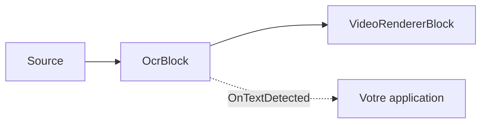

# Reconnaissance de texte OCR — OcrBlock

`OcrBlock` reconnaît le texte dans n'importe quelle source vidéo ou image. En interne, il exécute le
pipeline multi-étapes PP-OCR — détection de texte (DBNet) → classification d'angle optionnelle 0°/180°
→ reconnaissance de ligne de texte (CRNN/SVTR + décodage CTC) — sur chaque image traitée, déclenche les
régions reconnues et peut éventuellement les dessiner dans la vidéo. Le bloc réside dans
`VisioForge.Core.AI` (`VisioForge.DotNet.Core.AI`), implémente `IVideoProcessingBlock`, et possède une
entrée vidéo `Input` et une sortie vidéo `Output`.



## Utilisation

```csharp
using VisioForge.Core.MediaBlocks;
using VisioForge.Core.MediaBlocks.AI;
using VisioForge.Core.Types.X.AI;

var ocrSettings = new OcrSettings(
    detectionModelPath: "ch_PP-OCRv5_mobile_det.onnx",
    recognitionModelPath: "latin_PP-OCRv5_rec_mobile_infer.onnx",
    characterDictionaryPath: "ppocrv5_latin_dict.txt",
    classificationModelPath: "ch_ppocr_mobile_v2.0_cls_infer.onnx")
{
    Provider = OnnxExecutionProvider.Auto, // CPU / CUDA / DirectML / CoreML
    FramesToSkip = 3,                      // exécuter l'OCR toutes les 4 images en vidéo en direct
    DrawResults = true,                    // incruster les cadres + le texte dans l'image
};

var ocr = new OcrBlock(ocrSettings);
ocr.OnTextDetected += (sender, e) =>
{
    foreach (var region in e.Regions)
    {
        Console.WriteLine($"{region.Text} ({region.Confidence:P0}) at {region.BoundingBox}");
    }
};

pipeline.Connect(source.Output, ocr.Input);
pipeline.Connect(ocr.Output, videoRenderer.Input);

await pipeline.StartAsync();
```

Chaque `OcrTextRegion` porte le `Text` reconnu, une `Confidence` moyenne (0..1), une `BoundingBox`
(`Rect`) alignée sur les axes, et le `Polygon` de détection — les quatre sommets `OcrPoint` du
détecteur (haut-gauche, haut-droite, bas-droite, bas-gauche, en pixels du repère source), qui peuvent
être inclinés pour du texte oblique.

## Paramètres clés

`OcrSettings(detectionModelPath, recognitionModelPath, characterDictionaryPath,
classificationModelPath = null)` définit `UseAngleClassifier` selon qu'un chemin de modèle de
classification a été fourni ou non.

| Propriété | Par défaut | Description |
| --- | --- | --- |
| `DetectionModelPath` | — | Modèle ONNX de détection de texte (DBNet). Obligatoire. |
| `RecognitionModelPath` | — | Modèle ONNX de reconnaissance de texte (CRNN/SVTR). Obligatoire. |
| `CharacterDictionaryPath` | — | Dictionnaire de caractères du reconnaisseur ; doit correspondre à la langue du modèle de reconnaissance. Obligatoire. |
| `ClassificationModelPath` | `null` | Classificateur d'angle 0°/180° optionnel. |
| `UseAngleClassifier` | `true` | Applique le classificateur d'angle (nécessite `ClassificationModelPath`). |
| `Provider` | `Auto` | Fournisseur d'exécution ONNX. |
| `DeviceId` | `0` | Index du périphérique pour les fournisseurs d'exécution matériels. |
| `FramesToSkip` | `0` | Images ignorées entre deux exécutions de l'OCR. Utilisez une valeur non nulle pour la vidéo en direct. |
| `MaxSideLength` | `1024` | Le côté le plus long de l'entrée du détecteur est redimensionné à cette valeur. `0` ou une valeur négative utilise à la place le redimensionnement adaptatif PP-OCRv5. |
| `BoxThreshold` | `0.3` | Seuil de binarisation appliqué à la carte de probabilité du détecteur. |
| `BoxScoreThreshold` | `0.5` | Probabilité moyenne minimale qu'une région détectée doit atteindre pour être conservée. |
| `UnclipRatio` | `1.6` | Ratio d'expansion utilisé pour agrandir les polygones de texte détectés. |
| `TextScoreThreshold` | `0.5` | Score de reconnaissance moyen minimal par caractère pour qu'une ligne soit signalée. |
| `DrawResults` | `true` | Dessine les cadres + le texte dans l'image. |
| `BoxColor` | Vert citron | Couleur du cadre/texte de la région quand `DrawResults` est activé. |
| `BoxThickness` | `2` | Épaisseur du trait du cadre de la région, en pixels. |
| `LabelFontSize` | `0` | Taille de police de l'étiquette en pixels ; `0` adapte automatiquement à la hauteur de l'image. |

## Modèles et licences

`OcrBlock` exécute des modèles ONNX tiers ; le SDK ne fournit pas les poids dans le paquet NuGet. Les
démos livrent les modèles Apache-2.0 **PP-OCRv5 mobile** (détection, classification d'angle,
reconnaissance latine) ainsi qu'un dictionnaire latin à côté des exécutables d'exemple. PP-OCR prend en
charge plus de 100 langues — téléchargez le modèle de reconnaissance et le dictionnaire correspondants
pour d'autres langues.

!!! note "Licences des modèles"
    La licence d'un modèle est déterminée par son origine (code d'entraînement + poids publiés), pas
    par le format ONNX. Vérifiez la licence de tout modèle — code, poids et jeu de données — avant de
    le distribuer. Les modèles PP-OCR fournis sont sous licence Apache-2.0.

## Utilisation avec VideoCaptureCoreX et MediaPlayerCoreX

`OcrBlock` implémente `IVideoProcessingBlock`, il peut donc être enregistré directement sur
`VideoCaptureCoreX` ou `MediaPlayerCoreX` au lieu de construire manuellement un pipeline Media Blocks :

```csharp
var ocr = new OcrBlock(ocrSettings);
ocr.OnTextDetected += Ocr_OnTextDetected;

core.Video_Processing_AddBlock(ocr); // avant StartAsync (VideoCaptureCoreX)
// player.Video_Processing_AddBlock(ocr); // avant OpenAsync/PlayAsync (MediaPlayerCoreX)

await core.StartAsync();
```

Consultez [Utiliser les blocs IA avec VideoCaptureCoreX et MediaPlayerCoreX](x-engines.md) pour l'API
complète des blocs de traitement, l'ordre d'insertion et les règles de cycle de vie partagées par
chaque bloc vidéo IA.

## Cas d'usage

- **Capture de documents et d'écran** — reconnaître du texte à partir de documents numérisés, de cartes
  d'identité, de formulaires ou d'écrans partagés dans un pipeline de visioconférence.
- **Automatisation du commerce de détail et de l'entrepôt** — lire les étiquettes de produits, le texte
  imprimé des codes-barres ou les étiquettes de rayon depuis une caméra fixe en hauteur ou portative.
- **Inspection industrielle** — lire les numéros de série, codes de lot ou étiquettes imprimées sur une
  ligne de production.
- **Surveillance de signalétique et de diffusion** — vérifier que le texte à l'écran (bandeaux, défilants,
  signalétique numérique) correspond au contenu attendu.
- **Outils d'accessibilité** — extraire le texte à l'écran pour des pipelines de synthèse vocale ou de
  traduction.

Pour un cas plus spécifique et plus restreint — la lecture de plaques d'immatriculation — utilisez le
bloc dédié [Reconnaissance de plaques d'immatriculation (ANPR)](license-plate-recognition.md) plutôt
que l'OCR général ; il est à la fois plus précis et plus rapide car il exécute un détecteur et une tête
OCR spécifiques aux plaques plutôt que de scanner l'image entière à la recherche de texte quelconque.

## Dépannage

| Symptôme | Cause probable | Solution |
| --- | --- | --- |
| `OnTextDetected` ne se déclenche jamais | Aucun gestionnaire souscrit, ou `FramesToSkip` combiné à un clip très court | Abonnez-vous avant `StartAsync`/`OpenAsync` ; réduisez `FramesToSkip`. |
| Le texte reconnu est vide ou illisible | `CharacterDictionaryPath` ne correspond pas à la langue de `RecognitionModelPath` | Utilisez le dictionnaire fourni avec ce modèle de reconnaissance spécifique. |
| Le texte incliné ou pivoté est manqué | `UseAngleClassifier` est à `false`, ou `ClassificationModelPath` n'a pas été fourni | Fournissez `ClassificationModelPath` et laissez `UseAngleClassifier` à sa valeur par défaut `true`. |
| Le petit texte est manqué sur une grande image | `MaxSideLength` trop faible pour la résolution source | Augmentez `MaxSideLength`, ou définissez-le à `0` pour utiliser le redimensionnement adaptatif PP-OCRv5. |
| Utilisation CPU élevée en vidéo en direct | OCR exécuté sur chaque image | Définissez `FramesToSkip` à une valeur non nulle ; l'OCR est plus lourd par image qu'un détecteur à modèle unique. |
| `Provider = CUDA`/`DirectML` revient silencieusement au CPU | Le paquet natif du fournisseur d'exécution ONNX Runtime correspondant n'est pas référencé, ou aucun GPU compatible n'est présent | Ajoutez le paquet de runtime natif correspondant pour votre plateforme, ou utilisez `Auto` et laissez le bloc choisir ce qui est réellement disponible. |

## Foire aux questions

### Quelle est la différence entre OcrBlock et LicensePlateRecognizerBlock ?

`OcrBlock` lit du texte arbitraire n'importe où dans l'image. `LicensePlateRecognizerBlock` est un
pipeline dédié à deux étapes (un détecteur de plaques plus une tête OCR spécifique aux plaques) réglé
uniquement pour les plaques de véhicules — utilisez-le à la place de `OcrBlock` pour les scénarios
ANPR/LPR.

### OcrBlock prend-il en charge d'autres langues que l'anglais ?

Oui. PP-OCR prend en charge plus de 100 langues. Pointez `RecognitionModelPath` et
`CharacterDictionaryPath` vers le modèle de reconnaissance et le dictionnaire de votre langue cible ;
les deux doivent correspondre.

### Puis-je exécuter l'OCR sur une image fixe plutôt que sur un flux vidéo en direct ?

Oui — connectez une source de fichier/image à `OcrBlock.Input` dans un `MediaBlocksPipeline`, ou
transmettez une seule image via le pipeline ; le bloc traite toute image qui atteint son pad d'entrée,
en direct ou depuis un fichier.

### OcrBlock a-t-il besoin d'un GPU pour fonctionner en temps réel ?

Non, mais un fournisseur d'exécution GPU (`CUDA`, `DirectML` ou `CoreML`) réduit la latence par image
par rapport au CPU. Pour la vidéo en direct, combiner `FramesToSkip` avec une inférence CPU est
également un moyen courant, sans GPU, d'éviter que l'OCR ne devienne le goulot d'étranglement du
pipeline.

## Démos

- **[Démo de reconnaissance de texte OCR](https://github.com/visioforge/.Net-SDK-s-samples/tree/master/Media%20Blocks%20SDK/WPF/CSharp/OCR%20Text%20Recognition%20Demo)** — démo de pipeline Media Blocks pour WPF.
- **[OCR Text Recognition MB](https://github.com/visioforge/.Net-SDK-s-samples/tree/master/Media%20Blocks%20SDK/MAUI/OCR%20Text%20Recognition%20MB)** — la même démo Media Blocks pour MAUI.

Les démos OCR dédiées `VideoCaptureCoreX`/`MediaPlayerCoreX` (`Capture OCR X`, `Capture OCR X WPF`,
`Player OCR X`, `Player OCR X WPF`) font partie du jeu de démos du SDK et seront liées ici une fois
publiées dans le dépôt public d'exemples.
